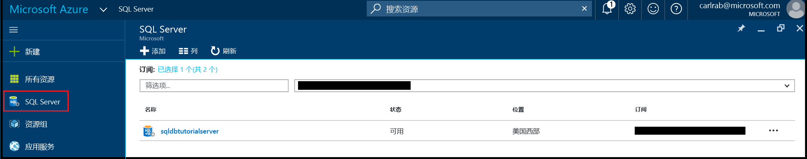
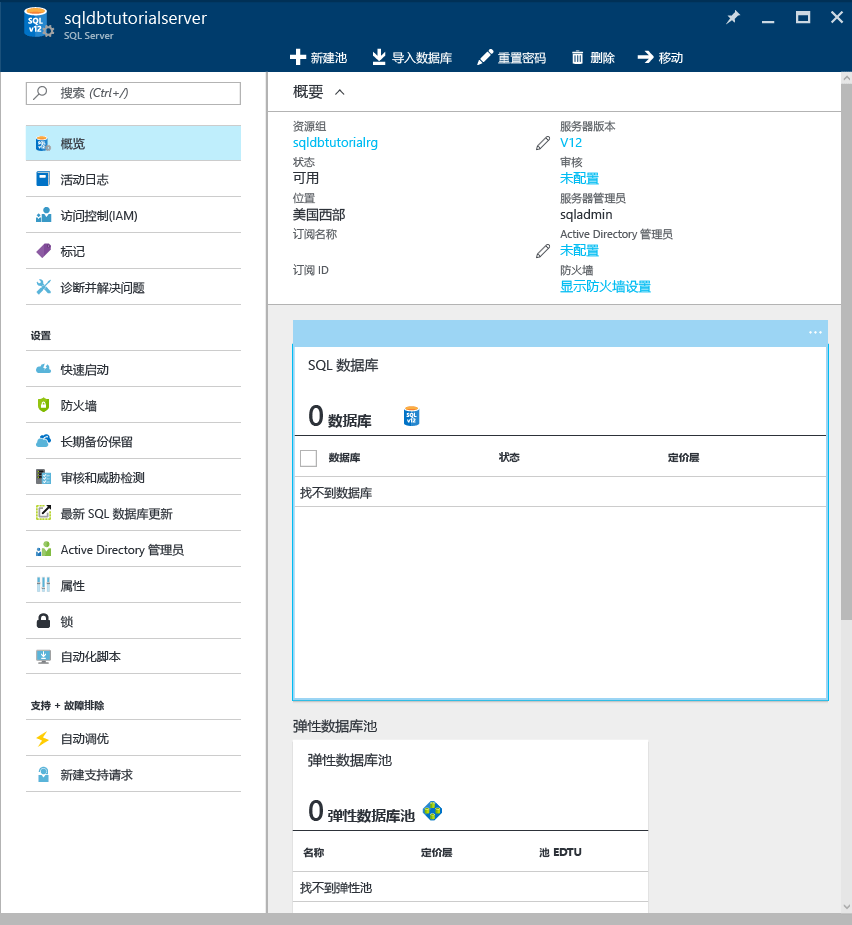

# 查看和更新 Azure SQL 数据库服务器及其设置

可以使用 [Azure 门户]((sql-database-manage-portal.md)、[PowerShell](sql-database-manage-powershell.md)、REST API 或 C# 查看和更新 Azure SQL 数据库服务器及其设置。 

## 使用 Azure 门户查看和更新 Azure SQL 服务器设置
1. 在 [Azure 门户](https://portal.azure.com/)中打开“SQL 服务器”边栏选项卡。 

    

2. 在 SQL 服务器边栏选项卡上单击要使用的服务器，然后单击所需设置。 

    

> [!TIP]
> 有关使用 Azure 门户的入门教程，请参阅[通过 Azure 门户和 SQL Server Management Studio 开始使用 Azure SQL 数据库服务器、数据库和防火墙规则](sql-database-get-started.md)。
>

## 其他资源
* 有关管理工具的概述，请参阅[管理工具概述](sql-database-manage-overview.md)
* 若要了解如何使用 Azure 门户执行其他管理任务，请参阅[使用 Azure 门户管理 Azure SQL 数据库](sql-database-manage-portal.md)
* 若要了解如何使用 PowerShell 执行其他管理任务，请参阅[使用 PowerShell 管理 Azure SQL 数据库](sql-database-manage-powershell.md)
* 有关 SQL 数据库服务的信息，请参阅[什么是 SQL 数据库](sql-database-technical-overview.md)。 
* 有关 Azure 数据库服务器和数据库功能的信息，请参阅[功能](sql-database-features.md)。

<!--HONumber=Dec16_HO1-->

