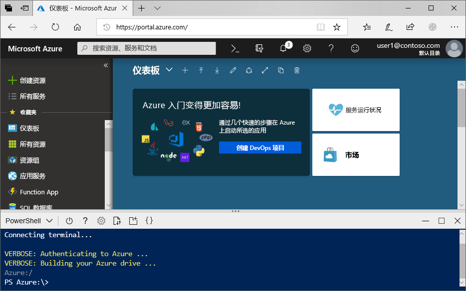
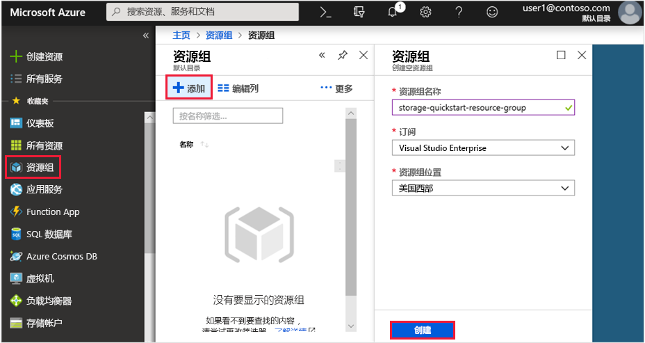
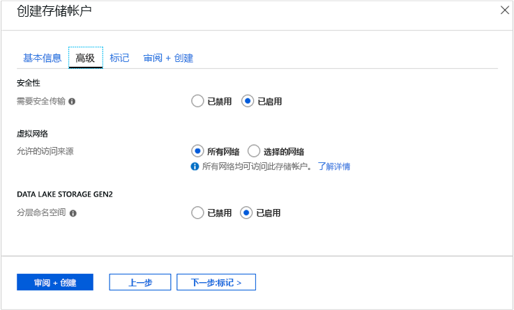

# <a name="quickstart-create-an-azure-data-lake-storage-gen2-storage-account"></a>快速入门：创建 Azure Data Lake Storage Gen2 存储帐户

Azure Data Lake Storage Gen2 [支持分层命名空间服务](data-lake-storage-introduction.md)，该服务提供了一个适合与 Hadoop 分布式文件系统 (HDFS) 配合使用的基于原生目录的文件系统。 可以通过 [ABFS 驱动程序](data-lake-storage-abfs-driver.md)从 HDFS 访问 Data Lake Storage Gen2 数据。

本快速入门展示了如何使用 [Azure 门户](https://portal.azure.com/)、[Azure PowerShell](https://docs.microsoft.com/powershell/azure/overview) 或通过 [Azure CLI](https://docs.microsoft.com/cli/azure?view=azure-cli-latest) 创建帐户。

## <a name="prerequisites"></a>先决条件

如果没有 Azure 订阅，请在开始之前创建一个[免费帐户](https://azure.microsoft.com/free/)。 

|           | 先决条件 |
|-----------|--------------|
|门户     | 无         |
|PowerShell | 本快速入门需要 PowerShell 模块 Az.Storage 0.7 或更高版本。 若要查找当前版本，请运行 `Get-Module -ListAvailable Az.Storage` 命令。 如果在运行此命令后，没有显示任何结果，或者如果出现 0.7 以外的版本，则必须升级 powershell 模块。 请参阅本指南的[升级 powershell 模块](#upgrade-your-powershell-module)部分。
|CLI        | 可以登录到 Azure，然后采用以下两种方式之一运行 Azure CLI 命令： <ul><li>可以在 Azure 门户的 Azure Cloud Shell 中运行 CLI 命令 </li><li>可以安装 CLI 并在本地运行 CLI 命令</li></ul>|

使用命令行时，可以运行 Azure Cloud shell，也可以在本地安装 CLI。

### <a name="use-azure-cloud-shell"></a>使用 Azure Cloud Shell

Azure Cloud Shell 是可直接在 Azure 门户中运行的免费 Bash shell。 它预安装有 Azure CLI 并将其配置为与帐户一起使用。 单击 Azure 门户右上角菜单上的“Cloud Shell”按钮：

[](https://portal.azure.com)

该按钮会启动交互式 shell，用于运行本快速入门中的步骤：

[](https://portal.azure.com)

### <a name="install-the-cli-locally"></a>在本地安装 CLI

也可在本地安装和使用 Azure CLI。 本快速入门需要运行 Azure CLI 2.0.38 或更高版本。 运行 `az --version` 即可查找版本。 如需进行安装或升级，请参阅[安装 Azure CLI](/cli/azure/install-azure-cli)。

## <a name="create-a-storage-account-with-azure-data-lake-storage-gen2-enabled"></a>创建启用了 Azure Data Lake Storage Gen2 的存储帐户

在创建帐户前，首先创建一个资源组，使其充当你创建的存储帐户或任何其他 Azure 资源的逻辑容器。 若要清理本快速入门创建的资源，可以直接删除资源组。 删除资源组也会删除相关联的存储帐户，以及与资源组相关联的任何其他资源。 有关资源组的详细信息，请参阅 [Azure 资源管理器概述](../../azure-resource-manager/resource-group-overview.md)。

> [!NOTE]
> 必须将新的存储帐户创建为 **StorageV2(常规用途 v2 )** 类型才能利用 Data Lake Storage Gen2 功能。  

有关存储帐户的详细信息，请参阅 [Azure 存储帐户概述](../common/storage-account-overview.md)。

为存储帐户命名时，请记住以下规则：

- 存储帐户名称必须为 3 到 24 个字符，并且只能包含数字和小写字母。
- 存储帐户名称在 Azure 中必须是唯一的。 没有两个存储帐户可以有相同的名称。

## <a name="create-an-account-using-the-azure-portal"></a>使用 Azure 门户创建帐户

登录到 [Azure 门户](https://portal.azure.com)。

### <a name="create-a-resource-group"></a>创建资源组

若要在 Azure 门户中创建资源组，请执行以下步骤：

1. 在 Azure 门户中展开左侧的菜单，打开服务菜单，然后选择“资源组”。
2. 单击“添加”按钮添加新的资源组。
3. 输入新资源组的名称。
4. 选择要在其中创建新资源组的订阅。
5. 选择资源组的位置。
6. 单击“创建”  按钮。  

   

### <a name="create-a-general-purpose-v2-storage-account"></a>创建常规用途 v2 存储帐户

若要在 Azure 门户中创建常规用途 v2 存储帐户，请执行以下步骤：

> [!NOTE]
> 分层命名空间目前在所有公共区域中提供。 它目前不在主权云中提供。

1. 在 Azure 门户中展开左侧的菜单，打开服务菜单，然后选择“所有服务”。 然后向下滚动到“存储”，接着选择“存储帐户”。 在显示的“存储帐户”窗口中，选择“添加”。
2. 选择之前创建的订阅和资源组。
3. 输入存储帐户的名称。
4. 将“位置”设置为“美国西部 2”。
5. 将这些字段设置为其默认值：性能、帐户类型、复制、访问层。
6. 选择要在其中创建存储帐户的订阅。
7. 选择“下一步:高级 >”
8. 将“SECURITY”和“VIRTUAL NETWORKS”字段下的值设置为默认值。
9. 在“Data Lake Storage Gen2(预览版)”部分中，将“分层命名空间”设置为“已启用”。
10. 单击“查看 + 创建”以创建存储帐户。

    

现在已通过门户创建了存储帐户。

### <a name="clean-up-resources"></a>清理资源

若要使用 Azure 门户删除资源组，请执行以下操作：

1. 在 Azure 门户中展开左侧的菜单，打开服务菜单，然后选择“资源组”以显示资源组的列表。
2. 找到要删除的资源组，右键单击列表右侧的“更多”按钮 (**...**)。
3. 选择“删除资源组”并进行确认。

## <a name="create-an-account-using-powershell"></a>使用 PowerShell 创建帐户

首先，安装最新版本的 [PowerShellGet](https://docs.microsoft.com/powershell/gallery/installing-psget) 模块。

然后，升级 powershell 模块，登录 Azure 订阅，创建资源组，然后创建存储帐户。

### <a name="upgrade-your-powershell-module"></a>升级 powershell 模块

[!INCLUDE [updated-for-az](../../../includes/updated-for-az.md)]

若要使用 PowerShell 与 Data Lake Storage Gen2 交互，需要安装模块 Az.Storage 0.7 或更高版本。

首先使用提升的权限打开 PowerShell 会话。

安装 Az.Storage 模块

```powershell
Install-Module Az.Storage -Repository PSGallery -AllowPrerelease -AllowClobber -Force
```

### <a name="log-in-to-your-azure-subscription"></a>登录 Azure 订阅

使用 `Login-AzAccount` 命令并按照屏幕上的说明进行身份验证。

```powershell
Login-AzAccount
```

### <a name="create-a-resource-group"></a>创建资源组

若要通过 PowerShell 创建新的资源组，请使用 [New-AzResourceGroup](/powershell/module/az.resources/new-azresourcegroup) 命令： 

> [!NOTE]
> 分层命名空间目前在所有公共区域中提供。 它目前不在主权云中提供。

```powershell
# put resource group in a variable so you can use the same group name going forward,
# without hardcoding it repeatedly
$resourceGroup = "storage-quickstart-resource-group"
$location = "westus2"
New-AzResourceGroup -Name $resourceGroup -Location $location
```

### <a name="create-a-general-purpose-v2-storage-account"></a>创建常规用途 v2 存储帐户

若要使用本地冗余存储 (LRS) 从 PowerShell 创建常规用途 v2 存储帐户，请使用 [New-AzStorageAccount](/powershell/module/az.storage/New-azStorageAccount) 命令：

```powershell
$location = "westus2"

New-AzStorageAccount -ResourceGroupName $resourceGroup `
  -Name "storagequickstart" `
  -Location $location `
  -SkuName Standard_LRS `
  -Kind StorageV2 `
  -EnableHierarchicalNamespace $True
```

### <a name="clean-up-resources"></a>清理资源

若要删除资源组及其关联的资源（包括新的存储帐户），请使用 [Remove-AzResourceGroup](/powershell/module/az.resources/remove-azresourcegroup) 命令： 

```powershell
Remove-AzResourceGroup -Name $resourceGroup
```

## <a name="create-an-account-using-azure-cli"></a>使用 Azure CLI 创建帐户

若要启动 Azure Cloud Shell，请登录到 [Azure 门户](https://portal.azure.com)。

若要登录到本地安装的 CLI，请运行登录命令：

```cli
az login
```

### <a name="add-the-cli-extension-for-azure-data-lake-gen-2"></a>为 Azure Data Lake Gen 2 添加 CLI 扩展

若要使用 CLI 来与 Data Lake Storage Gen2 交互，必须将扩展添加到 shell。

为此，请使用 Cloud Shell 或本地 shell 输入以下命令：`az extension add --name storage-preview`

### <a name="create-a-resource-group"></a>创建资源组

若要通过 Azure CLI 创建新的资源组，请使用 [az group create](/cli/azure/group) 命令。

```azurecli-interactive
az group create `
    --name storage-quickstart-resource-group `
    --location westus2
```

> [!NOTE]
> > 分层命名空间目前在所有公共区域中提供。 它目前不在主权云中提供。

### <a name="create-a-general-purpose-v2-storage-account"></a>创建常规用途 v2 存储帐户

若要使用本地冗余存储从 Azure CLI 创建常规用途 v2 存储帐户，请使用 [az storage account create](/cli/azure/storage/account) 命令。

```azurecli-interactive
az storage account create `
    --name storagequickstart `
    --resource-group storage-quickstart-resource-group `
    --location westus2 `
    --sku Standard_LRS `
    --kind StorageV2 `
    --hierarchical-namespace true
```

### <a name="clean-up-resources"></a>清理资源

若要删除资源组及其关联的资源（包括新的存储帐户），请使用 [az group delete](/cli/azure/group) 命令。

```azurecli-interactive
az group delete --name myResourceGroup
```

## <a name="next-steps"></a>后续步骤

在本快速入门中，你已创建了一个具有 Data Lake Storage Gen2 功能的存储帐户。 若要了解如何通过存储帐户上传和下载 Blob，请参阅以下主题。

* [AzCopy V10](https://docs.microsoft.com/azure/storage/common/storage-use-azcopy-v10?toc=%2fazure%2fstorage%2fblobs%2ftoc.json)
