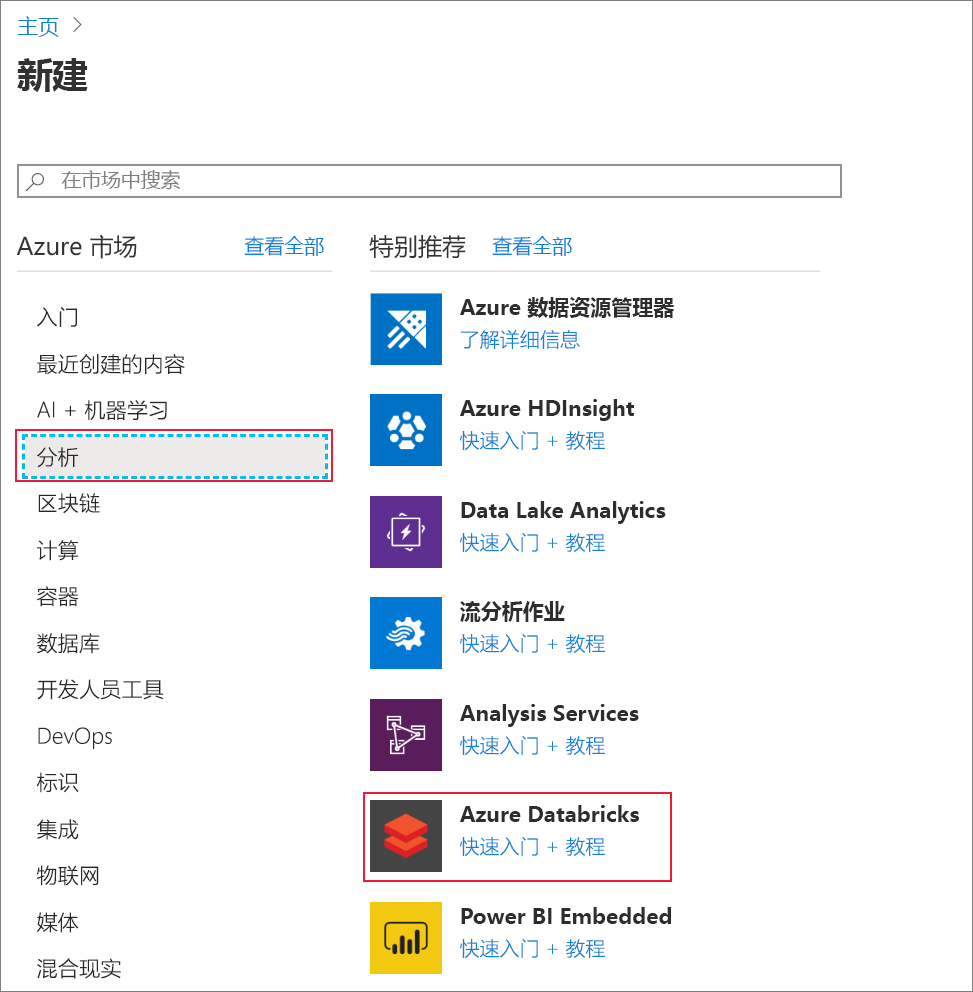
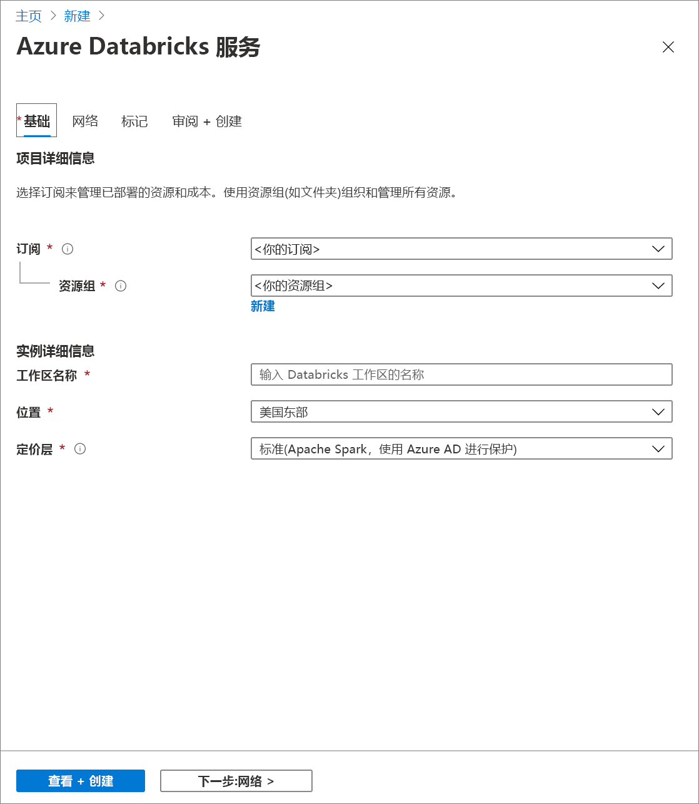
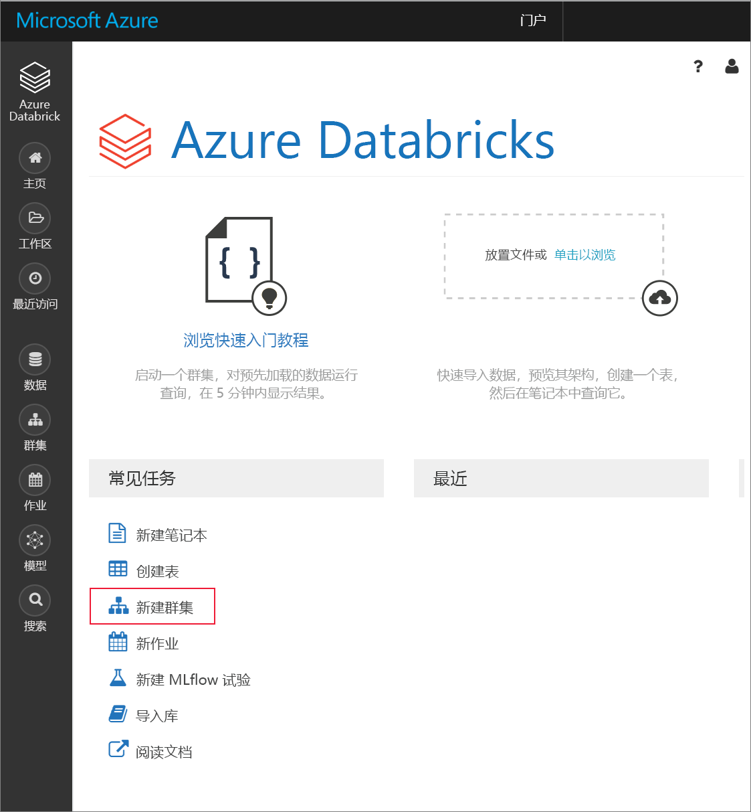
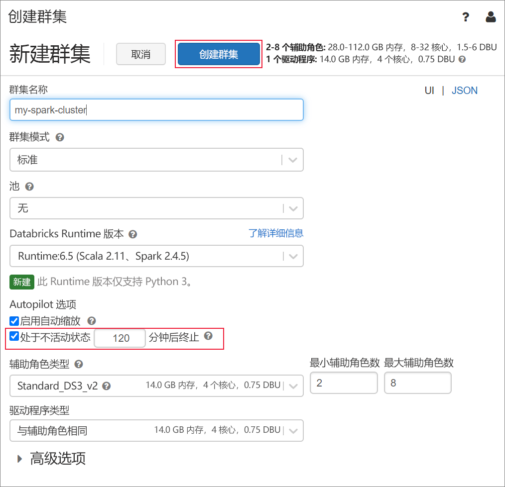
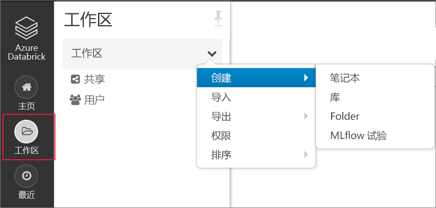
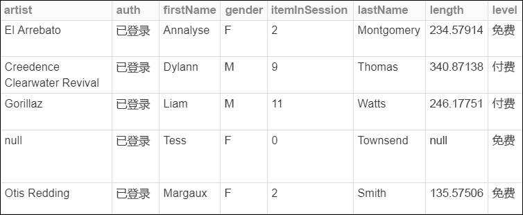
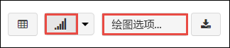
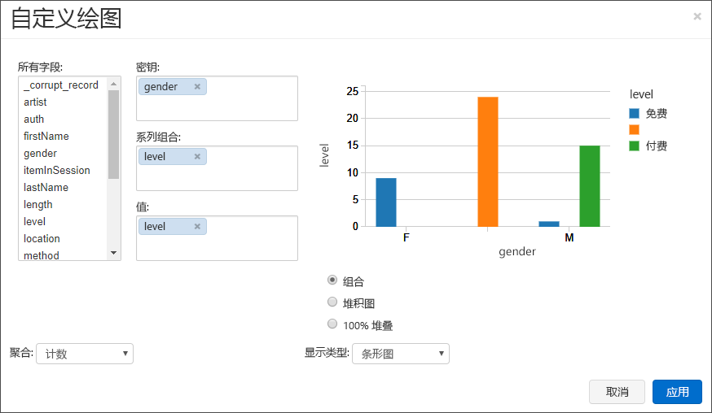
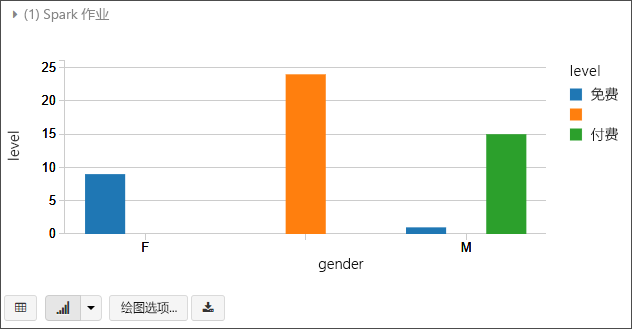
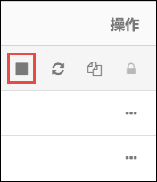

# <a name="quickstart-analyze-data-with-databricks"></a>快速入门：使用 Databricks 分析数据

在本快速入门中，你将使用 Azure Databricks 运行 Apache Spark 作业，以对存储帐户中存储的数据执行分析。 在 Spark 作业中，你将分析收音机频道订阅数据，以根据人口统计信息洞察免费/付费节目的使用情况。

## <a name="prerequisites"></a>先决条件

* 具有活动订阅的 Azure 帐户。 [免费创建帐户](https://azure.microsoft.com/free/?ref=microsoft.com&utm_source=microsoft.com&utm_medium=docs&utm_campaign=visualstudio)。

* Azure Data Lake Gen2 存储帐户的名称。 [创建 Azure Data Lake Storage Gen2 存储帐户](data-lake-storage-quickstart-create-account.md)。

* 分配有角色“存储 Blob 数据参与者”  的 Azure 服务主体的租户 ID、应用 ID 和密码。 [创建服务主体](../../active-directory/develop/howto-create-service-principal-portal.md)。

  > [!IMPORTANT]
  > 在 Data Lake Storage Gen2 存储帐户范围内分配角色。 可以将角色分配给父资源组或订阅，但在这些角色分配传播到存储帐户之前，你将收到与权限相关的错误。

## <a name="create-an-azure-databricks-workspace"></a>创建 Azure Databricks 工作区

在本部分，使用 Azure 门户创建 Azure Databricks 工作区。

1. 在 Azure 门户中，选择“创建资源”   >   “分析” >   “Azure Databricks”。

    

2. 在“Azure Databricks 服务”  下，提供所需的值以创建 Databricks 工作区。

    

    提供以下值：

    |properties  |说明  |
    |---------|---------|
    |**工作区名称**     | 提供 Databricks 工作区的名称        |
    |**订阅**     | 从下拉列表中选择自己的 Azure 订阅。        |
    |**资源组**     | 指定是要创建新的资源组还是使用现有的资源组。 资源组是用于保存 Azure 解决方案相关资源的容器。 有关详细信息，请参阅 [Azure 资源组概述](../../azure-resource-manager/management/overview.md)。 |
    |**位置**     | 选择“美国西部 2”  。 可以根据偏好随意选择其他公共区域。        |
    |**定价层**     |  选择“标准”或“高级”。   有关这些层的详细信息，请参阅 [Databricks 价格页](https://azure.microsoft.com/pricing/details/databricks/)。       |

3. 创建帐户需要几分钟时间。 若要监视操作状态，请查看顶部的进度栏。

4. 选择“固定到仪表板”  ，然后选择“创建”  。

## <a name="create-a-spark-cluster-in-databricks"></a>在 Databricks 中创建 Spark 群集

1. 在 Azure 门户中，转到所创建的 Databricks 工作区，然后选择“启动工作区”。 

2. 随后将会重定向到 Azure Databricks 门户。 从门户中，选择“新建” > “群集”。  

    

3. 在“新建群集”页中，提供用于创建群集的值。 

    

    填写以下字段的值，对于其他字段接受默认值：

    - 输入群集的名称。
     
    - 请务必选中“在不活动超过 120 分钟后终止”  复选框。 提供一个持续时间（以分钟为单位），如果群集在这段时间内一直未被使用，则会将其终止。

4. 选择“创建群集”。  群集运行后，可将笔记本附加到该群集，并运行 Spark 作业。

有关创建群集的详细信息，请参阅[在 Azure Databricks 中创建 Spark 群集](https://docs.azuredatabricks.net/user-guide/clusters/create.html)。

## <a name="create-notebook"></a>创建笔记本

在本部分中，你将在 Azure Databricks 工作区中创建一个 Notebook，然后运行代码片段来配置存储帐户。

1. 在 [Azure 门户](https://portal.azure.com)中，转到所创建的 Azure Databricks 工作区，然后选择“启动工作区”。 

2. 在左窗格中选择“工作区”  。 在**工作区**下拉列表中，选择**创建** > **笔记本**。

    

3. 在“创建 Notebook”对话框中，输入 Notebook 的名称。  选择“Scala”作为语言，然后选择前面创建的 Spark 群集。 

    

    选择“创建”  。

4. 将以下代码块复制并粘贴到第一个单元格中，但目前请勿运行此代码。

   ```scala
   spark.conf.set("fs.azure.account.auth.type.<storage-account-name>.dfs.core.windows.net", "OAuth")
   spark.conf.set("fs.azure.account.oauth.provider.type.<storage-account-name>.dfs.core.windows.net", "org.apache.hadoop.fs.azurebfs.oauth2.ClientCredsTokenProvider")
   spark.conf.set("fs.azure.account.oauth2.client.id.<storage-account-name>.dfs.core.windows.net", "<appID>")
   spark.conf.set("fs.azure.account.oauth2.client.secret.<storage-account-name>.dfs.core.windows.net", "<password>")
   spark.conf.set("fs.azure.account.oauth2.client.endpoint.<storage-account-name>.dfs.core.windows.net", "https://login.microsoftonline.com/<tenant-id>/oauth2/token")
   spark.conf.set("fs.azure.createRemoteFileSystemDuringInitialization", "true")
   dbutils.fs.ls("abfss://<container-name>@<storage-account-name>.dfs.core.windows.net/")
   spark.conf.set("fs.azure.createRemoteFileSystemDuringInitialization", "false")

   ```
5. 在此代码块中，请将 `storage-account-name`、`appID`、`password` 和 `tenant-id` 占位符值替换为在创建服务主体时收集的值。 将 `container-name` 占位符值设置为你要为容器指定的任何名称。

6. 按 **SHIFT + ENTER** 键，运行此块中的代码。

## <a name="ingest-sample-data"></a>引入示例数据

开始学习本部分之前，必须完成以下先决条件：

将以下代码输入到 Notebook 单元格中：

    %sh wget -P /tmp https://raw.githubusercontent.com/Azure/usql/master/Examples/Samples/Data/json/radiowebsite/small_radio_json.json

在单元格中，按 SHIFT + ENTER 来运行代码  。

现在，请在此单元格下方的新单元格中输入以下代码，将括号中出现的值替换为此前使用的相同值：

    dbutils.fs.cp("file:///tmp/small_radio_json.json", "abfss://<container-name>@<storage-account-name>.dfs.core.windows.net/")

在单元格中，按 SHIFT + ENTER 来运行代码  。

## <a name="run-a-spark-sql-job"></a>运行 Spark SQL 作业

执行以下任务来对数据运行 Spark SQL 作业。

1. 运行一条 SQL 语句，以使用示例 JSON 数据文件 **small_radio_json.json** 中的数据创建一个临时表。 在以下代码片段中，请将占位符值替换为容器名称和存储帐户名称。 使用之前创建的 Notebook，将该代码片段粘贴到该 Notebook 中的一个新的代码单元格中，然后按 SHIFT + ENTER。

    ```sql
    %sql
    DROP TABLE IF EXISTS radio_sample_data;
    CREATE TABLE radio_sample_data
    USING json
    OPTIONS (
     path  "abfss://<container-name>@<storage-account-name>.dfs.core.windows.net/small_radio_json.json"
    )
    ```

    成功完成命令后，Databricks 群集中将以表的形式列出 JSON 文件中的所有数据。

    使用 `%sql` 语言魔法 (magic) 命令可从笔记本运行 SQL 代码，即使该笔记本采用另一种类型。 有关详细信息，请参阅[在笔记本中混合使用语言](https://docs.azuredatabricks.net/user-guide/notebooks/index.html#mixing-languages-in-a-notebook)。

2. 让我们看看示例 JSON 数据的快照，以便更好地了解运行的查询。 将以下代码片段粘贴到代码单元中，并按 **SHIFT + ENTER**。

    ```sql
    %sql
    SELECT * from radio_sample_data
    ```

3. 随后将会看到以下屏幕截图中所示的表格输出（此处只显示了一部分列）：

    

    在其他详细信息中，示例数据捕获了无线电频道的听众的性别（列名为“性别”），以及这些听众的订阅是免费还是付费的（列名为“级别”）。  

4. 现在创建这些数据的可视表示形式，以显示每种性别、有多少用户使用免费帐户和多少用户是付费的订户。 在表格输出的底部，单击“条形图”图标，再单击“绘图选项”。  

    

5. 在“自定义绘图”中，按屏幕截图中所示拖放值。 

    

    - 将“键”设置为“性别”。  
    - 将“序列分组”设置为“级别”。  
    - 将“值”设置为“级别”。  
    - 将“聚合”设置为“计数”。  

6. 单击“应用”  。

7. 输出将显示以下屏幕截图中所示的可视表示形式：

     

## <a name="clean-up-resources"></a>清理资源

完成本文后，可以终止群集。 从 Azure Databricks 工作区中，选择“群集”  并找到要终止的群集。 将鼠标指针移动到“操作”  列下的省略号上，然后选择“终止”  图标。



如果不手动终止群集，但在创建群集时选中了“在不活动 \_\_ 分钟后终止”  复选框，则该群集会自动停止。 如果设置了此选项，则群集在处于不活动状态达到指定时间量后将停止。

## <a name="next-steps"></a>后续步骤

在本文中，你在 Azure Databricks 中创建了一个 Spark 群集，并使用启用了 Data Lake Storage Gen2 的存储帐户中的数据运行了一个 Spark 作业。

请继续学习下一篇文章，了解如何使用 Azure Databricks 执行 ETL（提取、转换和加载数据）操作。

> [!div class="nextstepaction"]
>[使用 Azure Databricks 提取、转换和加载数据](../../azure-databricks/databricks-extract-load-sql-data-warehouse.md)。

- 若要了解如何将其他数据源中的数据导入 Azure Databricks，请参阅 [Spark 数据源](https://docs.azuredatabricks.net/spark/latest/data-sources/index.html)。

- 若要了解从 Azure Databricks 工作区访问 Azure Data Lake Storage Gen2 的其他方式，请参阅 [Azure Data Lake Storage Gen2](https://docs.azuredatabricks.net/spark/latest/data-sources/azure/azure-datalake-gen2.html)。
