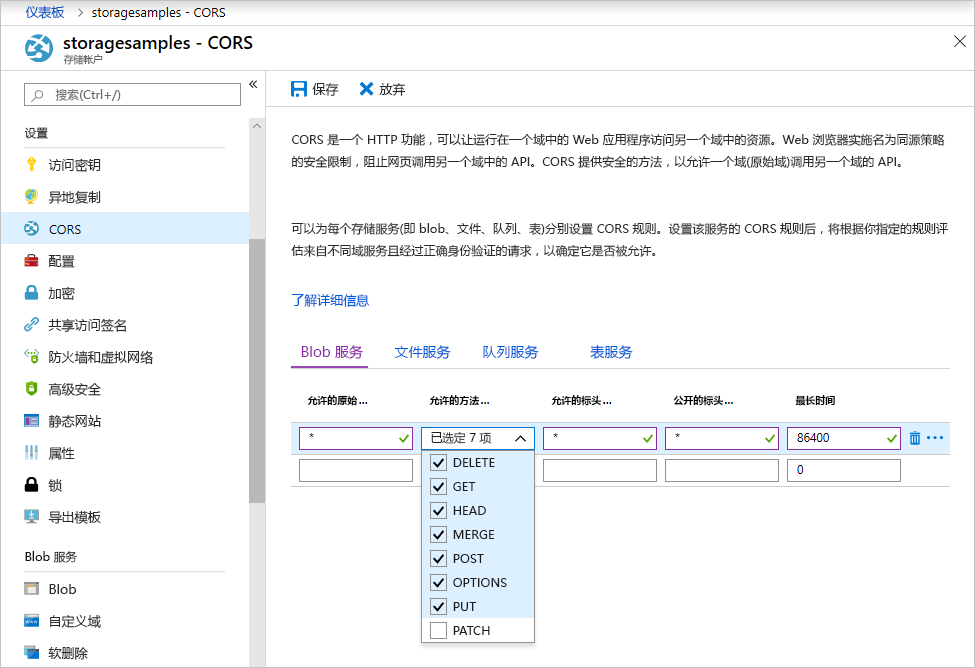

<!-- Customer intent: As a web application developer I want to interface with Azure Blob storage entirely on the client so that I can build a SPA application that is able to upload and delete files on blob storage. -->

# <a name="quickstart-manage-blobs-with-javascript-v12-sdk-in-a-browser"></a>快速入门：在浏览器中使用 JavaScript v12 SDK 管理 Blob

Azure Blob 存储已经过优化，可以存储大量的非结构化数据。 Blob 是可以保存文本或二进制数据（包括图像、文档、流媒体和存档数据）的对象。 本快速入门介绍如何在浏览器中使用 JavaScript 管理 Blob。 你将上传和列出 Blob，并创建和删除容器。

[API 参考文档](/javascript/api/@azure/storage-blob) | [库源代码](https://github.com/Azure/azure-sdk-for-js/tree/master/sdk/storage/storage-blob) | [包 (npm)](https://www.npmjs.com/package/@azure/storage-blob) | [示例](https://docs.microsoft.com/azure/storage/common/storage-samples-javascript?toc=%2fazure%2fstorage%2fblobs%2ftoc.json#blob-samples)

> [!NOTE]
> 若要使用之前的 SDK 版本入门，请参阅[快速入门：在 Node.js 中使用 JavaScript v10 SDK 管理 blob](storage-quickstart-blobs-nodejs-legacy.md)。

## <a name="prerequisites"></a>先决条件

* [一个 Azure 帐户和一个有效的订阅](https://azure.microsoft.com/free/?ref=microsoft.com&utm_source=microsoft.com&utm_medium=docs&utm_campaign=visualstudio)
* [一个 Azure 存储帐户](../common/storage-account-create.md)
* [Node.js](https://nodejs.org)
* [Microsoft Visual Studio Code](https://code.visualstudio.com)
* 一个用于进行浏览器调试的 Visual Studio Code 扩展，例如：
    * [适用于 Microsoft Edge 的调试器](https://marketplace.visualstudio.com/items?itemName=msjsdiag.debugger-for-edge)
    * [适用于 Chrome 的调试器](https://marketplace.visualstudio.com/items?itemName=msjsdiag.debugger-for-chrome)
    * [适用于 Firefox 的调试器](https://marketplace.visualstudio.com/items?itemName=firefox-devtools.vscode-firefox-debug)


[!INCLUDE [storage-multi-protocol-access-preview](../../../includes/storage-multi-protocol-access-preview.md)]

## <a name="object-model"></a>对象模型

Blob 存储提供了三种类型的资源：

* 存储帐户
* 存储帐户中的容器
* 容器中的 blob

以下图示显示了这些资源之间的关系。


在本快速入门中，你将使用以下 JavaScript 类来与这些资源进行交互：

* [BlobServiceClient](/javascript/api/@azure/storage-blob/blobserviceclient)：`BlobServiceClient` 类可用于操纵 Azure 存储资源和 blob 容器。
* [ContainerClient](/javascript/api/@azure/storage-blob/containerclient)：`ContainerClient` 类可用于操纵 Azure 存储容器及其 blob。
* [BlockBlobClient](/javascript/api/@azure/storage-blob/blockblobclient)：`BlockBlobClient` 类可用于操纵 Azure 存储 blob。

## <a name="setting-up"></a>设置

本部分逐步指导如何准备一个项目，使其与适用于 JavaScript 的 Azure Blob 存储客户端库 v12 配合使用。

### <a name="create-a-cors-rule"></a>创建 CORS 规则

必须先配置你的帐户来启用[跨源资源共享](https://docs.microsoft.com/rest/api/storageservices/cross-origin-resource-sharing--cors--support-for-the-azure-storage-services)（简称 CORS），然后 Web 应用程序才能从客户端访问 Blob 存储。

在 Azure 门户中，选择你的存储帐户。 若要定义新的 CORS 规则，请导航到“设置”部分并选择“CORS”。   对于本快速入门，请创建开放的 CORS 规则：



下表描述了每项 CORS 设置，并对用于定义规则的值进行了说明。

|设置  |值  | 说明 |
|---------|---------|---------|
| **允许的源** | **\*** | 接受一个逗号分隔的列表，其中的域设置为可以接受的域。 将值设置为 `*` 意味着所有域都可以访问存储帐户。 |
| **允许的方法** | “DELETE”、“GET”、“HEAD”、“MERGE”、“POST”、“OPTIONS”和“PUT”        | 列出允许对存储帐户执行操作的 HTTP 谓词。 对于本快速入门，请选择所有可用的选项。 |
| **允许的标头** | **\*** | 定义一个列表，其中包含存储帐户允许的请求标头（包括带前缀的标头）。 将值设置为 `*` 意味着所有标头都可以进行访问。 |
| **公开的标头** | **\*** | 列出帐户允许的响应标头。 将值设置为 `*` 意味着帐户可以发送任何标头。 |
| **最长时间** | **86400** | 浏览器缓存预检 OPTIONS 请求的最长时间（以秒为单位）。 值为 *86400* 意味着缓存可以保留一整天。 |

使用此表中的值填写字段后，单击“保存”按钮。 

> [!IMPORTANT]
> 请确保将生产环境中使用的任何设置所公开的针对存储帐户的访问权限降至最低，以便始终能够进行安全的访问。 此处描述的 CORS 设置适用于快速入门，因为快速入门定义的安全策略是宽松的。 但是，不建议对实际环境使用这些设置。

### <a name="create-a-shared-access-signature"></a>创建共享访问签名

在浏览器中运行的代码使用共享访问签名 (SAS) 来向 Azure Blob 存储请求授权。 使用 SAS 时，客户端可以在没有帐户访问密钥或连接字符串的情况下授权访问存储资源。 有关 SAS 的详细信息，请参阅[使用共享访问签名 (SAS)](../common/storage-sas-overview.md)。

按照以下步骤获取 Blob 服务 SAS URL：

1. 在 Azure 门户中，选择你的存储帐户。
2. 导航到“设置”部分，并选择“共享访问签名”。  
3. 向下滚动，然后单击“生成 SAS 和连接字符串”按钮。 
4. 继续向下滚动，找到“Blob 服务 SAS URL”字段 
5. 单击“Blob 服务 SAS URL”字段最右侧的“复制到剪贴板”按钮。  
6. 将复制的 URL 保存到某个位置，以便在后续步骤中使用。

### <a name="add-the-azure-blob-storage-client-library"></a>添加 Azure Blob 存储客户端库

在本地计算机上创建名为 azure-blobs-js-browser 的新文件夹，并在 Visual Studio Code 中将其打开。 

选择“视图”>“终端”在 Visual Studio Code 中打开一个控制台窗口。  在终端窗口中运行以下 Node.js 包管理器 (npm) 命令，以创建 [package.json](https://docs.npmjs.com/files/package.json) 文件。

```console
npm init -y
```

Azure SDK 由许多单独的包组成。 可以根据你想要使用的服务选择所需的包。 在终端窗口中运行以下 `npm` 命令，以安装 `@azure/storage-blob` 包。

```console
npm install --save @azure/storage-blob
```

#### <a name="bundle-the-azure-blob-storage-client-library"></a>捆绑 Azure Blob 存储客户端库

若要在网站上使用 Azure SDK 库，请转换代码，使其能够在浏览器中运行。 使用称作“捆绑程序”的工具来执行此操作。 绑定过程将提取使用 [Node.js](https://nodejs.org) 约定编写的 JavaScript 代码，并将其转换为浏览器能够理解的格式。 本快速入门文章使用 [Parcel](https://parceljs.org/) 捆绑程序。

在终端窗口中运行以下 `npm` 命令来安装 Parcel：

```console
npm install -g parcel-bundler
```

在 Visual Studio Code 中打开 package.json 文件，并在 `license` 与 `dependencies` 条目之间添加 `browserlist`。  此 `browserlist` 针对三个流行浏览器的最新版本。 现在，完整的 package.json 文件应如下所示： 

:::code language="json" source="~/azure-storage-snippets/blobs/quickstarts/JavaScript/V12/azure-blobs-js-browser/package.json" highlight="12-16":::

保存 package.json 文件。 

### <a name="import-the-azure-blob-storage-client-library"></a>导入 Azure Blob 存储客户端库

若要在 JavaScript 中使用 Azure SDK 库，请导入 `@azure/storage-blob` 包。 在 Visual Studio Code 中创建包含以下 JavaScript 代码的新文件。

:::code language="javascript" source="~/azure-storage-snippets/blobs/quickstarts/JavaScript/V12/azure-blobs-js-browser/index.js" id="snippet_ImportLibrary":::

将该文件作为 index.js 保存到 azure-blobs-js-browser 目录中。  

### <a name="implement-the-html-page"></a>实现 HTML 页

在 Visual Studio Code 中创建一个新文件并添加以下 HTML 代码。

:::code language="html" source="~/azure-storage-snippets/blobs/quickstarts/JavaScript/V12/azure-blobs-js-browser/index.html":::

将该文件作为 index.html 保存到 azure-blobs-js-browser 文件夹中。  

## <a name="code-examples"></a>代码示例

该示例代码展示了如何使用适用于 JavaScript 的 Azure Blob 存储客户端库完成以下任务：

* [声明 UI 元素的字段](#declare-fields-for-ui-elements)
* [添加存储帐户信息](#add-your-storage-account-info)
* [创建客户端对象](#create-client-objects)
* [创建和删除存储容器](#create-and-delete-a-storage-container)
* [列出 Blob](#list-blobs)
* [上传 Blob](#upload-blobs)
* [删除 Blob](#delete-blobs)

你将在向 index.js 文件添加所有代码片段后运行代码。 

### <a name="declare-fields-for-ui-elements"></a>声明 UI 元素的字段

在 index.js 文件的末尾添加以下代码。 

:::code language="JavaScript" source="~/azure-storage-snippets/blobs/quickstarts/JavaScript/V12/azure-blobs-js-browser/index.js" id="snippet_DeclareVariables":::

保存 index.js 文件。 

此代码声明每个 HTML 元素的字段，并实现一个 `reportStatus` 函数来显示输出。

在以下部分，在上一个块的后面添加 JavaScript 代码的每个新块。

### <a name="add-your-storage-account-info"></a>添加存储帐户信息

添加用于访问存储帐户的代码。 请将占位符替换为你之前生成的 Blob 服务 SAS URL。 在 index.js 文件的末尾添加以下代码。 

:::code language="javascript" source="~/azure-storage-snippets/blobs/quickstarts/JavaScript/V12/azure-blobs-js-browser/index.js" id="snippet_StorageAcctInfo":::

保存 index.js 文件。 

### <a name="create-client-objects"></a>创建客户端对象

创建用来与 Azure Blob 存储服务交互的 [BlobServiceClient](/javascript/api/@azure/storage-blob/blobserviceclient) 和 [ContainerClient](/javascript/api/@azure/storage-blob/containerclient) 对象。 在 index.js 文件的末尾添加以下代码。 

:::code language="javascript" source="~/azure-storage-snippets/blobs/quickstarts/JavaScript/V12/azure-blobs-js-browser/index.js" id="snippet_CreateClientObjects":::

保存 index.js 文件。 

### <a name="create-and-delete-a-storage-container"></a>创建和删除存储容器

在网页上单击相应的按钮时会创建和删除存储容器。 在 index.js 文件的末尾添加以下代码。 

:::code language="javascript" source="~/azure-storage-snippets/blobs/quickstarts/JavaScript/V12/azure-blobs-js-browser/index.js" id="snippet_CreateDeleteContainer":::

保存 index.js 文件。 

### <a name="list-blobs"></a>列出 Blob

单击“列出文件”按钮时，会列出存储容器的内容。  在 index.js 文件的末尾添加以下代码。 

:::code language="javascript" source="~/azure-storage-snippets/blobs/quickstarts/JavaScript/V12/azure-blobs-js-browser/index.js" id="snippet_ListBlobs":::

保存 index.js 文件。 

此代码调用 [ContainerClient.listBlobsFlat](/javascript/api/@azure/storage-blob/containerclient#listblobsflat-containerlistblobsoptions-) 函数，然后使用迭代器检索返回的每个 [BlobItem](/javascript/api/@azure/storage-blob/blobitem) 的名称。 对于每个 `BlobItem`，它会使用 [name](/javascript/api/@azure/storage-blob/blobitem#name) 属性值更新“文件”列表。 

### <a name="upload-blobs"></a>上传 Blob

单击“选择并上传文件”按钮时，会将文件上传到存储容器。  在 index.js 文件的末尾添加以下代码。 

:::code language="javascript" source="~/azure-storage-snippets/blobs/quickstarts/JavaScript/V12/azure-blobs-js-browser/index.js" id="snippet_UploadBlobs":::

保存 index.js 文件。 

此代码将“Select and upload files”按钮连接到隐藏的 `file-input` 元素。  按钮 `click` 事件会触发文件输入 `click` 事件，并显示文件选取器。 选择文件并关闭对话框之后，将发生 `input` 事件并调用 `uploadFiles` 函数。 此函数创建一个 [BlockBlobClient](/javascript/api/@azure/storage-blob/blockblobclient) 对象，然后针对所选的每个文件调用仅限浏览器的 [uploadBrowserData](/javascript/api/@azure/storage-blob/blockblobclient#uploadbrowserdata-blob---arraybuffer---arraybufferview--blockblobparalleluploadoptions-) 函数。 每个调用返回一个 `Promise`。 每个 `Promise` 将添加到列表中，这样就可以等待它们集中到一起，实现文件并行上传。

### <a name="delete-blobs"></a>删除 Blob

单击“删除选定的文件”按钮时，会从存储容器中删除文件。  在 index.js 文件的末尾添加以下代码。 

:::code language="javascript" source="~/azure-storage-snippets/blobs/quickstarts/JavaScript/V12/azure-blobs-js-browser/index.js" id="snippet_DeleteBlobs":::

保存 index.js 文件。 

此代码调用 [ContainerClient.deleteBlob](/javascript/api/@azure/storage-blob/containerclient#deleteblob-string--blobdeleteoptions-) 函数，以删除列表中选定的每个文件。 然后，它会调用前面所示的 `listFiles` 来刷新 **Files** 列表的内容。

## <a name="run-the-code"></a>运行代码

若要在 Visual Studio Code 调试器中运行代码，请为浏览器配置 launch.json 文件。 

### <a name="configure-the-debugger"></a>配置调试器

若要在 Visual Studio Code 中设置调试器扩展，请执行以下操作：

1. 选择“运行”>“添加配置” 
2. 根据在前面的[先决条件](#prerequisites)部分中安装的扩展，选择“Edge”、“Chrome”或“Firefox”。   

添加新配置会创建 launch.json 文件并在编辑器中打开该文件。  修改 launch.json  文件，使 `url` 值为 `http://localhost:1234/index.html`，如下所示：

:::code language="json" source="~/azure-storage-snippets/blobs/quickstarts/JavaScript/V12/azure-blobs-js-browser/.vscode/launch.json" highlight="11":::

更新后，保存 launch.json 文件。  此配置告知 Visual Studio Code 要打开哪个浏览器以及要加载哪个 URL。

### <a name="launch-the-web-server"></a>启动 Web 服务器

若要启动本地开发 Web 服务器，请选择“视图”>“终端”在 Visual Studio Code 中打开一个控制台窗口，然后输入以下命令。 

```console
parcel index.html
```

Parcel 会捆绑你的代码，并在 `http://localhost:1234/index.html` 上为你的页面启动一个本地开发服务器。 每当保存 index.js 文件时，对该文件所做的更改会自动生成，并反映在开发服务器上。 

如果有消息指出“无法使用所配置的端口 1234”，可以运行命令 `parcel -p <port#> index.html` 来更改端口。  在 launch.json 文件中，更新 URL 路径中的端口，使之匹配。 

### <a name="start-debugging"></a>开始调试

在调试器中运行该页，并大致感受一下 Blob 存储的工作原理。 如果出现任何错误，网页上的“状态”窗格会显示收到的错误消息。 

若要在附加了 Visual Studio Code 调试器的浏览器中打开 index.html，请在 Visual Studio Code 中选择“运行”>“开始调试”或者按 F5。  

### <a name="use-the-web-app"></a>使用 Web 应用

在 [Azure 门户](https://portal.azure.com)中，可按以下步骤验证 API 调用的结果。

#### <a name="step-1---create-a-container"></a>步骤 1 - 创建容器

1. 在 Web 应用中，选择“创建容器”。  状态将指示已创建了一个容器。
2. 若要在 Azure 门户中进行验证，请选择你的存储帐户。 在“Blob 服务”下，选择“容器”。   验证是否显示了新容器。 （可能需要选择“刷新”。） 

#### <a name="step-2---upload-a-blob-to-the-container"></a>步骤 2 - 将 Blob 上传到容器

1. 在本地计算机上，创建并保存一个测试文件，例如 test.txt。 
2. 在 Web 应用中，单击“选择并上传文件”。 
3. 浏览到测试文件，然后选择“打开”。  状态将指示文件已上传，并已检索到文件列表。
4. 在 Azure 门户中，选择前面创建的新容器的名称。 验证是否显示了测试文件。

#### <a name="step-3---delete-the-blob"></a>步骤 3 - 删除 Blob

1. 在 Web 应用中，在“文件”下，选择测试文件。 
2. 选择“删除选定的文件”。  状态将指示该文件已删除，并且容器不包含任何文件。
3. 在 Azure 门户中选择“刷新”。  验证是否显示了“找不到任何 Blob”。 

#### <a name="step-4---delete-the-container"></a>步骤 4 - 删除容器

1. 在 Web 应用中，选择“删除容器”。  状态将指示容器已删除。
2. 在 Azure 门户中，选择门户窗格左上角的“\<帐户名\> | 容器”链接。 
3. 选择“刷新”  。 新容器随即消失。
4. 关闭 Web 应用。

### <a name="clean-up-resources"></a>清理资源

在 Visual Studio Code 中单击“终端”控制台，并按 CTRL+C 停止 Web 服务器。 

若要清理在本快速入门中创建的资源，请转到 [Azure 门户](https://portal.azure.com)，并删除在[先决条件](#prerequisites)部分中创建的资源组。

## <a name="next-steps"></a>后续步骤

本快速入门介绍了如何使用 JavaScript 上传、列出和删除 Blob。 此外，还介绍了如何创建和删除 Blob 存储容器。

有关教程、示例、快速入门和其他文档，请访问：

> [!div class="nextstepaction"]
> [Azure for JavaScript 文档](/azure/javascript/)

* 若要了解详细信息，请参阅[适用于 JavaScript 的 Azure Blob 存储客户端库](https://github.com/Azure/azure-sdk-for-js/blob/master/sdk/storage/storage-blob)。
* 若要查看 Blob 存储示例应用，请继续学习 [Azure Blob 存储客户端库 v12 JavaScript 示例](https://github.com/Azure/azure-sdk-for-js/tree/master/sdk/storage/storage-blob/samples)。
