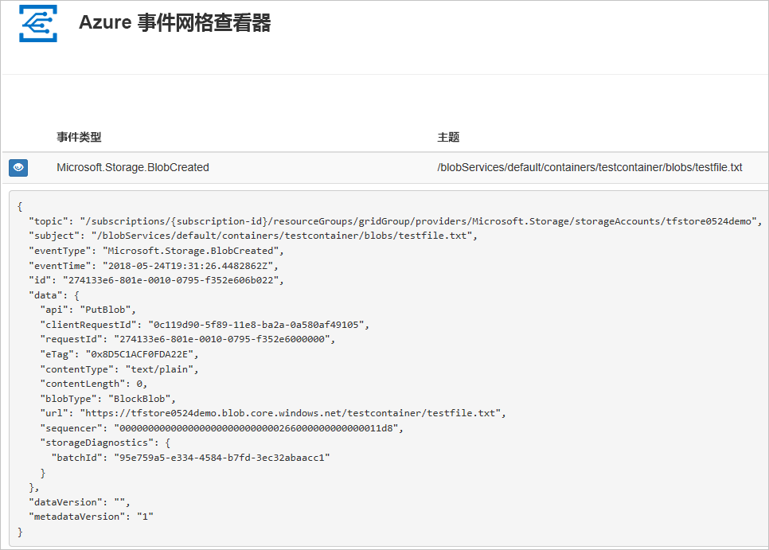
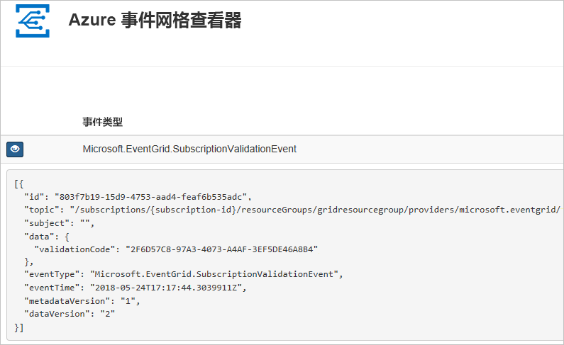

# <a name="route-blob-storage-events-to-a-custom-web-endpoint-with-azure-cli"></a>使用 Azure CLI 将 Blob 存储事件路由到自定义 Web 终结点

Azure 事件网格是针对云的事件处理服务。 在本文中，请使用 Azure CLI 订阅 Blob 存储事件，然后触发可查看结果的事件。

通常，你将事件发送到用于处理事件数据并执行操作的终结点。 但是，为了简化本文，你将事件发送到收集并显示消息的 Web 应用。

完成本文所述步骤后，即可看到事件数据已发送到 Web 应用。




[!INCLUDE [quickstarts-free-trial-note.md](../../../includes/quickstarts-free-trial-note.md)]

[!INCLUDE [cloud-shell-try-it.md](../../../includes/cloud-shell-try-it.md)]

如果选择在本地安装并使用 CLI，本文需要运行最新版的 Azure CLI（2.0.24 或更高版本）。 若要查找版本，请运行 `az --version`。 如果需要进行安装或升级，请参阅[安装 Azure CLI](/cli/azure/install-azure-cli)。

如果不使用云 Shell，则必须先使用 `az login` 登录。

## <a name="create-a-resource-group"></a>创建资源组

事件网格主题是 Azure 资源，必须放置在 Azure 资源组中。 该资源组是在其中部署和管理 Azure 资源的逻辑集合。

使用 [az group create](/cli/azure/group#az_group_create) 命令创建资源组。 

以下示例在 westcentralus 位置创建名为 `<resource_group_name>` 的资源组。  用资源组的唯一名称替换 `<resource_group_name>`。

```azurecli-interactive
az group create --name <resource_group_name> --location westcentralus
```

## <a name="create-a-storage-account"></a>创建存储帐户

要使用 Blob 存储事件，需要 [Blob 存储帐户](../common/storage-create-storage-account.md?toc=%2fazure%2fstorage%2fblobs%2ftoc.json#blob-storage-accounts)或[常规用途 v2 存储帐户](../common/storage-account-options.md#general-purpose-v2-accounts)。 常规用途 v2 (GPv2) 是支持所有存储服务（包括 Blob、文件、队列和表）的所有功能的存储帐户。 Blob 存储帐户是将非结构化数据作为 Blob（对象）存储在 Azure 存储的专用存储帐户。 Blob 存储帐户类似于常规用途存储帐户，并且具有现在使用的所有卓越的耐用性、可用性、伸缩性和性能功能，包括用于块 blob 和追加 blob 的 100% API 一致性。 对于仅需要块 blob 或追加 blob 存储的应用程序，我们建议使用 Blob 存储帐户。 

> [!NOTE]
> 存储事件的可用性与事件网格[可用性](../../event-grid/overview.md)相关联，当事件网格在其他地区可用时，存储事件也同样可用。

将 `<storage_account_name>` 替换为存储帐户的唯一名称，将 `<resource_group_name>` 替换为此前创建的资源组。

```azurecli-interactive
az storage account create \
  --name <storage_account_name> \
  --location westcentralus \
  --resource-group <resource_group_name> \
  --sku Standard_LRS \
  --kind BlobStorage \
  --access-tier Hot
```

## <a name="create-a-message-endpoint"></a>创建消息终结点

在订阅主题之前, 让我们创建事件消息的终结点。 通常情况下，终结点基于事件数据执行操作。 为了简化此快速入门，将部署用于显示事件消息的[预建 Web 应用](https://github.com/dbarkol/azure-event-grid-viewer)。 部署的解决方案包括应用服务计划、应用服务 Web 应用和 GitHub 中的源代码。

将 `<your-site-name>` 替换为 Web 应用的唯一名称。 Web 应用名称必须唯一，因为它是 DNS 条目的一部分。

```azurecli-interactive
sitename=<your-site-name>

az group deployment create \
  --resource-group <resource_group_name> \
  --template-uri "https://raw.githubusercontent.com/dbarkol/azure-event-grid-viewer/master/azuredeploy.json" \
  --parameters siteName=$sitename hostingPlanName=viewerhost
```

部署可能需要几分钟才能完成。 部署成功后，请查看 Web 应用以确保它正在运行。 在 Web 浏览器中导航到 `https://<your-site-name>.azurewebsites.net`

应该看到当前未显示任何消息的站点。

[!INCLUDE [event-grid-register-provider-cli.md](../../../includes/event-grid-register-provider-cli.md)]

## <a name="subscribe-to-your-storage-account"></a>订阅存储帐户

订阅主题，以告知事件网格要跟踪哪些事件，以及要将这些事件发送到何处。 以下示例订阅所创建的存储帐户，并将 Web 应用中的 URL 作为事件通知的终结点传递。 将 `<event_subscription_name>` 替换为事件订阅的名称。 对于 `<resource_group_name>` 和 `<storage_account_name>`，请使用此前创建的值。

Web 应用的终结点必须包括后缀 `/api/updates/`。

```azurecli-interactive
storageid=$(az storage account show --name <storage_account_name> --resource-group <resource_group_name> --query id --output tsv)
endpoint=https://$sitename.azurewebsites.net/api/updates

az eventgrid event-subscription create \
  --resource-id $storageid \
  --name <event_subscription_name> \
  --endpoint $endpoint
```

再次查看 Web 应用，并注意订阅验证事件已发送给它。 选择眼睛图标以展开事件数据。 事件网格发送验证事件，以便终结点可以验证它是否想要接收事件数据。 Web 应用包含用于验证订阅的代码。



## <a name="trigger-an-event-from-blob-storage"></a>触发 Blob 存储中的事件

现在，让我们触发一个事件，看事件网格如何将消息分发到终结点。 首先配置存储帐户的名称和密钥，然后创建容器，再创建并上传文件。 同样，对于 `<storage_account_name>` 和 `<resource_group_name>`，请使用此前创建的值。

```azurecli-interactive
export AZURE_STORAGE_ACCOUNT=<storage_account_name>
export AZURE_STORAGE_ACCESS_KEY="$(az storage account keys list --account-name <storage_account_name> --resource-group <resource_group_name> --query "[0].value" --output tsv)"

az storage container create --name testcontainer

touch testfile.txt
az storage blob upload --file testfile.txt --container-name testcontainer --name testfile.txt
```

你已经触发事件，而事件网格则已将消息发送到你在订阅时配置的终结点。 查看 Web 应用以查看刚刚发送的事件。


```json
[{
  "topic": "/subscriptions/xxxxxxxx-xxxx-xxxx-xxxx-xxxxxxxxxxxx/resourceGroups/myrg/providers/Microsoft.Storage/storageAccounts/myblobstorageaccount",
  "subject": "/blobServices/default/containers/testcontainer/blobs/testfile.txt",
  "eventType": "Microsoft.Storage.BlobCreated",
  "eventTime": "2017-08-16T20:33:51.0595757Z",
  "id": "4d96b1d4-0001-00b3-58ce-16568c064fab",
  "data": {
    "api": "PutBlockList",
    "clientRequestId": "d65ca2e2-a168-4155-b7a4-2c925c18902f",
    "requestId": "4d96b1d4-0001-00b3-58ce-16568c000000",
    "eTag": "0x8D4E4E61AE038AD",
    "contentType": "text/plain",
    "contentLength": 0,
    "blobType": "BlockBlob",
    "url": "https://myblobstorageaccount.blob.core.windows.net/testcontainer/testblob1.txt",
    "sequencer": "00000000000000EB0000000000046199",
    "storageDiagnostics": {
      "batchId": "dffea416-b46e-4613-ac19-0371c0c5e352"
    }
  },
  "dataVersion": "",
  "metadataVersion": "1"
}]

```

## <a name="clean-up-resources"></a>清理资源
如果打算继续使用此存储帐户和事件订阅，请勿清除本文中创建的资源。 如果不打算继续学习，请使用以下命令删除本文中创建的资源。

将 `<resource_group_name>` 替换为上面创建的资源组。

```azurecli-interactive
az group delete --name <resource_group_name>
```

## <a name="next-steps"></a>后续步骤

了解如何创建主题和事件订阅以后，即可进一步学习 Blob 存储事件以及事件网格的功能：

- [对 Blob 存储事件作出反应](storage-blob-event-overview.md)
- [关于事件网格](../../event-grid/overview.md)
