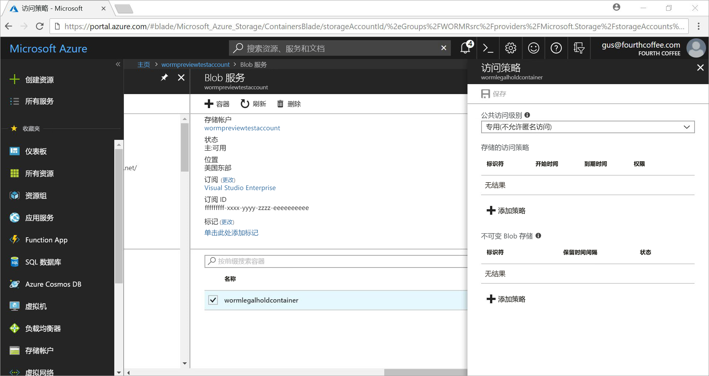
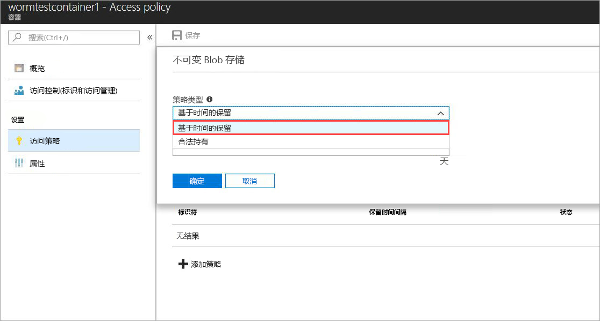
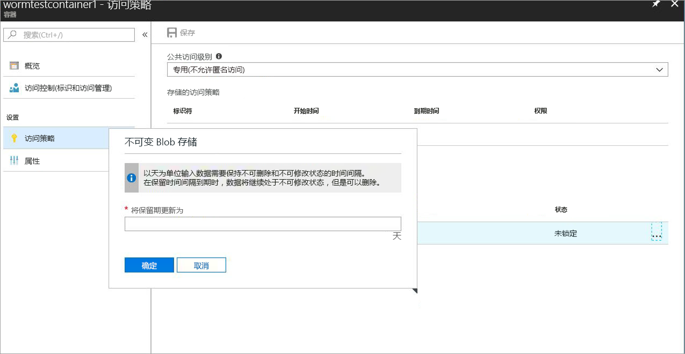
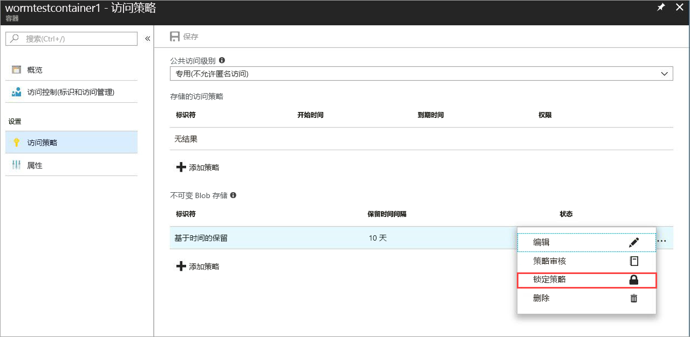
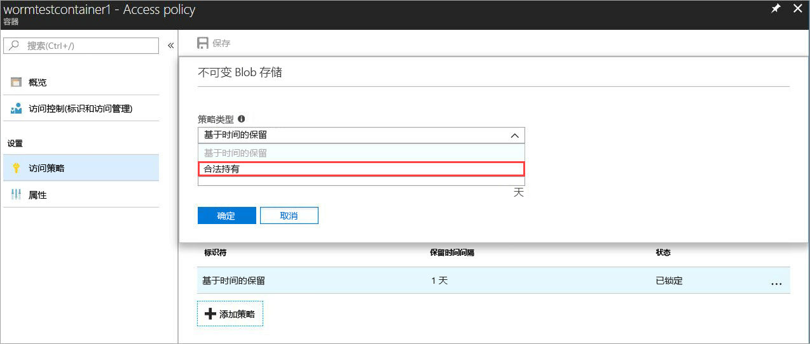
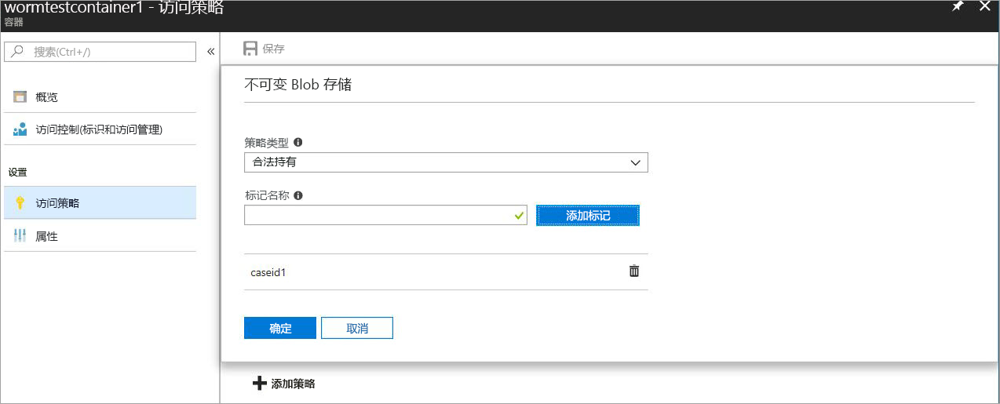

# <a name="immutable-storage-feature-of-azure-blob-storage-preview"></a>Azure Blob 存储的不可变存储功能（预览版）

Azure Blob 的不可变存储功能允许用户以 WORM（一次写入，多次读取）状态在 Azure Blob 存储中存储业务关键数据。 此状态使数据不可擦除且不可修改，存储时间间隔由用户指定。 在保留间隔期间，Blob 可以创建和读取，但不能修改或删除。

## <a name="overview"></a>概述

许多管控行业的组织（尤其是经纪人-经销商组织）可以使用此不可变存储功能以符合 SEC 17a-4(f) 和其他法规的方式存储数据。

典型的应用程序包含：

- **法规符合性**：Azure Blob 的不可变存储功能旨在帮助金融机构和相关的行业解决 SEC 17a-4(f)、CFTC 1.31©-(d)、FINRA 等问题。

- **安全的文档保留**：用户可以获得最大程度的数据保护，因为 Blob 存储服务确保了数据不能被任何用户（包括具有帐户管理特权的用户）修改或删除。

- **法定保留**：Azure Blob 的不可变存储允许用户以防篡改状态存储对诉讼或刑事调查等事项来说很重要的敏感信息，存储时间视需要而定。

不可变存储功能允许：

- **基于时间的保留策略支持：** 用户可以设置策略，将数据存储一段指定的时间间隔。

- **法定保留策略支持：** 在保留时间间隔未知的情况下，用户可以设置法定保留，以不变的方式存储数据，直至法定保留解除。  设置法定保留时，Blob 可以创建和读取，但不能修改或删除。 每个法定保留都与一个用户定义的用作标识符字符串（例如案例 ID）的字母数字标记相关联。

- **支持所有 Blob 层：** WORM 策略独立于 Azure Blob 存储层，将应用于所有层：热层、冷层和存档层。 这样一来，客户就可以将数据存储在最适合其工作负荷的层，同时确保数据不可变

- **容器级别配置：** 不可变存储功能允许用户在容器级别配置基于时间的保留策略和法定保留标记。  用户可以通过简单的容器级别设置来创建并锁定基于时间的保留策略、扩展保留时间间隔，设置并清除法定保留，等等。  这些策略将应用于容器中的所有 Blob，不管是现有的还是新的。

- **审核日志记录支持：** 每个容器包含一个审核日志，为锁定的基于时间的保留策略显示最多五个基于时间的保留命令，保留时间间隔扩展的日志最多为三个。  对于基于时间的保留，日志包含用户 ID、命令类型、时间戳和保留时间间隔。 对于法定保留，日志包含用户 ID、命令类型、时间戳和法定保留标记。 根据 SEC 17a-4(f) 法规准则，此日志的保留时间就是容器的生存时间。 如需包含所有控制平面活动的更全面的日志，可参看 [Azure 活动日志](https://docs.microsoft.com/en-us/azure/monitoring-and-diagnostics/monitoring-overview-activity-logs)。 由用户负责根据法规要求或其他要求永久存储这些日志。

 此功能在所有 Azure 公共区域启用。

## <a name="how-it-works"></a>工作原理

Azure Blob 的不可变存储支持两类 WORM 或不可变策略：基于时间的保留和法定保留。 请参阅[入门](#Getting-started)部分，详细了解如何创建这些不可变策略。
在容器上应用基于时间的保留策略或法定保留时，所有现有的 Blob 都会转为不可变（不可写入和删除）状态。 所有上传到容器的新 Blob 也会转为不可变状态。

> [!IMPORTANT]
> 根据 SEC 17a-4(f) 和其他法规符合性要求，基于时间的保留策略必须处于“锁定”状态才能确保 Blob 不可变（不可写入和删除）。 建议将策略锁定合理的时间，通常为 24 小时内。 除非是短时功能试用，否则不建议使用“非锁定”状态。

 在容器上应用基于时间的保留策略时，容器中的所有 Blob 都会保持在不可变的状态，其持续时间就是有效的保持期。 现有 Blob 的有效保持期就是 Blob 创建时间和用户指定的保留时间间隔之间的差异。 就新 Blob 来说，有效保持期为用户指定的保留时间间隔。 用于用户可以更改保留时间间隔，因此会使用用户指定的保留时间间隔的最新值来计算有效保持期。

> [!TIP]
> 示例：用户创建了一个基于时间的保留策略，将保留时间间隔设置为五年。
> 在该容器中有一个创建于一年前的现成 Blob (testblob1)。 testblob1 的有效保持期将为四年。
> 一个新的 Blob (testblob2) 现已上传到容器。 此新 Blob 的有效保持期将为五年。

### <a name="legal-holds"></a>法定保留

使用法定保留时，所有现有的和新的 Blob 会一直保持在不可变状态，直至法定保留被清除。
有关如何设置和清除法定保留的详细信息，请参阅[入门](#Getting-started)部分。

容器可能会同时有法定保留策略和基于时间的保留策略。 该容器中的所有 Blob 会一直保持不可变状态，直至所有法定保留被清除，即使有效保持期已过期。 与之相反，即使所有法定保留已被清除，Blob 也会保持不可变状态，直至有效保持期过期。
下表显示了会因各种不可变方案而禁用的 Blob 操作的类型。
请参阅 [Azure Blob 服务 API](https://docs.microsoft.com/en-us/rest/api/storageservices/blob-service-rest-api) 文档，了解 Blob REST API 详细信息。

|场景  |Blob 状态  |不允许 Blob 操作  |
|---------|---------|---------|
|Blob 的有效保留时间间隔尚未到期，并且/或者法定保留已设置     |不可变：不可删除和写入         |删除容器、删除 Blob、放置 Blob1、放置块、放置块列表、设置 Blob 元数据、放置页、设置 Blob 属性、快照 Blob、增量复制 Blob、追加块         |
|Blob 的有效保留时间间隔尚未到期     |仅仅不可写入（允许删除操作）         |放置 Blob、放置块、放置块列表、设置 Blob 元数据、放置页、设置 Blob 属性、快照 Blob、增量复制 Blob、追加块         |
|清除了所有法定保留，未在容器上设置任何基于时间的保留策略     |可变         |无         |
|未创建任何 WORM 策略（基于时间的保留或法定保留）     |可变         |无         |

> [!NOTE]
> 在上表的前两个方案中，允许创建 Blob 所需的第一个放置 Blob、放置块列表和放置块操作，所有后续操作都不允许。
> 不可变存储功能仅在 GPv2 和 Blob 存储帐户中提供，必须通过 [Azure 资源管理器](https://docs.microsoft.com/en-us/azure/azure-resource-manager/resource-group-overview)创建。

## <a name="pricing"></a>定价

使用此功能不额外收费，不可变数据的定价方式与常规的可变数据相同。 请参阅 [Azure 存储定价页](https://azure.microsoft.com/pricing/details/storage/blobs/)，了解相关的定价详细信息。

### <a name="restrictions"></a>限制

在公共预览期间，适用以下限制：

- **请勿存储生产或业务关键性数据**
- 所有预览/NDA 限制均适用

## <a name="getting-started"></a>入门

最新版的 [Azure 门户](http://portal.azure.com)、Azure [CLI 2.0](https://docs.microsoft.com/en-us/cli/azure/install-azure-cli?view=azure-cli-latest) 和 Azure [PowerShell](https://github.com/Azure/azure-powershell/releases/tag/Azure.Storage.v4.4.0-preview-May2018) 支持用于 Azure Blob 的 Azure 不可变存储

### <a name="azure-portal"></a>Azure 门户

1. 请创建新的容器或选择现有容器，以便存储需要保持不可变状态的 Blob。
 容器必须位于 GPv2 存储帐户中。
2. 单击“容器设置”中的“访问策略”，然后单击“不可变 Blob 存储”策略下的“+ 添加策略”，如下所示。

    

3. 若要启用基于时间的保留，请从下拉菜单中选择“基于时间的保留”。

    

4. 输入所需的保留时间间隔（以天为单位，至少为一天）

    

    在上面可以看到，策略的初始状态为“未锁定”。 这样就可以使用较小的保留时间间隔来测试此功能，并在锁定它之前对策略进行更改。 必须进行锁定才能确保在法规方面符合 SEC 17a-4 等的要求。

5. 若要锁定策略，请右键单击“...”，然后就会显示以下菜单：

    

    单击“锁定策略”，此时策略状态会显示为“已锁定”。 锁定以后，就不能再删除策略，只能延长锁定时间间隔。

6. 若要启用法定保留，请单击“+ 添加策略”，然后从下拉菜单中选择“法定保留”

    

7. 使用一个或多个标记创建法定保留

    

### <a name="cli-20"></a>CLI 2.0

使用 `az extension add -n storage-preview` 安装 [CLI 扩展](http://docs.microsoft.com/en-us/cli/azure/install-azure-cli?view=azure-cli-latest)

如果已安装扩展，请通过以下命令启用不可变存储功能：`az extension update -n storage-preview`

此功能包括在 `az storage container immutability-policy` 和 `az storage container legal-hold` 命令组中（在其上运行“-h”即可查看命令）。

### <a name="powershell"></a>PowerShell

[PowerShell 版本 4.4.0-preview](https://github.com/Azure/azure-powershell/releases/tag/Azure.Storage.v4.4.0-preview-May20180) 支持不可变存储功能。
若要启用此功能，请执行以下步骤：

1. 确保已使用 `Install-Module PowerShellGet –Repository PSGallery –Force` 安装 PowerShellGet 最新版本
2. 删除以前安装的 Azure PowerShell
3. 安装 AzureRM（Azure 可以从此存储库以类似方式安装）`Install-Module AzureRM –Repository PSGallery –AllowClobber`
4. 安装预览版存储管理平面 cmdlet`Install-Module -Name AzureRM.Storage -AllowPrerelease -Repository PSGallery -AllowClobber`

下面提供了示例 PowerShell 代码，演示了此功能的使用。

## <a name="client-libraries"></a>客户端库

以下客户端库版本支持 Azure Blob 的不可变存储功能

- [.net 客户端库（7.2.0-preview 及更高版本）](https://www.nuget.org/packages/Microsoft.Azure.Management.Storage/7.2.0-preview)
- [node.js 客户端库（4.0.0 及更高版本）](https://www.npmjs.com/package/azure-arm-storage)
- [Python 客户端库（2.0.0 候选发布版 2 及更高版本）](https://pypi.org/project/azure-mgmt-storage/2.0.0rc1/)

## <a name="supported-values"></a>支持的值

- 最小保留时间间隔为 1 天，最大为 400 年
- 就给定的存储帐户来说，在使用锁定的不可变策略的情况下，每个存储帐户的最大容器数目是 1000
- 就给定的存储帐户来说，在使用法定保留设置的情况下，容器的最大数目为 1000
- 就给定的容器来说，法定保留标记的最大数目为 10
- 法定保留标记的最大长度为 23 个字母数字字符，最小长度为 3 个字符
- 就给定容器来说，对于锁定的不可变策略，允许的保留时间间隔扩展的最大数目为 3
- 就使用锁定的不可变策略的给定容器来说，基于时间的保留策略日志的最大数目为 5，可以在容器生存期保留的法定保留策略日志的最大数目为 10。

## <a name="faq"></a>常见问题

**此功能是只适用于块 Blob，还是也适用于页 Blob 和追加 Blob？**

Blob 的不可变存储功能适用于任何 Blob 类型。  但请注意，建议在大多数情况下将此功能用于块 Blob。 与块 Blob 不同，页 Blob 和追加 Blob 需先在 WORM 容器外部创建，然后再复制到容器中。  复制到 WORM 容器中以后，就不再允许对追加 Blob 执行追加操作，也不允许对页 Blob 进行更改。

**是否始终需要创建新的存储帐户才能使用此功能？**

可以在任何现有的 GPv2 帐户上使用不可变存储功能，也可在帐户类型为 GPv2 的新存储帐户上使用此功能。 此功能仅适用于 Blob 存储。

**如果尝试删除某个容器，而该容器使用锁定的基于时间的保留策略或法定保留，会发生什么情况？**

如果至少有一个 Blob 使用锁定的基于时间的保留策略或法定保留，则“删除容器”操作会失败。 如果没有 Blob 存在活动的保留时间间隔，也没有法定保留，则“删除容器”操作会成功。 必须先删除 Blob，然后才能删除容器。

**如果尝试删除的存储帐户有一个 WORM 容器，而该容器使用锁定的基于时间的保留策略或法定保留，会发生什么情况？**

如果至少有一个 WORM 容器有法定保留，或者有一个 Blob 有活动的保留时间间隔，则存储帐户删除操作会失败。  必须先删除所有 WORM 容器，然后才能删除存储帐户。  有关容器删除的信息，请查看问题 2。

**当 Blob 处于不可变状态时，是否可以跨不同的 Blob 层（热、凉、冷）来移动数据？**

是的，可以在数据处于不可变状态时使用“设置 Blob 层”命令跨 Blob 层移动数据。 热、凉、冷 Blob 层均支持不可变存储功能。

**如果我无法付款，但我的保留时间间隔尚未到期，会发生什么情况？**

在未付款的情况下，会应用常规的数据保留策略（即规定的宽限期），这在你与 Microsoft 签署的合同的条款与条件中有规定。

**你们是否为只想试用此功能的用户提供试用期或宽限期？**

是的，基于时间的保留策略在首先创建时，将处于“未锁定”状态。 在这种状态下，可以对保留时间间隔进行所需的更改，例如延长或缩短保留时间间隔，甚至可以删除策略。 策略一旦锁定就会始终保持锁定状态，不可删除。 另外，策略在锁定后就再也不能缩短保留时间间隔。 强烈建议仅在试用的情况下使用“未锁定”状态，并在 24 小时内锁定策略，这样就不存在违反 SEC 17a-4(f) 及其他法规的风险。

**此功能在国家/地区及政府云中是否可用？**

不可变存储功能目前仅在 Azure 公共区域提供。 如果对特定的国家/地区云感兴趣，请向 azurestoragefeedback@microsoft.com 发送电子邮件。

## <a name="sample-code"></a>代码示例

下面提供了一个示例 PowerShell 脚本，供参考。
此脚本先创建一个新的存储帐户和容器，然后演示如何设置和清除法定保留、创建和锁定基于时间的保留策略（也称不可变策略）、扩展保留时间间隔，等等。

```powershell
\$ResourceGroup = "\<Enter your resource group\>”

\$StorageAccount = "\<Enter your storage account name\>"

\$container = "\<Enter your container name\>"

\$container2 = "\<Enter another container name\>”

\$location = "\<Enter the storage account location\>"

\# Login to the Azure Resource Manager Account

Login-AzureRMAccount

Register-AzureRmResourceProvider -ProviderNamespace "Microsoft.Storage"

\# Create your Azure Resource Group

New-AzureRmResourceGroup -Name \$ResourceGroup -Location \$location

\# Create your Azure storage account

New-AzureRmStorageAccount -ResourceGroupName \$ResourceGroup -StorageAccountName
\$StorageAccount -SkuName Standard_LRS -Location \$location -Kind Storage

\# Create a new container

New-AzureRmStorageContainer -ResourceGroupName \$ResourceGroup
-StorageAccountName \$StorageAccount -Name \$container

\# Create Container 2 with Storage Account object

\$accountObject = Get-AzureRmStorageAccount -ResourceGroupName \$ResourceGroup
-StorageAccountName \$StorageAccount

New-AzureRmStorageContainer -StorageAccount \$accountObject -Name \$container2

\# Get container

Get-AzureRmStorageContainer -ResourceGroupName \$ResourceGroup
-StorageAccountName \$StorageAccount -Name \$container

\# Get Container with Account object

\$containerObject = Get-AzureRmStorageContainer -StorageAccount \$accountObject
-Name \$container

\#list container

Get-AzureRmStorageContainer -ResourceGroupName \$ResourceGroup
-StorageAccountName \$StorageAccount

\#remove container (Add -Force to dismiss prompt)

Remove-AzureRmStorageContainer -ResourceGroupName \$ResourceGroup
-StorageAccountName \$StorageAccount -Name \$container2

\#with Account object

Remove-AzureRmStorageContainer -StorageAccount \$accountObject -Name
\$container2

\#with Container object

\$containerObject2 = Get-AzureRmStorageContainer -StorageAccount \$accountObject
-Name \$container2

Remove-AzureRmStorageContainer -InputObject \$containerObject2

\#Set LegalHold

Add-AzureRmStorageContainerLegalHold -ResourceGroupName \$ResourceGroup
-StorageAccountName \$StorageAccount -Name \$container -Tag tag1,tag2

\#with Account object

Add-AzureRmStorageContainerLegalHold -StorageAccount \$accountObject -Name
\$container -Tag tag3

\#with Container object

Add-AzureRmStorageContainerLegalHold -Container \$containerObject -Tag tag4,tag5

\#Clear LegalHold

Remove-AzureRmStorageContainerLegalHold -ResourceGroupName \$ResourceGroup
-StorageAccountName \$StorageAccount -Name \$container -Tag tag2

\#with Account object

Remove-AzureRmStorageContainerLegalHold -StorageAccount \$accountObject -Name
\$container -Tag tag3,tag5

\#with Container object

Remove-AzureRmStorageContainerLegalHold -Container \$containerObject -Tag tag4

\# create/update ImmutabilityPolicy

\#\# with account/container name

Set-AzureRmStorageContainerImmutabilityPolicy -ResourceGroupName \$ResourceGroup
-StorageAccountName \$StorageAccount -ContainerName \$container
-ImmutabilityPeriod 10

\#with Account object

Set-AzureRmStorageContainerImmutabilityPolicy -StorageAccount \$accountObject
-ContainerName \$container -ImmutabilityPeriod 1 -Etag \$policy.Etag

\#with Container object

\$policy = Set-AzureRmStorageContainerImmutabilityPolicy -Container
\$containerObject -ImmutabilityPeriod 7

\#\# with ImmutabilityPolicy object

Set-AzureRmStorageContainerImmutabilityPolicy -ImmutabilityPolicy \$policy
-ImmutabilityPeriod 5

\#get ImmutabilityPolicy

Get-AzureRmStorageContainerImmutabilityPolicy -ResourceGroupName \$ResourceGroup
-StorageAccountName \$StorageAccount -ContainerName \$container

\#with Account object

Get-AzureRmStorageContainerImmutabilityPolicy -StorageAccount \$accountObject
-ContainerName \$container

\#with Container object

Get-AzureRmStorageContainerImmutabilityPolicy -Container \$containerObject

\#Lock ImmutabilityPolicy (Add -Force to dismiss prompt)

\#\# with ImmutabilityPolicy object

\$policy = Get-AzureRmStorageContainerImmutabilityPolicy -ResourceGroupName
\$ResourceGroup -StorageAccountName \$StorageAccount -ContainerName \$container

\$policy = Lock-AzureRmStorageContainerImmutabilityPolicy -ImmutabilityPolicy
\$policy -force

\#\# with account/container name

\$policy = Lock-AzureRmStorageContainerImmutabilityPolicy -ResourceGroupName
\$ResourceGroup -StorageAccountName \$StorageAccount -ContainerName \$container
-Etag \$policy.Etag

\#with Account object

\$policy = Lock-AzureRmStorageContainerImmutabilityPolicy -StorageAccount
\$accountObject -ContainerName \$container -Etag \$policy.Etag

\#with Container object

\$policy = Lock-AzureRmStorageContainerImmutabilityPolicy -Container
\$containerObject -Etag \$policy.Etag -force

\#Extend ImmutabilityPolicy

\#\# with ImmutabilityPolicy object

\$policy = Get-AzureRmStorageContainerImmutabilityPolicy -ResourceGroupName
\$ResourceGroup -StorageAccountName \$StorageAccount -ContainerName \$container

\$policy = Set-AzureRmStorageContainerImmutabilityPolicy -ImmutabilityPolicy
\$policy -ImmutabilityPeriod 11 -ExtendPolicy

\#\# with account/container name

\$policy = Set-AzureRmStorageContainerImmutabilityPolicy -ResourceGroupName
\$ResourceGroup -StorageAccountName \$StorageAccount -ContainerName \$container
-ImmutabilityPeriod 11 -Etag \$policy.Etag -ExtendPolicy

\#with Account object

\$policy = Set-AzureRmStorageContainerImmutabilityPolicy -StorageAccount
\$accountObject -ContainerName \$container -ImmutabilityPeriod 12 -Etag
\$policy.Etag -ExtendPolicy

\#with Container object

\$policy = Set-AzureRmStorageContainerImmutabilityPolicy -Container
\$containerObject -ImmutabilityPeriod 13 -Etag \$policy.Etag -ExtendPolicy

\#Remove ImmutabilityPolicy (Add -Force to dismiss prompt)

\#\# with ImmutabilityPolicy object

\$policy = Get-AzureRmStorageContainerImmutabilityPolicy -ResourceGroupName
\$ResourceGroup -StorageAccountName \$StorageAccount -ContainerName \$container

Remove-AzureRmStorageContainerImmutabilityPolicy -ImmutabilityPolicy \$policy

\#\# with account/container name

Remove-AzureRmStorageContainerImmutabilityPolicy -ResourceGroupName
\$ResourceGroup -StorageAccountName \$StorageAccount -ContainerName \$container
-Etag \$policy.Etag

\#with Account object

Remove-AzureRmStorageContainerImmutabilityPolicy -StorageAccount \$accountObject
-ContainerName \$container -Etag \$policy.Etag

\#with Container object

Remove-AzureRmStorageContainerImmutabilityPolicy -Container \$containerObject
-Etag \$policy.Etag
```