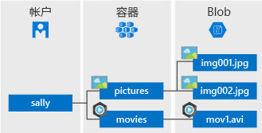

# <a name="quickstart-azure-blob-storage-client-library-for-net"></a>快速入门：适用于 .NET 的 Azure Blob 存储客户端库

适用于 .NET 的 Azure Blob 存储客户端库入门。 Azure Blob 存储是 Microsoft 提供的适用于云的对象存储解决方案。 请按照步骤操作，安装程序包并试用基本任务的示例代码。 Blob 存储最适合存储巨量的非结构化数据。

使用适用于 .NET 的 Azure Blob 存储客户端库完成以下操作：

* 创建容器
* 设置容器权限
* 在 Azure 存储中创建 blob
* 将 blob 下载到本地计算机
* 列出容器中所有的 blob
* 删除容器

[API 参考文档](https://docs.microsoft.com/dotnet/api/overview/azure/storage?view=azure-dotnet) | [库源代码](https://github.com/Azure/azure-storage-net/tree/master/Blob) | [包 (NuGet)](https://www.nuget.org/packages/Microsoft.Azure.Storage.Blob/) | [示例](https://azure.microsoft.com/resources/samples/?sort=0&service=storage&platform=dotnet&term=blob)

[!INCLUDE [storage-multi-protocol-access-preview](../../../includes/storage-multi-protocol-access-preview.md)]

## <a name="required-before-you-begin"></a>开始前需要

* Azure 订阅 - [创建免费帐户](https://azure.microsoft.com/free/)
* Azure 存储帐户 - [创建存储帐户](https://docs.microsoft.com/azure/storage/common/storage-quickstart-create-account)
* 适用于你的操作系统的 [NET Core SDK](https://dotnet.microsoft.com/download/dotnet-core) 或更高版本。 确保获取 SDK，而不是运行时。

## <a name="setting-up"></a>设置

本部分逐步指导如何准备一个项目，使其与适用于 .NET 的 Azure Blob 存储客户端库配合使用。

### <a name="create-the-project"></a>创建项目

首先，创建名为 blob-quickstart 的 .NET Core 应用程序  。

1. 在控制台窗口（例如 cmd、PowerShell 或 Bash）中，使用 `dotnet new` 命令创建名为 blob-quickstart  的新控制台应用程序。 此命令将创建包含单个源文件的简单“Hello World”C# 项目：*Program.cs*。

   ```console
   dotnet new console -n blob-quickstart
   ```

2. 切换到新建的 blob-quickstart 文件夹，并生成应用以验证一切是否正常  。

   ```console
   cd blob-quickstart
   ```

   ```console
   dotnet build
   ```

内部版本的预期输出应如下所示：

```output
C:\QuickStarts\blob-quickstart> dotnet build
Microsoft (R) Build Engine version 16.0.450+ga8dc7f1d34 for .NET Core
Copyright (C) Microsoft Corporation. All rights reserved.

  Restore completed in 44.31 ms for C:\QuickStarts\blob-quickstart\blob-quickstart.csproj.
  blob-quickstart -> C:\QuickStarts\blob-quickstart\bin\Debug\netcoreapp2.1\blob-quickstart.dll

Build succeeded.
    0 Warning(s)
    0 Error(s)

Time Elapsed 00:00:03.08
```

### <a name="install-the-package"></a>安装包

当仍在应用程序目录中时，使用 `dotnet add package` 命令安装适用于 .NET 包的 Azure Blob 存储客户端库。

```console
dotnet add package Microsoft.Azure.Storage.Blob
```

### <a name="set-up-the-app-framework"></a>设置应用框架

从项目目录中执行以下操作：

1. 在编辑器中打开 Program.cs  文件
2. 删除 `Console.WriteLine` 语句
3. 添加 `using` 指令
4. 创建一个 `ProcessAsync` 方法，其中包含示例的主代码
5. 从 `Main` 异步调用 `ProcessAsync` 方法

代码如下：

```csharp
using System;
using System.IO;
using System.Threading.Tasks;
using Microsoft.Azure.Storage;
using Microsoft.Azure.Storage.Blob;

namespace blob_quickstart
{
    class Program
    {
        public static void Main()
        {
            Console.WriteLine("Azure Blob Storage - .NET quickstart sample\n");

            // Run the examples asynchronously, wait for the results before proceeding
            ProcessAsync().GetAwaiter().GetResult();

            Console.WriteLine("Press any key to exit the sample application.");
            Console.ReadLine();
        }

        private static async Task ProcessAsync()
        {
        }
    }
}
```

### <a name="copy-your-credentials-from-the-azure-portal"></a>从 Azure 门户复制凭据

当示例应用程序向 Azure 存储发出请求时，必须对其进行授权。 若要对请求进行授权，请将存储帐户凭据以连接字符串形式添加到应用程序中。 按照以下步骤查看存储帐户凭据：

1. 导航到 [Azure 门户](https://portal.azure.com)。
2. 找到自己的存储帐户。
3. 在存储帐户概述的“设置”部分，选择“访问密钥”。   在这里，可以查看你的帐户访问密钥以及每个密钥的完整连接字符串。
4. 找到“密钥 1”下面的“连接字符串”值，选择“复制”按钮复制该连接字符串。    下一步需将此连接字符串值添加到某个环境变量。

    

### <a name="configure-your-storage-connection-string"></a>配置存储连接字符串

复制连接字符串以后，请将其写入运行应用程序的本地计算机的新环境变量中。 若要设置环境变量，请打开控制台窗口，并遵照适用于操作系统的说明。 将 `<yourconnectionstring>` 替换为实际的连接字符串。

#### <a name="windows"></a>Windows

```cmd
setx CONNECT_STR "<yourconnectionstring>"
```

在 Windows 中添加环境变量后，必须启动命令窗口的新实例。

#### <a name="linux"></a>Linux

```bash
export CONNECT_STR="<yourconnectionstring>"
```

#### <a name="macos"></a>MacOS

```bash
export CONNECT_STR="<yourconnectionstring>"
```

添加环境变量后，重启需要读取环境变量的任何正在运行的程序。 例如，重启开发环境或编辑器，然后再继续。

## <a name="object-model"></a>对象模型

Azure Blob 存储最适合存储巨量的非结构化数据。 非结构化数据是不遵循特定数据模型或定义（如文本或二进制数据）的数据。 Blob 存储提供了三种类型的资源：

* 存储帐户。
* 存储帐户中的容器
* 容器中的 blob

以下图示显示了这些资源之间的关系。



使用以下 .NET 类与这些资源进行交互：

* [CloudStorageAccount](/dotnet/api/microsoft.azure.storage.cloudstorageaccount)：`CloudStorageAccount` 类表示 Azure 存储帐户。 借助此类，可使用帐户访问密钥授予对 Blob 存储的访问权限。
* [CloudBlobClient](/dotnet/api/microsoft.azure.storage.blob.cloudblobclient)：`CloudBlobClient` 类提供对代码中 Blob 服务的访问点。
* [CloudBlobContainer](/dotnet/api/microsoft.azure.storage.blob.cloudblobcontainer)：`CloudBlobContainer` 类表示代码中的 blob 容器。
* [CloudBlockBlob](/dotnet/api/microsoft.azure.storage.blob.cloudblockblob)：`CloudBlockBlob` 对象表示代码中的块 blob。 块 Blob 由可以分别管理的数据块构成。

## <a name="code-examples"></a>代码示例

这些示例代码片段演示如何使用适用于 .NET 的 Azure Blob 存储客户端库执行以下步骤：

   * [对客户端进行身份验证](#authenticate-the-client)
   * [创建容器](#create-a-container)
   * [设置容器权限](#set-permissions-on-a-container)
   * [将 blob 上传到容器中](#upload-blobs-to-a-container)
   * [列出容器中的 blob](#list-the-blobs-in-a-container)
   * [下载 blob](#download-blobs)
   * [删除容器](#delete-a-container)

### <a name="authenticate-the-client"></a>验证客户端

以下代码检查环境变量是否包含一个连接字符串，该字符串在经过分析后可以创建一个指向存储帐户的 [CloudStorageAccount](/dotnet/api/microsoft.azure.storage.cloudstorageaccount?view=azure-dotnet) 对象。 若要检查连接字符串是否有效，请使用 [TryParse](/dotnet/api/microsoft.azure.storage.cloudstorageaccount.tryparse?view=azure-dotnet) 方法。 如果 `TryParse` 成功，它将初始化 `storageAccount` 变量并返回 `true`。

在 `ProcessAsync` 方法内添加此代码：

```csharp
// Retrieve the connection string for use with the application. The storage 
// connection string is stored in an environment variable on the machine 
// running the application called CONNECT_STR. If the 
// environment variable is created after the application is launched in a 
// console or with Visual Studio, the shell or application needs to be closed
// and reloaded to take the environment variable into account.
string storageConnectionString = Environment.GetEnvironmentVariable("CONNECT_STR");

// Check whether the connection string can be parsed.
CloudStorageAccount storageAccount;
if (CloudStorageAccount.TryParse(storageConnectionString, out storageAccount))
{
    // If the connection string is valid, proceed with operations against Blob
    // storage here.
    // ADD OTHER OPERATIONS HERE
}
else
{
    // Otherwise, let the user know that they need to define the environment variable.
    Console.WriteLine(
        "A connection string has not been defined in the system environment variables. " +
        "Add an environment variable named 'CONNECT_STR' with your storage " +
        "connection string as a value.");
    Console.WriteLine("Press any key to exit the application.");
    Console.ReadLine();
}
```

> [!NOTE]
> 若要执行本文中的其余操作，请使用以下部分中的代码片段替换上述代码中的 `// ADD OTHER OPERATIONS HERE`。

### <a name="create-a-container"></a>创建容器

若要创建容器，请先创建 [CloudBlobClient](/dotnet/api/microsoft.azure.storage.blob.cloudblobclient) 对象的实例，该对象指向存储帐户中的 Blob 存储。 接下来，请创建 [CloudBlobContainer](/dotnet/api/microsoft.azure.storage.blob.cloudblobcontainer) 对象的实例，然后创建容器。

在此示例中，代码调用 [CreateAsync](/dotnet/api/microsoft.azure.storage.blob.cloudblobcontainer.createasync) 方法来创建容器。 GUID 值会追加到容器名称，确保其是唯一的。 在生产环境中，通常情况下，首选使用 [CreateIfNotExistsAsync](/dotnet/api/microsoft.azure.storage.blob.cloudblobcontainer.createifnotexistsasync) 方法来创建容器的前提是该方法不存在。

> [!IMPORTANT]
> 容器名称必须为小写。 有关命名容器和 Blob 的详细信息，请参阅[命名和引用容器、Blob 和元数据](https://docs.microsoft.com/rest/api/storageservices/naming-and-referencing-containers--blobs--and-metadata)。

```csharp
// Create the CloudBlobClient that represents the 
// Blob storage endpoint for the storage account.
CloudBlobClient cloudBlobClient = storageAccount.CreateCloudBlobClient();

// Create a container called 'quickstartblobs' and 
// append a GUID value to it to make the name unique.
CloudBlobContainer cloudBlobContainer = 
    cloudBlobClient.GetContainerReference("quickstartblobs" + 
        Guid.NewGuid().ToString());
await cloudBlobContainer.CreateAsync();
```

### <a name="set-permissions-on-a-container"></a>设置容器权限

设置容器权限，使容器中的所有 blob 都是公共的。 如果某个 Blob 是公开的，则任何客户端都可以对其进行匿名访问。

```csharp
// Set the permissions so the blobs are public.
BlobContainerPermissions permissions = new BlobContainerPermissions
{
    PublicAccess = BlobContainerPublicAccessType.Blob
};
await cloudBlobContainer.SetPermissionsAsync(permissions);
```

### <a name="upload-blobs-to-a-container"></a>将 blob 上传到容器中

以下代码片段通过针对前面部分创建的容器调用 [GetBlockBlobReference](/dotnet/api/microsoft.azure.storage.blob.cloudblobcontainer.getblockblobreference) 方法，获取 `CloudBlockBlob` 对象的引用。 然后，它会通过调用 [UploadFromFileAsync](/dotnet/api/microsoft.azure.storage.blob.cloudblockblob.uploadfromfileasync) 方法将所选本地文件上传到 blob。 此方法将创建 Blob（如果该 Blob 尚不存在），或者覆盖 Blob（如果该 Blob 已存在）。

```csharp
// Create a file in your local MyDocuments folder to upload to a blob.
string localPath = Environment.GetFolderPath(Environment.SpecialFolder.MyDocuments);
string localFileName = "QuickStart_" + Guid.NewGuid().ToString() + ".txt";
string sourceFile = Path.Combine(localPath, localFileName);
// Write text to the file.
File.WriteAllText(sourceFile, "Hello, World!");

Console.WriteLine("Temp file = {0}", sourceFile);
Console.WriteLine("Uploading to Blob storage as blob '{0}'", localFileName);

// Get a reference to the blob address, then upload the file to the blob.
// Use the value of localFileName for the blob name.
CloudBlockBlob cloudBlockBlob = cloudBlobContainer.GetBlockBlobReference(localFileName);
await cloudBlockBlob.UploadFromFileAsync(sourceFile);
```

### <a name="list-the-blobs-in-a-container"></a>列出容器中的 Blob

通过使用 [ListBlobsSegmentedAsync](/dotnet/api/microsoft.azure.storage.blob.cloudblobcontainer.listblobssegmentedasync) 方法列出容器中的 blob。 在这种情况下，只向容器添加了一个 blob，因此列表操作只返回那个 blob。

如果一次调用需要返回的 Blob 数过多（默认为超过 5000 个），则 `ListBlobsSegmentedAsync` 方法会返回总结果集的一部分和一个继续令牌。 若要检索下一部分的 Blob，请提供前一调用返回的继续令牌，依此类推，直至继续令牌为 null。 继续令牌为 null 表明已检索所有 Blob。 代码演示如何根据最佳做法使用继续令牌。

```csharp
// List the blobs in the container.
Console.WriteLine("List blobs in container.");
BlobContinuationToken blobContinuationToken = null;
do
{
    var results = await cloudBlobContainer.ListBlobsSegmentedAsync(null, blobContinuationToken);
    // Get the value of the continuation token returned by the listing call.
    blobContinuationToken = results.ContinuationToken;
    foreach (IListBlobItem item in results.Results)
    {
        Console.WriteLine(item.Uri);
    }
} while (blobContinuationToken != null); // Loop while the continuation token is not null.

```

### <a name="download-blobs"></a>下载 Blob

通过使用 [DownloadToFileAsync](/dotnet/api/microsoft.azure.storage.blob.cloudblob.downloadtofileasync) 方法将以前创建的 blob 下载到本地文件系统。 示例代码向 blob 名称添加后缀“_DOWNLOADED”，这样你就可以在本地文件系统中看到这两个文件。

```csharp
// Download the blob to a local file, using the reference created earlier.
// Append the string "_DOWNLOADED" before the .txt extension so that you 
// can see both files in MyDocuments.
string destinationFile = sourceFile.Replace(".txt", "_DOWNLOADED.txt");
Console.WriteLine("Downloading blob to {0}", destinationFile);
await cloudBlockBlob.DownloadToFileAsync(destinationFile, FileMode.Create);
```

### <a name="delete-a-container"></a>删除容器

以下代码使用 [CloudBlobContainer.DeleteAsync](/dotnet/api/microsoft.azure.storage.blob.cloudblobcontainer.deleteasync) 来删除整个容器，从而清除该应用所创建的资源。 也可根据需要删除本地文件。

```csharp
Console.WriteLine("Press the 'Enter' key to delete the example files, " +
    "example container, and exit the application.");
Console.ReadLine();
// Clean up resources. This includes the container and the two temp files.
Console.WriteLine("Deleting the container");
if (cloudBlobContainer != null)
{
    await cloudBlobContainer.DeleteIfExistsAsync();
}
Console.WriteLine("Deleting the source, and downloaded files");
File.Delete(sourceFile);
File.Delete(destinationFile);
```

## <a name="run-the-code"></a>运行代码

此应用在本地 *MyDocuments* 文件夹中创建一个测试文件，并将其上传到 Blob 存储。 然后，该示例会列出容器中的 blob，并使用新名称下载文件，这样便可对旧文件和新文件进行比较。

导航到应用程序目录，然后生成并运行应用程序。

```console
dotnet build
```

```console
dotnet run
```

示例应用程序的输出类似于以下示例：

```output
Azure Blob storage - .NET Quickstart example

Created container 'quickstartblobs33c90d2a-eabd-4236-958b-5cc5949e731f'

Temp file = C:\Users\myusername\Documents\QuickStart_c5e7f24f-a7f8-4926-a9da-96
97c748f4db.txt
Uploading to Blob storage as blob 'QuickStart_c5e7f24f-a7f8-4926-a9da-9697c748f
4db.txt'

Listing blobs in container.
https://storagesamples.blob.core.windows.net/quickstartblobs33c90d2a-eabd-4236-
958b-5cc5949e731f/QuickStart_c5e7f24f-a7f8-4926-a9da-9697c748f4db.txt

Downloading blob to C:\Users\myusername\Documents\QuickStart_c5e7f24f-a7f8-4926
-a9da-9697c748f4db_DOWNLOADED.txt

Press any key to delete the example files and example container.
```

按 **Enter** 键时，应用程序会删除存储容器和文件。 在删除之前，请在 *MyDocuments* 文件夹中查看这两个文件。 可以打开它们，然后就会观察到它们完全相同。 从控制台窗口复制 Blob 的 URL，将其粘贴到浏览器中，查看 Blob 的内容。

验证文件后，按任意键可完成演示并删除测试文件。

## <a name="next-steps"></a>后续步骤

本快速入门介绍了如何使用 .NET 上传、下载和列出 Blob。

若要了解如何创建一个 Web 应用，以便将映像上传到 Blob 存储，请继续学习：

> [!div class="nextstepaction"]
> [上传和处理图像](storage-upload-process-images.md)

* 若要详细了解 .NET Core，请参阅 [Get started with .NET in 10 minutes](https://www.microsoft.com/net/learn/get-started/)（.NET 10 分钟入门）。
* 若要了解可以通过用于 Windows 的 Visual Studio 部署的示例应用程序，请参阅 [.NET Photo Gallery Web Application Sample with Azure Blob Storage](https://azure.microsoft.com/resources/samples/storage-blobs-dotnet-webapp/)（.NET 照片库 Web 应用程序示例与 Azure Blob 存储）。
