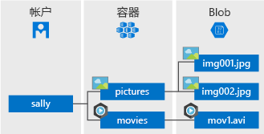

# <a name="quickstart-azure-blob-storage-client-library-v12-for-java"></a>快速入门：适用于 Java 的 Azure Blob 存储客户端库 v12

适用于 Java 的 Azure Blob 存储客户端库 v12 入门。 Azure Blob 存储是 Microsoft 提供的适用于云的对象存储解决方案。 请按照步骤操作，安装程序包并试用基本任务的示例代码。 Blob 存储最适合存储巨量的非结构化数据。

> [!NOTE]
> 若要开始使用以前的 SDK 版本，请参阅[快速入门：适用于 Java 的 Azure Blob 存储客户端库](storage-quickstart-blobs-java-legacy.md)。

使用适用于 Java 的 Azure Blob 存储客户端库 v12 完成以下操作：

* 创建容器
* 将 blob 上传到 Azure 存储
* 列出容器中所有的 blob
* 将 Blob 下载到本地计算机
* 删除容器

[API 参考文档](https://azuresdkdocs.blob.core.windows.net/$web/java/azure-storage-blob/12.0.0/index.html) | [库源代码](https://github.com/Azure/azure-sdk-for-java/tree/master/sdk/storage/azure-storage-blob) | [包 (Maven)](https://mvnrepository.com/artifact/com.azure/azure-storage-blob?repo=jcenter) | [示例](https://github.com/Azure/azure-sdk-for-java/tree/master/sdk/storage/azure-storage-blob/src/samples/java/com/azure/storage/blob)

[!INCLUDE [storage-multi-protocol-access-preview](../../../includes/storage-multi-protocol-access-preview.md)]

## <a name="prerequisites"></a>先决条件

* [Java 开发工具包 (JDK)](/java/azure/jdk/?view=azure-java-stable) 8 或更高版本
* [Apache Maven](https://maven.apache.org/download.cgi)
* Azure 订阅 - [创建免费帐户](https://azure.microsoft.com/free/)
* Azure 存储帐户 - [创建存储帐户](https://docs.microsoft.com/azure/storage/common/storage-quickstart-create-account)

## <a name="setting-up"></a>设置

本部分逐步指导如何准备一个项目，使其与适用于 Java 的 Azure Blob 存储客户端库 v12 配合使用。

### <a name="create-the-project"></a>创建项目

创建名为 blob-quickstart-v12 的 Java Core 应用程序  。

1. 在控制台窗口（例如 cmd、PowerShell 或 Bash）中，使用 Maven 创建名为 blob-quickstart-v12 的新控制台应用  。 在单个行上键入以下“mvn”命令，创建简单的“Hello World!  ” Java 项目。 为了便于阅读，这里以多行显示该命令。

   ```console
   mvn archetype:generate -DgroupId=com.blobs.quickstart
                          -DartifactId=blob-quickstart-v12
                          -DarchetypeArtifactId=maven-archetype-quickstart
                          -DarchetypeVersion=1.4
                          -DinteractiveMode=false
   ```

1. 生成项目的输出应如下所示：

    ```console
    [INFO] Scanning for projects...
    [INFO]
    [INFO] ------------------< org.apache.maven:standalone-pom >-------------------
    [INFO] Building Maven Stub Project (No POM) 1
    [INFO] --------------------------------[ pom ]---------------------------------
    [INFO]
    [INFO] >>> maven-archetype-plugin:3.1.2:generate (default-cli) > generate-sources @ standalone-pom >>>
    [INFO]
    [INFO] <<< maven-archetype-plugin:3.1.2:generate (default-cli) < generate-sources @ standalone-pom <<<
    [INFO]
    [INFO]
    [INFO] --- maven-archetype-plugin:3.1.2:generate (default-cli) @ standalone-pom ---
    [INFO] Generating project in Batch mode
    [INFO] ----------------------------------------------------------------------------
    [INFO] Using following parameters for creating project from Archetype: maven-archetype-quickstart:1.4
    [INFO] ----------------------------------------------------------------------------
    [INFO] Parameter: groupId, Value: com.blobs.quickstart
    [INFO] Parameter: artifactId, Value: blob-quickstart-v12
    [INFO] Parameter: version, Value: 1.0-SNAPSHOT
    [INFO] Parameter: package, Value: com.blobs.quickstart
    [INFO] Parameter: packageInPathFormat, Value: com/blobs/quickstart
    [INFO] Parameter: version, Value: 1.0-SNAPSHOT
    [INFO] Parameter: package, Value: com.blobs.quickstart
    [INFO] Parameter: groupId, Value: com.blobs.quickstart
    [INFO] Parameter: artifactId, Value: blob-quickstart-v12
    [INFO] Project created from Archetype in dir: C:\QuickStarts\blob-quickstart-v12
    [INFO] ------------------------------------------------------------------------
    [INFO] BUILD SUCCESS
    [INFO] ------------------------------------------------------------------------
    [INFO] Total time:  7.056 s
    [INFO] Finished at: 2019-10-23T11:09:21-07:00
    [INFO] ------------------------------------------------------------------------
        ```

1. Switch to the newly created *blob-quickstart-v12* folder.

   ```console
   cd blob-quickstart-v12
   ```

1. 在 blob-quickstart-v12 目录中，创建名为 data 的另一个目录   。 将在这里创建和存储 blob 数据文件。

    ```console
    mkdir data
    ```

### <a name="install-the-package"></a>安装包

在文本编辑器中打开 pom.xml 文件  。 将以下依赖项元素添加到依赖项组。

```xml
<dependency>
    <groupId>com.azure</groupId>
    <artifactId>azure-storage-blob</artifactId>
    <version>12.0.0</version>
</dependency>
```

### <a name="set-up-the-app-framework"></a>设置应用框架

从项目目录中执行以下操作：

1. 导航到 /src/main/java/com/blobs/quickstart 目录 
1. 在编辑器中打开 App.java 文件 
1. 删除 `System.out.println("Hello world!");` 语句
1. 添加 `import` 指令

代码如下：

```java
package com.blobs.quickstart;

/**
 * Azure blob storage v12 SDK quickstart
 */
import com.azure.storage.blob.*;
import com.azure.storage.blob.models.*;
import java.io.*;

public class App
{
    public static void main( String[] args ) throws IOException
    {
    }
}
```

### <a name="copy-your-credentials-from-the-azure-portal"></a>从 Azure 门户复制凭据

当示例应用程序向 Azure 存储发出请求时，必须对其进行授权。 若要对请求进行授权，请将存储帐户凭据以连接字符串形式添加到应用程序中。 按照以下步骤查看存储帐户凭据：

1. 登录到 [Azure 门户](https://portal.azure.com)。
2. 找到自己的存储帐户。
3. 在存储帐户概述的“设置”部分，选择“访问密钥”。   在这里，可以查看你的帐户访问密钥以及每个密钥的完整连接字符串。
4. 找到“密钥 1”下面的“连接字符串”值，选择“复制”按钮复制该连接字符串。    下一步需将此连接字符串值添加到某个环境变量。

    

### <a name="configure-your-storage-connection-string"></a>配置存储连接字符串

复制连接字符串以后，请将其写入运行应用程序的本地计算机的新环境变量中。 若要设置环境变量，请打开控制台窗口，并遵照适用于操作系统的说明。 将 `<yourconnectionstring>` 替换为实际的连接字符串。

#### <a name="windows"></a>Windows

```cmd
setx CONNECT_STR "<yourconnectionstring>"
```

在 Windows 中添加环境变量后，必须启动命令窗口的新实例。

#### <a name="linux"></a>Linux

```bash
export CONNECT_STR="<yourconnectionstring>"
```

#### <a name="macos"></a>macOS

```bash
export CONNECT_STR="<yourconnectionstring>"
```

#### <a name="restart-programs"></a>重新启动程序

添加环境变量后，重启需要读取环境变量的任何正在运行的程序。 例如，重启开发环境或编辑器，然后再继续。

## <a name="object-model"></a>对象模型

Azure Blob 存储最适合存储巨量的非结构化数据。 非结构化数据是不遵循特定数据模型或定义（如文本或二进制数据）的数据。 Blob 存储提供了三种类型的资源：

* 存储帐户
* 存储帐户中的容器
* 容器中的 blob

以下图示显示了这些资源之间的关系。



使用以下 Java 类与这些资源进行交互：

* [BlobServiceClient](/java/api/com.azure.storage.blob.blobserviceclient)：`BlobServiceClient` 类可用于操纵 Azure 存储资源和 blob 容器。 存储帐户为 Blob 服务提供顶级命名空间。
* [BlobServiceClientBuilder](/java/api/com.azure.storage.blob.blobserviceclientbuilder)：`BlobServiceClientBuilder` 类提供流畅的生成器 API，以帮助对 `BlobServiceClient` 对象的配置和实例化。
* [BlobContainerClient](/java/api/com.azure.storage.blob.blobcontainerclient)：`BlobContainerClient` 类可用于操纵 Azure 存储容器及其 blob。
* [BlobClient](/java/api/com.azure.storage.blob.blobclient)：`BlobClient` 类可用于操纵 Azure 存储 blob。
* [BlobItem](/java/api/com.azure.storage.blob.blobitem)：`BlobItem` 类表示从对 `listBlobsFlat` 的调用返回的单个 blob。

## <a name="code-examples"></a>代码示例

这些示例代码片段演示如何使用适用于 Java 的 Azure Blob 存储客户端库执行以下步骤：

* [获取连接字符串](#get-the-connection-string)
* [创建容器](#create-a-container)
* [将 blob 上传到容器中](#upload-blobs-to-a-container)
* [列出容器中的 blob](#list-the-blobs-in-a-container)
* [下载 blob](#download-blobs)
* [删除容器](#delete-a-container)

### <a name="get-the-connection-string"></a>获取连接字符串

下面的代码从[配置存储连接字符串](#configure-your-storage-connection-string)部分中创建的环境变量中检索存储帐户的连接字符串。

在 `Main` 方法内添加此代码：

```java
System.out.println("Azure Blob storage v12 - Java quickstart sample\n");

// Retrieve the connection string for use with the application. The storage
// connection string is stored in an environment variable on the machine
// running the application called CONNECT_STR. If the environment variable
// is created after the application is launched in a console or with
// Visual Studio, the shell or application needs to be closed and reloaded
// to take the environment variable into account.
String connectStr = System.getenv("CONNECT_STR");
```

### <a name="create-a-container"></a>创建容器

确定新容器的名称。 以下代码将 UUID 值追加到容器名称，确保其是唯一的。

> [!IMPORTANT]
> 容器名称必须为小写。 有关命名容器和 Blob 的详细信息，请参阅[命名和引用容器、Blob 和元数据](/rest/api/storageservices/naming-and-referencing-containers--blobs--and-metadata)。

接下来，创建 [BlobContainerClient](/java/api/com.azure.storage.blob.blobcontainerclient) 类，然后调用 [create](/java/api/com.azure.storage.blob.blobcontainerclient.create) 方法，在存储帐户中实际创建容器。

将此代码添加到 `Main` 方法的末尾：

```java
// Create a BlobServiceClient object which will be used to create a container client
BlobServiceClient blobServiceClient = new BlobServiceClientBuilder().connectionString(connectStr).buildClient();

//Create a unique name for the container
String containerName = "quickstartblobs" + java.util.UUID.randomUUID();

// Create the container and return a container client object
BlobContainerClient containerClient = blobServiceClient.createBlobContainer(containerName);
```

### <a name="upload-blobs-to-a-container"></a>将 blob 上传到容器中

以下代码片段：

1. 在本地 data 目录中创建文本文件  。
1. 对在[创建容器](#create-a-container)部分创建的容器调用 [getBlobClient](/java/api/com.azure.storage.blob.blobcontainerclient.getblobclient) 方法，获取对 [BlobClient](/java/api/com.azure.storage.blob.blobclient) 对象的引用。
1. 通过调用 [uploadFromFile](/java/api/com.azure.storage.blob.blobclient.uploadfromfile) 方法将本地文本文件上传到 blob。 此方法将创建 Blob（如果该 Blob 尚不存在），或者覆盖 Blob（如果该 Blob 已存在）。

将此代码添加到 `Main` 方法的末尾：

```java
// Create a local file in the ./data/ directory for uploading and downloading
String localPath = "./data/";
String fileName = "quickstart" + java.util.UUID.randomUUID() + ".txt";
File localFile = new File(localPath + fileName);

// Write text to the file
FileWriter writer = new FileWriter(localPath + fileName, true);
writer.write("Hello, World!");
writer.close();

// Get a reference to a blob
BlobClient blobClient = containerClient.getBlobClient(fileName);

System.out.println("\nUploading to Blob storage as blob:\n\t" + blobClient.getBlobUrl());

// Upload the blob
blobClient.uploadFromFile(localPath + fileName);
```

### <a name="list-the-blobs-in-a-container"></a>列出容器中的 Blob

通过调用 [listBlobsFlat](/java/api/com.azure.storage.blob.blobcontainerclient.listblobsflat) 方法，列出容器中的 blob。 在这种情况下，只向容器添加了一个 blob，因此列表操作只返回那个 blob。

将此代码添加到 `Main` 方法的末尾：

```java
System.out.println("\nListing blobs...");

// List the blob(s) in the container.
for (BlobItem blobItem : containerClient.listBlobs()) {
    System.out.println("\t" + blobItem.getName());
}
```

### <a name="download-blobs"></a>下载 Blob

通过调用 [downloadToFile](/java/api/com.azure.storage.blob.blobclient.downloadtofile) 方法，下载以前创建的 blob。 示例代码将向文件名添加后缀“DOWNLOAD”，这样你就可以在本地文件系统中看到这两个文件。

将此代码添加到 `Main` 方法的末尾：

```java
// Download the blob to a local file
// Append the string "DOWNLOAD" before the .txt extension so that you can see both files.
String downloadFileName = fileName.replace(".txt", "DOWNLOAD.txt");
File downloadedFile = new File(localPath + downloadFileName);

System.out.println("\nDownloading blob to\n\t " + localPath + downloadFileName);

blobClient.downloadToFile(localPath + downloadFileName);
```

### <a name="delete-a-container"></a>删除容器

以下代码使用 [delete](/java/api/com.azure.storage.blob.blobcontainerclient.delete) 方法删除整个容器，从而清除该应用所创建的资源。 它还会删除由应用创建的本地文件。

在删除 blob、容器和本地文件之前，应用会调用 `System.console().readLine()` 以暂停并等待用户输入。 可以通过这种方式验证是否已正确创建资源，然后再删除该资源。

将此代码添加到 `Main` 方法的末尾：

```java
// Clean up
System.out.println("\nPress the Enter key to begin clean up");
System.console().readLine();

System.out.println("Deleting blob container...");
containerClient.delete();

System.out.println("Deleting the local source and downloaded files...");
localFile.delete();
downloadedFile.delete();

System.out.println("Done");
```

## <a name="run-the-code"></a>运行代码

此应用在本地文件夹中创建测试文件，并将其上传到 Blob 存储。 然后，该示例会列出容器中的 blob，并使用新名称下载文件，这样便可对旧文件和新文件进行比较。

导航到包含 pom.xml 文件的目录，并使用以下 `mvn` 命令编译该项目  。

```console
mvn compile
```

然后，生成包。

```console
mvn package
```

运行以下 `mvn` 命令以执行应用。

```console
mvn exec:java -Dexec.mainClass="com.blobs.quickstart.App" -Dexec.cleanupDaemonThreads=false
```

应用的输出类似于以下示例：

```output
Azure Blob storage v12 - Java quickstart sample

Uploading to Blob storage as blob:
        https://mystorageacct.blob.core.windows.net/quickstartblobsf9aa68a5-260e-47e6-bea2-2dcfcfa1fd9a/quickstarta9c3a53e-ae9d-4863-8b34-f3d807992d65.txt

Listing blobs...
        quickstarta9c3a53e-ae9d-4863-8b34-f3d807992d65.txt

Downloading blob to
        ./data/quickstarta9c3a53e-ae9d-4863-8b34-f3d807992d65DOWNLOAD.txt

Press the Enter key to begin clean up

Deleting blob container...
Deleting the local source and downloaded files...
Done
```

在开始清理过程之前，请在“MyDocuments”文件夹中查找这两个文件  。 可以打开它们，然后就会观察到它们完全相同。

验证文件后，按 Enter 键以删除测试文件并完成演示  。

## <a name="next-steps"></a>后续步骤

本快速入门介绍了如何使用 Java 上传、下载和列出 blob。

若要查看 Blob 存储示例应用，请继续执行以下操作：

> [!div class="nextstepaction"]
> [Azure Blob 存储 SDK v12 Java 示例](https://github.com/Azure/azure-sdk-for-java/tree/master/sdk/storage/azure-storage-blob/src/samples/java/com/azure/storage/blob)

* 若要了解详细信息，请参阅 [Azure SDK for Java](https://github.com/Azure/azure-sdk-for-java/blob/master/README.md)。
* 有关教程、示例、快速入门和其他文档，请访问[面向 Java 云开发人员的 Azure](/azure/java/)。
