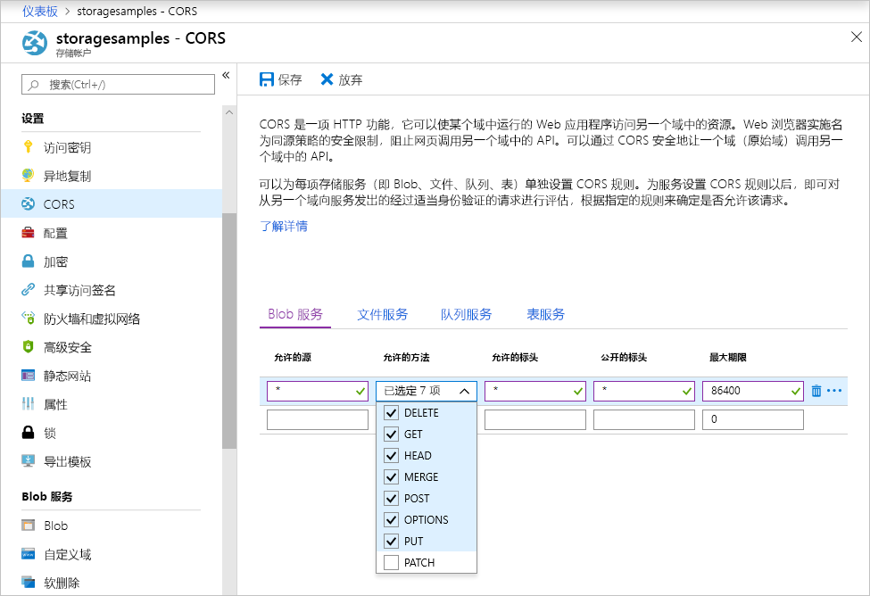

<!-- Customer intent: As a web application developer I want to interface with Azure Blob storage entirely on the client so that I can build a SPA application that is able to upload and delete files on blob storage. -->

# <a name="quickstart-upload-list-and-delete-blobs-using-javascripthtml-in-the-browser"></a>快速入门：在浏览器中使用 JavaScript/HTML 上传、列出和删除 Blob
本快速入门演示如何通过完全在浏览器中运行的代码管理 blob。 此处使用的方法演示如何使用所需的安全措施确保对 blob 存储帐户的受保护访问。 若要完成本快速入门，需要一个 [Azure 订阅](https://azure.microsoft.com/free/?WT.mc_id=A261C142F)。

[!INCLUDE [storage-quickstart-tutorial-create-account-portal](../../../includes/storage-quickstart-tutorial-create-account-portal.md)]

## <a name="setting-up-storage-account-cors-rules"></a>设置存储帐户 CORS 规则 
必须先将帐户配置为启用[跨域资源共享](https://docs.microsoft.com/rest/api/storageservices/cross-origin-resource-sharing--cors--support-for-the-azure-storage-services)（简称 CORS），然后 Web 应用程序才能从客户端访问 Blob 存储。 

返回到 Azure 门户，然后选择存储帐户。 若要定义新的 CORS 规则，请返回到“设置”部分，然后单击“CORS”链接。 接下来，请单击“添加”按钮，打开“添加 CORS 规则”窗口。 对于本快速入门，请创建开放的 CORS 规则：



下表描述了每项 CORS 设置，并对用于定义规则的值进行了说明。

|设置  |值  | Description |
|---------|---------|---------|
| 允许的域 | * | 接受一个逗号分隔的列表，其中的域设置为可以接受的域。 将值设置为 `*` 意味着所有域都可以访问存储帐户。 |
| 允许的谓词     | delete、get、head、merge、post、options 和 put | 列出允许对存储帐户执行操作的 HTTP 谓词。 对于本快速入门，请选择所有可用的选项。 |
| 允许的标题 | * | 定义一个列表，其中包含存储帐户允许的请求标头（包括带前缀的标头）。 将值设置为 `*` 意味着所有标头都可以进行访问。 |
| 公开的标题 | * | 列出帐户允许的响应标头。 将值设置为 `*` 意味着帐户可以发送任何标头。  |
| 最长存在时间(秒) | 86400 | 浏览器缓存预检 OPTIONS 请求的最长时间。 值为 *86400* 意味着缓存可以保留一整天。 |

> [!IMPORTANT]
> 请确保将生产环境中使用的任何设置所公开的针对存储帐户的访问权限降至最低，以便始终能够进行安全的访问。 此处描述的 CORS 设置适用于快速入门，因为快速入门定义的安全策略是宽松的。 但是，不建议对实际环境使用这些设置。

接下来，请使用 Azure Cloud Shell 创建一个安全令牌。

[!INCLUDE [Open the Azure cloud shell](../../../includes/cloud-shell-try-it.md)]

## <a name="create-a-shared-access-signature"></a>创建共享访问签名
在浏览器中运行的代码可以使用共享访问签名 (SAS) 对发往 Blob 存储的请求进行授权。 使用 SAS 时，客户端可以在没有帐户访问密钥或连接字符串的情况下授权访问存储资源。 有关 SAS 的详细信息，请参阅[使用共享访问签名 (SAS)](../common/storage-dotnet-shared-access-signature-part-1.md)。

可以通过 Azure Cloud Shell 或 Azure 存储资源管理器使用 Azure CLI 创建 SAS。 下表对使用 CLI 生成 SAS 时需要提供值的参数进行了说明。

| 参数      |Description  | 占位符 |
|----------------|-------------|-------------|
| *expiry*       | 访问令牌的过期日期，采用 YYYY-MM-DD 格式。 若要在本快速入门中使用，请输入明天的日期。 | *FUTURE_DATE* |
| *account-name* | 存储帐户名称。 请使用在此前的步骤中搁置的名称。 | *YOUR_STORAGE_ACCOUNT_NAME* |
| *account-key*  | 存储帐户密钥。 请使用在此前的步骤中搁置的密钥。 | *YOUR_STORAGE_ACCOUNT_KEY* |

以下脚本使用了 Azure CLI 来创建可以传递给 JavaScript Blob 服务的 SAS。

> [!NOTE]
> 为了获得最佳结果，请在将命令粘贴到 Azure Cloud Shell 中之前删除参数之间的多余空格。

```bash
az storage account generate-sas
                    --permissions racwdl
                    --resource-types sco
                    --services b
                    --expiry FUTURE_DATE
                    --account-name YOUR_STORAGE_ACCOUNT_NAME
                    --account-key YOUR_STORAGE_ACCOUNT_KEY
```
你可能会觉得每个参数之后的一系列值有点费解。 这些参数值取自相应权限的第一个字母。 下表解释了这些值的来源： 

| 参数        | 值   | Description  |
|------------------|---------|---------|
| *permissions*    | racwdl  | 此 SAS 允许 *read*（读取）、*append*（追加）、*create*（创建）、*write*（编写）、*delete*（删除）和 *list*（列出）功能。 |
| *resource-types* | sco     | 受 SAS 影响的资源为 *service*（服务）、*container*（容器）和 *object*（对象）。 |
| *services*       | b       | 受 SAS 影响的服务为 *blob* 服务。 |

生成 SAS 以后，请将控制台中返回的值复制到文本编辑器中。 请在即将执行的步骤中使用此值。

> [!IMPORTANT]
> 在生产中，请始终使用 SSL 来传递 SAS 令牌。 另外，SAS 令牌应该在服务器上生成并发送到 HTML 页面，以便将其传递回 Azure Blob 存储。 一种可以考虑的方法是使用无服务器函数来生成 SAS 令牌。 Azure 门户包括的函数模板具有通过 JavaScript 函数生成 SAS 的功能。

## <a name="implement-the-html-page"></a>实现 HTML 页

### <a name="set-up-the-web-application"></a>设置 Web 应用程序
Azure 存储 JavaScript 客户端库无法直接通过文件系统来使用，必须通过 Web 服务器进行处理。 因此，以下步骤详述了如何将简单的本地 Web 服务器与 Node.js 配合使用。

> [!NOTE]
> 此部分介绍了如何创建需要在计算机上安装 Node.js 的本地 Web 服务器。 如果不希望安装 Node.js，则可使用任何其他方式来运行本地 Web 服务器。

首先，为项目创建一个新文件夹，将其命名为 *azure-blobs-javascript*。 接下来，在 *azure-blobs-javascript* 文件夹中打开命令提示符，然后输入以下命令，让应用程序做好安装 Web 服务器模块的准备：

```bash
npm init -y
```
运行 *init* 可以添加安装 Web 服务器模块所需的文件。 若要安装此模块，请输入以下命令：

```bash
npm i http-server
```
接下来，编辑 *package.json* 文件，将现有的 *scripts* 定义替换为以下代码片段：

```javascript
"scripts": {
    "start": "http-server"
}
```
最后，在命令提示符中输入 `npm start`，以便启动 Web 服务器：

```bash
npm start
```

### <a name="get-the-blob-storage-client-library"></a>获取 Blob 存储客户端库
[下载 JavaScript 客户端库](https://aka.ms/downloadazurestoragejs)，提取该 zip 的内容，将 *bundle* 文件夹中的脚本文件置于名为 *scripts* 的文件夹中。

### <a name="add-the-client-script-reference-to-the-page"></a>向页面添加客户端脚本引用
在 *azure-blobs-javascript* 文件夹的根目录中创建 HTML 页，将其命名为 *index.html*。 创建该页面以后，向其添加以下标记。

```html
<!DOCTYPE html>
<html>
    <body>
        <button id="create-button">Create Container</button>

        <input type="file" id="fileinput" />
        <button id="upload-button">Upload</button>

        <button id="list-button">List</button>
        
        <button id="delete-button">Delete</button>
    </body>
    <script src="scripts/azure-storage.blob.min.js"></script>
    <script>
        // Blob-related code goes here
    </script>
</html>
```
此标记向页面添加以下内容：

- 对 *scripts/azure-storage.blob.js* 的引用
- 按钮，用于创建容器以及上传、列出和删除 Blob
- 一个 *INPUT* 元素，用于上传文件
- 一个占位符，适用于特定于存储的代码

### <a name="create-an-instance-of-blobservice"></a>创建 BlobService 的实例 
[BlobService](https://azure.github.io/azure-storage-node/BlobService.html) 提供适用于 Azure Blob 存储的接口。 若要创建服务实例，需提供存储帐户名称以及在前面的步骤中生成的 SAS。

```javascript
const account = {
    name: YOUR_STORAGE_ACCOUNT_NAME,
    sas:  YOUR_SAS
};

const blobUri = 'https://' + account.name + '.blob.core.windows.net';
const blobService = AzureStorage.Blob.createBlobServiceWithSas(blobUri, account.sas);
```

### <a name="create-a-blob-container"></a>创建 Blob 容器
创建 Blob 服务以后，即可创建新的容器来存储上传的 Blob。 [createContainerIfNotExists](https://azure.github.io/azure-storage-node/BlobService.html#createContainerIfNotExists__anchor) 方法用于创建新的容器，但在该容器已存在的情况下，不会返回错误。

```javascript
document.getElementById('create-button').addEventListener('click', () => {

    blobService.createContainerIfNotExists('mycontainer',  (error, container) => {
        if (error) {
            // Handle create container error
        } else {
            console.log(container.name);
        }
    });

});
```

### <a name="upload-a-blob"></a>上传 blob
若要从 HTML 表单上传 blob，可以从 *INPUT* 元素获取对所选文件的引用。 当元素的 *type* 设置为 *file* 时，所选文件通过 `files` 数组提供。

在脚本中，可以引用 HTML 元素并将所选文件传递到 Blob 服务。

```javascript
document.getElementById('upload-button').addEventListener('click', () => {

    const file = document.getElementById('fileinput').files[0];

    blobService.createBlockBlobFromBrowserFile('mycontainer', 
                                                file.name, 
                                                file, 
                                                (error, result) => {
                                                    if(error) {
                                                        // Handle blob error
                                                    } else {
                                                        console.log('Upload is successful');
                                                    }
                                                });

});
```

[createBlockBlobFromBrowserFile](https://azure.github.io/azure-storage-node/BlobService.html#createBlockBlobFromBrowserFile__anchor) 方法直接使用可上传到 Blob 容器的浏览器文件。

### <a name="list-blobs"></a>列出 Blob
将文件上传到 Blob 容器以后，可以使用 [listBlobsSegmented](https://azure.github.io/azure-storage-node/BlobService.html#listBlobsSegmented__anchor) 方法访问容器中 Blob 的列表。

```javascript
document.getElementById('list-button').addEventListener('click', () => {

    blobService.listBlobsSegmented('mycontainer', null, (error, results) => {
        if (error) {
            // Handle list blobs error
        } else {
            results.entries.forEach(blob => {
                console.log(blob.name);
            });
        }
    });
    
});
```

*listBlobsSegmented* 方法会返回 blob 的集合。 默认情况下，集合数量是 5,000 个 blob，但可以调整此值以满足你的需求。 [继续示例](https://github.com/Azure/azure-storage-node/blob/master/examples/samples/continuationsample.js#L132)演示如何使用大量 blob 以及客户端库如何支持分页。 


### <a name="delete-blobs"></a>删除 Blob
可以通过调用 [deleteBlobIfExists](https://azure.github.io/azure-storage-node/BlobService.html#deleteBlobIfExists__anchor) 来删除已上传的 Blob。

```javascript
document.getElementById('delete-button').addEventListener('click', () => {

    var blobName = YOUR_BLOB_NAME;
    blobService.deleteBlobIfExists('mycontainer', blobName, (error, result) => {
        if (error) {
            // Handle delete blob error
        } else {
            console.log('Blob deleted successfully');
        }
    });
    
});
```
> [!WARNING]
> 若要使用此代码示例，需为 *blobName* 提供字符串值。

## <a name="clean-up-resources"></a>清理资源
若要清理在本快速入门过程中创建的资源，请返回到 [Azure 门户](https://portal.azure.com)，然后选择存储帐户。 选中以后，即可转到“概览”>“删除存储帐户”来删除该存储帐户。

## <a name="next-steps"></a>后续步骤
浏览示例，了解如何下载 Blob 以及如何在文件上传过程中报告进度。

> [!div class="nextstepaction"]
> [Blob 存储客户端库](https://github.com/Azure/azure-storage-node/tree/master/browser)
