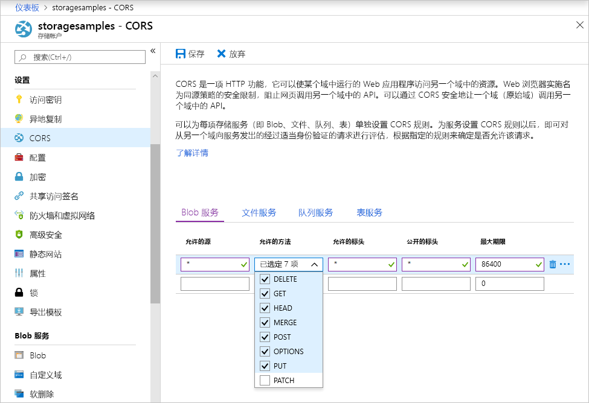

<!-- Customer intent: As a web application developer I want to interface with Azure Blob storage entirely on the client so that I can build a SPA application that is able to upload and delete files on blob storage. -->

# <a name="quickstart-upload-list-and-delete-blobs-using-azure-storage-v10-sdk-for-javascripthtml-in-the-browser"></a>快速入门：在浏览器中使用适用于 JavaScript/HTML 的 Azure 存储 v10 SDK 上传、下载和删除 Blob

本快速入门介绍如何使用[适用于 JavaScript 的 Azure 存储 SDK V10 - Blob](https://github.com/Azure/azure-sdk-for-js/tree/master/sdk/storage/storage-blob#readme) 库，通过完全在浏览器中运行的 JavaScript 代码管理 Blob。 此处使用的方法演示如何使用所需的安全措施确保对 blob 存储帐户的受保护访问。

## <a name="prerequisites"></a>必备条件

[!INCLUDE [storage-quickstart-prereq-include](../../../includes/storage-quickstart-prereq-include.md)]

Azure 存储 JavaScript 客户端库无法直接通过文件系统来使用，必须通过 Web 服务器进行处理。 本主题使用 [Node.js](https://nodejs.org) 启动一个基本的服务器。 如果你不想要安装 Node，可以使用任何其他方式来运行本地 Web 服务器。

若要执行调试步骤，需要安装 [Visual Studio Code](https://code.visualstudio.com) 以及[适用于 Chrome 的调试器](vscode:extension/msjsdiag.debugger-for-chrome)或[适用于 Microsoft Edge 的调试器](vscode:extension/msjsdiag.debugger-for-edge)扩展。

## <a name="setting-up-storage-account-cors-rules"></a>设置存储帐户 CORS 规则

必须先将帐户配置为启用[跨域资源共享](https://docs.microsoft.com/rest/api/storageservices/cross-origin-resource-sharing--cors--support-for-the-azure-storage-services)（简称 CORS），然后 Web 应用程序才能从客户端访问 Blob 存储。

返回到 Azure 门户，然后选择存储帐户。 若要定义新的 CORS 规则，请导航到“设置”部分，然后单击“CORS”链接。   接下来，请单击“添加”按钮，打开“添加 CORS 规则”窗口。   对于本快速入门，请创建开放的 CORS 规则：



下表描述了每项 CORS 设置，并对用于定义规则的值进行了说明。

|设置  |值  | 说明 |
|---------|---------|---------|
| 允许的域 | * | 接受一个逗号分隔的列表，其中的域设置为可以接受的域。 将值设置为 `*` 意味着所有域都可以访问存储帐户。 |
| 允许的谓词     | delete、get、head、merge、post、options 和 put | 列出允许对存储帐户执行操作的 HTTP 谓词。 对于本快速入门，请选择所有可用的选项。 |
| 允许的标题 | * | 定义一个列表，其中包含存储帐户允许的请求标头（包括带前缀的标头）。 将值设置为 `*` 意味着所有标头都可以进行访问。 |
| 公开的标题 | * | 列出帐户允许的响应标头。 将值设置为 `*` 意味着帐户可以发送任何标头。  |
| 最长存在时间(秒) | 86400 | 浏览器缓存预检 OPTIONS 请求的最长时间。 值为 *86400* 意味着缓存可以保留一整天。 |

> [!IMPORTANT]
> 请确保将生产环境中使用的任何设置所公开的针对存储帐户的访问权限降至最低，以便始终能够进行安全的访问。 此处描述的 CORS 设置适用于快速入门，因为快速入门定义的安全策略是宽松的。 但是，不建议对实际环境使用这些设置。

接下来，请使用 Azure Cloud Shell 创建一个安全令牌。

[!INCLUDE [Open the Azure cloud shell](../../../includes/cloud-shell-try-it.md)]

## <a name="create-a-shared-access-signature"></a>创建共享访问签名

在浏览器中运行的代码可以使用共享访问签名 (SAS) 对发往 Blob 存储的请求进行授权。 使用 SAS 时，客户端可以在没有帐户访问密钥或连接字符串的情况下授权访问存储资源。 有关 SAS 的详细信息，请参阅[使用共享访问签名 (SAS)](../common/storage-sas-overview.md)。

可以通过 Azure Cloud Shell 使用 Azure CLI 创建 SAS；也可以使用 Azure 门户或 Azure 存储资源管理器创建 SAS。 下表描述了使用 CLI 生成 SAS 时需要提供值的参数。

| 参数      |说明  | 占位符 |
|----------------|-------------|-------------|
| *expiry*       | 访问令牌的过期日期，采用 YYYY-MM-DD 格式。 若要在本快速入门中使用，请输入明天的日期。 | *FUTURE_DATE* |
| *account-name* | 存储帐户名称。 请使用在此前的步骤中搁置的名称。 | *YOUR_STORAGE_ACCOUNT_NAME* |
| *account-key*  | 存储帐户密钥。 请使用在此前的步骤中搁置的密钥。 | *YOUR_STORAGE_ACCOUNT_KEY* |

使用以下 CLI 命令（请将每个占位符替换为实际值）生成可在 JavaScript 代码中使用的 SAS。

```azurecli-interactive
az storage account generate-sas \
  --permissions racwdl \
  --resource-types sco \
  --services b \
  --expiry FUTURE_DATE \
  --account-name YOUR_STORAGE_ACCOUNT_NAME \
  --account-key YOUR_STORAGE_ACCOUNT_KEY
```

你可能会觉得每个参数之后的一系列值有点费解。 这些参数值取自相应权限的第一个字母。 下表解释了这些值的来源：

| 参数        | 值   | 说明  |
|------------------|---------|---------|
| *权限*    | racwdl  | 此 SAS 允许 *read*（读取）、*append*（追加）、*create*（创建）、*write*（编写）、*delete*（删除）和 *list*（列出）功能。 |
| *resource-types* | sco     | 受 SAS 影响的资源为 *service*（服务）、*container*（容器）和 *object*（对象）。 |
| *services*       | b       | 受 SAS 影响的服务为 *blob* 服务。 |

生成 SAS 后，复制返回值并将其保存到某个位置，以便在后续步骤中使用。 如果使用 Azure CLI 以外的方法生成了 SAS，则需要删除初始的 `?`（如果存在）。 此字符是已在 URL 模板中提供的 URL 分隔符，本主题稍后用到 SAS 的步骤都会使用它。

> [!IMPORTANT]
> 在生产中，请始终使用 SSL 来传递 SAS 令牌。 另外，SAS 令牌应该在服务器上生成并发送到 HTML 页面，以便将其传递回 Azure Blob 存储。 一种可以考虑的方法是使用无服务器函数来生成 SAS 令牌。 Azure 门户包括的函数模板具有通过 JavaScript 函数生成 SAS 的功能。

## <a name="implement-the-html-page"></a>实现 HTML 页

在本部分，你将创建一个基本的网页，然后将 VS Code 配置为启动并调试该页面。 但是，在启动之前，需要使用 Node.js 启动本地 Web 服务器，并根据浏览器的请求提供该页面。 接下来，添加 JavaScript 代码以调用各种 Blob 存储 API，并在页中显示结果。 也可以在 [Azure 门户](https://portal.azure.com)、[Azure 存储资源管理器](https://azure.microsoft.com/features/storage-explorer)和适用于 VS Code 的 [Azure 存储扩展](vscode:extension/ms-azuretools.vscode-azurestorage)中查看这些调用的结果。

### <a name="set-up-the-web-application"></a>设置 Web 应用程序

首先，创建名为 *azure-blob-javascript* 的新文件夹并在 VS Code 中打开它。 然后在 VS Code 中创建一个新文件，添加以下 HTML，并在 *azure-blob-javascript* 文件夹中将其保存为 *index.html*。

```html
<!DOCTYPE html>
<html>

<body>
    <button id="create-container-button">Create container</button>
    <button id="delete-container-button">Delete container</button>
    <button id="select-button">Select and upload files</button>
    <input type="file" id="file-input" multiple style="display: none;" />
    <button id="list-button">List files</button>
    <button id="delete-button">Delete selected files</button>
    <p><b>Status:</b></p>
    <p id="status" style="height:160px; width: 593px; overflow: scroll;" />
    <p><b>Files:</b></p>
    <select id="file-list" multiple style="height:222px; width: 593px; overflow: scroll;" />
</body>

<!-- You'll add code here later in this quickstart. -->

</html>
```

### <a name="configure-the-debugger"></a>配置调试器

若要在 VS Code 中设置调试器扩展，请选择“调试”>“添加配置...”，然后根据在前面“先决条件”部分选择的扩展，选择“Chrome”或“Edge”。    此操作会创建 *launch.json* 文件并在编辑器中打开它。

接下来，修改 *launch.json* 文件，使 `url` 值包含 `/index.html`，如下所示：

```json
{
    // Use IntelliSense to learn about possible attributes.
    // Hover to view descriptions of existing attributes.
    // For more information, visit: https://go.microsoft.com/fwlink/?linkid=830387
    "version": "0.2.0",
    "configurations": [
        {
            "type": "chrome",
            "request": "launch",
            "name": "Launch Chrome against localhost",
            "url": "http://localhost:8080/index.html",
            "webRoot": "${workspaceFolder}"
        }
    ]
}
```

此配置告知 VS Code 要启动哪个浏览器以及要加载哪个 URL。

### <a name="launch-the-web-server"></a>启动 Web 服务器

若要启动本地 Node.js Web 服务器，请选择“视图”>“终端”打开 VS Code 中的控制台窗口，然后输入以下命令。 

```console
npx http-server
```

此命令将安装 *http-server* 包并启动服务器，以便可以通过默认的 URL 使用当前文件夹（包括上一步骤中所示的文件夹）。

### <a name="start-debugging"></a>开始调试

若要在附加了 VS Code 调试器的浏览器中启动 *index.html*，请选择“调试”>“开始调试”，或者在 VS Code 中按 F5。 

显示的 UI 暂时不起任何作用，但在下一部分，你将会添加 JavaScript 代码以实现所示的每个函数。 然后可以设置断点，并在调试器在代码中暂停时与它交互。

对 *index.html* 进行更改后，请务必重新加载页面，以便在浏览器中查看更改。 在 VS Code 中，还可以选择“调试”>“重新开始调试”，或按 CTRL + SHIFT + F5。 

### <a name="add-the-blob-storage-client-library"></a>添加 Blob 存储客户端库

若要调用 Blob 存储 API，请先[下载适用于 JavaScript 的 Azure 存储 SDK - Blob 客户端库](https://aka.ms/downloadazurestoragejsblob)，提取压缩内容，并将 azure-storage.blob.js 文件放入 azure-blob-javascript 文件夹   。

接下来，将以下 HTML 粘贴到 *index.html* 中的 `</body>` 结束标记的后面（请替换占位符注释）。

```html
<script src="azure-storage-blob.js" charset="utf-8"></script>

<script>
// You'll add code here in the following sections.
</script>
```

此代码添加对脚本文件的引用，并为你自己的 JavaScript 代码提供一个位置。 在本快速入门中，我们将使用 azure-storage.blob.js 脚本文件，以便可以在 VS Code 中打开它、读取其内容，并设置断点  。 在生产环境中，应使用更精简的 *azure-storage.blob.min.js* 文件，该文件也已在 zip 文件中提供。

可以在[参考文档](https://docs.microsoft.com/javascript/api/%40azure/storage-blob/index)中详细了解每个 Blob 存储函数。 请注意，SDK 中的某些函数只能在 Node.js 中使用，或只能在浏览器中使用。

azure-storage.blob.js 中的代码导出名为 `azblob` 的全局变量，你将在 JavaScript 代码中使用该变量来访问 Blob 存储 API  。

### <a name="add-the-initial-javascript-code"></a>添加初始 JavaScript 代码

接下来，将以下代码粘贴到上一个代码块中所示的 `<script>` 元素（请替换占位符注释）。

```javascript
const createContainerButton = document.getElementById("create-container-button");
const deleteContainerButton = document.getElementById("delete-container-button");
const selectButton = document.getElementById("select-button");
const fileInput = document.getElementById("file-input");
const listButton = document.getElementById("list-button");
const deleteButton = document.getElementById("delete-button");
const status = document.getElementById("status");
const fileList = document.getElementById("file-list");

const reportStatus = message => {
    status.innerHTML += `${message}<br/>`;
    status.scrollTop = status.scrollHeight;
}
```

此代码为后续代码要使用的每个 HTML 元素创建字段，并实现一个 `reportStatus` 函数来显示输出。

在以下部分，在上一个块的后面添加 JavaScript 代码的每个新块。

### <a name="add-your-storage-account-info"></a>添加存储帐户信息

接下来，添加用于访问存储帐户的代码（请将占位符替换为你的帐户名称和上一步骤中生成的 SAS）。

```javascript
const accountName = "<Add your storage account name>";
const sasString = "<Add the SAS you generated earlier>";
const containerName = "testcontainer";
const containerURL = new azblob.ContainerURL(
    `https://${accountName}.blob.core.windows.net/${containerName}?${sasString}`,
    azblob.StorageURL.newPipeline(new azblob.AnonymousCredential));
```

此代码使用你的帐户信息和 SAS 来创建 [ContainerURL](https://docs.microsoft.com/javascript/api/@azure/storage-blob/ContainerURL) 实例，该实例可用于创建和操作存储容器。

### <a name="create-and-delete-a-storage-container"></a>创建和删除存储容器

接下来，添加可在按下相应按钮时创建和删除存储容器的代码。

```javascript
const createContainer = async () => {
    try {
        reportStatus(`Creating container "${containerName}"...`);
        await containerURL.create(azblob.Aborter.none);
        reportStatus(`Done.`);
    } catch (error) {
        reportStatus(error.body.message);
    }
};

const deleteContainer = async () => {
    try {
        reportStatus(`Deleting container "${containerName}"...`);
        await containerURL.delete(azblob.Aborter.none);
        reportStatus(`Done.`);
    } catch (error) {
        reportStatus(error.body.message);
    }
};

createContainerButton.addEventListener("click", createContainer);
deleteContainerButton.addEventListener("click", deleteContainer);
```

此代码在不使用 [Aborter](https://docs.microsoft.com/javascript/api/@azure/storage-blob/aborter) 实例的情况下调用 ContainerURL [create](https://docs.microsoft.com/javascript/api/@azure/storage-blob/containerclient#create-containercreateoptions-) 和 [delete](https://docs.microsoft.com/javascript/api/@azure/storage-blob/containerclient#delete-containerdeletemethodoptions-) 函数。 为了简化本快速入门中的操作，此代码假设你的存储帐户已创建且已启用。 在生产代码中，请使用 Aborter 实例来添加超时功能。

### <a name="list-blobs"></a>列出 Blob

接下来，添加可在按下“List files”按钮时列出存储容器内容的代码。 

```javascript
const listFiles = async () => {
    fileList.size = 0;
    fileList.innerHTML = "";
    try {
        reportStatus("Retrieving file list...");
        let marker = undefined;
        do {
            const listBlobsResponse = await containerURL.listBlobFlatSegment(
                azblob.Aborter.none, marker);
            marker = listBlobsResponse.nextMarker;
            const items = listBlobsResponse.segment.blobItems;
            for (const blob of items) {
                fileList.size += 1;
                fileList.innerHTML += `<option>${blob.name}</option>`;
            }
        } while (marker);
        if (fileList.size > 0) {
            reportStatus("Done.");
        } else {
            reportStatus("The container does not contain any files.");
        }
    } catch (error) {
        reportStatus(error.body.message);
    }
};

listButton.addEventListener("click", listFiles);
```

此代码将在循环中调用 [ContainerURL.listBlobFlatSegment](https://docs.microsoft.com/javascript/api/@azure/storage-blob/containerclient#listblobsflat-containerlistblobsoptions-) 函数，以确保检索所有段。 对于每个段，它会循环访问它所包含的 Blob 项列表，并更新 **Files** 列表。

### <a name="upload-blobs"></a>上传 Blob

接下来，添加可在按下“Select and upload files”按钮时将文件上传到存储容器的代码。 

```javascript
const uploadFiles = async () => {
    try {
        reportStatus("Uploading files...");
        const promises = [];
        for (const file of fileInput.files) {
            const blockBlobURL = azblob.BlockBlobURL.fromContainerURL(containerURL, file.name);
            promises.push(azblob.uploadBrowserDataToBlockBlob(
                azblob.Aborter.none, file, blockBlobURL));
        }
        await Promise.all(promises);
        reportStatus("Done.");
        listFiles();
    } catch (error) {
        reportStatus(error.body.message);
    }
}

selectButton.addEventListener("click", () => fileInput.click());
fileInput.addEventListener("change", uploadFiles);
```

此代码将“Select and upload files”按钮连接到隐藏的 `file-input` 元素。  这样，按钮 `click` 事件便会触发文件输入 `click` 事件，并显示文件选取器。 选择文件并关闭对话框之后，将发生 `input` 事件并调用 `uploadFiles` 函数。 对于选择的每个文件，此函数将调用仅限浏览器的 [uploadBrowserDataToBlockBlob](https://docs.microsoft.com/javascript/api/@azure/storage-blob/blockblobclient#uploadbrowserdata-blob---arraybuffer---arraybufferview--blockblobparalleluploadoptions-) 函数。 每次调用都会返回一个约定，此约定将添加到某个列表，以便可以等待一次，导致并行上传文件。

### <a name="delete-blobs"></a>删除 Blob

接下来，添加可在按下“Delete selected files”按钮时从存储容器中删除文件的代码。 

```javascript
const deleteFiles = async () => {
    try {
        if (fileList.selectedOptions.length > 0) {
            reportStatus("Deleting files...");
            for (const option of fileList.selectedOptions) {
                const blobURL = azblob.BlobURL.fromContainerURL(containerURL, option.text);
                await blobURL.delete(azblob.Aborter.none);
            }
            reportStatus("Done.");
            listFiles();
        } else {
            reportStatus("No files selected.");
        }
    } catch (error) {
        reportStatus(error.body.message);
    }
};

deleteButton.addEventListener("click", deleteFiles);
```

此代码调用 [BlobURL.delete](https://docs.microsoft.com/javascript/api/@azure/storage-blob/BlobURL#delete-aborter--iblobdeleteoptions-) 函数以删除列表中选择的每个文件。 然后，它会调用前面所示的 `listFiles` 来刷新 **Files** 列表的内容。

### <a name="run-and-test-the-web-application"></a>运行并测试 Web 应用程序

现在，可以启动该页面并试着体会 Blob 存储的工作方式。 如果发生任何错误（例如，在创建容器之前尝试列出文件时），“状态”窗格将显示收到的错误消息。  还可以在 JavaScript 代码中设置断点，以检查存储 API 返回的值。

## <a name="clean-up-resources"></a>清理资源

若要清理在本快速入门中创建的资源，请转到 [Azure 门户](https://portal.azure.com)，并删除在“先决条件”部分创建的资源组。

## <a name="next-steps"></a>后续步骤

在本快速入门中，你已创建一个可从基于浏览器的 JavaScript 访问 Blob 存储的简单网站。 若要了解如何在 Blob 存储中托管网站本身，请继续阅读以下教程：

> [!div class="nextstepaction"]
> [在 Blob 存储中托管静态网站](https://docs.microsoft.com/azure/storage/blobs/storage-blob-static-website-host)
