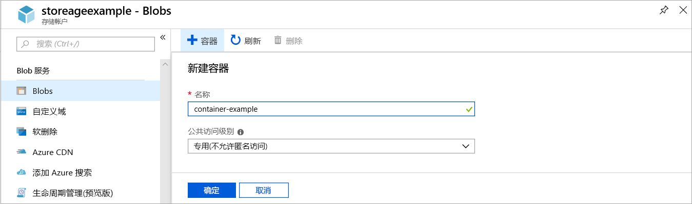
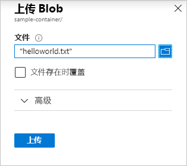

# 快速入门：使用 Azure 门户上传、下载和列出 Blob

本快速入门介绍如何使用 [Azure 门户](https://portal.azure.com/)在 Azure 存储中创建容器，以及在该容器中上传和下载块 Blob。

## 必备条件

[!INCLUDE [storage-quickstart-prereq-include](../../../includes/storage-quickstart-prereq-include.md)]

## 创建容器

若要在 Azure 门户中创建容器，请执行以下步骤：

1. 导航到 Azure 门户中的新存储帐户。
2. 在存储帐户的左侧菜单中滚动到“Blob 服务”部分，然后选择“容器”。  
3. 选择“+ 容器”。 
4. 键入新容器的名称。 容器名称必须小写，必须以字母或数字开头，并且只能包含字母、数字和短划线 (-) 字符。 有关容器名称和 Blob 名称的详细信息，请参阅 [Naming and referencing containers, blobs, and metadata](https://docs.microsoft.com/rest/api/storageservices/naming-and-referencing-containers--blobs--and-metadata)（命名和引用容器、Blob 和元数据）。
5. 设置容器的公共访问权限级别。 默认级别为“专用(禁止匿名访问)”。 
6. 选择“确定”  创建容器。

    

## 上传块 Blob

块 Blob 包含经过组装后可以生成 Blob 的数据块。 大多数使用 Blob 存储的方案都采用块 Blob。 块 Blob 适用于在云中存储文本和二进制数据，例如文件、图像和视频。 本快速入门介绍如何使用块 Blob。 

若要在 Azure 门户中将块 Blob 上传到新的容器，请执行以下步骤：

1. 在 Azure 门户中，导航到在上一部分创建的容器。
2. 选择一个容器，显示其包含的 Blob 的列表。 此容器为新容器，因此不会包含任何 Blob。
3. 选择“上传”  按钮以打开“上传”边栏选项卡
4. 浏览本地文件系统，找到要作为块 Blob 上传的文件
     
    

5. （可选）展开“高级”部分以定义其他设置，例如身份验证类型、访问层或虚拟文件夹路径。
6. 选择“上传”  按钮以提交上传
7. 以这种方式根据需要上传相应数量的 Blob。 可以看到新的 Blob 现已列在容器中。

## 下载块 Blob

可以下载一个块 Blob，让其在浏览器中显示，或者将其保存到本地文件系统。 若要下载块 Blob，请执行以下步骤：

1. 导航到在前一部分上传的 Blob 的列表。 
2. 右键单击要下载的 Blob，然后选择“下载”。  

## 清理资源

若要删除在本快速入门中创建的资源，可以删除容器。 容器中的所有 Blob 也会被删除。

若要删除容器，请执行以下操作：

1. 在 Azure 门户中，导航到存储帐户中的容器的列表。
2. 选择要删除的容器。
3. 选择“更多”按钮 ( **...** )，然后选择“删除”。  
4. 确认要删除该容器。

## 后续步骤

本快速入门介绍了如何使用 Azure 门户在本地磁盘和 Azure Blob 存储之间传输文件。 要深入了解如何使用 Blob 存储，请继续学习 Blob 存储操作说明。

> [!div class="nextstepaction"]
> [Blob 存储操作说明](storage-dotnet-how-to-use-blobs.md)

