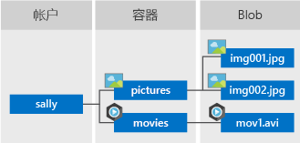

# <a name="quickstart-manage-blobs-with-python-v12-sdk"></a>快速入门：使用 Python v12 SDK 管理 blob

本快速入门介绍如何使用 Python 管理 blob。 Blob 是可以保存大量文本或二进制数据（包括图像、文档、流媒体和存档数据）的对象。 你将上传、下载和列出 Blob，并创建和删除容器。

[API 参考文档](/python/api/azure-storage-blob) | [库源代码](https://github.com/Azure/azure-sdk-for-python/tree/master/sdk/storage/azure-storage-blob) | [包 （Python 包索引）](https://pypi.org/project/azure-storage-blob/) | [示例](https://docs.microsoft.com/azure/storage/common/storage-samples-python?toc=%2fazure%2fstorage%2fblobs%2ftoc.json#blob-samples)

## <a name="prerequisites"></a>先决条件

- 具有活动订阅的 Azure 帐户。 [免费创建帐户](https://azure.microsoft.com/free/?ref=microsoft.com&utm_source=microsoft.com&utm_medium=docs&utm_campaign=visualstudio)。
- 一个 Azure 存储帐户。 [创建存储帐户](../common/storage-account-create.md)。
- [Python](https://www.python.org/downloads/) 2.7、3.5 或更高版本。

> [!NOTE]
> 若要使用之前的 SDK 版本入门，请参阅[快速入门：使用 Python v2.1 SDK 管理 blob](storage-quickstart-blobs-python-legacy.md)。

[!INCLUDE [storage-multi-protocol-access-preview](../../../includes/storage-multi-protocol-access-preview.md)]

## <a name="setting-up"></a>设置

本部分逐步指导如何准备一个项目，使其与适用于 Python 的 Azure Blob 存储客户端库 v12 配合使用。

### <a name="create-the-project"></a>创建项目

创建名为 blob-quickstart-v12 的 Python 应用程序  。

1. 在控制台窗口（例如 cmd、PowerShell 或 Bash）中，为项目创建新目录。

    ```console
    mkdir blob-quickstart-v12
    ```

1. 切换到新创建的 blob-quickstart-v12 目录  。

    ```console
    cd blob-quickstart-v12
    ```

1. 在 blob-quickstart-v12 目录中，创建名为 data 的另一个目录   。 将在这里创建和存储 blob 数据文件。

    ```console
    mkdir data
    ```

### <a name="install-the-package"></a>安装包

仍在应用程序目录中，使用 `pip install` 命令安装适用于 Python 包的 Azure Blob 存储客户端库。

```console
pip install azure-storage-blob
```

此命令安装适用于 Python 包的 Azure Blob 存储客户端库及其依赖的所有库。 在本例中，即适用于 Python 的 Azure Core 库。

### <a name="set-up-the-app-framework"></a>设置应用框架

从项目目录中执行以下操作：

1. 在代码编辑器中打开新文本文件
1. 添加 `import` 语句
1. 为程序创建结构，包括基本的异常处理

    代码如下：

    ```python
    import os, uuid
    from azure.storage.blob import BlobServiceClient, BlobClient, ContainerClient

    try:
        print("Azure Blob storage v12 - Python quickstart sample")
        # Quick start code goes here
    except Exception as ex:
        print('Exception:')
        print(ex)
    ```

1. 在 blob-quickstart-v12 目录中，将新文件另存为 blob-quickstart-v12.py   。

[!INCLUDE [storage-quickstart-credentials-include](../../../includes/storage-quickstart-credentials-include.md)]

## <a name="object-model"></a>对象模型

Azure Blob 存储最适合存储巨量的非结构化数据。 非结构化数据是不遵循特定数据模型或定义的数据（如文本或二进制数据）。 Blob 存储提供了三种类型的资源：

* 存储帐户
* 存储帐户中的容器
* 容器中的 blob

以下图示显示了这些资源之间的关系。



使用以下 Python 类与这些资源进行交互：

* [BlobServiceClient](/python/api/azure-storage-blob/azure.storage.blob.blobserviceclient)：`BlobServiceClient` 类可用于操纵 Azure 存储资源和 blob 容器。
* [ContainerClient](/python/api/azure-storage-blob/azure.storage.blob.containerclient)：`ContainerClient` 类可用于操纵 Azure 存储容器及其 blob。
* [BlobClient](/python/api/azure-storage-blob/azure.storage.blob.blobclient)：`BlobClient` 类可用于操纵 Azure 存储 blob。

## <a name="code-examples"></a>代码示例

这些示例代码片段演示如何使用适用于 Python 的 Azure Blob 存储客户端库执行以下步骤：

* [获取连接字符串](#get-the-connection-string)
* [创建容器](#create-a-container)
* [将 blob 上传到容器中](#upload-blobs-to-a-container)
* [列出容器中的 blob](#list-the-blobs-in-a-container)
* [下载 blob](#download-blobs)
* [删除容器](#delete-a-container)

### <a name="get-the-connection-string"></a>获取连接字符串

下面的代码从[配置存储连接字符串](#configure-your-storage-connection-string)部分中创建的环境变量中检索存储帐户的连接字符串。

在 `try` 块内添加此代码：

```python
# Retrieve the connection string for use with the application. The storage
# connection string is stored in an environment variable on the machine
# running the application called AZURE_STORAGE_CONNECTION_STRING. If the environment variable is
# created after the application is launched in a console or with Visual Studio,
# the shell or application needs to be closed and reloaded to take the
# environment variable into account.
connect_str = os.getenv('AZURE_STORAGE_CONNECTION_STRING')
```

### <a name="create-a-container"></a>创建容器

确定新容器的名称。 以下代码将 UUID 值追加到容器名称，确保其是唯一的。

> [!IMPORTANT]
> 容器名称必须为小写。 有关命名容器和 Blob 的详细信息，请参阅[命名和引用容器、Blob 和元数据](/rest/api/storageservices/naming-and-referencing-containers--blobs--and-metadata)。

调用 [from_connection_string](/python/api/azure-storage-blob/azure.storage.blob.blobserviceclient#from-connection-string-conn-str--credential-none----kwargs-) 方法，创建 [BlobServiceClient](/python/api/azure-storage-blob/azure.storage.blob.blobserviceclient) 类的实例。 然后，调用 [create_container](/python/api/azure-storage-blob/azure.storage.blob.blobserviceclient#create-container-name--metadata-none--public-access-none----kwargs-) 方法在存储帐户中实际创建容器。

将此代码添加到 `try` 块的末尾：

```python
# Create the BlobServiceClient object which will be used to create a container client
blob_service_client = BlobServiceClient.from_connection_string(connect_str)

# Create a unique name for the container
container_name = "quickstart" + str(uuid.uuid4())

# Create the container
container_client = blob_service_client.create_container(container_name)
```

### <a name="upload-blobs-to-a-container"></a>将 blob 上传到容器中

以下代码片段：

1. 在本地目录中创建文本文件。
1. 通过从[创建容器](#create-a-container)部分中调用 [BlobServiceClient](/python/api/azure-storage-blob/azure.storage.blob.blobserviceclient) 上的 [get_blob_client](/python/api/azure-storage-blob/azure.storage.blob.containerclient#get-blob-client-blob--snapshot-none-) 方法，获取对 [BlobClient](/python/api/azure-storage-blob/azure.storage.blob.blobclient) 对象的引用。
1. 通过调用 [upload_blob](/python/api/azure-storage-blob/azure.storage.blob.blobclient#upload-blob-data--blob-type--blobtype-blockblob---blockblob----length-none--metadata-none----kwargs-) 方法将本地文本文件上传到 blob。

将此代码添加到 `try` 块的末尾：

```python
# Create a file in local data directory to upload and download
local_path = "./data"
local_file_name = "quickstart" + str(uuid.uuid4()) + ".txt"
upload_file_path = os.path.join(local_path, local_file_name)

# Write text to the file
file = open(upload_file_path, 'w')
file.write("Hello, World!")
file.close()

# Create a blob client using the local file name as the name for the blob
blob_client = blob_service_client.get_blob_client(container=container_name, blob=local_file_name)

print("\nUploading to Azure Storage as blob:\n\t" + local_file_name)

# Upload the created file
with open(upload_file_path, "rb") as data:
    blob_client.upload_blob(data)
```

### <a name="list-the-blobs-in-a-container"></a>列出容器中的 Blob

通过调用 [list_blobs](/python/api/azure-storage-blob/azure.storage.blob.containerclient#list-blobs-name-starts-with-none--include-none----kwargs-) 方法，列出容器中的 blob。 在这种情况下，只向容器添加了一个 blob，因此列表操作只返回那个 blob。

将此代码添加到 `try` 块的末尾：

```python
print("\nListing blobs...")

# List the blobs in the container
blob_list = container_client.list_blobs()
for blob in blob_list:
    print("\t" + blob.name)
```

### <a name="download-blobs"></a>下载 Blob

通过调用 [download_blob](/python/api/azure-storage-blob/azure.storage.blob.blobclient#download-blob-offset-none--length-none----kwargs-) 方法，下载以前创建的 blob。 示例代码将向文件名添加后缀“DOWNLOAD”，这样你就可以在本地文件系统中看到这两个文件。

将此代码添加到 `try` 块的末尾：

```python
# Download the blob to a local file
# Add 'DOWNLOAD' before the .txt extension so you can see both files in the data directory
download_file_path = os.path.join(local_path, str.replace(local_file_name ,'.txt', 'DOWNLOAD.txt'))
print("\nDownloading blob to \n\t" + download_file_path)

with open(download_file_path, "wb") as download_file:
    download_file.write(blob_client.download_blob().readall())
```

### <a name="delete-a-container"></a>删除容器

以下代码使用 [delete_container](/python/api/azure-storage-blob/azure.storage.blob.containerclient#delete-container---kwargs-) 方法删除整个容器，从而清除该应用所创建的资源。 也可根据需要删除本地文件。

在删除 blob、容器和本地文件之前，应用会调用 `input()` 以暂停并等待用户输入。 可以通过此机会验证是否已正确创建资源，然后再删除这些资源。

将此代码添加到 `try` 块的末尾：

```python
# Clean up
print("\nPress the Enter key to begin clean up")
input()

print("Deleting blob container...")
container_client.delete_container()

print("Deleting the local source and downloaded files...")
os.remove(upload_file_path)
os.remove(download_file_path)

print("Done")
```

## <a name="run-the-code"></a>运行代码

此应用在本地文件夹中创建测试文件，并将其上传到 Blob 存储。 然后，该示例会列出容器中的 blob，并使用新名称下载文件，这样便可对新旧文件进行对比。

导航到包含 blob-quickstart-v12.py 文件的目录，然后执行以下 `python` 命令来运行应用  。

```console
python blob-quickstart-v12.py
```

应用的输出类似于以下示例：

```output
Azure Blob storage v12 - Python quickstart sample

Uploading to Azure Storage as blob:
        quickstartcf275796-2188-4057-b6fb-038352e35038.txt

Listing blobs...
        quickstartcf275796-2188-4057-b6fb-038352e35038.txt

Downloading blob to
        ./data/quickstartcf275796-2188-4057-b6fb-038352e35038DOWNLOAD.txt

Press the Enter key to begin clean up

Deleting blob container...
Deleting the local source and downloaded files...
Done
```

在开始清理过程之前，请在“data”文件夹中查看这两个文件  。 可以打开它们，然后就会观察到它们完全相同。

验证文件后，按 Enter 键以删除测试文件并完成演示  。

## <a name="next-steps"></a>后续步骤

本快速入门介绍了如何使用 Python 上传、下载和列出 blob。

若要查看 Blob 存储示例应用，请继续执行以下操作：

> [!div class="nextstepaction"]
> [Azure Blob 存储 SDK v12 Python 示例](https://github.com/Azure/azure-sdk-for-python/tree/master/sdk/storage/azure-storage-blob/samples)

* 若要了解详细信息，请参阅 [Azure SDK for Python](https://github.com/Azure/azure-sdk-for-python/blob/master/sdk/storage/azure-storage-blob/README.md)。
* 有关教程、示例、快速入门和其他文档，请访问[面向 Python 开发人员的 Azure](/azure/python/)。
