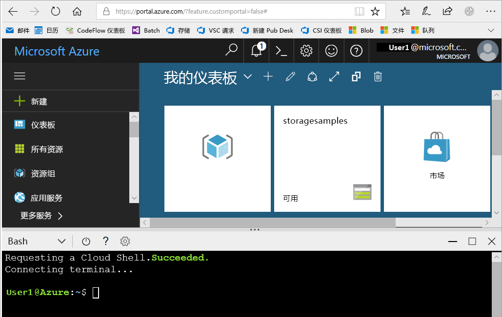

# <a name="create-an-azure-storage-account"></a>创建 Azure 存储帐户

Azure 存储帐户包含所有 Azure 存储数据对象：Blob、文件、队列、表和磁盘。 存储帐户为你的 Azure 存储数据提供了一个唯一的命名空间，可以从世界上的任何位置通过 HTTP 或 HTTPS 访问该命名空间。 Azure 存储帐户中的数据是持久的，高度可用、安全且可大规模缩放。

本操作指南文章介绍如何使用 [Azure 门户](https://portal.azure.com/)、[Azure PowerShell](https://docs.microsoft.com/powershell/azure/overview)、[Azure CLI](https://docs.microsoft.com/cli/azure?view=azure-cli-latest) 或 [Azure 资源管理器模板](../../azure-resource-manager/management/overview.md)创建存储帐户。  

[!INCLUDE [updated-for-az](../../../includes/updated-for-az.md)]

## <a name="prerequisites"></a>必备条件

如果没有 Azure 订阅，请在开始之前创建一个[免费帐户](https://azure.microsoft.com/free/)。

# <a name="portal"></a>[门户](#tab/azure-portal)

无。

# <a name="powershell"></a>[PowerShell](#tab/azure-powershell)

若要使用 PowerShell 创建 Azure 存储帐户，请确保已安装 Azure PowerShell 模块 Az 0.7 版或更高版本。 有关详细信息，请参阅 [Azure PowerShell Az 模块简介](/powershell/azure/new-azureps-module-az)。

若要查找当前版本，请运行以下命令：

```powershell
Get-InstalledModule -Name "Az"
```

若要安装或升级 Azure PowerShell，请参阅[安装 Azure PowerShell 模块](/powershell/azure/install-Az-ps)。

# <a name="azure-cli"></a>[Azure CLI](#tab/azure-cli)

可以登录到 Azure，然后采用以下两种方式之一运行 Azure CLI 命令：

- 可以在 Azure Cloud Shell 中的 Azure 门户内运行 CLI 命令。
- 可以安装 CLI 并在本地运行 CLI 命令。

### <a name="use-azure-cloud-shell"></a>使用 Azure Cloud Shell

Azure Cloud Shell 是可直接在 Azure 门户中运行的免费 Bash shell。 Azure CLI 已预安装并配置为与帐户一起使用。 单击 Azure 门户右上部分菜单上的 " **Cloud Shell** " 按钮：

[](https://portal.azure.com)

此按钮会启动交互式 shell，你可以使用它来运行本操作指南文章中所述的步骤：

[](https://portal.azure.com)

### <a name="install-the-cli-locally"></a>在本地安装 CLI

也可在本地安装和使用 Azure CLI。 本操作指南文章要求运行 Azure CLI 2.0.4 或更高版本。 运行 `az --version` 即可查找版本。 如需进行安装或升级，请参阅[安装 Azure CLI](/cli/azure/install-azure-cli)。 

# <a name="template"></a>[模板](#tab/template)

无。

---

## <a name="sign-in-to-azure"></a>登录 Azure

# <a name="portal"></a>[Portal](#tab/azure-portal)

登录 [Azure 门户](https://portal.azure.com)。

# <a name="powershell"></a>[PowerShell](#tab/azure-powershell)

使用 `Connect-AzAccount` 命令登录到 Azure 订阅，然后按照屏幕上的说明进行身份验证。

```powershell
Connect-AzAccount
```

# <a name="azure-cli"></a>[Azure CLI](#tab/azure-cli)

若要启动 Azure Cloud Shell，请登录到[Azure 门户](https://portal.azure.com)。

若要登录到本地安装的 CLI，请运行 [az login](/cli/azure/reference-index#az-login) 命令：

```azurecli-interactive
az login
```

# <a name="template"></a>[模板](#tab/template)

不适用

---

## <a name="create-a-storage-account"></a>创建存储帐户

现在可以创建存储帐户。

每个存储帐户都必须属于 Azure 资源组。 资源组是对 Azure 资源进行分组的逻辑容器。 在创建存储帐户时，可以选择创建新的资源组，也可以使用现有资源组。 本文介绍如何创建新资源组。

可以使用常规用途 v2 存储帐户访问所有 Azure 存储服务：Blob、文件、队列、表和磁盘****。 本文所述的步骤将创建常规用途 v2 存储帐户，但创建任何类型的存储帐户的步骤都相似。

# <a name="portal"></a>[门户](#tab/azure-portal)

[!INCLUDE [storage-create-account-portal-include](../../../includes/storage-create-account-portal-include.md)]

# <a name="powershell"></a>[PowerShell](#tab/azure-powershell)

首先，使用 [New-AzResourceGroup](/powershell/module/az.resources/new-azresourcegroup) 命令，通过 PowerShell 创建新的资源组：

```powershell
# put resource group in a variable so you can use the same group name going forward,
# without hard-coding it repeatedly
$resourceGroup = "storage-resource-group"
$location = "westus"
New-AzResourceGroup -Name $resourceGroup -Location $location
```

如果不确定为 `-Location` 参数指定哪个区域，可使用 [Get-AzLocation](/powershell/module/az.resources/get-azlocation) 命令检索订阅支持的区域的列表：

```powershell
Get-AzLocation | select Location
```

接下来，通过 [New-AzStorageAccount](/powershell/module/az.storage/New-azStorageAccount) 命令创建使用读取访问异地冗余存储 (RA-GRS) 的常规用途 v2 存储帐户。 请记住，存储帐户的名称必须在 Azure 中唯一，因此请将括号中的占位符值替换为你自己的唯一值：

```powershell
New-AzStorageAccount -ResourceGroupName $resourceGroup `
  -Name <account-name> `
  -Location $location `
  -SkuName Standard_RAGRS `
  -Kind StorageV2
```

> [!IMPORTANT]
> 如果计划使用[Azure Data Lake Storage](https://azure.microsoft.com/services/storage/data-lake-storage/)，请在此`-EnableHierarchicalNamespace $True`参数列表中包含。

若要使用不同的复制选项创建常规用途 v2 存储帐户，请将 **SkuName** 参数替换为下表中的所需值。

|复制选项  |SkuName 参数  |
|---------|---------|
|本地冗余存储 (LRS)     |Standard_LRS         |
|区域冗余存储 (ZRS)     |Standard_ZRS         |
|异地冗余存储 (GRS)     |Standard_GRS         |
|读取访问异地冗余存储 (GRS)     |Standard_RAGRS         |
|异地区域冗余存储 (GZRS)    |Standard_GZRS         |
|读取访问区域冗余存储（GZRS）    |Standard_RAGZRS         |

# <a name="azure-cli"></a>[Azure CLI](#tab/azure-cli)

首先，使用 [az group create](/cli/azure/group#az_group_create) 命令，通过 Azure CLI 创建新的资源组。

```azurecli-interactive
az group create \
    --name storage-resource-group \
    --location westus
```

如果不确定为 `--location` 参数指定哪个区域，可使用 [az account list-locations](/cli/azure/account#az_account_list) 命令检索订阅支持的区域的列表。

```azurecli-interactive
az account list-locations \
    --query "[].{Region:name}" \
    --out table
```

接下来，通过 [az storage account create](/cli/azure/storage/account#az_storage_account_create) 命令创建使用读取访问异地冗余存储的常规用途 v2 存储帐户。 请记住，存储帐户的名称必须在 Azure 中唯一，因此请将括号中的占位符值替换为你自己的唯一值：

```azurecli-interactive
az storage account create \
    --name <account-name> \
    --resource-group storage-resource-group \
    --location westus \
    --sku Standard_RAGRS \
    --kind StorageV2
```

> [!IMPORTANT]
> 如果计划使用[Azure Data Lake Storage](https://azure.microsoft.com/services/storage/data-lake-storage/)，请在此`--enable-hierarchical-namespace true`参数列表中包含。 

若要使用不同的复制选项创建常规用途 v2 存储帐户，请将 **sku** 参数替换为下表中的所需值。

|复制选项  |sku 参数  |
|---------|---------|
|本地冗余存储 (LRS)     |Standard_LRS         |
|区域冗余存储 (ZRS)     |Standard_ZRS         |
|异地冗余存储 (GRS)     |Standard_GRS         |
|读取访问异地冗余存储 (GRS)     |Standard_RAGRS         |
|异地区域冗余存储 (GZRS)    |Standard_GZRS         |
|读取访问区域冗余存储（GZRS）    |Standard_RAGZRS         |

# <a name="template"></a>[模板](#tab/template)

你可以使用 Azure PowerShell 或 Azure CLI 来部署资源管理器模板来创建存储帐户。 本操作指南文章中使用的模板来自 [Azure 资源管理器快速入门模板](https://azure.microsoft.com/resources/templates/101-storage-account-create/)。 若要运行脚本，请选择 "**尝试**" 以打开 Azure Cloud Shell。 若要粘贴脚本，请右键单击 shell，然后选择“粘贴”  。

```azurepowershell-interactive
$resourceGroupName = Read-Host -Prompt "Enter the Resource Group name"
$location = Read-Host -Prompt "Enter the location (i.e. centralus)"

New-AzResourceGroup -Name $resourceGroupName -Location "$location"
New-AzResourceGroupDeployment -ResourceGroupName $resourceGroupName -TemplateUri "https://raw.githubusercontent.com/Azure/azure-quickstart-templates/master/101-storage-account-create/azuredeploy.json"
```

```azurecli-interactive
echo "Enter the Resource Group name:" &&
read resourceGroupName &&
echo "Enter the location (i.e. centralus):" &&
read location &&
az group create --name $resourceGroupName --location "$location" &&
az group deployment create --resource-group $resourceGroupName --template-file "https://raw.githubusercontent.com/Azure/azure-quickstart-templates/master/101-storage-account-create/azuredeploy.json"
```

> [!NOTE]
> 此模板仅用作示例。 存在许多未配置为此模板的一部分的存储帐户设置。 例如，如果要使用[Azure Data Lake Storage](https://azure.microsoft.com/services/storage/data-lake-storage/)，则可以通过将`isHnsEnabledad` `StorageAccountPropertiesCreateParameters`对象的属性设置为来`true`修改此模板。 

若要了解如何修改此模板或创建新模板，请参阅：

- [Azure 资源管理器文档](/azure/azure-resource-manager/)。
- [存储帐户模板参考](/azure/templates/microsoft.storage/allversions)。
- [其他存储帐户模板示例](https://azure.microsoft.com/resources/templates/?resourceType=Microsoft.Storage)。

---

有关可用的复制选项的详细信息，请参阅[存储复制选项](storage-redundancy.md)。

## <a name="delete-a-storage-account"></a>删除存储帐户

删除存储帐户将删除整个帐户，包括该帐户中的所有数据，并且该操作无法撤销。

# <a name="portal"></a>[Portal](#tab/azure-portal)

1. 导航到[Azure 门户](https://portal.azure.com)中的存储帐户。
1. 单击 **“删除”** 。

# <a name="powershell"></a>[PowerShell](#tab/azure-powershell)

若要删除存储帐户，请使用 [Remove-AzStorageAccount](/powershell/module/az.storage/remove-azstorageaccount) 命令：

```powershell
Remove-AzStorageAccount -Name <storage-account> -ResourceGroupName <resource-group>
```

# <a name="azure-cli"></a>[Azure CLI](#tab/azure-cli)

若要删除存储帐户，请使用 [az storage account delete](/cli/azure/storage/account#az-storage-account-delete) 命令：

```azurecli-interactive
az storage account delete --name <storage-account> --resource-group <resource-group>
```

# <a name="template"></a>[模板](#tab/template)

若要删除存储帐户，请使用 Azure PowerShell 或 Azure CLI。

```azurepowershell-interactive
$storageResourceGroupName = Read-Host -Prompt "Enter the resource group name"
$storageAccountName = Read-Host -Prompt "Enter the storage account name"
Remove-AzStorageAccount -Name $storageAccountName -ResourceGroupName $storageResourceGroupName
```

```azurecli-interactive
echo "Enter the resource group name:" &&
read resourceGroupName &&
echo "Enter the storage account name:" &&
read storageAccountName &&
az storage account delete --name storageAccountName --resource-group resourceGroupName
```

---

或者，你可以删除资源组，该操作将删除该资源组中的存储帐户和其他任何资源。 有关删除资源组的详细信息，请参阅[删除资源组和资源](../../azure-resource-manager/management/delete-resource-group.md)。

> [!WARNING]
> 无法恢复已删除的存储帐户，也无法检索删除之前该存储帐户包含的任何内容。 请在删除帐户之前务必备份要保存的任何内容。 对于帐户中的任务资源也是如此 — 一旦你删除了一个 Blob、表、队列或文件，则它会被永久删除。
>
> 如果尝试删除与 Azure 虚拟机关联的存储帐户，则会显示一条错误消息，指出存储帐户仍在使用。 有关排除此错误的帮助信息，请参阅[删除存储帐户时排除错误](../common/storage-resource-manager-cannot-delete-storage-account-container-vhd.md)。

## <a name="next-steps"></a>后续步骤

在本操作指南文章中，你已创建一个常规用途 v2 标准存储帐户。 若要了解如何通过存储帐户上传和下载 Blob，请继续阅读 Blob 存储快速入门之一。

# <a name="portal"></a>[Portal](#tab/azure-portal)

> [!div class="nextstepaction"]
> [通过 Azure 门户使用 Blob](../blobs/storage-quickstart-blobs-portal.md)

# <a name="powershell"></a>[PowerShell](#tab/azure-powershell)

> [!div class="nextstepaction"]
> [通过 PowerShell 使用 Blob](../blobs/storage-quickstart-blobs-powershell.md)

# <a name="azure-cli"></a>[Azure CLI](#tab/azure-cli)

> [!div class="nextstepaction"]
> [通过 Azure CLI 使用 Blob](../blobs/storage-quickstart-blobs-cli.md)

# <a name="template"></a>[模板](#tab/template)

> [!div class="nextstepaction"]
> [通过 Azure 门户使用 Blob](../blobs/storage-quickstart-blobs-portal.md)

---
