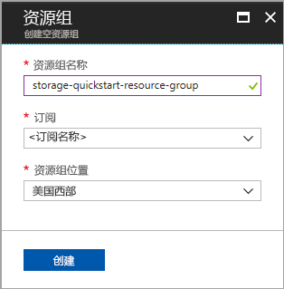
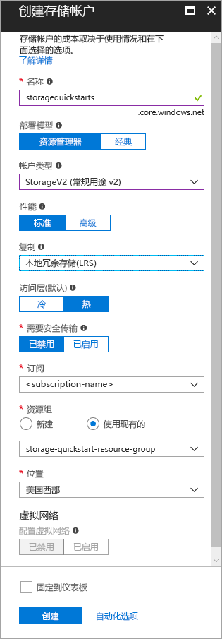

# <a name="create-a-storage-account"></a>创建存储帐户

Azure 存储帐户提供云中的唯一命名空间，用于在 Azure 存储中存储和访问数据对象。 存储帐户包含在该帐户下创建的任何 Blob、文件、队列、表和磁盘。 

若要开始使用 Azure 存储，首先需创建新的存储帐户。 可使用 [Azure 门户](https://portal.azure.com/)、[Azure PowerShell](https://docs.microsoft.com/powershell/azure/overview) 或 [Azure CLI](https://docs.microsoft.com/cli/azure?view=azure-cli-latest) 创建 Azure 存储帐户。 本快速入门介绍如何使用这其中的每个选项创建新的存储帐户。 


## <a name="prerequisites"></a>先决条件

如果没有 Azure 订阅，请在开始之前创建一个[免费帐户](https://azure.microsoft.com/free/)。

# <a name="portaltabportal"></a>[门户](#tab/portal)

无。

# <a name="powershelltabpowershell"></a>[PowerShell](#tab/powershell)

本快速入门需要 Azure PowerShell 模块 3.6 版或更高版本。 运行 `Get-Module -ListAvailable AzureRM` 即可查找当前版本。 如果需要进行安装或升级，请参阅[安装 Azure PowerShell 模块](/powershell/azure/install-azurerm-ps)。

# <a name="azure-clitabazure-cli"></a>[Azure CLI](#tab/azure-cli)

可以登录到 Azure，然后采用以下两种方式之一运行 Azure CLI 命令：

- 可以在 Azure 门户的 Azure Cloud Shell 中运行 CLI 命令 
- 可以安装 CLI 并在本地运行 CLI 命令  

### <a name="use-azure-cloud-shell"></a>使用 Azure Cloud Shell

Azure Cloud Shell 是可直接在 Azure 门户中运行的免费 Bash shell。 它预安装有 Azure CLI 并将其配置为与帐户一起使用。 单击 Azure 门户右上角菜单上的“Cloud Shell”按钮：

[](https://portal.azure.com)

该按钮会启动交互式 shell，用于运行本快速入门中的步骤：

[](https://portal.azure.com)

### <a name="install-the-cli-locally"></a>在本地安装 CLI

也可在本地安装和使用 Azure CLI。 本快速入门需要运行 Azure CLI 2.0.4 或更高版本。 运行 `az --version` 即可查找版本。 如果需要进行安装或升级，请参阅[安装 Azure CLI 2.0](/cli/azure/install-azure-cli)。 

---

## <a name="log-in-to-azure"></a>登录 Azure

# <a name="portaltabportal"></a>[门户](#tab/portal)

登录到 [Azure 门户](https://portal.azure.com)。

# <a name="powershelltabpowershell"></a>[PowerShell](#tab/powershell)

使用 `Connect-AzureRmAccount` 命令登录到 Azure 订阅，然后按照屏幕上的说明进行身份验证。

```powershell
Connect-AzureRmAccount
```

# <a name="azure-clitabazure-cli"></a>[Azure CLI](#tab/azure-cli)

若要启动 Azure Cloud Shell，请登录到 [Azure 门户](https://portal.azure.com)。

若要登录到本地安装的 CLI，请运行登录命令：

```cli
az login
```

---

## <a name="create-a-resource-group"></a>创建资源组

Azure 资源组是在其中部署和管理 Azure 资源的逻辑容器。 有关资源组的详细信息，请参阅 [Azure 资源管理器概述](../../azure-resource-manager/resource-group-overview.md)。

# <a name="portaltabportal"></a>[门户](#tab/portal)

若要在 Azure 门户中创建资源组，请执行以下步骤：

1. 在 Azure 门户中展开左侧的菜单，打开服务菜单，然后选择“资源组”。
2. 单击“添加”按钮添加新的资源组。
3. 输入新资源组的名称。
4. 选择要在其中创建新资源组的订阅。
5. 选择资源组的位置。
6. 单击“创建”  按钮。  



# <a name="powershelltabpowershell"></a>[PowerShell](#tab/powershell)

若要通过 PowerShell 创建新的资源组，请使用 [New-AzureRmResourceGroup](/powershell/module/azurerm.resources/new-azurermresourcegroup) 命令： 

```powershell
# put resource group in a variable so you can use the same group name going forward,
# without hardcoding it repeatedly
$resourceGroup = "storage-quickstart-resource-group"
New-AzureRmResourceGroup -Name $resourceGroup -Location $location 
```

如果不确定为 `-Location` 参数指定哪个区域，可使用 [Get-AzureRmLocation](/powershell/module/azurerm.resources/get-azurermlocation) 命令检索订阅支持的区域的列表：

```powershell
Get-AzureRmLocation | select Location 
$location = "westus"
```

# <a name="azure-clitabazure-cli"></a>[Azure CLI](#tab/azure-cli)

若要通过 Azure CLI 创建新的资源组，请使用 [az group create](/cli/azure/group#az_group_create) 命令。 

```azurecli-interactive
az group create \
    --name storage-quickstart-resource-group \
    --location westus
```

如果不确定为 `--location` 参数指定哪个区域，可使用 [az account list-locations](/cli/azure/account#az_account_list) 命令检索订阅支持的区域的列表。

```azurecli-interactive
az account list-locations \
    --query "[].{Region:name}" \
    --out table
```

---

## <a name="create-a-general-purpose-storage-account"></a>创建常规用途存储帐户

可以使用常规用途存储帐户访问所有 Azure 存储服务：Blob、文件、队列、表。 可以在标准层或高级层中创建常规用途存储帐户。 本文中的示例演示了如何在标准层（默认）中创建常规用途存储帐户。

Azure 存储提供两种类型的常规用途存储帐户：

- 常规用途 v2 帐户 
- 常规用途 v1 帐户。 

> [!NOTE]
> 我们建议将新存储帐户创建为**常规用途 v2 帐户**，以利用这些帐户提供的较新功能。  

有关存储帐户类型的详细信息，请参阅 [Azure 存储帐户选项](storage-account-options.md)。

为存储帐户命名时，请记住以下规则：

- 存储帐户名称必须为 3 到 24 个字符，并且只能包含数字和小写字母。
- 存储帐户名称在 Azure 中必须是唯一的。 没有两个存储帐户可以有相同的名称。

# <a name="portaltabportal"></a>[门户](#tab/portal)

若要在 Azure 门户中创建常规用途 v2 存储帐户，请执行以下步骤：

1. 在 Azure 门户中展开左侧的菜单，打开服务菜单，然后选择“所有服务”。 然后向下滚动到“存储”，接着选择“存储帐户”。 在显示的“存储帐户”窗口中，选择“添加”。
2. 输入存储帐户的名称。
3. 将“帐户类型”字段设置为“StorageV2 (常规用途 v2)”。
4. 将“复制”字段保持设置为“本地冗余存储(LRS)”。 另外，也可以选择“区域冗余存储(ZRS)”、“异地冗余存储(GRS)”或“读取访问异地冗余存储(RA-GRS)”。
5. 将以下字段设置为默认值：“部署模型”、“性能”、“需要安全传输”。
6. 选择要在其中创建存储帐户的订阅。
7. 在“资源组”部分选择“使用现有资源组”，然后选择在上一部分创建的资源组。
8. 选择新存储帐户的位置。
9. 单击“创建”以创建存储帐户。      



# <a name="powershelltabpowershell"></a>[PowerShell](#tab/powershell)

若要使用本地冗余存储 (LRS) 从 PowerShell 创建常规用途 v2 存储帐户，请使用 [New-AzureRmStorageAccount](/powershell/module/azurerm.storage/New-AzureRmStorageAccount) 命令： 

```powershell
New-AzureRmStorageAccount -ResourceGroupName $resourceGroup `
  -Name "storagequickstart" `
  -Location $location `
  -SkuName Standard_LRS `
  -Kind StorageV2 
```

若要使用区域冗余存储 (ZRS) （预览版）、异地冗余存储 (GRS) 或读取访问异地冗余存储 (RA-GRS) 创建常规用途 v2 存储帐户，请将 **SkuName** 参数替换为下表中的所需值。 

|复制选项  |SkuName 参数  |
|---------|---------|
|本地冗余存储 (LRS)     |Standard_LRS         |
|区域冗余存储空间 (ZRS)     |Standard_ZRS         |
|异地冗余存储 (GRS)     |Standard_GRS         |
|读取访问异地冗余存储 (GRS)     |Standard_RAGRS         |

# <a name="azure-clitabazure-cli"></a>[Azure CLI](#tab/azure-cli)

若要使用本地冗余存储从 Azure CLI 创建常规用途 v2 存储帐户，请使用 [az storage account create](/cli/azure/storage/account#az_storage_account_create) 命令。

```azurecli-interactive
az storage account create \
    --name storagequickstart \
    --resource-group storage-quickstart-resource-group \
    --location westus \
    --sku Standard_LRS \
    --kind StorageV2
```

若要使用区域冗余存储（ZRS 预览版）、异地冗余存储 (GRS) 或读取访问异地冗余存储 (RA-GRS) 创建常规用途 v2 存储帐户，请将 **sku** 参数替换为下表中的所需值。 

|复制选项  |sku 参数  |
|---------|---------|
|本地冗余存储 (LRS)     |Standard_LRS         |
|区域冗余存储空间 (ZRS)     |Standard_ZRS         |
|异地冗余存储 (GRS)     |Standard_GRS         |
|读取访问异地冗余存储 (GRS)     |Standard_RAGRS         |

---

有关可用的复制选项的详细信息，请参阅[存储复制选项](storage-redundancy.md)。

## <a name="clean-up-resources"></a>清理资源

若要清理本快速入门创建的资源，可以直接删除资源组。 删除资源组也会删除相关联的存储帐户，以及与资源组相关联的任何其他资源。

# <a name="portaltabportal"></a>[门户](#tab/portal)

若要使用 Azure 门户删除资源组，请执行以下操作：

1. 在 Azure 门户中展开左侧的菜单，打开服务菜单，然后选择“资源组”以显示资源组的列表。
2. 找到要删除的资源组，右键单击列表右侧的“更多”按钮 (**...**)。
3. 选择“删除资源组”并进行确认。

# <a name="powershelltabpowershell"></a>[PowerShell](#tab/powershell)

若要删除资源组及其关联的资源（包括新的存储帐户），请使用 [Remove-AzureRmResourceGroup](/powershell/module/azurerm.resources/remove-azurermresourcegroup) 命令： 

```powershell
Remove-AzureRmResourceGroup -Name $resourceGroup
```

# <a name="azure-clitabazure-cli"></a>[Azure CLI](#tab/azure-cli)

若要删除资源组及其关联的资源（包括新的存储帐户），请使用 [az group delete](/cli/azure/group#az_group_delete) 命令。

```azurecli-interactive
az group delete --name myResourceGroup
```

---

## <a name="next-steps"></a>后续步骤

在本快速入门中，已创建一个通用的标准存储帐户。 若要了解如何通过存储帐户上传和下载 Blob，请继续阅读 Blob 存储快速入门。

# <a name="portaltabportal"></a>[门户](#tab/portal)

> [!div class="nextstepaction"]
> [使用 Azure 门户将对象转移到 Azure Blob 存储或从 Azure Blob 存储转移对象](../blobs/storage-quickstart-blobs-portal.md)

# <a name="powershelltabpowershell"></a>[PowerShell](#tab/powershell)

> [!div class="nextstepaction"]
> [使用 PowerShell 将对象转移到 Azure Blob 存储或从 Azure Blob 存储转移对象](../blobs/storage-quickstart-blobs-powershell.md)

# <a name="azure-clitabazure-cli"></a>[Azure CLI](#tab/azure-cli)

> [!div class="nextstepaction"]
> [使用 Azure CLI 将对象传输到 Azure Blob 存储和从 Azure Blob 存储传输对象](../blobs/storage-quickstart-blobs-cli.md)

---
