# <a name="quickstart-run-a-spark-job-on-azure-databricks-using-the-azure-portal"></a>快速入门：使用 Azure 门户在 Azure Databricks 上运行 Spark 作业

本快速入门展示了如何使用 Azure Databricks 运行 Apache Spark 作业来对 Azure Data Lake Storage Gen2 预览版中存储的数据执行分析。

在 Spark 作业中，你将分析收音机频道订阅数据，以根据人口统计信息洞察免费/付费节目的使用情况。

如果还没有 Azure 订阅，可以在开始前[创建一个免费帐户](https://azure.microsoft.com/free/)。

## <a name="prerequisites"></a>先决条件

- [创建 Azure Data Lake Storage Gen2 帐户](quickstart-create-account.md)

## <a name="set-aside-storage-account-configuration"></a>保留存储帐户配置

在本教程中，你需要能够访问存储帐户名称和访问密钥。 在 Azure 门户中，选择“所有服务”，并基于“存储”进行筛选。 选择“存储帐户”并找到你为本教程创建的帐户。

从“概述”中，将存储帐户的名称复制到文本编辑器中。 接下来，选择“访问密钥”并将“key1”的值复制到文本编辑器中，因为上述两个值都是后续命令所必需的。

## <a name="create-an-azure-databricks-workspace"></a>创建 Azure Databricks 工作区

在本部分，使用 Azure 门户创建 Azure Databricks 工作区。

1. 在 Azure 门户中，选择“创建资源” > “分析” > “Azure Databricks”。 

    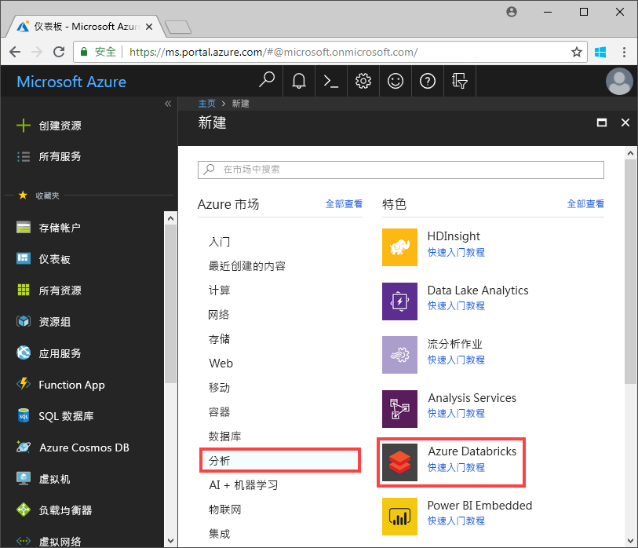

2. 在“Azure Databricks 服务”下，提供所需的值以创建 Databricks 工作区。

    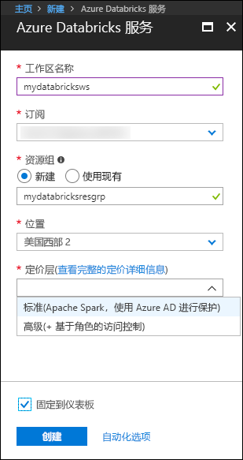

    提供以下值：
     
    |属性  |说明  |
    |---------|---------|
    |**工作区名称**     | 提供 Databricks 工作区的名称        |
    |**订阅**     | 从下拉列表中选择自己的 Azure 订阅。        |
    |**资源组**     | 指定是要创建新的资源组还是使用现有的资源组。 资源组是用于保存 Azure 解决方案相关资源的容器。 有关详细信息，请参阅 [Azure 资源组概述](../../azure-resource-manager/resource-group-overview.md)。 |
    |**位置**     | 选择“美国西部 2”。 有关其他可用区域，请参阅[各区域推出的 Azure 服务](https://azure.microsoft.com/regions/services/)。        |
    |**定价层**     |  选择“标准”或“高级”。 有关这些层的详细信息，请参阅 [Databricks 价格页](https://azure.microsoft.com/pricing/details/databricks/)。       |

    选择“固定到仪表板”，并单击“创建”。

3. 创建工作区需要几分钟时间。 在创建工作区过程中，门户会在右侧显示“正在提交 Azure Databricks 的部署”磁贴。 可能需要在仪表板上向右滚动才能看到此磁贴。 另外，还会在屏幕顶部附近显示进度条。 你可以查看任一区域来了解进度。

    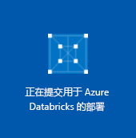

## <a name="create-a-spark-cluster-in-databricks"></a>在 Databricks 中创建 Spark 群集

1. 在 Azure 门户中，转到所创建的 Databricks 工作区，然后选择“启动工作区”。

2. 随后将会重定向到 Azure Databricks 门户。 从门户中，选择“新建” > “群集”。

    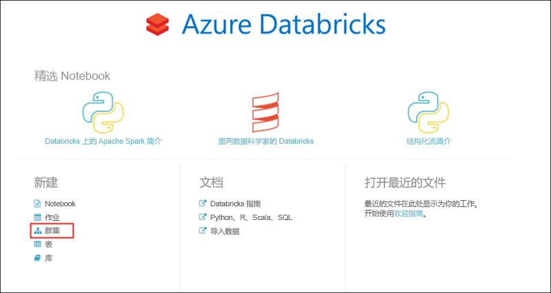

3. 在“新建群集”页中，提供用于创建群集的值。

    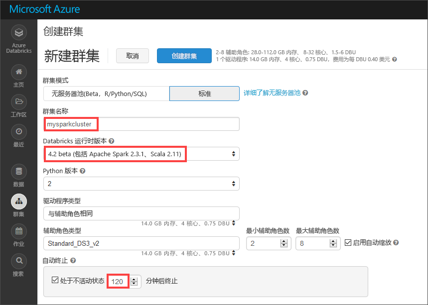

    除以下值外，接受其他所有默认值：

    * 输入群集的名称。
    * 创建采用 **4.2 beta** 版运行时的群集。
    * 请务必选中“在不活动超过 120 分钟后终止”复选框。 提供一个持续时间（以分钟为单位），如果群集在这段时间内一直未被使用，则会将其终止。

4. 选择“创建群集”。 群集运行后，可将笔记本附加到该群集，并运行 Spark 作业。

有关创建群集的详细信息，请参阅[在 Azure Databricks 中创建 Spark 群集](https://docs.azuredatabricks.net/user-guide/clusters/create.html)。

## <a name="create-storage-account-file-system"></a>创建存储帐户文件系统

在本部分中，你将在 Azure Databricks 工作区中创建一个 Notebook，然后运行代码片段来配置存储帐户。

1. 在 [Azure 门户](https://portal.azure.com)中，转到所创建的 Azure Databricks 工作区，然后选择“启动工作区”。

2. 在左窗格中选择“工作区”。 在**工作区**下拉列表中，选择**创建** > **笔记本**。

    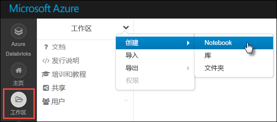

3. 在“创建 Notebook”对话框中，输入 Notebook 的名称。 选择“Scala”作为语言，然后选择前面创建的 Spark 群集。

    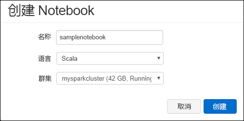

    选择**创建**。

4. 将下面的代码输入到第一个单元格中，并将占位符值替换为你的帐户名称、密钥以及文件系统的名称。

    ```scala
    spark.conf.set("fs.azure.account.key.<ACCOUNT_NAME>.dfs.core.windows.net", "<ACCOUNT_KEY>") 
    spark.conf.set("fs.azure.createRemoteFileSystemDuringInitialization", "true")
    dbutils.fs.ls("abfs://<FILE_SYSTEM_NAME>@<ACCOUNT_NAME>.dfs.core.windows.net/")
    spark.conf.set("fs.azure.createRemoteFileSystemDuringInitialization", "false") 
    ```

    按 **SHIFT + ENTER** 运行代码单元。

    现在，已经为存储帐户创建了文件系统。

## <a name="ingest-sample-data"></a>引入示例数据

开始学习本部分之前，必须完成以下先决条件：

* [从 Github](https://github.com/Azure/usql/blob/master/Examples/Samples/Data/json/radiowebsite/small_radio_json.json) 下载 **small_radio_json.json**。
* 使用 **AzCopy 版本 10** 将示例 JSON 文件上传到你创建的 Azure Blob 存储帐户和文件系统：

    ```bash
    set ACCOUNT_NAME=<ACCOUNT_NAME>
    set ACCOUNT_KEY=<ACCOUNT_KEY>
    azcopy cp "<LOCAL_FILE_PATH>\small_radio_json.json" https://<ACCOUNT_NAME>.dfs.core.windows.net/<CONTAINER_NAME> --recursive 
    ```

> [!NOTE]
> AzCopy 版本 10 仅可供预览版客户使用。

## <a name="run-a-spark-sql-job"></a>运行 Spark SQL 作业

执行以下任务来对数据运行 Spark SQL 作业。

1. 运行一条 SQL 语句，以使用示例 JSON 数据文件 **small_radio_json.json** 中的数据创建一个临时表。 在以下代码片段中，将占位符值替换为你的文件系统名称和存储帐户名称。 使用之前创建的 Notebook，将该代码片段粘贴到该 Notebook 中的一个新的代码单元格中，然后按 SHIFT + ENTER。

    ```sql
    %sql
    DROP TABLE IF EXISTS radio_sample_data;
    CREATE TABLE radio_sample_data
    USING json
    OPTIONS (
     path  "abfs://<FILE_SYSTEM_NAME>@<ACCOUNT_NAME>.dfs.core.windows.net/<PATH>/small_radio_json.json"
    )
    ```

    成功完成命令后，Databricks 群集中将以表的形式列出 JSON 文件中的所有数据。

    使用 `%sql` 语言魔法 (magic) 命令可从笔记本运行 SQL 代码，即使该笔记本采用另一种类型。 有关详细信息，请参阅[在笔记本中混合使用语言](https://docs.azuredatabricks.net/user-guide/notebooks/index.html#mixing-languages-in-a-notebook)。

2. 让我们看看示例 JSON 数据的快照，以便更好地了解运行的查询。 将以下代码片段粘贴到代码单元中，并按 **SHIFT + ENTER**。

    ```sql
    %sql 
    SELECT * from radio_sample_data
    ```

3. 随后将会看到以下屏幕截图中所示的表格输出（此处只显示了一部分列）：

    

    在其他详细信息中，示例数据捕获了无线电频道的听众的性别（列名为“性别”），以及这些听众的订阅是免费还是付费的（列名为“级别”）。

4. 现在创建这些数据的可视表示形式，以显示每种性别、有多少用户使用免费帐户和多少用户是付费的订户。 在表格输出的底部，单击“条形图”图标，再单击“绘图选项”。

    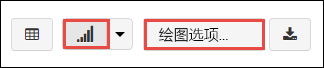

5. 在“自定义绘图”中，按屏幕截图中所示拖放值。

    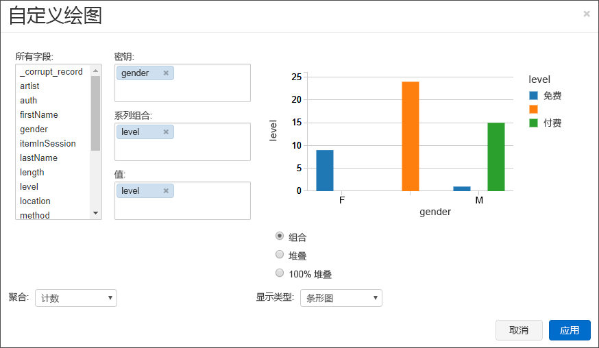

    - 将“键”设置为“性别”。
    - 将“序列分组”设置为“级别”。
    - 将“值”设置为“级别”。
    - 将“聚合”设置为“计数”。

6. 单击“应用”。

7. 输出将显示以下屏幕截图中所示的可视表示形式：

     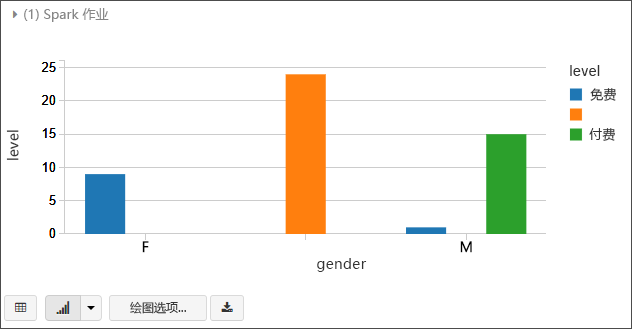

## <a name="clean-up-resources"></a>清理资源

完成本文后，可以终止群集。 从 Azure Databricks 工作区中，选择“群集”并找到要终止的群集。 将鼠标指针移动到“操作”列下的省略号上，然后选择“终止”图标。

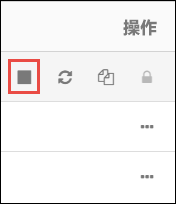

如果不手动终止群集，但在创建群集时选中了“在不活动 __ 分钟后终止”复选框，则该群集会自动停止。 如果设置了此选项，则群集在处于不活动状态达到指定时间量后将停止。

## <a name="next-steps"></a>后续步骤

在本文中，你在 Azure Databricks 中创建了一个 Spark 群集，并使用 Data Lake Storage Gen2 中的数据运行了一个 Spark 作业。 我们还可以查看 [Spark 数据源](https://docs.azuredatabricks.net/spark/latest/data-sources/index.html)，了解如何将其他数据源中的数据导入 Azure Databricks。 请继续学习下一篇文章，了解如何使用 Azure Databricks 执行 ETL（提取、转换和加载数据）操作。

> [!div class="nextstepaction"]
>[使用 Azure Databricks 提取、转换和加载数据](../../azure-databricks/databricks-extract-load-sql-data-warehouse.md)
