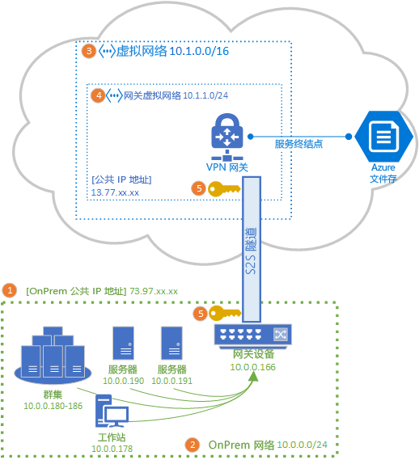
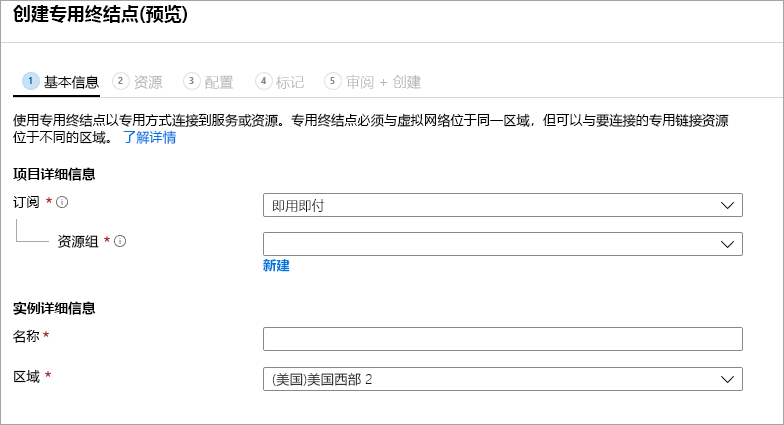

# 配置站点到站点 VPN 以与 Azure 文件存储一起使用
你可以使用站点到站点 (S2S) VPN 连接从本地网络中通过 SMB 装载 Azure 文件共享，而无需打开端口 445。 你可以使用 [Azure VPN 网关](../../vpn-gateway/vpn-gateway-about-vpngateways.md)设置站点到站点 VPN，该网关是提供 VPN 服务的 Azure 资源，与存储帐户或其他 Azure 资源一起部署在资源组中。

我们强烈建议先阅读 [Azure 文件存储网络概述](storage-files-networking-overview.md)，然后再继续阅读本文章，以全面讨论 Azure 文件存储可用的网络选项。

本文详细介绍了配置站点到站点 VPN 以直接在本地装载 Azure 文件共享的步骤。 如果想要通过站点到站点 VPN 路由 Azure 文件同步的同步流量，请参阅[配置 Azure 文件同步代理和防火墙设置](storage-sync-files-firewall-and-proxy.md)。

## 先决条件
- 要在本地装载的 Azure 文件共享。 可将[标准](storage-how-to-create-file-share.md)或[高级 Azure 文件共享](storage-how-to-create-premium-fileshare.md)用于站点到站点 VPN。

- 本地数据中心内与 Azure VPN 网关兼容的网络设备或服务器。 Azure 文件存储与所选的本地网络设备无关，但 Azure VPN 网关会保留[已测试设备列表](../../vpn-gateway/vpn-gateway-about-vpn-devices.md)。 不同的网络设备提供不同的特性、性能特征和管理功能，因此，在选择网络设备时要将这些因素考虑在内。

    如果你没有现有的网络设备，Windows Server 包含内置服务器角色、路由和远程访问 (RRAS)，可使用它们作为本地网络设备。 若要详细了解如何在 Windows Server 中配置路由和远程访问，请参阅 [RAS 网关](https://docs.microsoft.com/windows-server/remote/remote-access/ras-gateway/ras-gateway)。

## 将存储帐户添加到 VNet
在 Azure 门户中，导航到包含要本地装载的 Azure 文件共享的存储帐户。 在存储帐户的目录中，选择“防火墙和虚拟网络”项  。 除非在创建虚拟网络时将其添加到存储帐户中，否则显示的窗格中“允许的访问来源”部分应选中了“所有网络”单选按钮   。

若要将存储帐户添加到所需的虚拟网络，请选择“选定网络”  。 在小标题“虚拟网络”下，根据所需状态，单击“+ 添加现有虚拟网络”或“+ 添加新的虚拟网络”    。 创建新的虚拟网络将导致创建新的 Azure 资源。 新的或现有的 VNet 资源不需要与存储帐户位于同一资源组或订阅中，但它必须与存储帐户位于同一区域，并且将 VNet 部署到要在其中部署 VPN 网关的资源组和订阅。 

如果添加现有虚拟网络，需选择要将存储帐户添加到的该虚拟网络的一个或多个子网。 如果选择新的虚拟网络，则创建虚拟网络时将创建一个子网，稍后还可通过生成的 Azure 资源为该虚拟网络添加更多子网。

如果之前未将存储帐户添加到订阅，则需要将 Microsoft.Storage 服务终结点添加到虚拟网络。 这可能需要一些时间，在此操作完成之前，你将无法访问该存储帐户中的 Azure 文件共享，包括无法通过 VPN 连接进行访问。 

## 部署 Azure VPN 网关
在 Azure 门户的目录中，选择“新建资源”，并搜索“虚拟网络网关”   。 虚拟网络网关必须与上一步中部署的虚拟网络位于同一订阅、同一 Azure 区域和同一资源组中（请注意，在选择虚拟网络后，将自动选择资源组）。 

为了部署 Azure VPN 网关，必须填写以下字段：

- **名称**：VPN 网关的 Azure 资源的名称。 此名称可以是任何你认为有助于管理的名称。
- **区域**：要将 VPN 网关部署到的区域。
- **网关类型**：为了部署站点到站点 VPN，必须选择“VPN”  。
- **VPN 类型**：可以根据你的 VPN 设备选择“基于路由”或“基于策略”   。 基于路由的 VPN 支持 IKEv2，而基于策略的 VPN 仅支持 IKEv1。 若要详细了解两种类型的 VPN 网关，请参阅[基于策略的 VPN 网关和基于路由的 VPN 网关](../../vpn-gateway/vpn-gateway-connect-multiple-policybased-rm-ps.md#about)
- **SKU**：SKU 控制允许的站点到站点隧道数和所需的 VPN 性能。 若要为用例选择适当的 SKU，请参阅[网关 SKU](../../vpn-gateway/vpn-gateway-about-vpngateways.md#gwsku) 列表。 如果需要，稍后可以更改 VPN 网关的 SKU。
- **虚拟网络**：在上一步中创建的虚拟网络。
- **公共 IP 地址**：要向 Internet 公开的 VPN 网关 IP 地址。 很可能需要创建新的 IP 地址，但如果现有未使用的 IP 地址适用，也可以使用它。 如果选择“新建”，则将在与 VPN 网关相同的资源组中创建新的 IP 地址，并且“公共 IP 地址名称”将是新建的 IP 地址的名称   。 如果选择“使用现有的”，则必须选择现有未使用的 IP 地址  。
- **启用主动-主动模式**：仅当要创建主动-主动网关配置时，才选择“启用”，否则请保持选择“禁用”   。 若要详细了解主动-主动模式，请参阅[高可用性跨界连接与 VNet 到 VNet 连接](../../vpn-gateway/vpn-gateway-highlyavailable.md)。
- **配置 BGP ASN**：仅在配置特别需要此设置的情况下选择“启用”  。 若要了解有关此设置的详细信息，请参阅[关于 Azure VPN 网关的 BGP](../../vpn-gateway/vpn-gateway-bgp-overview.md)。

选择“查看 + 创建”以创建 VPN 网关  。 VPN 网关可能需要最多 45 分钟才能创建和部署完毕。

### 为本地网关创建本地网络网关 
本地网络网关是代表本地网络设备的 Azure 资源。 在 Azure 门户的“目录”中，选择“新建资源”，并搜索“本地网络网关”   。 本地网络网关是一种 Azure 资源，它将与存储帐户、虚拟网络和 VPN 网关一起部署，但无需与存储帐户位于同一资源组或订阅中。 

为了部署本地网络网关资源，必须写入以下字段：

- **名称**：本地网络网关的 Azure 资源名称。 此名称可以是任何你认为有助于管理的名称。
- **IP 地址**：本地网关的公共 IP 地址。
- **地址空间**：此本地网络网关所代表的网络的地址范围。 你可以添加多个地址空间范围，但是请确保此处所指定的范围没有与要连接到的其他网络的范围相重叠。 
- **配置 BGP 设置**：仅在配置需要 BGP 设置时才配置此设置。 若要了解有关此设置的详细信息，请参阅[关于 Azure VPN 网关的 BGP](../../vpn-gateway/vpn-gateway-bgp-overview.md)。
- **订阅**：所需的订阅。 这不需要与用于 VPN 网关或存储帐户的订阅相匹配。
- **资源组**：所需的资源组。 这不需要与用于 VPN 网关或存储帐户的资源组相匹配。
- **位置**：应在其中创建本地网络网关资源的 Azure 区域。 这应该与你为 VPN 网关和存储帐户选择的区域匹配。

选择“创建”以创建本地网络网关资源  。  

## 配置本地网络设备
配置本地网络设备的特定步骤取决于组织所选的网络设备。 根据组织所选的设备，[已测试设备的列表](../../vpn-gateway/vpn-gateway-about-vpn-devices.md)可能会包含链接，指向设备供应商提供的有关为设备配置 Azure VPN 网关的说明。

## 创建专用终结点（预览版）
为存储帐户创建专用终结点可为存储帐户提供虚拟网络 IP 地址空间内的 IP 地址。 使用此专用 IP 地址从本地装载 Azure 文件共享时，VPN 安装自动定义的传递规则将通过 VPN 将装载请求路由到存储帐户。 

在“存储帐户”边栏选项卡中，选择左侧目录中的“专用终结点连接”，并选择“+ 专用终结点”来新建专用终结点   。 将打开向导，要求你在多个页面上完成配置：

在“基本信息”选项卡上，为专用终结点选择适当的资源组、名称和区域  。 资源组、名称和区域可以任意配置，不必与存储帐户匹配，但必须在同一区域中创建专用终结点和用于容纳该专用终结点的存储帐户。

在“资源”选项卡上，选择“连接到目录中的 Azure 资源”的单选按钮   。 在“资源类型”下，选择“Microsoft.Storage/storageAccounts”为资源类型   。 “资源”字段用于指定包含要连接到的 Azure 文件共享的存储帐户  。 因为针对 Azure 文件存储，所以目标子资源是“文件”  。

使用“配置”选项卡，可以选择要向其添加专用终结点的特定虚拟网络和子网  。 选择上面创建的虚拟网络。 必须选择上面将服务终结点添加到的子网以外的子网。

使用“配置”选项卡还可以设置专用 DNS 区域  。 这不是强制要求，但可以使用易记的 UNC 路径（如 `\\mystorageaccount.privatelink.file.core.windows.net\myshare`）来装载 Azure 文件共享，而不使用包含 IP 地址的 UNC 路径。 此操作也可用于虚拟网络中的 DNS 服务器。

单击“查看 + 创建”以创建专用终结点  。 创建专用终结点后，你将看到两个新资源：专用终结点资源和配对的虚拟网络接口。 虚拟网络接口资源将具有存储帐户的专用 IP。 

## 创建站点到站点连接
若要完成 S2S VPN 的部署，必须在本地网络设备（由本地网络网关资源表示）和 VPN 网关之间创建连接。 为此，请导航到前面创建的 VPN 网关。 在 VPN 网关目录中，选择“连接”，然后单击“添加”   。 将打开“添加连接”窗格，要求你填充以下字段  ：

- **名称**：连接的名称。 VPN 网关可以承载多个连接，因此请选择一个有助于管理的名称来区分此特定连接。
- **连接类型**：由于这是 S2S 连接，因此请在下拉列表中选择“站点到站点(IPSec)”  。
- **虚拟网络网关**：此字段将自动选定到连接中的 VPN 网关，并且无法更改。
- **本地网络网关**：这是要连接到 VPN 网关的本地网络网关。 将打开选择窗格，其名称与上面创建的本地网络网关相同。
- **共享密钥 (PSK)** ：字母和数字的组合，用于为连接实现加密。 虚拟网络网关和本地网络网关必须使用同一共享密钥。 如果网关设备没有提供密钥，可以在此处创建一个密钥，并将其提供给设备。

单击“确定”以创建连接  。 可通过“连接”页面验证是否已成功完成连接  。

## 装载 Azure 文件共享 
配置 S2S VPN 的最后一步是验证其是否适用于 Azure 文件存储。 可以在你青睐的 OS 上本地装载 Azure 文件共享来完成此操作。 请在这里参阅各 OS 的装载说明：

- [Windows](storage-how-to-use-files-windows.md)
- [macOS](storage-how-to-use-files-mac.md)
- [Linux](storage-how-to-use-files-linux.md)

## 另请参阅
- [Azure 文件存储网络概述](storage-files-networking-overview.md)
- [在 Linux 上配置点到站点 (P2S) VPN 以与 Azure 文件存储一起使用](storage-files-configure-p2s-vpn-windows.md)
- [在 Linux 上配置点到站点 (P2S) VPN 以与 Azure 文件存储一起使用](storage-files-configure-p2s-vpn-linux.md)