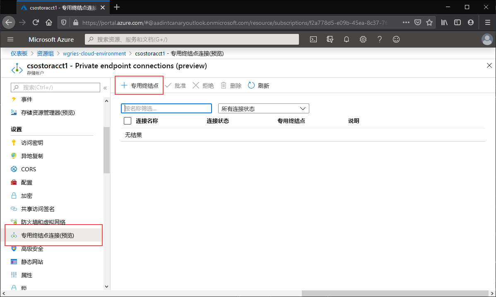
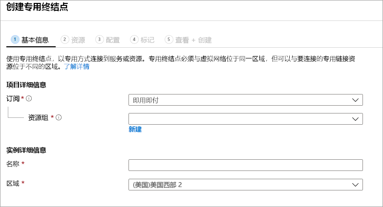
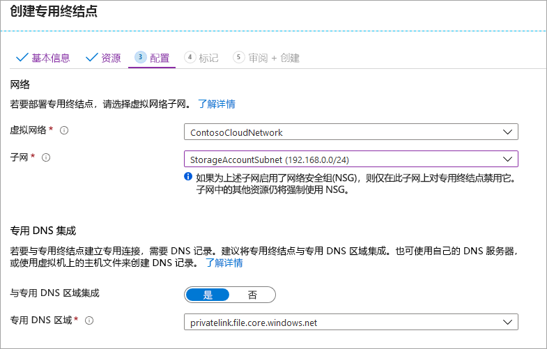
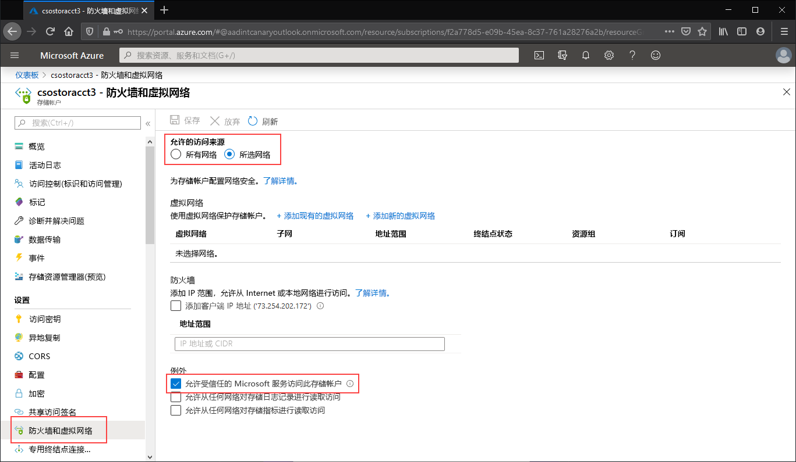
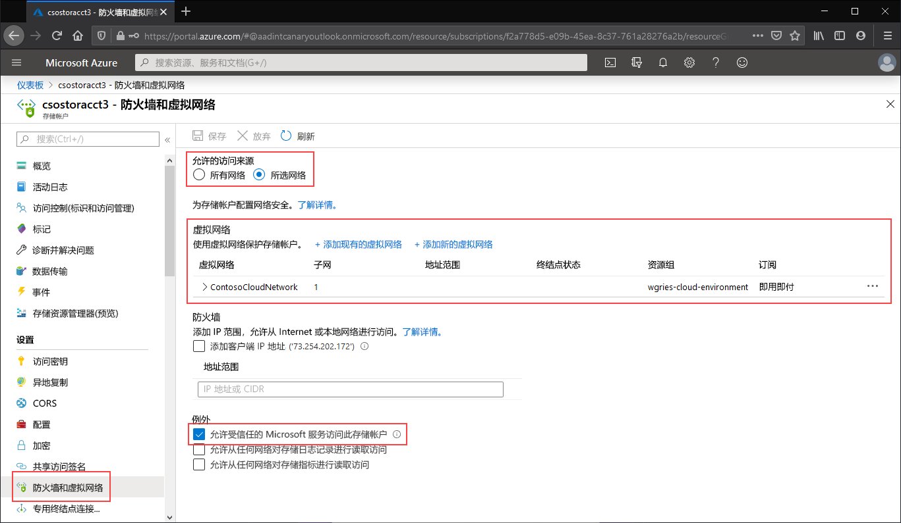

# <a name="configuring-azure-files-network-endpoints"></a>配置 Azure 文件存储网络终结点
Azure 文件存储提供两种主要类型的终结点用于访问 Azure 文件共享： 
- 公共终结点：使用公共 IP 地址，可从全球任意位置访问。
- 专用终结点：位于某个虚拟网络中，并使用该虚拟网络的地址空间内部的专用 IP 地址。

公共和专用终结点位于 Azure 存储帐户中。 存储帐户是代表共享存储池的管理结构，你可以在其中部署多个文件共享以及其他存储资源（例如，Blob 容器或队列）。

本文重点介绍如何配置存储帐户的终结点，以便直接访问 Azure 文件共享。 本文档中提供的大部分详细信息也适用于 Azure 文件同步与存储帐户公共和专用终结点的互操作方式，但有关 Azure 文件同步部署网络注意事项的详细信息，请参阅[配置 Azure 文件同步代理和防火墙设置](storage-sync-files-firewall-and-proxy.md)。

在阅读本操作指南之前，我们建议先阅读 [Azure 文件存储的网络注意事项](storage-files-networking-overview.md)。

## <a name="prerequisites"></a>先决条件
- 本文假设已创建一个 Azure 订阅。 如果还没有订阅，则请在开始前创建一个[免费帐户](https://azure.microsoft.com/free/?WT.mc_id=A261C142F)。
- 本文假设已在要从本地连接到的存储帐户中创建了一个 Azure 文件共享。 若要了解如何创建 Azure 文件共享，请参阅[创建 Azure 文件共享](storage-how-to-create-file-share.md)。
- 如果你打算使用 Azure PowerShell，请[安装最新版本](https://docs.microsoft.com/powershell/azure/install-az-ps)。
- 如果你打算使用 Azure CLI，请[安装最新版本](https://docs.microsoft.com/cli/azure/install-azure-cli?view=azure-cli-latest)。

## <a name="create-a-private-endpoint"></a>创建专用终结点
为存储帐户创建专用终结点会部署以下 Azure 资源：

- **一个专用终结点**：表示存储帐户专用终结点的 Azure 资源。 可将此资源视为连接存储帐户和网络接口的资源。
- **一个网络接口 (NIC)** ：在指定的虚拟网络/子网中保留专用 IP 地址的网络接口。 此网络接口是部署虚拟机时部署的同一个资源，但它不会分配到 VM，而是由专用终结点拥有。
- **一个专用 DNS 区域**：如果你以前从未为此虚拟网络部署过专用终结点，系统将为虚拟网络部署新的专用 DNS 区域。 此外，将为此 DNS 区域中的存储帐户创建 DNS A 记录。 如果已在此虚拟网络中部署了专用终结点，则会将存储帐户的新 A 记录添加到现有 DNS 区域。 部署 DNS 区域的操作是可选的，但我们强烈建议执行此操作；如果使用 AD 服务主体或 FileREST API 装载 Azure 文件共享，则此操作是必需的。

> [!Note]  
> 本文将使用 Azure 公共区域的存储帐户 DNS 后缀 `core.windows.net`。 此段注释也适用于 Azure 主权云（例如 Azure 美国政府云和 Azure 中国云）- 只需根据环境替换相应的后缀即可。 

# <a name="portal"></a>[门户](#tab/azure-portal)
导航到要为其创建专用终结点的存储帐户。 在存储帐户的目录中选择“专用终结点连接”，然后选择“+ 专用终结点”创建新的专用终结点。   



出现的向导包含多个要完成的页。

在“基本信息”边栏选项卡中，为专用终结点选择所需的资源组、名称和区域。  资源组、名称和区域可以任意配置，不必与存储帐户匹配，但必须在同一区域中创建专用终结点和用于容纳该专用终结点的存储帐户。



在“资源”边栏选项卡中，选中“连接到目录中的 Azure 资源”对应的单选按钮。   在“资源类型”下，选择“Microsoft.Storage/storageAccounts”为资源类型   。 “资源”字段用于指定包含要连接到的 Azure 文件共享的存储帐户  。 因为针对 Azure 文件存储，所以目标子资源是“文件”  。

在“配置”边栏选项卡中，可以选择要向其添加专用终结点的特定虚拟网络和子网。  选择上面创建的虚拟网络。 必须选择上面将服务终结点添加到的子网以外的子网。 “配置”边栏选项卡还包含用于创建/更新专用 DNS 区域的信息。 建议使用默认的 `privatelink.file.core.windows.net` 区域。



单击“查看 + 创建”以创建专用终结点  。 

如果你在虚拟网络中有一个虚拟机，或者已按[此文](storage-files-networking-dns.md)所述配置了 DNS 转发，则可以通过在 PowerShell、命令行或终端（适用于 Windows、Linux 或 macOS）中运行以下命令，来测试是否已正确设置专用终结点。 必须将 `<storage-account-name>` 替换为相应的存储帐户名称：

```
nslookup <storage-account-name>.file.core.windows.net
```

如果一切成功进行，则应会看到以下输出，其中 `192.168.0.5` 是虚拟网络中专用终结点的专用 IP 地址（Windows 中显示的输出）：

```Output
Server:  UnKnown
Address:  10.2.4.4

Non-authoritative answer:
Name:    storageaccount.privatelink.file.core.windows.net
Address:  192.168.0.5
Aliases:  storageaccount.file.core.windows.net
```

# <a name="powershell"></a>[PowerShell](#tab/azure-powershell)
若要为存储帐户创建专用终结点，首先需要获取对存储帐户的引用，以及要将专用终结点添加到的虚拟网络子网的引用。 请替换下面的 `<storage-account-resource-group-name>`、`<storage-account-name>`、`<vnet-resource-group-name>`、`<vnet-name>` 和 `<vnet-subnet-name>`：

```PowerShell
$storageAccountResourceGroupName = "<storage-account-resource-group-name>"
$storageAccountName = "<storage-account-name>"
$virtualNetworkResourceGroupName = "<vnet-resource-group-name>"
$virtualNetworkName = "<vnet-name>"
$subnetName = "<vnet-subnet-name>"

# Get storage account reference, and throw error if it doesn't exist
$storageAccount = Get-AzStorageAccount `
        -ResourceGroupName $storageAccountResourceGroupName `
        -Name $storageAccountName `
        -ErrorAction SilentlyContinue

if ($null -eq $storageAccount) {
    $errorMessage = "Storage account $storageAccountName not found "
    $errorMessage += "in resource group $storageAccountResourceGroupName."
    Write-Error -Message $errorMessage -ErrorAction Stop
}

# Get virtual network reference, and throw error if it doesn't exist
$virtualNetwork = Get-AzVirtualNetwork `
        -ResourceGroupName $virtualNetworkResourceGroupName `
        -Name $virtualNetworkName `
        -ErrorAction SilentlyContinue

if ($null -eq $virtualNetwork) {
    $errorMessage = "Virtual network $virtualNetworkName not found "
    $errorMessage += "in resource group $virtualNetworkResourceGroupName."
    Write-Error -Message $errorMessage -ErrorAction Stop
}

# Get reference to virtual network subnet, and throw error if it doesn't exist
$subnet = $virtualNetwork | `
    Select-Object -ExpandProperty Subnets | `
    Where-Object { $_.Name -eq $subnetName }

if ($null -eq $subnet) {
    Write-Error `
            -Message "Subnet $subnetName not found in virtual network $virtualNetworkName." `
            -ErrorAction Stop
}
```

若要创建专用终结点，必须与存储帐户建立专用链接服务连接。 专用链接服务连接是创建专用终结点时使用的输入。 

```PowerShell
# Disable private endpoint network policies
$subnet.PrivateEndpointNetworkPolicies = "Disabled"
$virtualNetwork | Set-AzVirtualNetwork | Out-Null

# Create a private link service connection to the storage account.
$privateEndpointConnection = New-AzPrivateLinkServiceConnection `
        -Name "$storageAccountName-Connection" `
        -PrivateLinkServiceId $storageAccount.Id `
        -GroupId "file"

# Create a new private endpoint.
$privateEndpoint = New-AzPrivateEndpoint `
        -ResourceGroupName $storageAccountResourceGroupName `
        -Name "$storageAccountName-PrivateEndpoint" `
        -Location $virtualNetwork.Location `
        -Subnet $subnet `
        -PrivateLinkServiceConnection $privateEndpointConnection `
        -ErrorAction Stop
```

创建 Azure 专用 DNS 区域可将存储帐户的原始名称（例如 `storageaccount.file.core.windows.net`）解析为虚拟网络内部的专用 IP。 尽管从创建专用终结点的角度来看，此操作是可选的，但如果使用 AD 用户主体装载或通过 REST API 访问 Azure 文件共享，则此操作肯定是必需的。  

```PowerShell
# Get the desired storage account suffix (core.windows.net for public cloud).
# This is done like this so this script will seamlessly work for non-public Azure.
$storageAccountSuffix = Get-AzContext | `
    Select-Object -ExpandProperty Environment | `
    Select-Object -ExpandProperty StorageEndpointSuffix

# For public cloud, this will generate the following DNS suffix:
# privatelink.file.core.windows.net.
$dnsZoneName = "privatelink.file.$storageAccountSuffix"

# Find a DNS zone matching desired name attached to this virtual network.
$dnsZone = Get-AzPrivateDnsZone | `
    Where-Object { $_.Name -eq $dnsZoneName } | `
    Where-Object {
        $privateDnsLink = Get-AzPrivateDnsVirtualNetworkLink `
                -ResourceGroupName $_.ResourceGroupName `
                -ZoneName $_.Name `
                -ErrorAction SilentlyContinue
        
        $privateDnsLink.VirtualNetworkId -eq $virtualNetwork.Id
    }

if ($null -eq $dnsZone) {
    # No matching DNS zone attached to virtual network, so create new one.
    $dnsZone = New-AzPrivateDnsZone `
            -ResourceGroupName $virtualNetworkResourceGroupName `
            -Name $dnsZoneName `
            -ErrorAction Stop

    $privateDnsLink = New-AzPrivateDnsVirtualNetworkLink `
            -ResourceGroupName $virtualNetworkResourceGroupName `
            -ZoneName $dnsZoneName `
            -Name "$virtualNetworkName-DnsLink" `
            -VirtualNetworkId $virtualNetwork.Id `
            -ErrorAction Stop
}
```

获取对专用 DNS 区域的引用后，接下来必须创建存储帐户的 A 记录。

```PowerShell
$privateEndpointIP = $privateEndpoint | `
    Select-Object -ExpandProperty NetworkInterfaces | `
    Select-Object @{ 
        Name = "NetworkInterfaces"; 
        Expression = { Get-AzNetworkInterface -ResourceId $_.Id } 
    } | `
    Select-Object -ExpandProperty NetworkInterfaces | `
    Select-Object -ExpandProperty IpConfigurations | `
    Select-Object -ExpandProperty PrivateIpAddress

$privateDnsRecordConfig = New-AzPrivateDnsRecordConfig `
        -IPv4Address $privateEndpointIP

New-AzPrivateDnsRecordSet `
        -ResourceGroupName $virtualNetworkResourceGroupName `
        -Name $storageAccountName `
        -RecordType A `
        -ZoneName $dnsZoneName `
        -Ttl 600 `
        -PrivateDnsRecords $privateDnsRecordConfig `
        -ErrorAction Stop | `
    Out-Null
```

如果你在虚拟网络中有一个虚拟机，或者已按[此文](storage-files-networking-dns.md)所述配置了 DNS 转发，则可以使用以下命令测试是否已正确设置专用终结点：

```PowerShell
$storageAccountHostName = [System.Uri]::new($storageAccount.PrimaryEndpoints.file) | `
    Select-Object -ExpandProperty Host

Resolve-DnsName -Name $storageAccountHostName
```

如果一切成功进行，则应会看到以下输出，其中 `192.168.0.5` 是虚拟网络中专用终结点的专用 IP 地址：

```Output
Name                             Type   TTL   Section    NameHost
----                             ----   ---   -------    --------
storageaccount.file.core.windows CNAME  60    Answer     storageaccount.privatelink.file.core.windows.net
.net

Name       : storageaccount.privatelink.file.core.windows.net
QueryType  : A
TTL        : 600
Section    : Answer
IP4Address : 192.168.0.5
```

# <a name="azure-cli"></a>[Azure CLI](#tab/azure-cli)
若要为存储帐户创建专用终结点，首先需要获取对存储帐户的引用，以及要将专用终结点添加到的虚拟网络子网的引用。 请替换下面的 `<storage-account-resource-group-name>`、`<storage-account-name>`、`<vnet-resource-group-name>`、`<vnet-name>` 和 `<vnet-subnet-name>`：

```bash
storageAccountResourceGroupName="<storage-account-resource-group-name>"
storageAccountName="<storage-account-name>"
virtualNetworkResourceGroupName="<vnet-resource-group-name>"
virtualNetworkName="<vnet-name>"
subnetName="<vnet-subnet-name>"

# Get storage account ID 
storageAccount=$(az storage account show \
        --resource-group $storageAccountResourceGroupName \
        --name $storageAccountName \
        --query "id" | \
    tr -d '"')

# Get virtual network ID
virtualNetwork=$(az network vnet show \
        --resource-group $virtualNetworkResourceGroupName \
        --name $virtualNetworkName \
        --query "id" | \
    tr -d '"')

# Get subnet ID
subnet=$(az network vnet subnet show \
        --resource-group $virtualNetworkResourceGroupName \
        --vnet-name $virtualNetworkName \
        --name $subnetName \
        --query "id" | \
    tr -d '"')
```

若要创建专用终结点，首先必须确保子网的专用终结点网络策略设置为“已禁用”。 然后，可以使用 `az network private-endpoint create` 命令创建专用终结点

```bash
# Disable private endpoint network policies
az network vnet subnet update \
        --ids $subnet \
        --disable-private-endpoint-network-policies \
        --output none

# Get virtual network location
region=$(az network vnet show \
        --ids $virtualNetwork \
        --query "location" | \
    tr -d '"')

# Create a private endpoint
privateEndpoint=$(az network private-endpoint create \
        --resource-group $virtualNetworkResourceGroupName \
        --name "$storageAccountName-PrivateEndpoint" \
        --location $region \
        --subnet $subnet \
        --private-connection-resource-id $storageAccount \
        --group-ids "file" \
        --connection-name "$storageAccountName-Connection" \
        --query "id" | \
    tr -d '"')
```

创建 Azure 专用 DNS 区域可将存储帐户的原始名称（例如 `storageaccount.file.core.windows.net`）解析为虚拟网络内部的专用 IP。 尽管从创建专用终结点的角度来看，此操作是可选的，但如果使用 AD 用户主体装载或通过 REST API 访问 Azure 文件共享，则此操作肯定是必需的。  

```bash
# Get the desired storage account suffix (core.windows.net for public cloud).
# This is done like this so this script will seamlessly work for non-public Azure.
storageAccountSuffix=$(az cloud show \
        --query "suffixes.storageEndpoint" | \
    tr -d '"')

# For public cloud, this will generate the following DNS suffix:
# privatelink.file.core.windows.net.
dnsZoneName="privatelink.file.$storageAccountSuffix"

# Find a DNS zone matching desired name attached to this virtual network.
possibleDnsZones=$(az network private-dns zone list \
        --query "[?name == '$dnsZoneName'].id" \
        --output tsv)

for possibleDnsZone in $possibleDnsZones
do
    possibleResourceGroupName=$(az resource show \
            --ids $possibleDnsZone \
            --query "resourceGroup" | \
        tr -d '"')
    
    link=$(az network private-dns link vnet list \
            --resource-group $possibleResourceGroupName \
            --zone-name $dnsZoneName \
            --query "[?virtualNetwork.id == '$virtualNetwork'].id" \
            --output tsv)
    
    if [ -z $link ]
    then
        1 > /dev/null
    else 
        dnsZoneResourceGroup=$possibleResourceGroupName
        dnsZone=$possibleDnsZone
        break
    fi  
done

if [ -z $dnsZone ]
then
    # No matching DNS zone attached to virtual network, so create a new one
    dnsZone=$(az network private-dns zone create \
            --resource-group $virtualNetworkResourceGroupName \
            --name $dnsZoneName \
            --query "id" | \
        tr -d '"')
    
    az network private-dns link vnet create \
            --resource-group $resourceGroupName \
            --zone-name $zoneName \
            --name "$virtualNetworkName-DnsLink" \
            --virtual-network $virtualNetwork \
            --registration-enabled false \
            --output none
fi
```

获取对专用 DNS 区域的引用后，接下来必须创建存储帐户的 A 记录。

```bash
privateEndpointNIC=$(az network private-endpoint show \
        --ids $privateEndpoint \
        --query "networkInterfaces[0].id" | \
    tr -d '"')

privateEndpointIP=$(az network nic show \
        --ids $privateEndpointNIC \
        --query "ipConfigurations[0].privateIpAddress" | \
    tr -d '"')

az network private-dns record-set a create \
        --resource-group $dnsZoneResourceGroup \
        --zone-name $dnsZoneName \
        --name $storageAccountName \
        --output none

az network private-dns record-set a add-record \
        --resource-group $dnsZoneResourceGroup \
        --zone-name $dnsZoneName \
        --record-set-name $storageAccountName \
        --ipv4-address $privateEndpointIP \
        --output none
```

如果你在虚拟网络中有一个虚拟机，或者已按[此文](storage-files-networking-dns.md)所述配置了 DNS 转发，则可以使用以下命令测试是否已正确设置专用终结点：

```bash
httpEndpoint=$(az storage account show \
        --resource-group $storageAccountResourceGroupName \
        --name $storageAccountName \
        --query "primaryEndpoints.file" | \
    tr -d '"')

hostName=$(echo $httpEndpoint | cut -c7-$(expr length $httpEndpoint) | tr -d "/")
nslookup $hostName
```

如果一切成功进行，则应会看到以下输出，其中 `192.168.0.5` 是虚拟网络中专用终结点的专用 IP 地址：

```Output
Server:         127.0.0.53
Address:        127.0.0.53#53

Non-authoritative answer:
storageaccount.file.core.windows.net      canonical name = storageaccount.privatelink.file.core.windows.net.
Name:   storageaccount.privatelink.file.core.windows.net
Address: 192.168.0.5
```

---

## <a name="restrict-access-to-the-public-endpoint"></a>限制对公共终结点的访问
可以使用存储帐户防火墙设置来限制对公共终结点的访问。 通常，大多数针对存储帐户的防火墙策略仅限一个或多个虚拟网络进行网络访问。 可通过两种方法来仅限虚拟网络访问存储帐户：

- [为存储帐户创建一个或多个专用终结点](#create-a-private-endpoint)，并限制对公共终结点的所有访问。 这可以确保只有源自所需虚拟网络内部的流量才能访问存储帐户中的 Azure 文件共享。
- 仅限一个或多个虚拟网络访问公共终结点。 为此，可以使用称作“服务终结点”的虚拟网络功能。  通过服务终结点限制发往存储帐户的流量时，仍会通过公共 IP 地址访问存储帐户。

### <a name="restrict-all-access-to-the-public-endpoint"></a>限制对公共终结点的所有访问
限制对公共终结点的所有访问时，仍可以通过存储帐户的专用终结点来访问该存储帐户。 否则，对存储帐户的公共终结点发出的有效请求将被拒绝。 

# <a name="portal"></a>[门户](#tab/azure-portal)
导航到要限制对其公共终结点的所有访问的存储帐户。 在该存储帐户的目录中，选择“防火墙和虚拟网络”。 

在页面顶部，选中“选定的网络”单选按钮。  随后会显示一些用于控制公共终结点限制的设置。 选中“允许受信任的 Microsoft 服务访问此服务帐户”，以允许受信任的第一方 Microsoft 服务（例如 Azure 文件同步）访问存储帐户。 



# <a name="powershell"></a>[PowerShell](#tab/azure-powershell)
以下 PowerShell 命令将拒绝发往存储帐户公共终结点的所有流量。 请注意，此命令的 `-Bypass` 参数设置为 `AzureServices`。 这会允许受信任的第一方服务（例如 Azure 文件同步）通过公共终结点访问存储帐户。

```PowerShell
# This assumes $storageAccount is still defined from the beginning of this of this guide.
$storageAccount | Update-AzStorageAccountNetworkRuleSet `
        -DefaultAction Deny `
        -Bypass AzureServices `
        -WarningAction SilentlyContinue `
        -ErrorAction Stop | `
    Out-Null
```

# <a name="azure-cli"></a>[Azure CLI](#tab/azure-cli)
以下 CLI 命令将拒绝发往存储帐户公共终结点的所有流量。 请注意，此命令的 `-bypass` 参数设置为 `AzureServices`。 这会允许受信任的第一方服务（例如 Azure 文件同步）通过公共终结点访问存储帐户。

```bash
# This assumes $storageAccountResourceGroupName and $storageAccountName 
# are still defined from the beginning of this guide.
az storage account update \
    --resource-group $storageAccountResourceGroupName \
    --name $storageAccountName \
    --bypass "AzureServices" \
    --default-action "Deny" \
    --output none
```
---

### <a name="restrict-access-to-the-public-endpoint-to-specific-virtual-networks"></a>仅限从特定的虚拟网络访问公共终结点
如果仅限从特定的虚拟网络访问存储帐户，则会允许从指定的虚拟网络内部对公共终结点发出请求。 为此，可以使用称作“服务终结点”的虚拟网络功能。  在具有或没有专用终结点的情况下都可以使用此功能。

# <a name="portal"></a>[门户](#tab/azure-portal)
导航到仅限从特定虚拟网络访问公共终结点的存储帐户。 在该存储帐户的目录中，选择“防火墙和虚拟网络”。  

在页面顶部，选中“选定的网络”单选按钮。  随后会显示一些用于控制公共终结点限制的设置。 单击“+添加现有虚拟网络”，选择应允许其通过公共终结点访问存储帐户的特定虚拟网络。  这需要选择一个虚拟网络以及该虚拟网络的子网。 

选中“允许受信任的 Microsoft 服务访问此服务帐户”，以允许受信任的第一方 Microsoft 服务（例如 Azure 文件同步）访问存储帐户。 



# <a name="powershell"></a>[PowerShell](#tab/azure-powershell)
若要仅限特定的虚拟网络使用服务终结点访问存储帐户的公共终结点，首先需要收集有关该存储帐户和虚拟网络的信息。 填写 `<storage-account-resource-group>`、`<storage-account-name>`、`<vnet-resource-group-name>`、`<vnet-name>` 和 `<subnet-name>` 以收集此信息。

```PowerShell
$storageAccountResourceGroupName = "<storage-account-resource-group>"
$storageAccountName = "<storage-account-name>"
$restrictToVirtualNetworkResourceGroupName = "<vnet-resource-group-name>"
$restrictToVirtualNetworkName = "<vnet-name>"
$subnetName = "<subnet-name>"

$storageAccount = Get-AzStorageAccount `
        -ResourceGroupName $storageAccountResourceGroupName `
        -Name $storageAccountName `
        -ErrorAction Stop

$virtualNetwork = Get-AzVirtualNetwork `
        -ResourceGroupName $restrictToVirtualNetworkResourceGroupName `
        -Name $restrictToVirtualNetworkName `
        -ErrorAction Stop

$subnet = $virtualNetwork | `
    Select-Object -ExpandProperty Subnets | `
    Where-Object { $_.Name -eq $subnetName }

if ($null -eq $subnet) {
    Write-Error `
            -Message "Subnet $subnetName not found in virtual network $restrictToVirtualNetworkName." `
            -ErrorAction Stop
}
```

要使 Azure 网络结构允许来自该虚拟网络的流量进入存储帐户公共终结点，该虚拟网络的子网必须公开 `Microsoft.Storage` 服务终结点。 以下 PowerShell 命令将 `Microsoft.Storage` 服务终结点添加到子网（如果其中不存在该服务终结点）。

```PowerShell
$serviceEndpoints = $subnet | `
    Select-Object -ExpandProperty ServiceEndpoints | `
    Select-Object -ExpandProperty Service

if ($serviceEndpoints -notcontains "Microsoft.Storage") {
    if ($null -eq $serviceEndpoints) {
        $serviceEndpoints = @("Microsoft.Storage")
    } elseif ($serviceEndpoints -is [string]) {
        $serviceEndpoints = @($serviceEndpoints, "Microsoft.Storage")
    } else {
        $serviceEndpoints += "Microsoft.Storage"
    }

    $virtualNetwork = $virtualNetwork | Set-AzVirtualNetworkSubnetConfig `
            -Name $subnetName `
            -AddressPrefix $subnet.AddressPrefix `
            -ServiceEndpoint $serviceEndpoints `
            -WarningAction SilentlyContinue `
            -ErrorAction Stop | `
        Set-AzVirtualNetwork `
            -ErrorAction Stop
}
```

限制发往存储帐户的流量的最后一步是创建网络规则并将其添加到存储帐户的网络规则集。

```PowerShell
$networkRule = $storageAccount | Add-AzStorageAccountNetworkRule `
    -VirtualNetworkResourceId $subnet.Id `
    -ErrorAction Stop

$storageAccount | Update-AzStorageAccountNetworkRuleSet `
        -DefaultAction Deny `
        -Bypass AzureServices `
        -VirtualNetworkRule $networkRule `
        -WarningAction SilentlyContinue `
        -ErrorAction Stop | `
    Out-Null
```

# <a name="azure-cli"></a>[Azure CLI](#tab/azure-cli)
若要仅限特定的虚拟网络使用服务终结点访问存储帐户的公共终结点，首先需要收集有关该存储帐户和虚拟网络的信息。 填写 `<storage-account-resource-group>`、`<storage-account-name>`、`<vnet-resource-group-name>`、`<vnet-name>` 和 `<subnet-name>` 以收集此信息。

```bash
storageAccountResourceGroupName="<storage-account-resource-group>"
storageAccountName="<storage-account-name>"
restrictToVirtualNetworkResourceGroupName="<vnet-resource-group-name>"
restrictToVirtualNetworkName="<vnet-name>"
subnetName="<subnet-name>"

storageAccount=$(az storage account show \
        --resource-group $storageAccountResourceGroupName \
        --name $storageAccountName \
        --query "id" | \
    tr -d '"')

virtualNetwork=$(az network vnet show \
        --resource-group $restrictToVirtualNetworkResourceGroupName \
        --name $restrictToVirtualNetworkName \
        --query "id" | \
    tr -d '"')

subnet=$(az network vnet subnet show \
        --resource-group $restrictToVirtualNetworkResourceGroupName \
        --vnet-name $restrictToVirtualNetworkName \
        --name $subnetName \
        --query "id" | \
    tr -d '"')
```

要使 Azure 网络结构允许来自该虚拟网络的流量进入存储帐户公共终结点，该虚拟网络的子网必须公开 `Microsoft.Storage` 服务终结点。 以下 CLI 命令将 `Microsoft.Storage` 服务终结点添加到子网（如果其中不存在该服务终结点）。

```bash
serviceEndpoints=$(az network vnet subnet show \
        --resource-group $restrictToVirtualNetworkResourceGroupName \
        --vnet-name $restrictToVirtualNetworkName \
        --name $subnetName \
        --query "serviceEndpoints[].service" \
        --output tsv)

foundStorageServiceEndpoint=false
for serviceEndpoint in $serviceEndpoints
do
    if [ $serviceEndpoint = "Microsoft.Storage" ]
    then
        foundStorageServiceEndpoint=true
    fi
done

if [ $foundStorageServiceEndpoint = false ] 
then
    serviceEndpointList=""

    for serviceEndpoint in $serviceEndpoints
    do
        serviceEndpointList+=$serviceEndpoint
        serviceEndpointList+=" "
    done
    
    serviceEndpointList+="Microsoft.Storage"

    az network vnet subnet update \
            --ids $subnet \
            --service-endpoints $serviceEndpointList \
            --output none
fi
```

限制发往存储帐户的流量的最后一步是创建网络规则并将其添加到存储帐户的网络规则集。

```bash
az storage account network-rule add \
        --resource-group $storageAccountResourceGroupName \
        --account-name $storageAccountName \
        --subnet $subnet \
        --output none

az storage account update \
        --resource-group $storageAccountResourceGroupName \
        --name $storageAccountName \
        --bypass "AzureServices" \
        --default-action "Deny" \
        --output none
```

---

## <a name="see-also"></a>另请参阅
- [Azure 文件存储的网络注意事项](storage-files-networking-overview.md)
- [配置 Azure 文件存储的 DNS 转发](storage-files-networking-dns.md)
- [配置 Azure 文件存储的 S2S VPN](storage-files-configure-s2s-vpn.md)
