# 快速入门：使用 Windows 虚拟机创建和管理 Azure 文件存储共享

本文演示创建和使用 Azure 文件存储共享的基本步骤。 本快速入门重点介绍如何快速设置 Azure 文件存储共享，以便可以体验该服务的工作原理。 如需有关在自己环境中创建和使用 Azure 文件共享的更多详细说明，请参阅[在 Windows 中使用 Azure 文件共享](storage-how-to-use-files-windows.md)。

如果没有 Azure 订阅，请在开始之前创建一个[免费帐户](https://azure.microsoft.com/free/?WT.mc_id=A261C142F)。

## 登录 Azure

登录 [Azure 门户](https://portal.azure.com)。

## 准备环境

在本快速入门中，你将设置以下项：

- Azure 存储帐户和 Azure 文件共享
- Windows Server 2016 Datacenter VM

### 创建存储帐户

在使用 Azure 文件共享之前，必须创建 Azure 存储帐户。 可以使用常规用途 v2 存储帐户访问所有 Azure 存储服务：Blob、文件、队列、表。 本快速入门创建常规用途 v2 存储帐户，但创建任何类型的存储帐户的步骤都相似。 一个存储帐户可以包含无数个共享。 一个共享可以存储无数个文件，直至达到存储帐户的容量限制为止。

[!INCLUDE [storage-create-account-portal-include](../../../includes/storage-create-account-portal-include.md)]

### 创建 Azure 文件共享

接下来，创建文件共享。

1. Azure 存储帐户部署完成后，请选择“转到资源”。 
1. 在存储帐户窗格中选择“文件”  。

    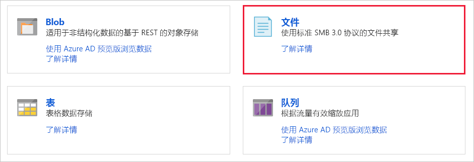

1. 选择“文件共享”。 

    

1. 将新文件共享命名为 *qsfileshare*，在“配额”中输入“1”，然后选择“创建”。   配额最高可为 5 TiB，但本快速入门只需 1 GiB。
1. 在本地计算机上创建名为 *qsTestFile* 的新 txt 文件。
1. 选择新文件共享，然后在文件共享位置选择“上传”。 

    

1. 浏览到创建 .txt 文件的位置，然后依次选择“qsTestFile.txt”、“上传”。  

目前已在 Azure 中创建 Azure 存储帐户和包含一个文件的文件共享。 接下来，请创建 Azure VM，其中的 Windows Server 2016 Datacenter 代表本快速入门中的本地服务器。

### 部署 VM

1. 接下来，请展开 Azure 门户左侧的菜单，然后在左上角选择“创建资源”。 
1. 在 **Azure 市场**资源列表上方的搜索框中，搜索并选择“Windows Server 2016 Datacenter”，然后选择“创建”   。
1. 在“基本信息”选项卡的“项目详细信息”下，选择为本快速入门创建的资源组。  

   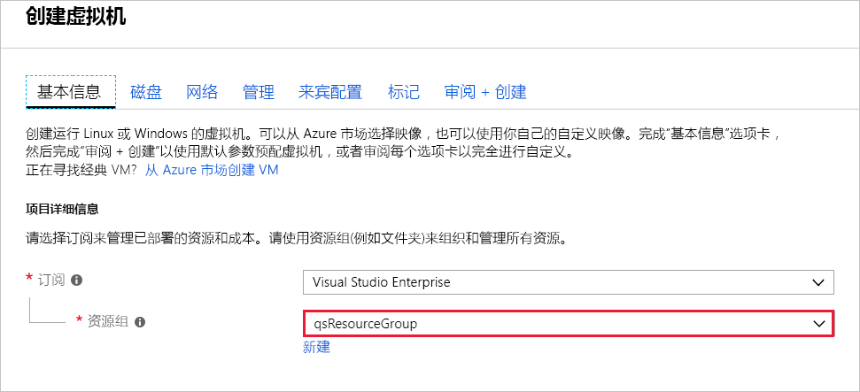

1. 在“实例详细信息”下，将 VM 命名为 *qsVM*。 
1. 保留“区域”、“可用性选项”、“映像”和“大小”的默认设置。    
1. 在“管理员帐户”下，添加 *VMadmin* 作为**用户名**，并输入 VM 的**密码**。 
1. 在“入站端口规则”  下，选择“允许所选端口”  ，然后从下拉列表中选择“RDP (3389)”  和“HTTP”  。
1. 选择“查看 + 创建”  。
1. 选择“创建”  。 创建新的 VM 需要数分钟才能完成。

1. VM 部署完成以后，请选择“转到资源”。 

目前已创建一个新虚拟机并附加一个数据磁盘。 现在需连接到 VM。

### 连接到 VM

1. 选择虚拟机属性页上的“连接”。 

   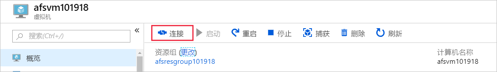

1. 在“连接到虚拟机”页面中，保留默认选项，以使用 IP 地址通过端口号 3389 进行连接，然后选择“下载 RDP 文件”      。
1. 打开下载的 RDP 文件，然后在出现提示时选择“连接”  。
1. 在“Windows 安全性”  窗口中，依次选择“更多选择”  、“使用其他帐户”  。 以 *localhost\username* 格式键入用户名，其中，&lt;username&gt; 是为虚拟机创建的 VM 管理员用户名。 输入针对虚拟机创建的密码，然后选择“确定”。 

   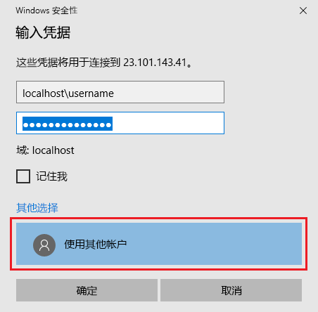

1. 你可能会在登录过程中收到证书警告。 选择“是”或“继续”以创建连接。  

## 将 Azure 文件共享映射到 Windows 驱动器

1. 在 Azure 门户中，导航到“qsfileshare”文件共享并选择“连接”。  
1. 复制第二个框中的内容并将其粘贴到**记事本**中。

   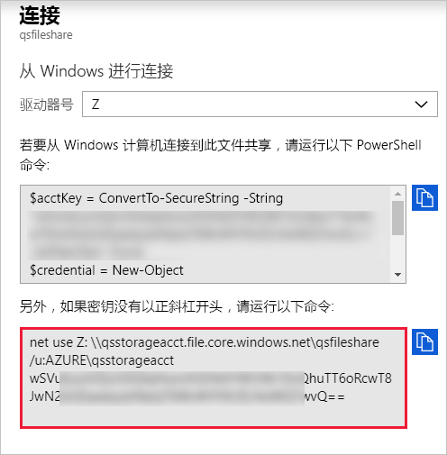

1. 在 VM 中打开“文件资源管理器”，并在窗口中选择“此电脑”。   这会更改功能区中的可用菜单。 在“计算机”菜单中，选择“映射网络驱动器”。  
1. 选择驱动器号并输入 UNC 路径。 如果已按本快速入门中的建议命名，请从**记事本**中将复制 *\\qsstorageacct.file.core.windows.net\qsfileshare*。

   确保选中这两个复选框。

   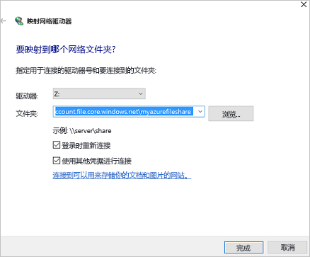

1. 选择“完成”  。
1. 在“Windows 安全性”对话框中： 

   - 从记事本中复制前面带有 AZURE\ 的存储帐户名，并将其作为用户名粘贴到“Windows 安全性”对话框中。  如果已按本快速入门中的建议命名，请复制 *AZURE\qsstorageacct*。
   - 从记事本中复制存储帐户密钥，并将其作为密码粘贴到“Windows 安全性”对话框中。 

      

## 创建共享快照

映射驱动器后，可以创建快照。

1. 在门户中，导航到你的文件共享并选择“创建快照”。 

   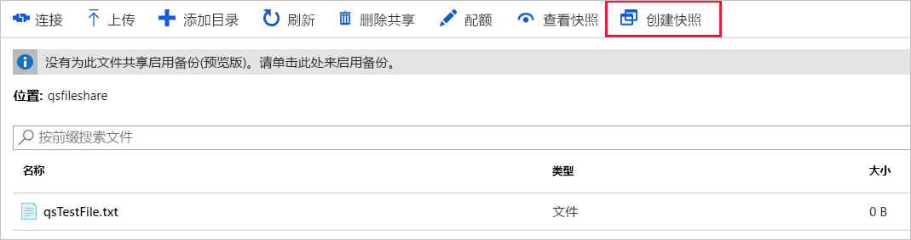

1. 在 VM 中打开“qstestfile.txt”，键入“this file has been modified”，然后保存并关闭该文件。 
1. 创建另一个快照。

## 浏览共享快照

1. 在文件共享中，选择“查看快照”  。
1. 在“文件共享快照”窗格中，选择列表中的第一个快照。 

   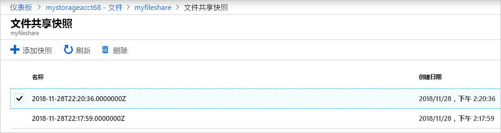

1. 在该快照的窗格中，选择“qsTestFile.txt”。 

## 从快照还原

1. 从文件共享快照边栏选项卡，右键单击 qsTestFile，然后选择“还原”按钮   。
1. 选择“覆盖原始文件”。 

   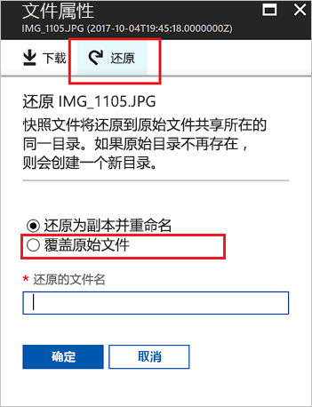

1. 在 VM 中打开该文件。 未修改的版本已还原。

## 删除共享快照

1. 在文件共享中，选择“查看快照”  。
1. 在“文件共享快照”窗格中，选择列表中的最后一个快照并单击“删除”。  

   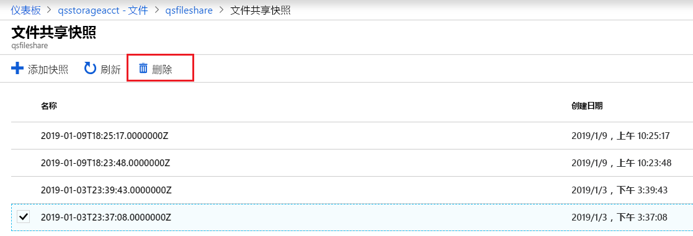

## 在 Windows 中使用共享快照

与使用本地 VSS 快照时一样，可以使用“以前的版本”选项卡通过装载的 Azure 文件共享查看快照。

1. 在文件资源管理器中找到装载的共享。

   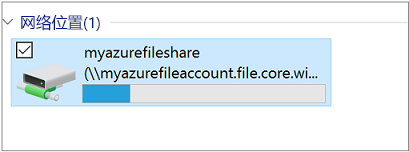

1. 选择“qsTestFile.txt”，然后单击右键并从菜单中选择“属性”。  

   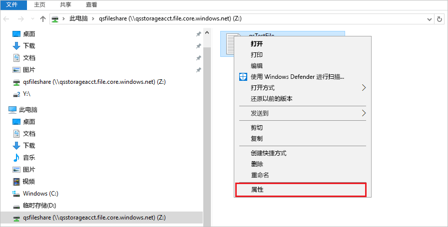

1. 选择"以前版本”  ，以查看此目录的共享快照列表。

1. 选择“打开”以打开该快照。 

   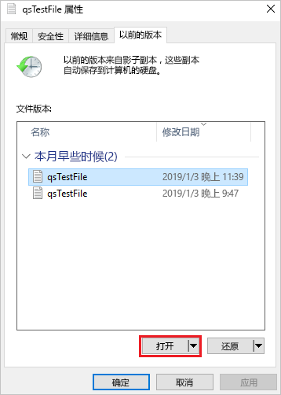

## 从以前版本还原

1. 选择“还原”。  此操作以递归方式将整个目录的内容复制到创建共享快照时所在的原始位置。

   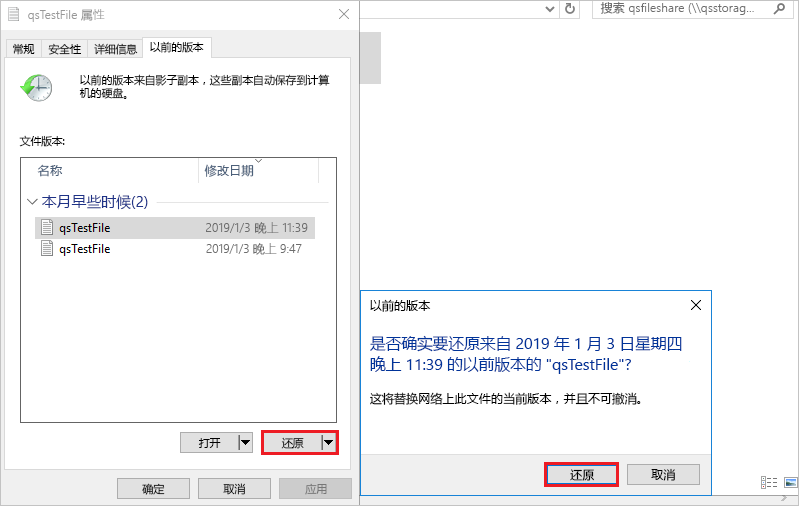 注意：如果文件未更改，则不会看到该文件的之前版本，因为该文件的版本与快照的版本相同。 这与 Windows 文件服务器上的工作原理一致。

## 清理资源

[!INCLUDE [storage-files-clean-up-portal](../../../includes/storage-files-clean-up-portal.md)]

## 后续步骤

> [!div class="nextstepaction"]
> [将 Azure 文件共享与 Windows 配合使用](storage-how-to-use-files-windows.md)
