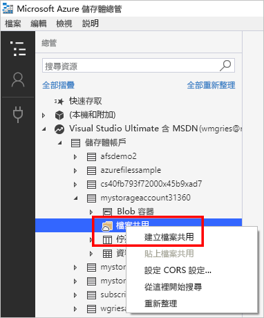

# 快速入门：使用 Azure 存储资源管理器创建和管理 Azure 文件共享
本指南介绍通过 Azure 存储资源管理器来使用 [Azure 文件共享](storage-files-introduction.md)的基本知识。 Azure 文件共享与其他文件共享一样，只不过是存储在云中并由 Azure 平台提供支持。 Azure 文件共享支持行业标准 SMB 协议，可以跨多个计算机、应用程序和实例进行文件共享。 

Azure 存储资源管理器是一个常用的客户端工具，可用于 Windows、macOS 和 Linux。 可以使用存储资源管理器来管理 Azure 文件共享和其他存储资源。

如果没有 Azure 订阅，请在开始之前创建一个[免费帐户](https://azure.microsoft.com/free/?WT.mc_id=A261C142F)。

## 必备条件
本快速入门要求安装存储资源管理器。 若要下载并安装它，请转到 [Azure 存储资源管理器](https://azure.microsoft.com/features/storage-explorer/)。

## 创建存储帐户
无法使用存储资源管理器创建新资源。 对于此演示，请在 [Azure 门户](https://portal.azure.com/)中创建存储帐户。 

[!INCLUDE [storage-files-create-storage-account-portal](../../../includes/storage-files-create-storage-account-portal.md)]

## 将存储资源管理器连接到 Azure 资源
首次启动存储资源管理器时，将会显示“Microsoft Azure 存储资源管理器 - 连接”  窗口。 存储资源管理器提供了多种用来连接到存储帐户的方式： 

- **使用 Azure 帐户登录**：可以通过用于你的组织或 Microsoft 帐户的用户凭据进行登录。 
- **使用连接字符串或 SAS 令牌连接到特定存储帐户**：连接字符串是一个特殊字符串，其中包含存储帐户名称和存储帐户密钥/SAS 令牌。 使用令牌，存储资源管理器可以直接访问存储帐户（而非仅仅看到 Azure 帐户中的所有存储帐户）。 若要详细了解连接字符串，请参阅[配置 Azure 存储连接字符串](../common/storage-configure-connection-string.md?toc=%2fazure%2fstorage%2ffiles%2ftoc.json)。
- **使用存储帐户名称和密钥连接到特定的存储帐户**：使用存储帐户的存储帐户名称和密钥连接到 Azure 存储。

对于本快速入门，请使用 Azure 帐户进行登录。 选择“添加 Azure 帐户”  ，然后选择“登录”  。 根据提示登录到 Azure 帐户。

### 创建文件共享
若要在 `storageacct<random number>` 存储帐户中创建第一个 Azure 文件共享，请执行以下操作：

1. 展开你创建的存储帐户。
2. 右键单击“文件共享”  ，然后选择“创建文件共享”  。  
    

3. 对于文件共享，输入 *myshare*，然后按 Enter。

共享名称只能包含小写字母、数字和单个连字符（但不能以连字符开头）。 有关为文件共享和文件命名的完整详细信息，请参阅 [命名和引用共享、目录、文件和元数据](https://docs.microsoft.com/rest/api/storageservices/Naming-and-Referencing-Shares--Directories--Files--and-Metadata)。

创建文件共享后，会在右窗格中打开文件共享的选项卡。 

## 使用 Azure 文件共享
创建 Azure 文件共享以后，即可使用 SMB 在 [Windows](storage-how-to-use-files-windows.md)、[Linux](storage-how-to-use-files-linux.md) 或 [macOS](storage-how-to-use-files-mac.md) 上装载该文件共享。 另外，也可通过 Azure 存储资源管理器使用 Azure 文件共享。 使用 Azure 存储资源管理器（而不是使用 SMB 来装载文件共享）的优势在于，所有通过 Azure 存储资源管理器发出的请求都是通过文件 REST API 发出的。 可以使用文件 REST API 在没有 SMB 访问权限的客户端上创建、修改和删除文件和目录。

### 创建目录
添加目录就是提供管理文件共享所需的层次结构。 可以在目录中创建多个层次。 但是，在创建子目录之前，必须确保父目录存在。 例如，对于路径 myDirectory/mySubDirectory，必须先创建目录 *myDirectory*。 然后，可以创建 *mySubDirectory*。 

1. 在文件共享对应的选项卡上，在顶部菜单中，选择“新建文件夹”按钮。  此时将打开“创建新目录”窗格。 
    

2. 对于目录名称，输入 *myDirectory*，然后选择“确定”  。 

*myDirectory* 目录将在 *myshare* 文件共享对应的选项卡上列出。

### 上传文件 
可以将文件从本地计算机上传到文件共享中的新目录。 可以上传整个文件夹，也可以上传单个文件。

1. 在顶部菜单中，选择“上传”。  这样就可以选择是上传文件夹还是文件。
2. 选择“上传文件”，然后从本地计算机选择要上传的文件。 
3. 在“上传到目录”  中，输入 *myDirectory*，然后选择“上传”。  

完成后，该文件将显示在“myDirectory”  窗格中的列表中。

### 下载文件
若要从文件共享下载某个文件的副本，请右键单击该文件，然后选择“下载”。  选择要在本地计算机上的哪个位置放置该文件，然后选择“保存”。 

下载进度显示在窗口底部的“活动”窗格中。 

## 清理资源
无法使用存储资源管理器删除资源。 若要清理本快速入门的资源，可以使用 [Azure 门户](https://portal.azure.com/)。 

[!INCLUDE [storage-files-clean-up-portal](../../../includes/storage-files-clean-up-portal.md)]

## 后续步骤

> [!div class="nextstepaction"]
> [什么是 Azure 文件？](storage-files-introduction.md)
