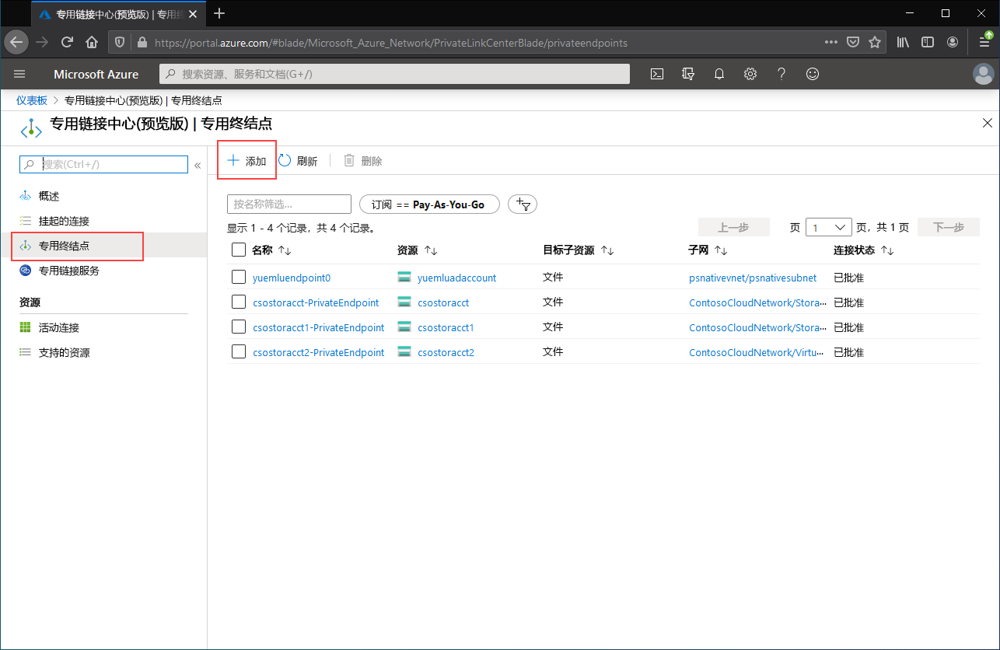

# <a name="configuring-azure-file-sync-network-endpoints"></a>配置 Azure 文件同步网络终结点
Azure 文件存储和 Azure 文件同步提供两种主要类型的终结点用于访问 Azure 文件共享： 
- 公共终结点：使用公共 IP 地址，可从全球任意位置访问。
- 专用终结点：位于某个虚拟网络中，并使用该虚拟网络的地址空间内部的专用 IP 地址。

对于 Azure 文件存储和 Azure 文件同步，Azure 管理对象、存储帐户和存储同步服务各自都同时控制公共和专用终结点。 存储帐户是代表共享存储池的管理结构，你可以在其中部署多个文件共享以及其他存储资源（例如，Blob 容器或队列）。 存储同步服务是代表已注册服务器（与 Azure 文件同步建立了信任关系的 Windows 文件服务器以及定义同步关系拓扑的同步组）的管理结构。 

本文重点介绍如何为 Azure 文件存储和 Azure 文件同步配置网络终结点。若要详细了解如何配置网络终结点以直接访问 Azure 文件共享，而不是通过 Azure 文件同步在本地缓存，请参阅[配置 Azure 文件存储网络终结点](storage-files-networking-endpoints.md)。

在阅读本操作指南之前，我们建议先阅读 [Azure 文件同步的网络注意事项](storage-sync-files-networking-overview.md)。

## <a name="prerequisites"></a>先决条件 
本文假设：
- 你有一个 Azure 订阅。 如果还没有订阅，则请在开始前创建一个[免费帐户](https://azure.microsoft.com/free/?WT.mc_id=A261C142F)。
- 已在要从本地连接到的存储帐户中创建了一个 Azure 文件共享。 若要了解如何创建 Azure 文件共享，请参阅[创建 Azure 文件共享](storage-how-to-create-file-share.md)。
- 已经创建一个存储同步服务并通过它注册了 Windows 文件服务器。 若要了解如何部署 Azure 文件同步，请参阅[部署 Azure 文件同步](storage-sync-files-deployment-guide.md)。

此外：
- 如果你打算使用 Azure PowerShell，请[安装最新版本](https://docs.microsoft.com/powershell/azure/install-az-ps)。
- 如果你打算使用 Azure CLI，请[安装最新版本](https://docs.microsoft.com/cli/azure/install-azure-cli?view=azure-cli-latest)。

## <a name="create-the-private-endpoints"></a>创建专用终结点
为 Azure 资源创建专用终结点时，将部署以下资源：

- **一个专用终结点**：表示存储帐户或存储同步服务的专用终结点的 Azure 资源。 可将此资源视为连接 Azure 资源和网络接口的资源。
- **一个网络接口 (NIC)** ：在指定的虚拟网络/子网中保留专用 IP 地址的网络接口。 此网络接口是部署虚拟机时部署的同一个资源，但它不会分配到 VM，而是由专用终结点拥有。
- **一个专用 DNS 区域**：如果你以前从未为此虚拟网络部署过专用终结点，系统将为虚拟网络部署新的专用 DNS 区域。 此外，将为此 DNS 区域中的 Azure 资源创建 DNS A 记录。 如果已在此虚拟网络中部署了专用终结点，则会将 Azure 资源的新 A 记录添加到现有 DNS 区域。 部署 DNS 区域是可选操作，但强烈建议执行此操以来简化所需的 DNS 管理。

> [!Note]  
> 本文使用 Azure 公共区域的 DNS 后缀，`core.windows.net` 对应存储帐户，`afs.azure.net` 对应存储同步服务。 此段注释也适用于 Azure 主权云（例如 Azure 美国政府云）- 只需根据环境替换相应的后缀即可。

### <a name="create-the-storage-account-private-endpoint"></a>创建存储帐户专用终结点
# <a name="portal"></a>[门户](#tab/azure-portal)
[!INCLUDE [storage-files-networking-endpoints-private-portal](../../../includes/storage-files-networking-endpoints-private-portal.md)]

如果你在虚拟网络中有一个虚拟机，或者已按[配置 Azure 文件存储的 DNS 转发](storage-files-networking-dns.md)所述配置了 DNS 转发，则可以通过在 PowerShell、命令行或终端（适用于 Windows、Linux 或 macOS）中运行以下命令，来测试是否已正确设置专用终结点。 必须将 `<storage-account-name>` 替换为相应的存储帐户名称：

```
nslookup <storage-account-name>.file.core.windows.net
```

如果一切成功进行，则应会看到以下输出，其中 `192.168.0.5` 是虚拟网络中专用终结点的专用 IP 地址（Windows 中显示的输出）：

```Output
Server:  UnKnown
Address:  10.2.4.4

Non-authoritative answer:
Name:    storageaccount.privatelink.file.core.windows.net
Address:  192.168.0.5
Aliases:  storageaccount.file.core.windows.net
```

# <a name="powershell"></a>[PowerShell](#tab/azure-powershell)
[!INCLUDE [storage-files-networking-endpoints-private-powershell](../../../includes/storage-files-networking-endpoints-private-powershell.md)]

如果你在虚拟网络中有一个虚拟机，或者已按[配置 Azure 文件存储的 DNS 转发](storage-files-networking-dns.md)所述配置了 DNS 转发，则可以使用以下命令测试是否已正确设置专用终结点：

```PowerShell
$storageAccountHostName = [System.Uri]::new($storageAccount.PrimaryEndpoints.file) | `
    Select-Object -ExpandProperty Host

Resolve-DnsName -Name $storageAccountHostName
```

如果一切成功进行，则应会看到以下输出，其中 `192.168.0.5` 是虚拟网络中专用终结点的专用 IP 地址：

```Output
Name                             Type   TTL   Section    NameHost
----                             ----   ---   -------    --------
storageaccount.file.core.windows CNAME  60    Answer     storageaccount.privatelink.file.core.windows.net
.net

Name       : storageaccount.privatelink.file.core.windows.net
QueryType  : A
TTL        : 600
Section    : Answer
IP4Address : 192.168.0.5
```

# <a name="azure-cli"></a>[Azure CLI](#tab/azure-cli)
[!INCLUDE [storage-files-networking-endpoints-private-cli](../../../includes/storage-files-networking-endpoints-private-cli.md)]

如果你在虚拟网络中有一个虚拟机，或者已按[配置 Azure 文件存储的 DNS 转发](storage-files-networking-dns.md)所述配置了 DNS 转发，则可以使用以下命令测试是否已正确设置专用终结点：

```bash
httpEndpoint=$(az storage account show \
        --resource-group $storageAccountResourceGroupName \
        --name $storageAccountName \
        --query "primaryEndpoints.file" | \
    tr -d '"')

hostName=$(echo $httpEndpoint | cut -c7-$(expr length $httpEndpoint) | tr -d "/")
nslookup $hostName
```

如果一切成功进行，则应会看到以下输出，其中 `192.168.0.5` 是虚拟网络中专用终结点的专用 IP 地址：

```Output
Server:         127.0.0.53
Address:        127.0.0.53#53

Non-authoritative answer:
storageaccount.file.core.windows.net      canonical name = storageaccount.privatelink.file.core.windows.net.
Name:   storageaccount.privatelink.file.core.windows.net
Address: 192.168.0.5
```

---

### <a name="create-the-storage-sync-private-endpoint"></a>创建存储同步专用终结点
> [!Important]  
> 为了使用存储同步服务资源上的专用终结点，必须使用 Azure 文件同步代理 10.1 或更高版本。 10.1 之前的代理版本不支持存储同步服务上的专用终结点。 所有以前的代理版本都支持存储帐户资源上的专用终结点。

# <a name="portal"></a>[门户](#tab/azure-portal)
通过在 Azure 门户顶部的搜索栏中键入“专用链接”，导航到“专用链接中心”。 在专用链接中心的目录中选择“专用终结点”，然后选择“+ 添加”创建新的专用终结点。 

[](media/storage-sync-files-networking-endpoints/create-storage-sync-private-endpoint-0.png#lightbox)

出现的向导包含多个要完成的页。

在“基本信息”边栏选项卡中，为专用终结点选择所需的资源组、名称和区域。 资源组、名称和区域可以任意配置，不必与存储同步服务匹配，但必须在与想要在其中创建专用终结点的虚拟网络相同的区域中创建专用终结点。


在“资源”边栏选项卡中，选中“连接到目录中的 Azure 资源”对应的单选按钮。  在“资源类型”下，选择“Microsoft.StorageSync/storageSyncServices”为资源类型 。 

在“配置”边栏选项卡中，可以选择要向其添加专用终结点的特定虚拟网络和子网。 选择用于上述存储帐户的同一虚拟网络。 “配置”边栏选项卡还包含用于创建/更新专用 DNS 区域的信息。

单击“查看 + 创建”以创建专用终结点。

可以通过在 PowerShell 中运行以下命令来测试专用终结点是否已正确设置。 

```powershell
$privateEndpointResourceGroupName = "<your-private-endpoint-resource-group>"
$privateEndpointName = "<your-private-endpoint-name>"

Get-AzPrivateEndpoint `
        -ResourceGroupName $privateEndpointResourceGroupName `
        -Name $privateEndpointName `
        -ErrorAction Stop | `
    Select-Object -ExpandProperty NetworkInterfaces | `
    Select-Object -ExpandProperty Id | `
    ForEach-Object { Get-AzNetworkInterface -ResourceId $_ } | `
    Select-Object -ExpandProperty IpConfigurations | `
    Select-Object -ExpandProperty PrivateLinkConnectionProperties | `
    Select-Object -ExpandProperty Fqdns | `
    ForEach-Object { Resolve-DnsName -Name $_ } | `
    Format-List
```

如果一切设置正确，则应看到以下输出，其中 `192.168.1.4`、`192.168.1.5`、`192.168.1.6` 和 `192.168.1.7` 是分配给专用终结点的专用 IP 地址：

```Output
Name     : mysssmanagement.westus2.afs.azure.net
Type     : CNAME
TTL      : 60
Section  : Answer
NameHost : mysssmanagement.westus2.privatelink.afs.azure.net


Name       : mysssmanagement.westus2.privatelink.afs.azure.net
QueryType  : A
TTL        : 60
Section    : Answer
IP4Address : 192.168.1.4

Name     : myssssyncp.westus2.afs.azure.net
Type     : CNAME
TTL      : 60
Section  : Answer
NameHost : myssssyncp.westus2.privatelink.afs.azure.net


Name       : myssssyncp.westus2.privatelink.afs.azure.net
QueryType  : A
TTL        : 60
Section    : Answer
IP4Address : 192.168.1.5

Name     : myssssyncs.westus2.afs.azure.net
Type     : CNAME
TTL      : 60
Section  : Answer
NameHost : myssssyncs.westus2.privatelink.afs.azure.net


Name       : myssssyncs.westus2.privatelink.afs.azure.net
QueryType  : A
TTL        : 60
Section    : Answer
IP4Address : 192.168.1.6

Name     : mysssmonitoring.westus2.afs.azure.net
Type     : CNAME
TTL      : 60
Section  : Answer
NameHost : mysssmonitoring.westus2.privatelink.afs.azure.net


Name       : mysssmonitoring.westus2.privatelink.afs.azure.net
QueryType  : A
TTL        : 60
Section    : Answer
IP4Address : 192.168.1.7

```

# <a name="powershell"></a>[PowerShell](#tab/azure-powershell)
若要为存储同步服务创建专用终结点，首先需要获取对存储同步服务的引用。 请记得将 `<storage-sync-service-resource-group>` 和 `<storage-sync-service>` 替换为你的环境对应的正确值。 以下 PowerShell 命令假设你所使用的终结点是已填充上面的虚拟网络信息。 

```powershell
$storageSyncServiceResourceGroupName = "<storage-sync-service-resource-group>"
$storageSyncServiceName = "<storage-sync-service>"

$storageSyncService = Get-AzStorageSyncService `
        -ResourceGroupName $storageSyncServiceResourceGroupName `
        -Name $storageSyncServiceName `
        -ErrorAction SilentlyContinue

if ($null -eq $storageSyncService) {
    $errorMessage = "Storage Sync Service $storageSyncServiceName not found "
    $errorMessage += "in resource group $storageSyncServiceResourceGroupName."
    Write-Error -Message $errorMessage -ErrorAction Stop
}
```

若要创建专用终结点，必须与存储同步服务建立专用链接服务连接。 专用链接连接是创建专用终结点时使用的输入。

```PowerShell 
# Disable private endpoint network policies
$subnet.PrivateEndpointNetworkPolicies = "Disabled"
$virtualNetwork = $virtualNetwork | `
    Set-AzVirtualNetwork -ErrorAction Stop

# Create a private link service connection to the storage account.
$privateEndpointConnection = New-AzPrivateLinkServiceConnection `
        -Name "$storageSyncServiceName-Connection" `
        -PrivateLinkServiceId $storageSyncService.ResourceId `
        -GroupId "Afs" `
        -ErrorAction Stop

# Create a new private endpoint.
$privateEndpoint = New-AzPrivateEndpoint `
        -ResourceGroupName $storageSyncServiceResourceGroupName `
        -Name "$storageSyncServiceName-PrivateEndpoint" `
        -Location $virtualNetwork.Location `
        -Subnet $subnet `
        -PrivateLinkServiceConnection $privateEndpointConnection `
        -ErrorAction Stop
```

通过创建 Azure 专用 DNS 区域，存储同步服务的主机名（如 `mysssmanagement.westus2.afs.azure.net`）可解析为虚拟网络内的存储同步服务的正确专用 IP。 尽管从创建专用终结点的角度来看，此操作是可选的，但如果 Azure 文件同步代理要访问存储同步服务，则此操作肯定是必需的。 

```powershell
# Get the desired Storage Sync Service suffix (afs.azure.net for public cloud).
# This is done like this so this script will seamlessly work for non-public Azure.
$azureEnvironment = Get-AzContext | `
    Select-Object -ExpandProperty Environment | `
    Select-Object -ExpandProperty Name

switch($azureEnvironment) {
    "AzureCloud" {
        $storageSyncSuffix = "afs.azure.net"
    }

    "AzureUSGovernment" {
        $storageSyncSuffix = "afs.azure.us"
    }
    
    default {
        Write-Error 
                -Message "The Azure environment $_ is not currently supported by Azure File Sync." `
                -ErrorAction Stop
    }
}

# For public cloud, this will generate the following DNS suffix:
# privatelink.afs.azure.net
$dnsZoneName = "privatelink.$storageSyncSuffix"

# Find a DNS zone matching desired name attached to this virtual network.
$dnsZone = Get-AzPrivateDnsZone | `
    Where-Object { $_.Name -eq $dnsZoneName } | `
    Where-Object {
        $privateDnsLink = Get-AzPrivateDnsVirtualNetworkLink `
                -ResourceGroupName $_.ResourceGroupName `
                -ZoneName $_.Name `
                -ErrorAction SilentlyContinue
        
        $privateDnsLink.VirtualNetworkId -eq $virtualNetwork.Id
    }

if ($null -eq $dnsZone) {
    # No matching DNS zone attached to virtual network, so create new one.
    $dnsZone = New-AzPrivateDnsZone `
            -ResourceGroupName $virtualNetworkResourceGroupName `
            -Name $dnsZoneName `
            -ErrorAction Stop

    $privateDnsLink = New-AzPrivateDnsVirtualNetworkLink `
            -ResourceGroupName $virtualNetworkResourceGroupName `
            -ZoneName $dnsZoneName `
            -Name "$virtualNetworkName-DnsLink" `
            -VirtualNetworkId $virtualNetwork.Id `
            -ErrorAction Stop
}
```
获取对专用 DNS 区域的引用后，接下来必须创建存储同步服务的 A 记录。

```PowerShell 
$privateEndpointIpFqdnMappings = $privateEndpoint | `
    Select-Object -ExpandProperty NetworkInterfaces | `
    Select-Object -ExpandProperty Id | `
    ForEach-Object { Get-AzNetworkInterface -ResourceId $_ } | `
    Select-Object -ExpandProperty IpConfigurations | `
    ForEach-Object { 
        $privateIpAddress = $_.PrivateIpAddress; 
        $_ | `
            Select-Object -ExpandProperty PrivateLinkConnectionProperties | `
            Select-Object -ExpandProperty Fqdns | `
            Select-Object `
                @{ 
                    Name = "PrivateIpAddress"; 
                    Expression = { $privateIpAddress } 
                }, `
                @{ 
                    Name = "FQDN"; 
                    Expression = { $_ } 
                } 
    }

foreach($ipFqdn in $privateEndpointIpFqdnMappings) {
    $privateDnsRecordConfig = New-AzPrivateDnsRecordConfig `
        -IPv4Address $ipFqdn.PrivateIpAddress
    
    $dnsEntry = $ipFqdn.FQDN.Substring(0, 
        $ipFqdn.FQDN.IndexOf(".", $ipFqdn.FQDN.IndexOf(".") + 1))

    New-AzPrivateDnsRecordSet `
            -ResourceGroupName $virtualNetworkResourceGroupName `
            -Name $dnsEntry `
            -RecordType A `
            -ZoneName $dnsZoneName `
            -Ttl 600 `
            -PrivateDnsRecords $privateDnsRecordConfig `
            -ErrorAction Stop | `
        Out-Null
}
```

# <a name="azure-cli"></a>[Azure CLI](#tab/azure-cli)
若要为存储同步服务创建专用终结点，首先需要获取对存储同步服务的引用。 请记得将 `<storage-sync-service-resource-group>` 和 `<storage-sync-service>` 替换为你的环境对应的正确值。 以下 CLI 命令假设你使用的是上面已填充的虚拟网络信息。 

```bash
storageSyncServiceResourceGroupName="<storage-sync-service-resource-group>"
storageSyncServiceName="<storage-sync-service>"

storageSyncService=$(az resource show \
        --resource-group $storageSyncServiceResourceGroupName \
        --name $storageSyncServiceName \
        --resource-type "Microsoft.StorageSync/storageSyncServices" \
        --query "id" | \
    tr -d '"')

storageSyncServiceRegion=$(az resource show \
        --resource-group $storageSyncServiceResourceGroupName \
        --name $storageSyncServiceName \
        --resource-type "Microsoft.StorageSync/storageSyncServices" \
        --query "location" | \
    tr -d '"')
```

若要创建专用终结点，首先必须确保子网的专用终结点网络策略设置为“已禁用”。 然后，可以使用 `az network private-endpoint create` 命令创建专用终结点。

```bash
# Disable private endpoint network policies
az network vnet subnet update \
        --ids $subnet \
        --disable-private-endpoint-network-policies \
        --output none

# Get virtual network location
region=$(az network vnet show \
        --ids $virtualNetwork \
        --query "location" | \
    tr -d '"')

# Create a private endpoint
privateEndpoint=$(az network private-endpoint create \
        --resource-group $storageSyncServiceResourceGroupName \
        --name "$storageSyncServiceName-PrivateEndpoint" \
        --location $region \
        --subnet $subnet \
        --private-connection-resource-id $storageSyncService \
        --group-id "Afs" \
        --connection-name "$storageSyncServiceName-Connection" \
        --query "id" | \
    tr -d '"')
```

通过创建 Azure 专用 DNS 区域，存储同步服务的主机名（如 `mysssmanagement.westus2.afs.azure.net`）可解析为虚拟网络内的存储同步服务的正确专用 IP。 尽管从创建专用终结点的角度来看，此操作是可选的，但如果 Azure 文件同步代理要访问存储同步服务，则此操作肯定是必需的。 

```bash
# Get the desired storage account suffix (afs.azure.net for public cloud).
# This is done like this so this script will seamlessly work for non-public Azure.
azureEnvironment=$(az cloud show \
        --query "name" |
    tr -d '"')

storageSyncSuffix=""
if [ $azureEnvironment == "AzureCloud" ]
then
    storageSyncSuffix="afs.azure.net"
elif [ $azureEnvironment == "AzureUSGovernment" ]
then
    storageSyncSuffix="afs.azure.us"
else
    echo "Unsupported Azure environment $azureEnvironment."
fi

# For public cloud, this will generate the following DNS suffix:
# privatelinke.afs.azure.net.
dnsZoneName="privatelink.$storageSyncSuffix"

# Find a DNS zone matching desired name attached to this virtual network.
possibleDnsZones=""
possibleDnsZones=$(az network private-dns zone list \
        --query "[?name == '$dnsZoneName'].id" \
        --output tsv)

dnsZone=""
possibleDnsZone=""
for possibleDnsZone in $possibleDnsZones
do
    possibleResourceGroupName=$(az resource show \
            --ids $possibleDnsZone \
            --query "resourceGroup" | \
        tr -d '"')
    
    link=$(az network private-dns link vnet list \
            --resource-group $possibleResourceGroupName \
            --zone-name $dnsZoneName \
            --query "[?virtualNetwork.id == '$virtualNetwork'].id" \
            --output tsv)
    
    if [ -z $link ]
    then
        echo "1" > /dev/null
    else 
        dnsZoneResourceGroup=$possibleResourceGroupName
        dnsZone=$possibleDnsZone
        break
    fi  
done

if [ -z $dnsZone ]
then
    # No matching DNS zone attached to virtual network, so create a new one
    dnsZone=$(az network private-dns zone create \
            --resource-group $virtualNetworkResourceGroupName \
            --name $dnsZoneName \
            --query "id" | \
        tr -d '"')
    
    az network private-dns link vnet create \
            --resource-group $virtualNetworkResourceGroupName \
            --zone-name $dnsZoneName \
            --name "$virtualNetworkName-DnsLink" \
            --virtual-network $virtualNetwork \
            --registration-enabled false \
            --output none
    
    dnsZoneResourceGroup=$virtualNetworkResourceGroupName
fi
```

获取对专用 DNS 区域的引用后，接下来必须创建存储同步服务的 A 记录。

```bash
privateEndpointNIC=$(az network private-endpoint show \
        --ids $privateEndpoint \
        --query "networkInterfaces[0].id" | \
    tr -d '"')

privateIpAddresses=$(az network nic show \
        --ids $privateEndpointNIC \
        --query "ipConfigurations[].privateIpAddress" \
        --output tsv) 

hostNames=$(az network nic show \
        --ids $privateEndpointNIC \
        --query "ipConfigurations[].privateLinkConnectionProperties.fqdns[]" \
        --output tsv)

i=0
for privateIpAddress in $privateIpAddresses
do
    j=0
    targetHostName=""
    for hostName in $hostNames
    do
        if [ $i == $j ]
        then
            targetHostName=$hostName
            break
        fi

        j=$(expr $j + 1)
    done

    endpointName=$(echo $targetHostName | \
        cut -c1-$(expr $(expr index $targetHostName ".") - 1))

    az network private-dns record-set a create \
        --resource-group $dnsZoneResourceGroup \
        --zone-name $dnsZoneName \
        --name "$endpointName.$storageSyncServiceRegion" \
        --output none
    
    az network private-dns record-set a add-record \
        --resource-group $dnsZoneResourceGroup \
        --zone-name $dnsZoneName \
        --record-set-name "$endpointName.$storageSyncServiceRegion" \
        --ipv4-address $privateIpAddress \
        --output none

    i=$(expr $i + 1)
done
```
---

## <a name="restrict-access-to-the-public-endpoints"></a>限制对公共终结点的访问
可以限制对存储帐户和存储同步服务的公共终结点的访问。 限制对公共终结点的访问可确保仅从批准的位置接受网络数据包，从而提高安全性。 

### <a name="restrict-access-to-the-storage-account-public-endpoint"></a>限制对存储帐户公共终结点的访问
可以使用存储帐户防火墙设置来限制对公共终结点的访问。 通常，大多数针对存储帐户的防火墙策略仅限一个或多个虚拟网络进行网络访问。 可通过两种方法来仅限虚拟网络访问存储帐户：

- [为存储帐户创建一个或多个专用终结点](#create-the-storage-account-private-endpoint)，并禁止对公共终结点的访问。 这可以确保只有源自所需虚拟网络内部的流量才能访问存储帐户中的 Azure 文件共享。
- 仅限一个或多个虚拟网络访问公共终结点。 为此，可以使用称作“服务终结点”的虚拟网络功能。 通过服务终结点限制发往存储帐户的流量时，仍会通过公共 IP 地址访问存储帐户。

#### <a name="disable-access-to-the-storage-account-public-endpoint"></a>禁止对存储帐户公共终结点的访问
禁止对公共终结点的访问时，仍可通过存储帐户的专用终结点来访问该存储帐户。 否则，对存储帐户的公共终结点发出的有效请求将被拒绝。 

# <a name="portal"></a>[门户](#tab/azure-portal)
[!INCLUDE [storage-files-networking-endpoints-public-disable-portal](../../../includes/storage-files-networking-endpoints-public-disable-portal.md)]

# <a name="powershell"></a>[PowerShell](#tab/azure-powershell)
[!INCLUDE [storage-files-networking-endpoints-public-disable-powershell](../../../includes/storage-files-networking-endpoints-public-disable-powershell.md)]

# <a name="azure-cli"></a>[Azure CLI](#tab/azure-cli)
[!INCLUDE [storage-files-networking-endpoints-public-disable-cli](../../../includes/storage-files-networking-endpoints-public-disable-cli.md)]

---

#### <a name="restrict-access-to-the-storage-account-public-endpoint-to-specific-virtual-networks"></a>仅限从特定的虚拟网络访问存储帐户公共终结点
如果仅限从特定的虚拟网络访问存储帐户，则会允许从指定的虚拟网络内部对公共终结点发出请求。 为此，可以使用称作“服务终结点”的虚拟网络功能。 在具有或没有专用终结点的情况下都可以使用此功能。

# <a name="portal"></a>[门户](#tab/azure-portal)
[!INCLUDE [storage-files-networking-endpoints-public-restrict-portal](../../../includes/storage-files-networking-endpoints-public-restrict-portal.md)]

# <a name="powershell"></a>[PowerShell](#tab/azure-powershell)
[!INCLUDE [storage-files-networking-endpoints-public-restrict-powershell](../../../includes/storage-files-networking-endpoints-public-restrict-powershell.md)]

# <a name="azure-cli"></a>[Azure CLI](#tab/azure-cli)
[!INCLUDE [storage-files-networking-endpoints-public-restrict-cli](../../../includes/storage-files-networking-endpoints-public-restrict-cli.md)]

---

### <a name="disable-access-to-the-storage-sync-service-public-endpoint"></a>禁止对存储同步服务公共终结点的访问
Azure 文件同步让你可限制为，仅通过专用终结点访问特定的虚拟网络；Azure 文件同步不支持通过服务终结点限制为从特定的虚拟网络访问公共终结点。 这意味着存储同步服务的公共终结点的两个状态为“已启用”和“已禁用”。

# <a name="portal"></a>[门户](#tab/azure-portal)
这不能通过 Azure 门户来完成。 请选择 Azure PowerShell 或 Azure CLI 选项卡说明，获取有关如何禁用存储同步服务公共终结点的说明。 

# <a name="powershell"></a>[PowerShell](#tab/azure-powershell)
若要禁止对存储同步服务的公共终结点的访问，请将存储同步服务上的 `incomingTrafficPolicy` 属性设置为 `AllowVirtualNetworksOnly`。 若要启用对存储同步服务的公共终结点的访问，请将 `incomingTrafficPolicy` 设置为 `AllowAllTraffic`。 记得替换 `<storage-sync-service-resource-group>` 和 `<storage-sync-service>`。

```powershell
$storageSyncServiceResourceGroupName = "<storage-sync-service-resource-group>"
$storageSyncServiceName = "<storage-sync-service>"

$storageSyncService = Get-AzResource `
        -ResourceGroupName $storageSyncServiceResourceGroupName `
        -ResourceName $storageSyncServiceName `
        -ResourceType "Microsoft.StorageSync/storageSyncServices"

$storageSyncService.Properties.incomingTrafficPolicy = "AllowVirtualNetworksOnly"
$storageSyncService = $storageSyncService | Set-AzResource -Confirm:$false -Force
```

# <a name="azure-cli"></a>[Azure CLI](#tab/azure-cli)
若要禁止对存储同步服务的公共终结点的访问，请将存储同步服务上的 `incomingTrafficPolicy` 属性设置为 `AllowVirtualNetworksOnly`。 若要启用对存储同步服务的公共终结点的访问，请将 `incomingTrafficPolicy` 设置为 `AllowAllTraffic`。 记得替换 `<storage-sync-service-resource-group>` 和 `<storage-sync-service>`。

```bash
storageSyncServiceResourceGroupName="<storage-sync-service-resource-group>"
storageSyncServiceName="<storage-sync-service>"

az resource update \
        --resource-group $storageSyncServiceResourceGroupName \
        --name $storageSyncServiceName \
        --resource-type "Microsoft.StorageSync/storageSyncServices" \
        --set "properties.incomingTrafficPolicy=AllowVirtualNetworksOnly" \
        --output none
```
---

## <a name="see-also"></a>另请参阅
- [规划 Azure 文件同步部署](storage-sync-files-planning.md)
- [部署 Azure 文件同步](storage-sync-files-deployment-guide.md)