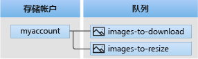

# <a name="quickstart-azure-queue-storage-client-library-v12-for-net"></a>快速入门：适用于 .NET 的 Azure 队列存储客户端库 v12

适用于 .NET 的 Azure 队列存储客户端库 v12 入门。 Azure 队列存储是一项可存储大量消息供以后检索和处理的服务。 请按照以下步骤安装包并试用基本任务的示例代码。

> [!NOTE]
> 若要使用之前的 SDK 版本入门，请参阅[快速入门：使用适用于 .NET 的 Azure 存储 SDK v11 来管理队列](storage-quickstart-queues-dotnet-legacy.md)。

使用适用于 .NET 的 Azure 队列存储客户端库 v12 完成以下操作：

* 创建队列
* 向队列添加消息
* 查看队列中的消息
* 更新队列中的消息
* 从队列接收消息
* 删除队列中的消息
* 删除队列

[API 参考文档](/dotnet/api/azure.storage.queues) | [库源代码](https://github.com/Azure/azure-sdk-for-net/tree/master/sdk/storage/Azure.Storage.Queues) | [包 (NuGet)](https://www.nuget.org/packages/Azure.Storage.Queues/12.0.0) | [示例](https://github.com/Azure/azure-sdk-for-net/tree/master/sdk/storage/Azure.Storage.Queues/samples)

## <a name="prerequisites"></a>必备条件

* Azure 订阅 - [创建免费帐户](https://azure.microsoft.com/free/)
* Azure 存储帐户 - [创建存储帐户](https://docs.microsoft.com/azure/storage/common/storage-quickstart-create-account)
* 适用于操作系统的最新 [NET Core SDK](https://dotnet.microsoft.com/download/dotnet-core)。 确保获取 SDK，而不是运行时。

## <a name="setting-up"></a>设置

本部分逐步指导如何准备一个项目，使其与适用于 .NET 的 Azure 队列存储客户端库 v12 配合使用。

### <a name="create-the-project"></a>创建项目

创建名为 QueuesQuickstartV12 的 .NET Core 应用程序  。

1. 在控制台窗口（例如 cmd、PowerShell 或 Bash）中，使用 `dotnet new` 命令创建名为 QueuesQuickstartV12 的新控制台应用  。 此命令将创建包含单个源文件的简单“Hello World”C# 项目：*Program.cs*。

   ```console
   dotnet new console -n QueuesQuickstartV12
   ```

1. 切换到新创建的 QueuesQuickstartV12 目录  。

   ```console
   cd QueuesQuickstartV12
   ```

### <a name="install-the-package"></a>安装包

仍在应用程序目录中时，使用 `dotnet add package` 命令安装适用于 .NET 包的 Azure 队列存储客户端库。

```console
dotnet add package Azure.Storage.Queues
```

### <a name="set-up-the-app-framework"></a>设置应用框架

从项目目录中执行以下操作：

1. 在编辑器中打开 Program.cs  文件
1. 删除 `Console.WriteLine("Hello World!");` 语句
1. 添加 `using` 指令
1. 更新 `Main` 方法声明以[支持异步代码](https://docs.microsoft.com/dotnet/csharp/whats-new/csharp-7-1#async-main)


代码如下：

```csharp
using Azure;
using Azure.Storage.Queues;
using Azure.Storage.Queues.Models;
using System;
using System.Threading.Tasks;

namespace QueuesQuickstartV12
{
    class Program
    {
        static async Task Main(string[] args)
        {
        }
    }
}
```

[!INCLUDE [storage-quickstart-credentials-include](../../../includes/storage-quickstart-credentials-include.md)]

## <a name="object-model"></a>对象模型

Azure 队列存储是一个可存储大量消息的服务。 队列消息大小最大可为 64 KB。 一个队列可以包含数百万条消息，直至达到存储帐户的总容量限值。 队列通常用于创建要异步处理的积压工作 (backlog)。 队列存储提供了三种类型的资源：

* 存储帐户
* 存储帐户中的队列
* 队列中的消息

以下图示显示了这些资源之间的关系。



使用以下 .NET 类与这些资源进行交互：

* [QueueServiceClient](/dotnet/api/azure.storage.queues.queueserviceclient)：可以通过 `QueueServiceClient` 管理存储帐户中的所有队列。
* [QueueClient](/dotnet/api/azure.storage.queues.queueclient)：可以通过 `QueueClient` 类管理和操作单个队列及其消息。
* [QueueMessage](/dotnet/api/azure.storage.queues.models.queuemessage)：`QueueMessage` 类表示在队列上调用 [ReceiveMessages](/dotnet/api/azure.storage.queues.queueclient.receivemessages) 时返回的单个对象。

## <a name="code-examples"></a>代码示例

这些示例代码片段演示如何使用适用于 .NET 的 Azure 队列存储客户端库执行以下操作：

* [获取连接字符串](#get-the-connection-string)
* [创建队列](#create-a-queue)
* [向队列添加消息](#add-messages-to-a-queue)
* [查看队列中的消息](#peek-at-messages-in-a-queue)
* [更新队列中的消息](#update-a-message-in-a-queue)
* [从队列接收消息](#receive-messages-from-a-queue)
* [删除队列中的消息](#delete-messages-from-a-queue)
* [删除队列](#delete-a-queue)

### <a name="get-the-connection-string"></a>获取连接字符串

以下代码检索存储帐户的连接字符串。 连接字符串存储在[配置存储连接字符串](#configure-your-storage-connection-string)部分创建的环境变量中。

在 `Main` 方法内添加此代码：

```csharp
Console.WriteLine("Azure Queue storage v12 - .NET quickstart sample\n");

// Retrieve the connection string for use with the application. The storage
// connection string is stored in an environment variable called
// AZURE_STORAGE_CONNECTION_STRING on the machine running the application.
// If the environment variable is created after the application is launched
// in a console or with Visual Studio, the shell or application needs to be
// closed and reloaded to take the environment variable into account.
string connectionString = Environment.GetEnvironmentVariable("AZURE_STORAGE_CONNECTION_STRING");
```

### <a name="create-a-queue"></a>创建队列

确定新队列的名称。 以下代码将 GUID 值追加到队列名称，确保其独一无二。

> [!IMPORTANT]
> 队列名称只能包含小写字母、数字和连字符，且必须以字母或数字开头。 每个连字符的前后必须为非连字符字符。 名称的长度还必须介于 3 到 63 个字符之间。 若要详细了解如何命名队列，请参阅[命名队列和元数据](/rest/api/storageservices/naming-queues-and-metadata)。


创建 [QueueClient](/dotnet/api/azure.storage.queues.queueclient) 类的实例。 然后，调用 [CreateAsync](/dotnet/api/azure.storage.queues.queueclient.createasync) 方法在存储帐户中创建队列。

将此代码添加到 `Main` 方法的末尾：

```csharp
// Create a unique name for the queue
string queueName = "quickstartqueues-" + Guid.NewGuid().ToString();

Console.WriteLine($"Creating queue: {queueName}");

// Instantiate a QueueClient which will be
// used to create and manipulate the queue
QueueClient queueClient = new QueueClient(connectionString, queueName);

// Create the queue
await queueClient.CreateAsync();
```

### <a name="add-messages-to-a-queue"></a>向队列添加消息

以下代码片段通过调用 [SendMessageAsync](/dotnet/api/azure.storage.queues.queueclient.sendmessageasync) 方法，以异步方式将消息添加到队列。 它还保存从 `SendMessageAsync` 调用返回的 [SendReceipt](/dotnet/api/azure.storage.queues.models.sendreceipt)。 收据用于在稍后的程序中更新消息。

将此代码添加到 `Main` 方法的末尾：

```csharp
Console.WriteLine("\nAdding messages to the queue...");

// Send several messages to the queue
await queueClient.SendMessageAsync("First message");
await queueClient.SendMessageAsync("Second message");

// Save the receipt so we can update this message later
SendReceipt receipt = await queueClient.SendMessageAsync("Third message");
```

### <a name="peek-at-messages-in-a-queue"></a>查看队列中的消息

通过调用 [PeekMessagesAsync](/dotnet/api/azure.storage.queues.queueclient.peekmessagesasync) 方法，查看队列中的消息。 `PeekMessagesAsync` 方法从队列前面检索一条或多条消息，但不更改消息的可见性。

将此代码添加到 `Main` 方法的末尾：

```csharp
Console.WriteLine("\nPeek at the messages in the queue...");

// Peek at messages in the queue
PeekedMessage[] peekedMessages = await queueClient.PeekMessagesAsync(maxMessages: 10);

foreach (PeekedMessage peekedMessage in peekedMessages)
{
    // Display the message
    Console.WriteLine($"Message: {peekedMessage.MessageText}");
}
```

### <a name="update-a-message-in-a-queue"></a>更新队列中的消息

通过调用 [UpdateMessageAsync](/dotnet/api/azure.storage.queues.queueclient.updatemessageasync) 方法来更新消息的内容。 `UpdateMessageAsync` 方法可以更改消息的可见性超时和内容。 消息内容必须是最大为 64 KB 的 UTF-8 编码的字符串。 除了该消息的新内容，还会传入代码中之前保存的 `SendReceipt` 中的值。 `SendReceipt` 值标识要更新的消息。

```csharp
Console.WriteLine("\nUpdating the third message in the queue...");

// Update a message using the saved receipt from sending the message
await queueClient.UpdateMessageAsync(receipt.MessageId, receipt.PopReceipt, "Third message has been updated");
```

### <a name="receive-messages-from-a-queue"></a>从队列接收消息

通过调用 [ReceiveMessagesAsync](/dotnet/api/azure.storage.queues.queueclient.receivemessagesasync) 方法，下载以前添加的消息。

将此代码添加到 `Main` 方法的末尾：

```csharp
Console.WriteLine("\nReceiving messages from the queue...");

// Get messages from the queue
QueueMessage[] messages = await queueClient.ReceiveMessagesAsync(maxMessages: 10);
```

### <a name="delete-messages-from-a-queue"></a>删除队列中的消息

在处理完消息后，将消息从队列中删除。 在这种情况下，处理只是在控制台上显示消息。

在处理和删除消息之前，应用会调用 `Console.ReadLine` 以暂停并等待用户输入。 在 [Azure 门户](https://portal.azure.com)中验证是否已正确创建资源，然后再删除它们。 未显式删除的任何消息最终都会在队列中再次变为可见，给用户另一个处理它们的机会。

将此代码添加到 `Main` 方法的末尾：

```csharp
Console.WriteLine("\nPress Enter key to 'process' messages and delete them from the queue...");
Console.ReadLine();

// Process and delete messages from the queue
foreach (QueueMessage message in messages)
{
    // "Process" the message
    Console.WriteLine($"Message: {message.MessageText}");

    // Let the service know we're finished with
    // the message and it can be safely deleted.
    await queueClient.DeleteMessageAsync(message.MessageId, message.PopReceipt);
}
```

### <a name="delete-a-queue"></a>删除队列

以下代码使用 [DeleteAsync](/dotnet/api/azure.storage.queues.queueclient.deleteasync) 方法来删除队列，以便清除该应用所创建的资源。

将此代码添加到 `Main` 方法的末尾：

```csharp
Console.WriteLine("\nPress Enter key to delete the queue...");
Console.ReadLine();

// Clean up
Console.WriteLine($"Deleting queue: {queueClient.Name}");
await queueClient.DeleteAsync();

Console.WriteLine("Done");
```

## <a name="run-the-code"></a>运行代码

此应用创建三条消息并将其添加到 Azure 队列。 此代码列出队列中的消息，并在最终删除队列之前检索并删除这些消息。

在控制台窗口中，导航到应用程序目录，然后生成并运行应用程序。

```console
dotnet build
```

```console
dotnet run
```

应用的输出类似于以下示例：

```output
Azure Queue storage v12 - .NET quickstart sample

Creating queue: quickstartqueues-5c72da2c-30cc-4f09-b05c-a95d9da52af2

Adding messages to the queue...

Peek at the messages in the queue...
Message: First message
Message: Second message
Message: Third message

Updating the third message in the queue...

Receiving messages from the queue...

Press Enter key to 'process' messages and delete them from the queue...

Message: First message
Message: Second message
Message: Third message has been updated

Press Enter key to delete the queue...

Deleting queue: quickstartqueues-5c72da2c-30cc-4f09-b05c-a95d9da52af2
Done
```

当应用在接收消息之前暂停时，请在 [Azure 门户](https://portal.azure.com)中检查存储帐户。 验证消息是否在队列中。

按 **Enter** 键接收和删除消息。 出现提示时，请再次按 **Enter** 键，以删除队列并完成演示。

## <a name="next-steps"></a>后续步骤

在本快速入门中，你学习了如何使用异步 .NET 代码创建队列并向其添加消息。 然后，你学习了如何扫视、检索和删除消息。 最后，你学习了如何删除消息队列。

有关教程、示例、快速入门和其他文档，请访问：

> [!div class="nextstepaction"]
> [面向 .NET 和 .NET Core 开发人员的 Azure](https://docs.microsoft.com/dotnet/azure/)

* 若要了解详细信息，请参阅[适用于 .NET 的 Azure 存储库](https://github.com/Azure/azure-sdk-for-net/tree/master/sdk/storage)。
* 若要查看更多 Azure 队列存储示例应用，请继续学习 [Azure 队列存储 v12 .NET 客户端库示例](https://github.com/Azure/azure-sdk-for-net/tree/master/sdk/storage/Azure.Storage.Queues/samples)。
* 若要详细了解 .NET Core，请参阅 [Get started with .NET in 10 minutes](https://www.microsoft.com/net/learn/get-started/)（.NET 10 分钟入门）。
