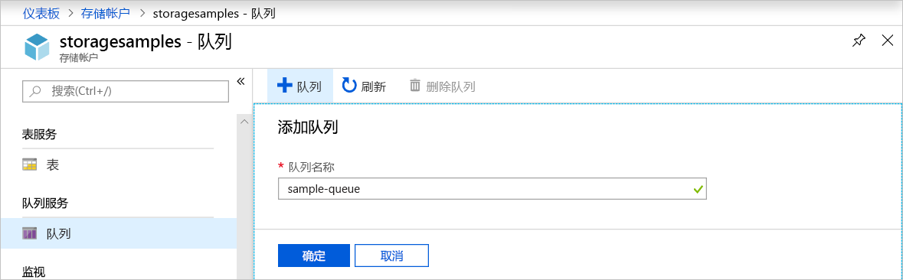
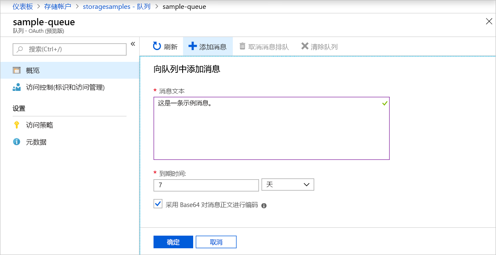
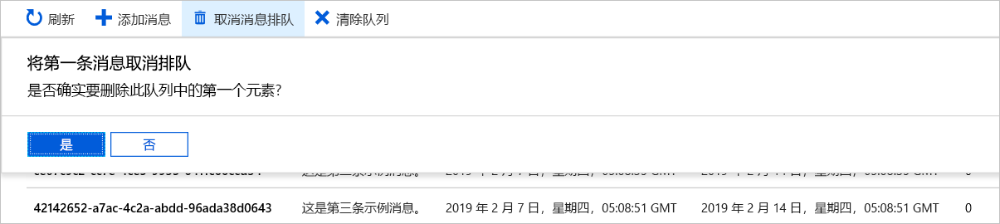

# 快速入门：使用 Azure 门户创建队列并添加消息

本快速入门介绍如何使用 [Azure 门户](https://portal.azure.com/)在 Azure 存储中创建队列、添加消息和取消消息的排队。

## 先决条件

[!INCLUDE [storage-quickstart-prereq-include](../../../includes/storage-quickstart-prereq-include.md)]

## 创建队列

若要在 Azure 门户中创建队列，请执行以下步骤：

1. 导航到 Azure 门户中的新存储帐户。
2. 在存储帐户的左侧菜单中滚动到“队列服务”部分，然后选择“队列”。  
3. 选择“+ 队列”按钮。 
4. 键入新队列的名称。 队列名称必须小写，必须以字母或数字开头，并且只能包含字母、数字和短划线 (-) 字符。
6. 选择“确定”以创建队列。 

    

## 添加消息

接下来，将消息添加到新队列。 消息的大小最大可为 64 KB。

1. 从存储帐户中的队列列表内选择新队列。
1. 选择“+ 添加消息”按钮以将消息添加到队列。  在“消息文本”字段中输入消息。  
1. 指定消息何时过期。 消息可以保留在队列中的最长时间为 7 天。
1. 指示是否要将消息编码为 Base64。 建议对二进制数据编码。
1. 选择“确定”按钮添加该消息。 

    

## 查看消息属性

添加消息后，Azure 门户会显示队列中所有消息的列表。 可以查看消息 ID、消息内容、消息插入时间和消息过期时间。 此外，可以查看此消息的取消排队次数。

## 取消消息排队

可以在 Azure 门户中，将队列前部的消息取消排队。 将消息取消排队时，会删除该消息。 

取消排队始终会删除队列中最早的消息。 

## 后续步骤

本快速入门介绍了如何在 Azure 门户中创建队列、添加消息、查看消息属性和取消消息排队。

> [!div class="nextstepaction"]
> [什么是 Azure 队列？](storage-queues-introduction.md)
