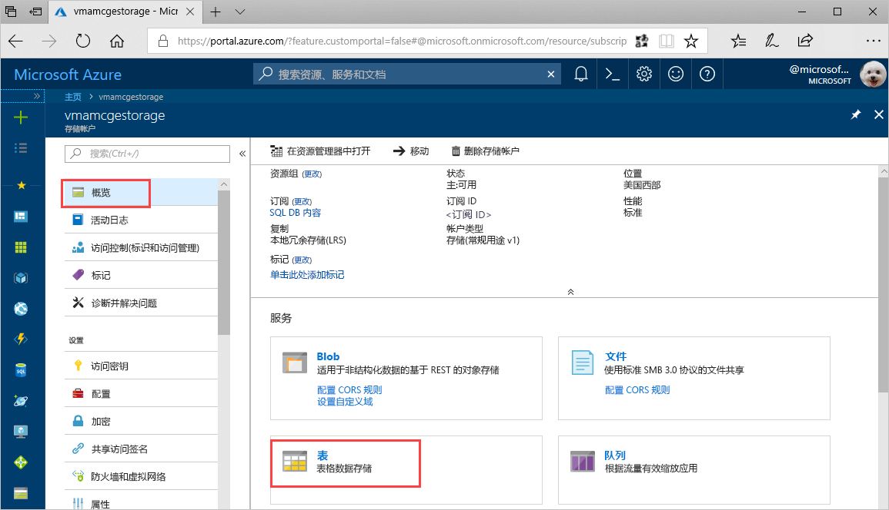
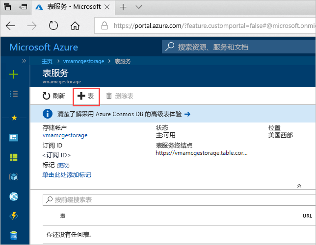
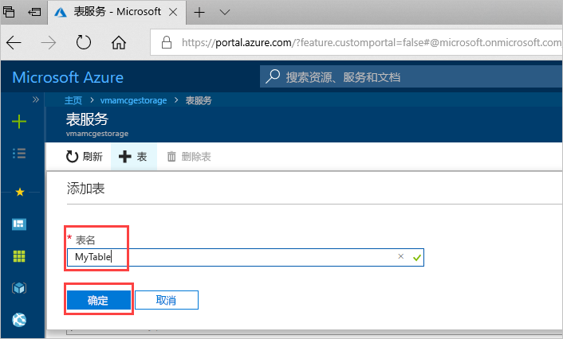

# 快速入门：在 Azure 门户中创建 Azure 存储表 

本快速入门演示如何在基于 Web 的 Azure 门户中创建表和实体。 本快速入门还演示如何创建 Azure 存储帐户。

[!INCLUDE [quickstarts-free-trial-note](../../../includes/quickstarts-free-trial-note.md)]

## 先决条件

若要完成此快速入门，请首先在 [Azure 门户](https://portal.azure.com/#create/Microsoft.StorageAccount-ARM)中创建 Azure 存储帐户。 有关如何创建帐户的帮助，请参阅[创建存储帐户](../common/storage-quickstart-create-account.md)。

## 添加表

现在可以在 Azure 门户中使用表服务来创建表。

1. 单击“概述”>“表”。

   

2. 单击“+ 表”。

   

3. 在“表名”框中键入表名，然后单击“确定”。 

   

## 后续步骤

- [表设计准则](table-storage-design-guidelines.md)