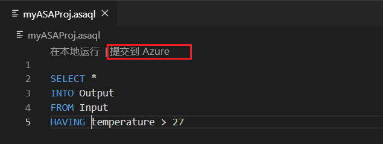

# 复制或备份 Azure 流分析作业

可以使用 Visual Studio Code 或 Visual Studio 来复制或备份已部署的 Azure 流分析作业。 

## 开始之前
* 如果还没有 Azure 订阅，可以创建一个[免费帐户](https://azure.microsoft.com/free/)。

* 登录 [Azure 门户](https://portal.azure.com/)。

* 安装适用于[Visual Studio Visual Studio Code 或 Azure 流分析工具](quick-create-vs-code.md#install-the-azure-stream-analytics-tools-extension)的[azure 流分析扩展](quick-create-vs-code.md#install-the-azure-stream-analytics-tools-extension)。  

## Visual Studio Code

1. 单击 "Visual Studio Code" 活动栏中的 " **Azure** " 图标，然后展开 "**流分析**" 节点。 你的作业应显示在你的订阅下。

   

2. 若要将作业导出到本地项目，请在 Visual Studio Code 中找到要导出的**流分析资源管理器**中的作业。 然后为项目选择一个文件夹。

    

    项目会导出到所选文件夹并添加到当前工作区。

    

3. 若要使用其他名称将作业发布到另一个区域或备份，请选择 "**从订阅中选择" 以**在查询编辑器中发布（\*script.asaql），然后按照说明进行操作。

    

## Visual Studio

1. 按照将[部署的 Azure 流分析作业导出到项目说明](https://docs.microsoft.com/azure/stream-analytics/stream-analytics-vs-tools#export-jobs-to-a-project)。

2. 在查询编辑器中打开 "script.asaql \*" 文件，选择 "脚本编辑器" 中的 "**提交到 Azure** "，并按照说明使用新名称将作业发布到另一个区域或备份。

## 后续步骤

* [快速入门：使用 Visual Studio Code 创建流分析作业](quick-create-vs-code.md)
* [快速入门：使用 Visual Studio 创建流分析作业](stream-analytics-quick-create-vs.md)
* [使用 Azure 管道通过 CI/CD 部署 Azure 流分析作业](stream-analytics-tools-visual-studio-cicd-vsts.md)
