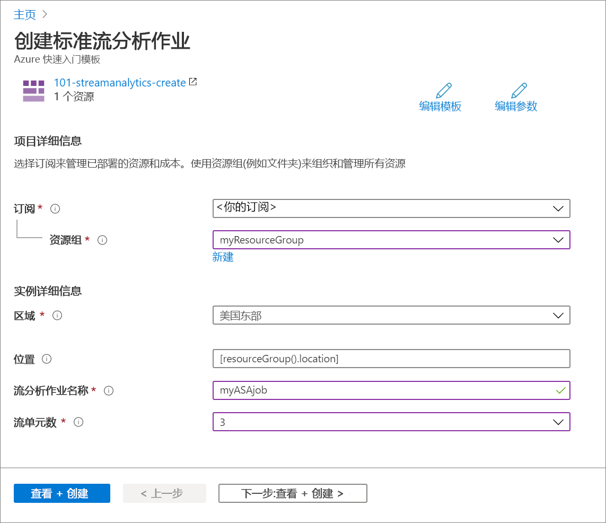

# <a name="quickstart-create-an-azure-stream-analytics-job-by-using-an-arm-template"></a>快速入门：使用 ARM 模板创建 Azure 流分析作业

本快速入门将使用 Azure 资源管理器模板（ARM 模板）创建 Azure 流分析作业。 创建作业后，将验证部署。

[!INCLUDE [About Azure Resource Manager](../../includes/resource-manager-quickstart-introduction.md)]

如果你的环境满足先决条件，并且你熟悉如何使用 ARM 模板，请选择“部署到 Azure”按钮。 Azure 门户中会打开模板。

[](https://portal.azure.com/#create/Microsoft.Template/uri/https%3A%2F%2Fraw.githubusercontent.com%2FAzure%2Fazure-quickstart-templates%2Fmaster%2F101-streamanalytics-create%2Fazuredeploy.json)

## <a name="prerequisites"></a>先决条件

若要完成本文，需要做好以下准备：

* 拥有 Azure 订阅 - [免费创建订阅](https://azure.microsoft.com/free/)。

## <a name="review-the-template"></a>查看模板

本快速入门中使用的模板来自 [Azure 快速启动模板](https://azure.microsoft.com/resources/templates/101-streamanalytics-create/)。

:::code language="json" source="~/quickstart-templates/101-streamanalytics-create/azuredeploy.json" range="1-66" highlight="41-60":::

模板中定义的 Azure 资源是 [Microsoft.StreamAnalytics/StreamingJobs](/azure/templates/microsoft.streamanalytics/streamingjobs)：创建 Azure 流分析作业。

## <a name="deploy-the-template"></a>部署模板

本部分介绍如何使用 ARM 模板创建 Azure 流分析作业。

1. 选择下图登录到 Azure 并打开一个模板。 该模板会创建 Azure 流分析作业。

   [](https://portal.azure.com/#create/Microsoft.Template/uri/https%3A%2F%2Fraw.githubusercontent.com%2FAzure%2Fazure-quickstart-templates%2Fmaster%2F101-streamanalytics-create%2Fazuredeploy.json)

2. 提供所需的值以创建 Azure 流分析作业。

   

   提供以下值：

   |properties  |说明  |
   |---------|---------|
   |**订阅**     | 从下拉列表中选择自己的 Azure 订阅。        |
   |**资源组**     | 指定是要创建新的资源组还是使用现有的资源组。 资源组是用于保存 Azure 解决方案相关资源的容器。 有关详细信息，请参阅 [Azure 资源组概述](../azure-resource-manager/management/overview.md)。 |
   |**区域**     | 选择“美国东部”。 有关其他可用区域，请参阅[各区域推出的 Azure 服务](https://azure.microsoft.com/regions/services/)。        |
   |流分析作业名称     | 提供流分析作业的名称。      |
   |**流单元数**     |  选择所需的流单元数。 有关详细信息，请参阅[了解和调整流单元](stream-analytics-streaming-unit-consumption.md)。       |

3. 选择“查看 + 创建”，然后选择“创建” 。

## <a name="review-deployed-resources"></a>查看已部署的资源

可以使用 Azure 门户检查 Azure 流分析作业，或者使用以下 Azure CLI 或 Azure PowerShell 脚本来列出资源。

### <a name="azure-cli"></a>Azure CLI

```azurecli-interactive
echo "Enter your Azure Stream Analytics job name:" &&
read streamAnalyticsJobName &&
echo "Enter the resource group where the Azure Stream Analytics job exists:" &&
read resourcegroupName &&
az stream-analytics job show -g $resourcegroupName -n $streamAnalyticsJobName
```

### <a name="azure-powershell"></a>Azure PowerShell

```azurepowershell-interactive
$resourceGroupName = Read-Host -Prompt "Enter the resource group name where your Azure Stream Analytics job exists"
(Get-AzResource -ResourceType "Microsoft.StreamAnalytics/StreamingJobs" -ResourceGroupName $resourceGroupName).Name
 Write-Host "Press [ENTER] to continue..."
```

## <a name="clean-up-resources"></a>清理资源

如果打算继续学习后续教程，可能需要保留这些资源。 如果不再需要资源组，可以将其删除，这会删除 Azure 流分析作业。 使用 Azure CLI 或 Azure PowerShell 删除资源组：

### <a name="azure-cli"></a>Azure CLI

```azurecli-interactive
echo "Enter the Resource Group name:" &&
read resourceGroupName &&
az group delete --name $resourceGroupName &&
echo "Press [ENTER] to continue ..."
```

### <a name="azure-powershell"></a>Azure PowerShell

```azurepowershell-interactive
$resourceGroupName = Read-Host -Prompt "Enter the Resource Group name"
Remove-AzResourceGroup -Name $resourceGroupName
Write-Host "Press [ENTER] to continue..."
```

## <a name="next-steps"></a>后续步骤

在本快速入门中，你已使用 ARM 模板创建了 Azure 流分析作业，并验证了部署。 要了解如何使用 VS Code 导出现有作业的 ARM 模板，请继续阅读下一篇文章。

> [!div class="nextstepaction"]
> [导出 Azure 流分析作业 ARM 模板](resource-manager-export.md)
