<properties
	pageTitle="开始使用 Azure 流分析处理来自 IoT 设备的数据 | 流分析"
	description="带流分析和实时数据处理的 IoT 传感器标记和数据流"
    keywords="iot 解决方案, iot 入门"
	services="stream-analytics"
	documentationCenter=""
	authors="jeffstokes72"
	manager="jhubbard"
	editor="cgronlun"
/>

<tags 
	ms.service="stream-analytics" 
	ms.devlang="na" 
	ms.topic="hero-article" 
	ms.tgt_pltfrm="na" 
	ms.workload="data-services" 
	ms.date="08/11/2016"
	ms.author="jeffstok"
/>

# 开始使用 Azure 流分析处理来自 IoT 设备的数据

在本教程中，你将学习创建流处理逻辑，以从物联网 (IoT) 设备收集数据。我们将使用真实的物联网 (IoT) 用例来演示如何经济实惠地快速创建解决方案。

## 先决条件

-   [Azure 订阅](https://azure.microsoft.com/pricing/free-trial/)
-   可从 [GitHub](https://aka.ms/azure-stream-analytics-get-started-iot) 下载示例查询和数据文件

## 方案

Contoso 是工业自动化领域的一家公司，该公司已经完全自动化其制造流程。这家工厂中的设备配有可实时发送数据流的传感器。在此方案中，产品车间经理希望通过传感器数据获得实时见解，从而找到规律并采取措施。我们将对传感器数据使用流分析查询语言 (SAQL)，查找传入数据流的有趣规律。

下图中，Texas Instrument Sensor Tag 设备正在生成数据。

数据的负载是 JSON 格式，如下所示：

    
	{
    	"time": "2016-01-26T20:47:53.0000000",  
	    "dspl": "sensorE",  
    	"temp": 123,  
	    "hmdt": 34  
	}  
    
在实际情况下，其中可能有数百个传感器以流的形式生成事件。理想情况下，会有一个运行某些代码的网关设备将这些事件推送到 [Azure 事件中心](https://azure.microsoft.com/services/event-hubs/)或 [Azure IoT 中心](https://azure.microsoft.com/services/iot-hub/)。流分析作业将从事件中心引入这些事件，并针对流运行实时分析查询。然后，可以将结果发送到[支持的输出](stream-analytics-define-outputs.md)之一。

为方便使用，在本入门指南中，我们提供了示例数据文件，此文件从真实的 SensorTag 设备上捕获，可针对其运行不同的查询并查看结果。在后续教程中，你将学习如何将你的作业连接到输入和输出并将其部署到 Azure 服务。

## 创建流分析作业

在 [Azure 门户](http://manage.windowsazure.com)中选择“流分析”，然后单击页左下角的“新建”来创建新的分析作业。

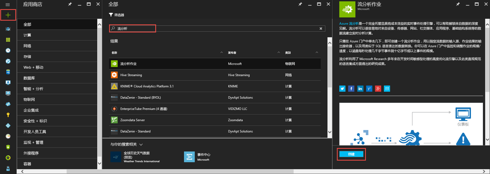

单击“快速创建”。

对于“区域监视存储帐户”设置，请选择“创建新存储帐户”，并为它指定任何唯一名称。Azure 流分析将使用此帐户来存储将来所有作业的监视信息。

> [AZURE.NOTE] 应按照区域一次性创建此存储帐户，此存储将跨创建在该区域中的所有流分析作业进行共享。

单击页面底部的“创建流分析作业”。

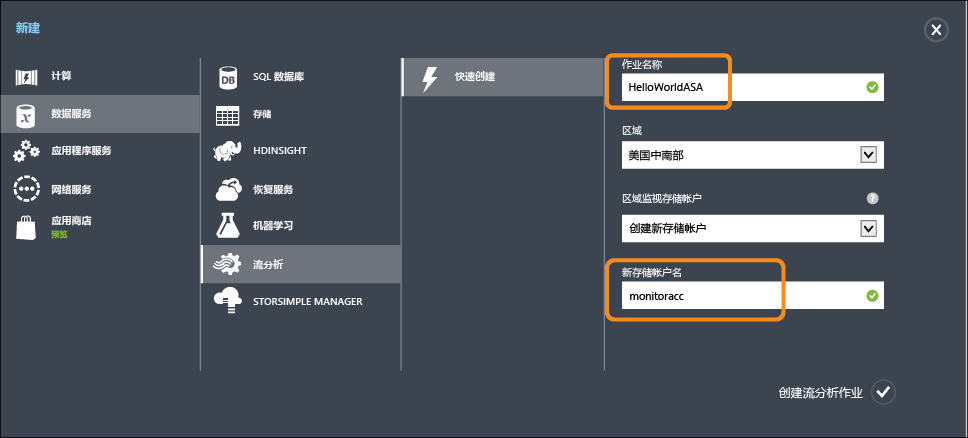

## Azure 流分析查询

单击“查询”选项卡，转到查询编辑器。“查询”选项卡包含针对传入事件数据进行转换的 T-SQL 查询。

## 将原始数据存档

查询的最简单形式是传递，这会将所有输入数据存档到其指定的输出。

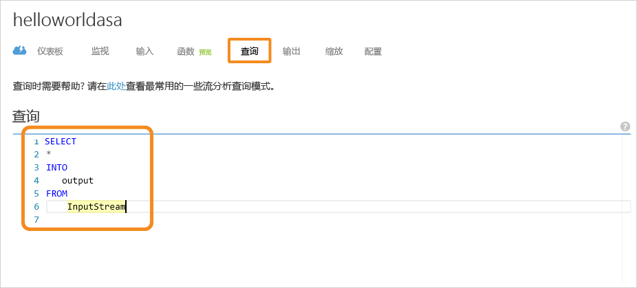

现在，将示例数据文件从 [GitHub](https://aka.ms/azure-stream-analytics-get-started-iot) 下载到计算机中的一个位置。从 **PassThrough.txt** 文件复制和粘贴查询。单击下方的“测试”按钮，从下载位置选择名为 **HelloWorldASA-InputStream.json** 的数据文件。

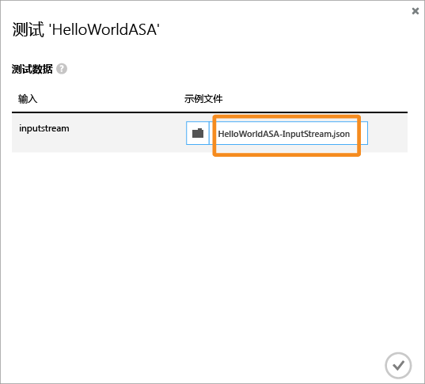  

可在浏览器中查看查询结果，如下所示。

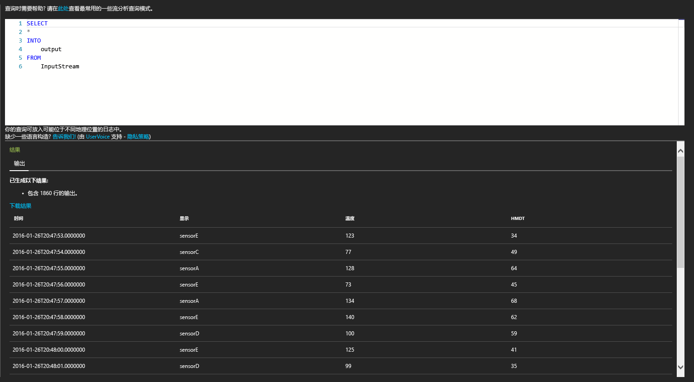

## 根据条件筛选数据

让我们尝试基于条件筛选结果。我们希望仅显示来自“SensorA”的事件的结果。查询位于 **Filtering.txt** 文件中。

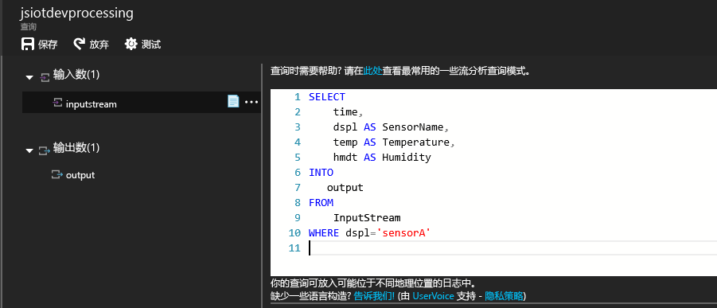

请注意，此处我们将比较字符串值和其大小写。单击“重新运行”按钮执行查询。查询应仅返回 1860 个事件中的 389 行。

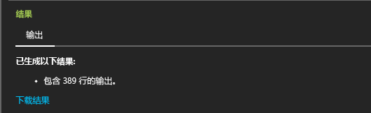  

## 触发业务工作流的警报

现在，我们创建一个更详细的查询。对于每个类型的传感器，如果我们要每 30 秒监视一次平均温度，且仅当平均温度高于 100 度时显示结果，我们将编写以下查询，然后单击“重新运行”查看结果。查询位于 **ThresholdAlerting.txt** 文件中。

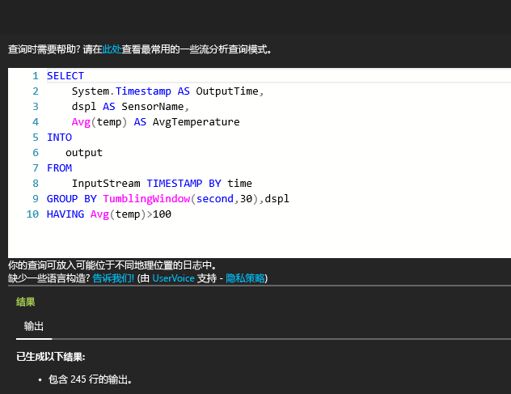

现在，会看到结果只包含 245 行，并列出了平均温度高于 100 的传感器。在此查询中，我们已按照 **dspl** 将事件流分组，dspl 是传感器名称并超过了 30 秒的“翻转窗口”。当我们进行此类临时查询时，必须声明想要处理时间的方式。通过使用 **TIMESTAMP BY** 子句，我们已指定“时间”列作为对所有临时计算的处理时间的方式。有关详细信息，请参阅有关[时间管理](https://msdn.microsoft.com/library/azure/mt582045.aspx)和[开窗函数](https://msdn.microsoft.com/library/azure/dn835019.aspx)的 MSDN 主题。

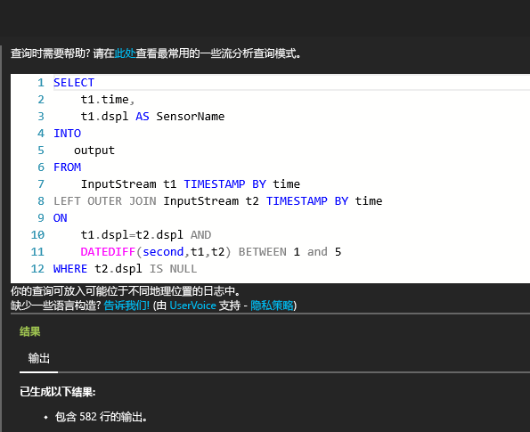

## 检测事件缺失

如何编写查询来确定是否缺少输入事件？ 编写此类查询相当简单。让我们找出传感器最后一次发送数据且下一分钟未发送出任何事件的情况。查询位于 **AbsenseOfEvent.txt** 文件中。

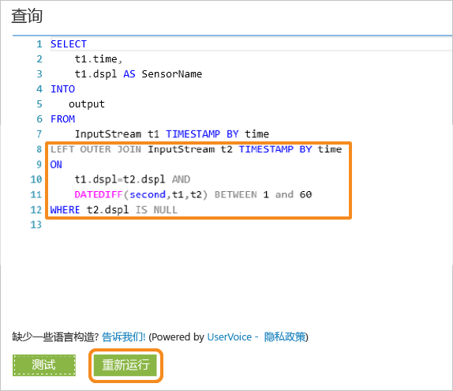

此时我们将对相同的数据流（自联接）使用 **LEFT OUTER JOIN**。对于内部联接，仅当找到匹配时返回结果。但是对于 **LEFT OUTER** 联接，如果联接左侧的事件不匹配，则返回右侧行所有列的带 NULL 的行。这种方法对于查找事件缺失很有用。有关 [JOIN](https://msdn.microsoft.com/library/azure/dn835026.aspx) 的详细信息，请参阅 MSDN 文档。

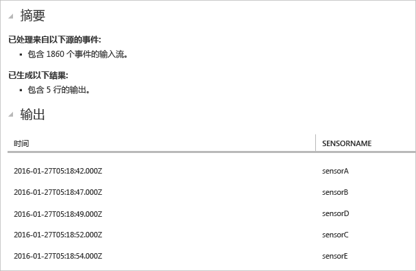  

## 结束语

本教程旨在演示如何编写不同的流分析查询语言查询，并在浏览器中查看结果。但是，这仅仅是一个开始。使用流分析还可以许多其他操作。流分析支持多种输入和输出，甚至可以利用 Azure 机器学习中的函数，因此是用于分析数据流的可靠工具。可以使用[学习路线图](https://azure.microsoft.com/documentation/learning-paths/stream-analytics/)开始了解有关流分析的详细信息。若要了解有关编写查询的详细信息，请阅读有关[常见查询模式](./stream-analytics-stream-analytics-query-patterns.md)的文章。

<!---HONumber=AcomDC_0921_2016-->