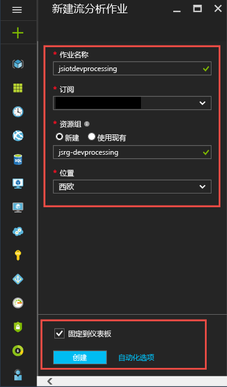

# <a name="process-real-time-iot-data-streams-with-azure-stream-analytics"></a>利用 Azure 流分析处理实时 IoT 数据流

本文介绍如何创建流处理逻辑，以从物联网（IoT）设备收集数据。 您可以使用现实世界物联网（IoT）用例来演示如何快速、经济地构建您的解决方案。

## <a name="prerequisites"></a>必备组件

* 创建免费的[Azure 订阅](https://azure.microsoft.com/pricing/free-trial/)。
* 从[GitHub](https://aka.ms/azure-stream-analytics-get-started-iot)下载示例查询和数据文件。

## <a name="scenario"></a>方案

Contoso 是一家工业自动化公司，该公司已将其制造流程完全自动化。 这家工厂中的设备配有可实时发送数据流的传感器。 在此方案中，产品车间经理希望通过传感器数据获得实时见解，从而找到规律并采取措施。 可以通过传感器数据使用流分析查询语言（SAQL），从传入的数据流中查找感兴趣的模式。

在此示例中，数据是从德克萨斯乐器传感器标记设备生成的。 数据的有效负载是 JSON 格式，如下所示：

```json
{
    "time": "2016-01-26T20:47:53.0000000",  
    "dspl": "sensorE",  
    "temp": 123,  
    "hmdt": 34  
}  
```

在实际情况下，其中可能有数百个传感器以流的形式生成事件。 理想情况下，网关设备会运行代码，将这些事件推送到 [Azure 事件中心](https://azure.microsoft.com/services/event-hubs/)或 [Azure IoT 中心](https://azure.microsoft.com/services/iot-hub/)。 流分析作业将从事件中心引入这些事件，并针对流运行实时分析查询。 然后，可以将结果发送到[支持的输出](stream-analytics-define-outputs.md)之一。

为了方便使用，本入门指南提供从实际 SensorTag 设备中捕获的示例数据文件。 可以对示例数据运行查询并查看结果。 在后续教程中，学习如何将作业连接到输入和输出并将其部署到 Azure 服务。

## <a name="create-a-stream-analytics-job"></a>创建流分析作业

1. 在[Azure 门户](https://portal.azure.com)的左侧导航菜单中，选择 " **+ 创建资源**"。 然后，从 "**分析**" 中选择 "**流分析作业**"。
   
    

1. 输入唯一的作业名称并验证订阅是否为用于作业的正确订阅。 创建新的资源组或从订阅中选择现有的资源组。

1. 选择作业的位置。 为资源组和所有资源使用相同的位置，以提高处理速度并降低成本。 完成配置后，选择 "**创建**"。
   
    

## <a name="create-an-azure-stream-analytics-query"></a>创建 Azure 流分析查询
创建作业后的下一步是编写查询。 您可以对示例数据测试查询，而无需将输入或输出连接到作业。

从 GitHub 下载[helloworldasa-inputstream.json-InputStream](https://github.com/Azure/azure-stream-analytics/blob/master/Samples/GettingStarted/HelloWorldASA-InputStream.json
) 。 然后，导航到 Azure 门户中的 Azure 流分析作业。

从左侧菜单中选择 "**作业拓扑**" 下的 "**查询**"。 然后选择 "**上传示例输入**"。 上传 `HelloWorldASA-InputStream.json` 文件，然后选择 **"确定"** 。


请注意，数据预览会自动填充到**输入预览**表中。


### <a name="query-archive-your-raw-data"></a>查询：存档原始数据

查询的最简单形式是传递查询，该查询会将所有输入数据存档到其指定的输出。 此查询是在新的 Azure 流分析作业中填充的默认查询。

```sql
SELECT 
    *
INTO
    Output
FROM
    InputStream
```

选择 "**测试查询**" 并在 "**测试结果**" 表中查看结果。


### <a name="query-filter-the-data-based-on-a-condition"></a>查询：根据条件筛选数据

让我们尝试基于条件筛选结果。 我们希望仅显示来自“sensorA”的事件的结果。

```sql
SELECT 
    time,
    dspl AS SensorName,
    temp AS Temperature,
    hmdt AS Humidity
INTO
   Output
FROM
    InputStream
WHERE dspl='sensorA'
```

将查询粘贴到编辑器中，然后选择 "**测试查询**" 查看结果。


### <a name="query-alert-to-trigger-a-business-workflow"></a>查询：触发业务工作流的警报

让我们创建更详细的查询。 对于每个类型的传感器，我们想要每 30 秒监视一次平均温度，且仅在平均温度高于 100 度的情况下显示结果。

```sql
SELECT 
    System.Timestamp AS OutputTime,
    dspl AS SensorName,
    Avg(temp) AS AvgTemperature
INTO
   Output
FROM
    InputStream TIMESTAMP BY time
GROUP BY TumblingWindow(second,30),dspl
HAVING Avg(temp)>100
```


应会看到结果只包含245行和传感器的名称，其中平均温度大于100。 此查询按 **dspl**（传感器名称）以 30 秒的**轮转窗口**对事件流进行分组。 临时查询必须陈述您需要时间的进度。 通过使用**TIMESTAMP by**子句，您已指定**OUTPUTTIME**列，以将时间与所有临时计算关联。 有关详细信息，请阅读[时间管理](https://docs.microsoft.com/stream-analytics-query/time-management-azure-stream-analytics)和开窗[函数](https://docs.microsoft.com/stream-analytics-query/windowing-azure-stream-analytics)。

### <a name="query-detect-absence-of-events"></a>查询：检测事件缺失

如何编写查询来确定是否缺少输入事件？ 接下来，我们来了解传感器发送数据的最后时间，然后在接下来的5秒内没有发送事件。

```sql
SELECT 
    t1.time,
    t1.dspl AS SensorName
INTO
   Output
FROM
    InputStream t1 TIMESTAMP BY time
LEFT OUTER JOIN InputStream t2 TIMESTAMP BY time
ON
    t1.dspl=t2.dspl AND
    DATEDIFF(second,t1,t2) BETWEEN 1 and 5
WHERE t2.dspl IS NULL
```


此时使用 **LEFT OUTER** 联接到相同的数据流（自联接）。 对于 **INNER** 联接，仅当找到匹配项时才返回结果。  对于 **LEFT OUTER** 联接，如果联接左侧的事件不匹配，则返回右侧所有列中带 NULL 的行。 这种方法对于查找事件缺失很有用。 有关详细信息，请参阅[JOIN](https://docs.microsoft.com/stream-analytics-query/join-azure-stream-analytics)。

## <a name="conclusion"></a>结束语

本文的目的是演示如何编写不同的流分析查询语言查询，并在浏览器中查看结果。 不过，这只是为了帮助你入门。 流分析支持多种输入和输出，甚至可以使用 Azure 机器学习中的函数，因而是用于分析数据流的可靠工具。 有关如何编写查询的详细信息，请阅读有关[常用查询模式](stream-analytics-stream-analytics-query-patterns.md)的文章。

