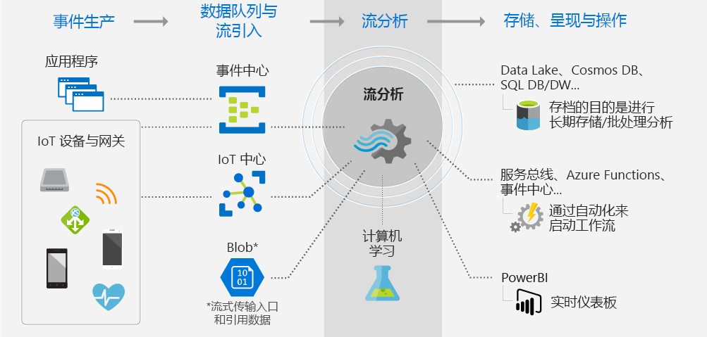
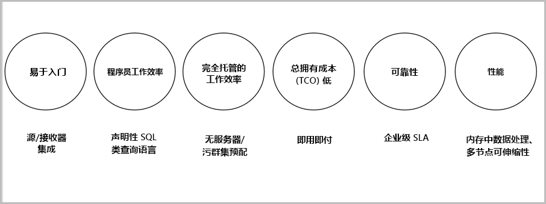

# 什么是流分析？

Azure 流分析是一个事件处理引擎，用于检查从设备流式传输的大量数据。 传入数据可能来自设备、传感器、网站、社交媒体源、应用程序等。 它还支持从数据流提取信息，以及确定模式和关系。 然后，你可以使用这些模式来触发其他下游操作（例如警报）、将信息馈送到报告工具，或者将其存储起来供以后使用。

下面是一些可以在其中使用 Azure 流分析的示例： 

* 基于设备遥测的物联网 (IoT) 传感器融合和实时分析
* Web 日志/点击流分析
* 适用于车队管理和无人驾驶汽车的地理空间分析
* 高价值资产的远程监视和预测性维护
* 实时分析销售点数据，以便进行库存控制和异常情况检测

## 流分析工作原理

Azure 流分析从流数据源开始，可以使用引入到 Azure 事件中心、Azure IoT 中心的数据，也可以使用从 Azure Blob 存储之类的数据存储引入的数据。 若要检查流，请创建一项流分析作业，以便指定可流式传输数据的输入源。 该作业还指定了转换查询，用于定义如何查找数据、模式或关系。 转换查询利用类似 SQL 的查询语言对某个时段的流数据进行筛选、排序、聚合和联接操作。 如果执行此作业，则可在执行聚合操作时调整事件排序选项以及时间窗口的长度。

分析传入数据以后，即可指定已转换数据的输出，并可针对所分析的信息来控制后续操作。 例如，可以执行如下所示操作：

* 将数据发送到受监视的队列，以便触发下游的自定义工作流。
* 将数据发送到 Power BI 仪表板进行实时可视化。
* 将数据存档到其他 Azure 存储服务。

下图表示流分析管道。流分析作业可以使用所有或部分输入和输出。 此图说明了如何将数据发送到流分析，在进行分析后再发送到其他位置进行其他操作（例如存储或演示）：

## 主要功能和优点

Azure 流分析经过专门的设计，具有易用、灵活、可靠的特点，并可根据作业大小进行缩放。 它可以跨多个数据中心和主权云使用。 下图说明了 Azure 流分析的重要功能：

## 易于入门

Azure 流分析易于入门。 只需点击几下即可连接到多个源和接收器并创建端到端管道。 流分析可以连接到 [Azure 事件中心](https://docs.microsoft.com/azure/event-hubs/)和 [Azure IoT 中心](https://docs.microsoft.com/azure/iot-hub/)进行流数据引入， 还可以连接到 [Azure Blob 存储](https://docs.microsoft.com/azure/storage/storage-introduction)服务进行历史数据引入。 它可以将事件中心的数据与其他数据源和处理引擎组合在一起使用。 作业输入也可以包含静态的或不怎么变化的引用数据，你可以通过将流数据联接到该引用数据来执行查找操作。

流分析可以将作业输出路由到许多存储系统，例如 [Azure Blob](https://docs.microsoft.com/azure/storage/storage-introduction)、[Azure SQL 数据库](https://docs.microsoft.com/azure/sql-database/)、[Azure Data Lake Store](https://docs.microsoft.com/azure/data-lake-store/) 或 [Azure Cosmos DB](https://docs.microsoft.com/azure/cosmos-db/introduction)。 进行存储以后，可以通过 Azure HDInsight 运行批处理分析，还可以将输出发送到其他服务（例如事件中心）以供使用，或者发送到 [Power BI](https://docs.microsoft.com/power-bi/)，由 Power BI 流式处理 API 进行实时可视化。

## 程序员工作效率

Azure 流分析使用简单的基于 SQL 的查询语言，该语言已使用强大的时态约束进行强化，可以分析动态数据。 若要定义作业转换，请使用简单的声明性[流分析查询语言](https://msdn.microsoft.com/library/azure/dn834998.aspx)，以便通过简单的 SQL 构造创作复杂的时态查询和分析。 流分析查询语言与 SQL 语言是一致的，因此，熟悉 SQL 语言就可以开始创建作业。 也可使用 Azure PowerShell、[流分析 Visual Studio 工具](stream-analytics-tools-for-visual-studio-install.md) 或 Azure 资源管理器模板等开发人员工具来创建作业。 可以使用开发人员工具来脱机开发转换查询，然后使用 [CI/CD 管道](stream-analytics-tools-for-visual-studio-cicd.md)将作业提交到 Azure。 

流分析查询语言提供各种用于分析和处理流数据的功能。 此查询语言支持简单的数据操作、聚合函数以及复杂的地理空间函数。 可以在门户中编辑查询，然后使用从实时流中提取的示例数据来测试它们。

可以通过定义和调用其他函数来扩展查询语言的功能。 可以在 Azure 机器学习服务中定义函数调用，以便利用 Azure 机器学习解决方案，还可以集成 JavaScript 用户定义函数 (UDF) 或用户定义聚合，以便在流分析查询中执行复杂的计算。

## 完全托管 

Azure 流分析是 Azure 中的一项完全托管的无服务器 (PaaS) 产品/服务。 这意味着，不需预配硬件或管理群集即可运行作业。 Azure 流分析对作业进行全方位管理，可以在云中设置复杂的计算群集，还可以完成运行作业所需的性能优化。 与 Azure 事件中心和 Azure IoT 中心集成后，即可通过作业每秒引入数百万个不同来源（已连接设备、点击流、日志文件等）的事件。 使用事件中心的分区功能，可以将计算分成多个逻辑步骤，每个步骤还可以进一步细分，以提高可伸缩性。

## 总拥有成本低廉

流分析已作为云服务进行成本优化。 没有前期费用，只需根据[所使用的流单元](stream-analytics-streaming-unit-consumption.md)和已处理的数据量付费。 不需承诺使用量，也不需群集预配。 可以根据业务需求纵向缩放流作业。 

## 可靠性 

作为托管服务，流分析保证在进行事件处理时，可以实现 99.9% 的可用性，并可防止数据丢失，确保业务连续性。如需更多详细信息，请参阅[流分析的 SLA](https://azure.microsoft.com/support/legal/sla/stream-analytics/v1_0/) 页。 流分析可以每秒处理数百万事件，而且传送结果时的延迟也低。
流分析保证刚好进行一次事件处理，以及至少进行一次事件传送。 它有内置的恢复功能，可以在事件传送失败时发挥作用。 流分析可以在内部保留作业的状态，可以让你根据作业上一次的输出时间来启动作业，还可以提供可重复的结果（即始终提供相同的结果）。 在进行根本原因分析时，可以通过流分析的此功能进行回溯，对各种计算进行调查。 

## 性能

Azure 流分析进行了高性能优化，可以处理流数据，还可以进行内存中计算。 可以通过它进行纵向缩放，以便操控实时且复杂的事件处理应用程序。 流分析通过分区来提供性能支持。 可以在多个流节点上对复杂查询进行并行化处理，然后执行该查询。 

## 后续步骤

你现在已对 Azure 流分析有了一个大致的了解。 接下来，你可以进行深入了解并创建第一个流分析作业：

* [使用 Azure 门户创建流分析作业](stream-analytics-quick-create-portal.md)。
* [使用 Azure PowerShell 创建流分析作业](stream-analytics-quick-create-powershell.md)。
