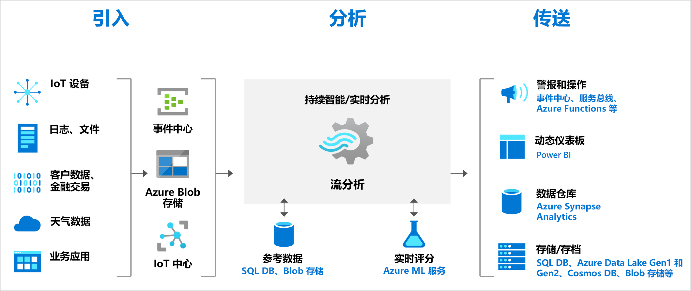
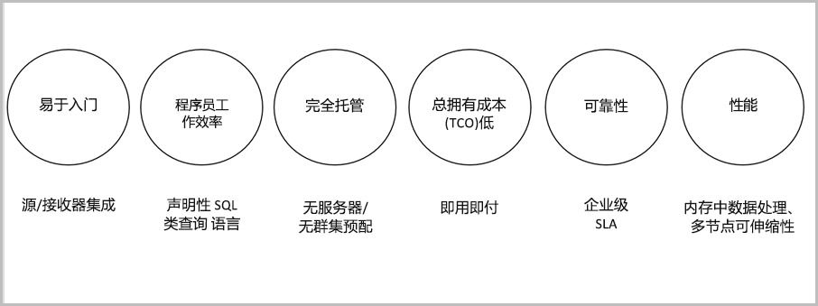

# 什么是 Azure 流分析？

Azure 流分析是一个实时分析和复杂事件处理引擎，旨在同时分析和处理来自多个源的大量快速流式处理数据。 可以在从许多输入源（包括设备、传感器、点击流、社交媒体源和应用程序）提取的信息中识别模式和关系。 这些模式可用于触发操作和启动工作流，例如创建警报、向报告工具馈送信息或存储转换后的数据供以后使用。 此外，流分析可在 Azure IoT Edge 运行时上使用，并支持与云完全相同的语言或语法。 

下面是可以使用 Azure 流分析的示例场景：

* 分析来自 IoT 设备的实时遥测数据流
* Web 日志/点击流分析
* 适用于车队管理和无人驾驶汽车的地理空间分析
* 远程监视和预测性维护高价值资产
* 实时分析销售点数据，以便进行库存控制和异常情况检测

## 流分析工作原理

Azure 流分析作业由输入、查询和输出构成。 流分析从 Azure 事件中心、Azure IoT 中心或 Azure Blob 存储引入数据。 基于 SQL 查询语言的查询可用于对某个时段的流数据轻松进行筛选、排序、聚合和联接。 还可以使用 JavaScript 和 C# 用户定义函数 (UDF) 扩展此 SQL 语言。 通过简单的语言构造和/或配置执行聚合操作时，可以轻松地调整事件排序选项和时间窗口的持续时间。

每个作业提供转换后数据的输出，你可以针对所要分析的信息控制过程。 例如，你能够：

* 将数据发送到 Azure Functions、服务总线主题或队列等服务，以触发下游的通信或自定义工作流。
* 将数据发送到 Power BI 仪表板进行实时仪表板操作。
* 将数据存储到其他 Azure 存储服务，以基于历史数据训练机器学习模型或执行批处理分析。

下图说明了如何将数据发送到流分析，在进行分析后再发送到其他位置进行其他操作（例如存储或演示）：

## 主要功能和优点

Azure 流分析经过专门的设计，具有易用、灵活、可靠的特点，并可根据作业大小进行缩放。 多个 Azure 区域均提供该服务。 下图演示了 Azure 流分析的重要功能：

## 易于入门

Azure 流分析易于入门。 只需点击几下鼠标即可连接到多个源和接收器并创建端到端的管道。 流分析可连接到 [Azure 事件中心](/azure/event-hubs/)和 [Azure IoT 中心](/azure/iot-hub/)来引入流数据，并可连接到 [Azure Blob 存储](/azure/storage/common/storage-introduction)来引入历史数据。 作业输入还可以包含 Azure Blob 存储或 [SQL 数据库](stream-analytics-use-reference-data.md#azure-sql-database)中的静态数据或缓慢更改的参考数据，可将这些数据与流数据相联接，以执行查找操作。

流分析可以将作业输出路由到许多存储系统，例如 [Azure Blob 存储](/azure/storage/common/storage-introduction)、[Azure SQL 数据库](/azure/sql-database/)、[Azure Data Lake Store](/azure/data-lake-store/) 和 [Azure Cosmos DB](/azure/cosmos-db/introduction)。 可以使用 Azure HDInsight 基于存储的输出运行批处理分析，或将输出发送到另一个服务（例如事件中心）以使用这些输出，或发送到 [Power BI](https://docs.microsoft.com/power-bi/) 以进行实时可视化。

有关流分析输出的完整列表，请参阅[了解 Azure 流分析的输出](stream-analytics-define-outputs.md)。

## 程序员工作效率

Azure 流分析使用简单的基于 SQL 的查询语言，该语言已使用强大的时态约束进行强化，可以分析动态数据。 若要定义作业转换，请使用简单的声明性[流分析查询语言](https://docs.microsoft.com/stream-analytics-query/stream-analytics-query-language-reference)，以便通过简单的 SQL 构造创作复杂的时态查询和分析。 由于流分析查询语言与 SQL 语言相一致，因此，熟悉 SQL 就足以开始创建作业。 也可使用 Azure PowerShell、[流分析 Visual Studio 工具](stream-analytics-tools-for-visual-studio-install.md)、[流分析 Visual Studio Code 扩展](quick-create-vs-code.md)或 Azure 资源管理器模板等开发人员工具来创建作业。 可以使用开发人员工具来脱机开发转换查询，然后使用 [CI/CD 管道](stream-analytics-tools-for-visual-studio-cicd.md)将作业提交到 Azure。

流分析查询语言提供各种用于分析和处理流数据的功能。 此查询语言支持简单的数据操作、聚合函数和复杂的地理空间函数。 可以在门户中编辑查询，然后使用从实时流中提取的示例数据来测试它们。

可以通过定义和调用其他函数来扩展查询语言的功能。 可以在 Azure 机器学习中定义函数调用，以便利用 Azure 机器学习解决方案，还可以集成 JavaScript 或 C# 用户定义的函数 (UDF) 或用户定义的聚合，以便在流分析查询中执行复杂的计算。

## 完全托管

Azure 流分析是 Azure 中的一项完全托管的无服务器 (PaaS) 产品/服务。 无需预配硬件或管理群集即可运行作业。 Azure 流分析对作业进行全方位管理，可以在云中设置复杂的计算群集，并负责实现运行作业所需的性能优化。 与 Azure 事件中心和 Azure IoT 中心集成后，作业每秒可以从大量的源引入数百万个事件，以包含连接的设备、点击流和日志文件。 使用事件中心的分区功能，可以将计算分成多个逻辑步骤，每个步骤还可以进一步细分，以提高可伸缩性。

## 在云中或智能边缘上运行

Azure 流分析可以在云中运行，实现大规模分析；还可以在 IoT Edge 上运行，实现超低延迟分析。 Azure 流分析在云和边缘上采用同一种查询语言，让开发者能够生成用于流处理的真正的混合体系结构。 

## 总拥有成本低廉

流分析已作为云服务进行成本优化。 没有前期费用，只需根据[所使用的流单元](stream-analytics-streaming-unit-consumption.md)和已处理的数据量付费。 无需承诺使用量，也无需预配群集，可以根据业务需求纵向缩放作业。

## 关键任务就绪

Azure 流分析可在全球多个地区使用，旨在通过支持可靠性、安全性和符合性要求来运行关键任务工作负载。

### 可靠性

Azure 流分析保证刚好进行一次事件处理，以及至少进行一次事件传送，因此事件不会丢失。 使用[事件传递保证](/stream-analytics-query/event-delivery-guarantees-azure-stream-analytics)中所述的选定输出保证刚好处理一次。

Azure 流分析有内置的恢复功能，可以在事件传送失败时发挥作用。 流分析还提供内置的检查点来维护作业的状态，并提供可重复的结果。

作为一项托管服务，流分析可保证事件处理在分钟级别粒度具备 99.9% 的可用性。 有关详细信息，请参阅[流分析 SLA](https://azure.microsoft.com/support/legal/sla/stream-analytics/v1_0/) 页。 

### 安全性

在安全性方面，Azure 流分析会加密所有传入和传出通信，并支持 TLS 1.2。 内置检查点也是加密的。 流分析不存储传入数据，因为所有处理都在内存中完成。

### 合规性

Azure 流分析遵循多个符合性认证，如 [Azure 符合性概述](https://gallery.technet.microsoft.com/Overview-of-Azure-c1be3942)中所述。 

## 性能

流分析可以每秒处理数百万事件，而且传送结果时的延迟也极低。 可以通过它进行纵向扩展和横向扩展，以便操控实时且复杂的大型事件处理应用程序。 流分析通过分区支持高性能，允许将复杂的查询并行化，并在多个流式处理节点上执行这些查询。 Azure 流分析基于 [Trill](https://github.com/Microsoft/Trill)，这是一种与 Microsoft Research 合作开发的高性能内存中流式处理分析引擎。

## 后续步骤

你现在已对 Azure 流分析有了一个大致的了解。 接下来，你可以进行深入了解并创建第一个流分析作业：

* [使用 Azure 门户创建流分析作业](stream-analytics-quick-create-portal.md)。
* [使用 Azure PowerShell 创建流分析作业](stream-analytics-quick-create-powershell.md)。
* [使用 Visual Studio 创建流分析作业](stream-analytics-quick-create-vs.md)。
* [使用 Visual Studio Code 创建流分析作业](quick-create-vs-code.md)。
