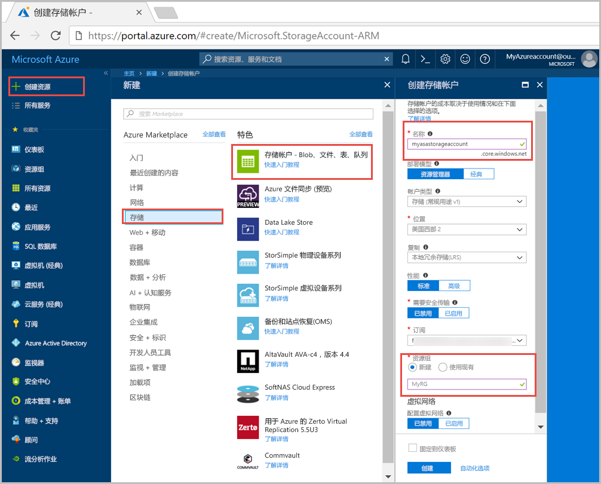
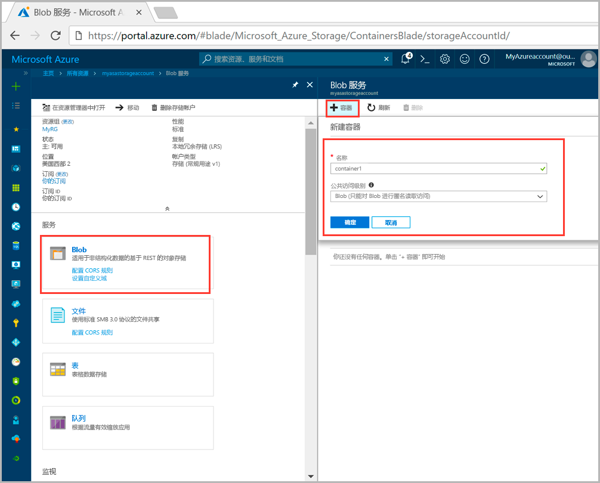
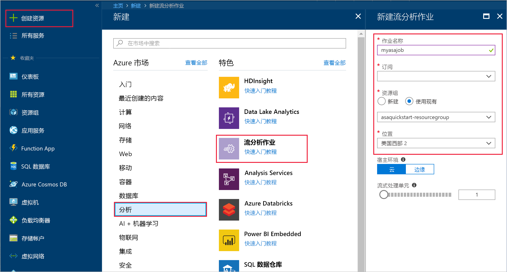
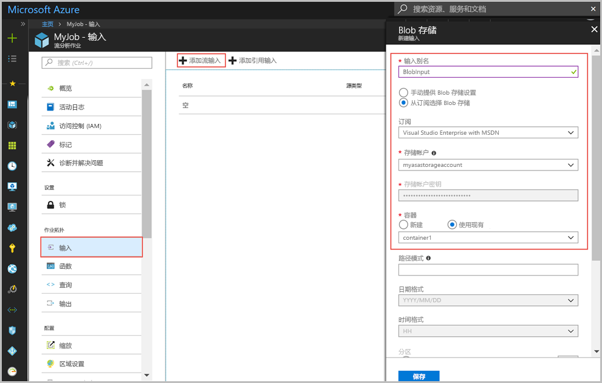
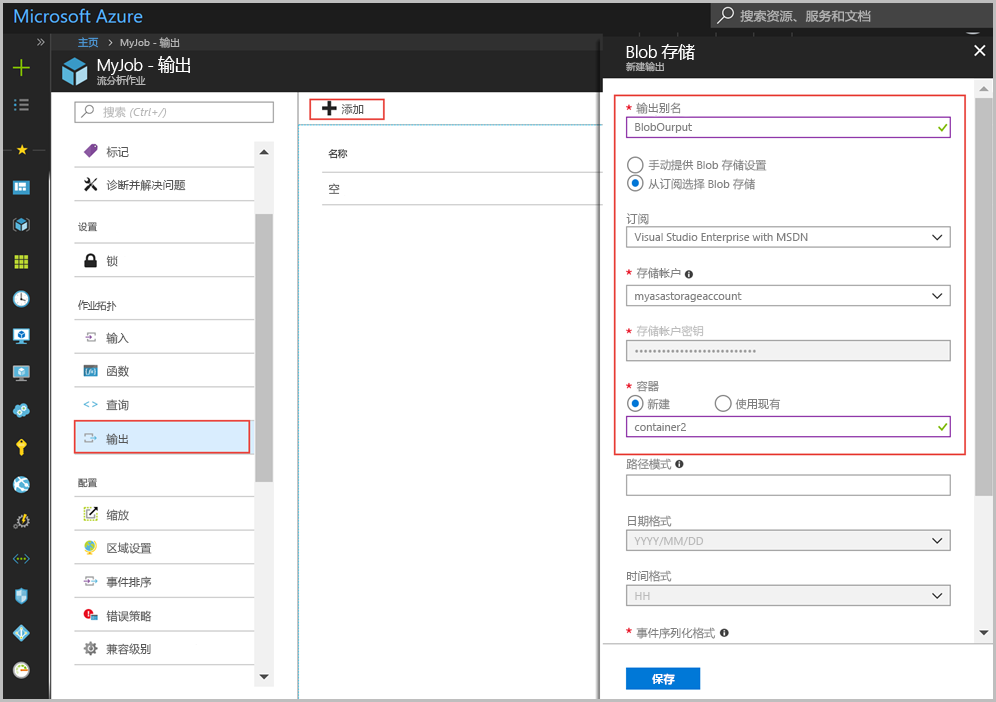
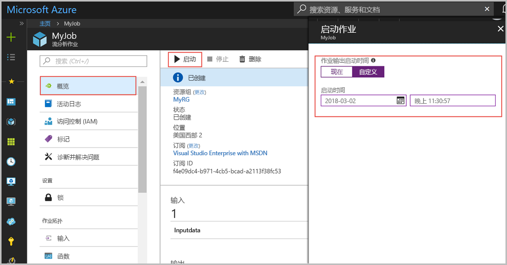
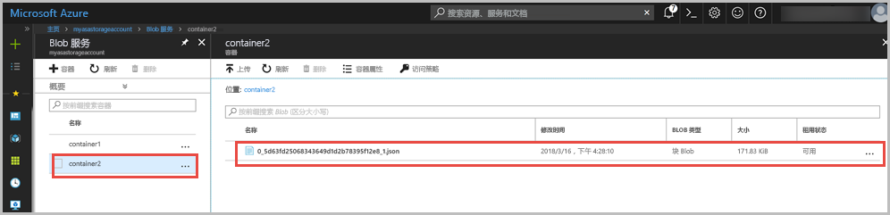

# <a name="quickstart-create-a-stream-analytics-job-by-using-the-azure-portal"></a>快速入门：使用 Azure 门户创建流分析作业

本快速入门介绍如何开始创建流分析作业。 在本快速入门中，请定义一个流分析作业，以便每隔 30 秒读取一次示例传感器数据并筛选出平均温度超过 100 的行。 在本文中，请从 Blob 存储读取数据，对数据进行转换，然后将数据写回到同一 Blob 存储中的另一容器。 在本快速入门中使用的输入数据文件包含的静态数据仅供说明之用。 在实际方案中，请将流式处理输入数据用于流分析作业。

## <a name="before-you-begin"></a>开始之前

* 如果还没有 Azure 订阅，可以创建一个[免费帐户](https://azure.microsoft.com/free/)。

* 登录到 [Azure 门户](https://portal.azure.com/)。

## <a name="prepare-the-input-data"></a>对输入数据进行准备

在定义流分析作业之前，应该对已配置为作业输入的数据进行准备。 若要对作业所需的输入数据进行准备，请运行以下步骤：

1. 从 GitHub 下载[示例传感器数据](https://raw.githubusercontent.com/Azure/azure-stream-analytics/master/Samples/GettingStarted/HelloWorldASA-InputStream.json)。 示例数据包含下述 JSON 格式的传感器信息：  

   ```json
   {
     "time": "2018-01-26T21:18:52.0000000",
     "dspl": "sensorC",
     "temp": 87,
     "hmdt": 44
   }
   ```
2. 登录到 Azure 门户。  

3. 从 Azure 门户的左上角选择“创建资源” > “存储” > “存储帐户”。 填充“存储帐户作业”页，将“名称”设置为“asaquickstartstorage”，将“位置”设置为“美国西部 2”，将“资源组”设置为“asaquickstart-resourcegroup”（请将存储帐户托管在流式处理作业所在的资源组中，以便提高性能）。 余下设置可以保留默认值。  

   

4. 在“所有资源”页中找到上一步创建的存储帐户。 打开“概览”页，然后打开“Blob”磁贴。  

5. 从“Blob 服务”页中选择“容器”，为容器提供一个**名称**（例如 *container1*），然后将“公共访问级别”更改为“Blob”（匿名读取访问权限仅适用于 Blob），然后选择“确定”。  

   

6. 转到上一步创建的容器。 选择“上传”，然后上传从第一步获取的传感器数据。  

   

## <a name="create-a-stream-analytics-job"></a>创建流分析作业

1. 登录到 Azure 门户。

2. 在 Azure 门户的左上角选择“创建资源”。  

3. 从结果列表中选择“数据+分析” > “流分析作业”。  

4. 使用以下信息填写“流分析作业”页：

   |**设置**  |建议的值  |**说明**  |
   |---------|---------|---------|
   |作业名称   |  myasajob   |   输入用于标识流分析作业的名称。 流分析作业名称只能包含字母数字字符、连字符和下划线，其长度必须介于 3 到 63 个字符之间。 |
   |订阅  | 用户的订阅\<\> |  选择要用于此作业的 Azure 订阅。 |
   |资源组   |   asaquickstart-resourcegroup  |   选择“新建”，然后输入帐户的新资源组名称。 |
   |位置  |  \<选择离用户最近的区域\> | 选择可以在其中托管流分析作业的地理位置。 使用最靠近用户的位置，以便改进性能并减少数据传输成本。 |
   |流式处理单位  | 1  |   流单元表示执行作业所需的计算资源。 默认情况下，此值设置为 1。 若要了解如何缩放流单元，请参阅[了解和调整流单元](stream-analytics-streaming-unit-consumption.md)一文。   |
   |宿主环境  |  云  |   流分析作业可以部署到云或边缘设备。 可以通过“Cloud”部署到 Azure Cloud，通过“Edge”部署到 IoT Edge 设备。 |

   

5. 选中用于将作业置于仪表板上的“固定到仪表板”复选框，然后选择“创建”。  

6. 此时会在浏览器窗口右上角显示“正在部署...”。 

## <a name="configure-input-to-the-job"></a>配置作业输入

在此部分，需将 Blob 存储配置为流分析作业的输入。 在配置输入之前，请创建 Blob 存储帐户。  

### <a name="add-the-input"></a>添加输入 

1. 导航到流分析作业。  

2. 选择“输入” > “添加流输入” > “Blob 存储”。  

3. 使用以下值填写“Blob 存储”页：

   |**设置**  |建议的值  |**说明**  |
   |---------|---------|---------|
   |输入别名  |  BlobInput   |  输入一个名称，用于标识作业的输入。   |
   |订阅   |  用户的订阅\<\> |  选择包含已创建的存储帐户的 Azure 订阅。 存储帐户可以在同一订阅中，也可以在另一订阅中。 此示例假定已在同一订阅中创建存储帐户。 |
   |存储帐户  |  myasastorageaccount |  选择或输入存储帐户的名称。 如果在同一订阅中创建存储帐户名称，则会自动将其删除。 |
   |容器  | container1 | 选择包含示例数据的容器的名称。 如果在同一订阅中创建容器名称，则会自动将其删除。 |

4. 让其他选项保留默认值，然后选择“保存”以保存设置。  

   
 
## <a name="configure-output-to-the-job"></a>配置作业输出

1. 导航到此前创建的的流分析作业。  

2. 选择“输出”>“添加”>“Blob 存储”。  

3. 使用以下值填写“Blob 存储”页：

   |**设置**  |建议的值  |**说明**  |
   |---------|---------|---------|
   |输出别名 |   BlobOutput   |   输入一个名称，用于标识作业的输出。 |
   |订阅  |  用户的订阅\<\>  |  选择包含已创建的存储帐户的 Azure 订阅。 存储帐户可以在同一订阅中，也可以在另一订阅中。 此示例假定已在同一订阅中创建存储帐户。 |
   |存储帐户 |  myasastorageaccount |   选择或输入存储帐户的名称。 如果在同一订阅中创建存储帐户名称，则会自动将其删除。       |
   |容器 |   container1  |  选择你在存储帐户中创建的现有容器。   |
   |路径模式 |   output  |  输入一个名称作为输出的现有容器中的路径。   |

4. 让其他选项保留默认值，然后选择“保存”以保存设置。  

   
 
## <a name="define-the-transformation-query"></a>定义转换查询

1. 导航到此前创建的的流分析作业。  

2. 选择“查询”，然后更新查询，如下所示：  

   ```sql
   SELECT 
   System.Timestamp AS OutputTime,
   dspl AS SensorName,
   Avg(temp) AS AvgTemperature
   INTO
     BlobOutput
   FROM
     BlobInput TIMESTAMP BY time
   GROUP BY TumblingWindow(second,30),dspl
   HAVING Avg(temp)>100
   ```

3. 在此示例中，查询从 Blob 读取数据，然后将其复制到 Blob 中的新文件。请选择“保存”。  

   

## <a name="start-the-stream-analytics-job-and-check-the-output"></a>启动流分析作业并检查输出

1. 返回到作业概览页，然后选择“启动”。

2. 在“启动作业”下，请针对“启动时间”字段选择“自定义”。 选择 `2018-01-24` 作为起始日期，但请勿更改时间。 之所以选择此起始日期，是因为它比示例数据中的事件时间戳要早。 完成后，选择“启动”。

   

3. 数分钟后，在门户中找到存储帐户以及此前已配置为作业输出的容器。 选择输出路径。 现在可以在容器中看到输出文件。 此作业的首次启动需要数分钟的时间，但在启动后，只要有数据到达，它就会持续运行。  

   

## <a name="clean-up-resources"></a>清理资源

若不再需要资源组、流式处理作业以及所有相关资源，请将其删除。 删除作业可避免对作业使用的流单元进行计费。 如果计划在将来使用该作业，可以先停止它，等到以后需要时再重启它。 如果不打算继续使用该作业，请按照以下步骤删除本快速入门创建的所有资源：

1. 在 Azure 门户的左侧菜单中选择“资源组”，然后选择已创建资源的名称。  

2. 在资源组页上选择“删除”，在文本框中键入要删除的资源的名称，然后选择“删除”。

## <a name="next-steps"></a>后续步骤

在本快速入门中，你部署了一个简单的流分析作业。 若要了解如何配置其他输入源并执行实时检测，请继续阅读以下文章：

> [!div class="nextstepaction"]
> [使用 Azure 流分析实时检测欺诈行为](stream-analytics-real-time-fraud-detection.md)

