# <a name="quickstart-create-a-stream-analytics-job-by-using-the-azure-portal"></a>快速入门：使用 Azure 门户创建流分析作业

本快速入门介绍如何开始创建流分析作业。 在本快速入门中，请定义一个流分析作业，以便读取实时流数据并筛选温度高于 27 的消息。 流分析作业会从 IoT 中心读取数据，对数据进行转换，然后将数据写回到 Blob 存储中的容器。 在本快速入门中使用的输入数据由 Raspberry Pi 联机模拟器生成。 

## <a name="before-you-begin"></a>开始之前

* 如果还没有 Azure 订阅，可以创建一个[免费帐户](https://azure.microsoft.com/free/)。

* 登录 [Azure 门户](https://portal.azure.com/)。

## <a name="prepare-the-input-data"></a>对输入数据进行准备

在定义流分析作业之前，应该准备输入数据。 实时传感器数据将引入到 IoT 中心，随后配置为作业输入。 若要对作业所需的输入数据进行准备，请完成以下步骤：

1. 登录 [Azure 门户](https://portal.azure.com/)。

2. 选择“创建资源” > “物联网” > “IoT 中心”。

3. 在“IoT 中心”窗格中，输入以下信息： 
   
   |**设置**  |**建议的值**  |**说明**  |
   |---------|---------|---------|
   |订阅  | 用户的订阅\<\> |  选择要使用的 Azure 订阅。 |
   |资源组   |   asaquickstart-resourcegroup  |   选择“新建”  ，然后输入帐户的新资源组名称。 |
   |区域  |  \<选择离用户最近的区域\> | 选择可以在其中托管 IoT 中心的地理位置。 使用最靠近用户的位置。 |
   |IoT 中心名称  | MyASAIoTHub  |   选择 IoT 中心的名称。   |

   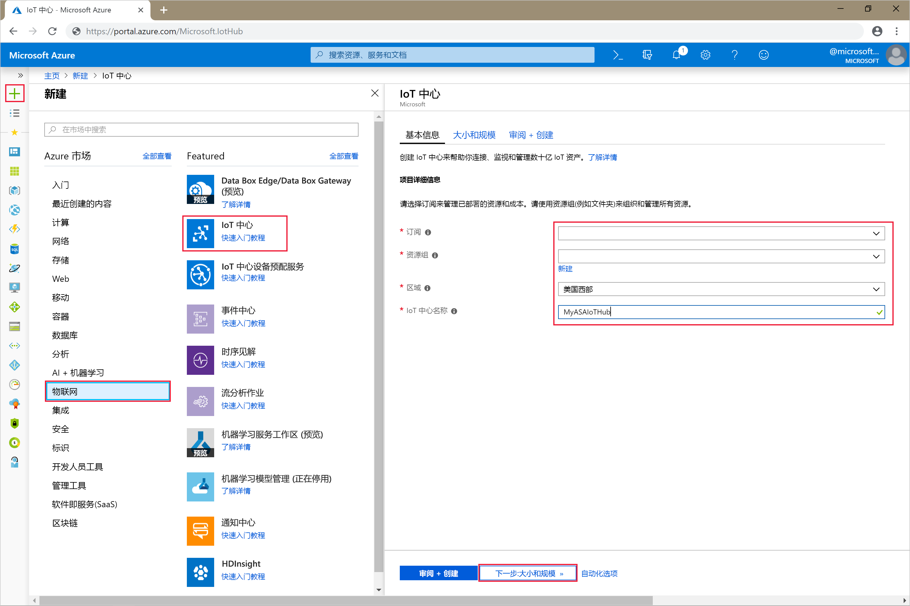

4. 选择“下一步: 设置大小和规模”。 

5. 选择“定价和缩放层”  。 就本快速入门来说，请选择“F1 - 免费”层（前提是此层在订阅上仍然可用）  。 有关详细信息，请参阅 [IoT 中心定价](https://azure.microsoft.com/pricing/details/iot-hub/)。

   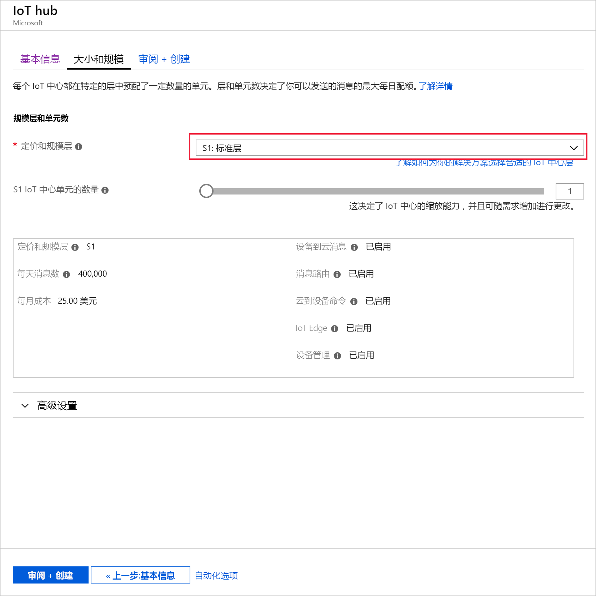

6. 选择“查看 + 创建”  。 查看 IoT 中心信息，然后单击“创建”  。 创建 IoT 中心可能需要数分钟的时间。 可在“通知”窗格中监视进度。 

7. 在 IoT 中心导航菜单的“IoT 设备”下单击“添加”   。 添加“设备 ID”，然后单击“保存”。  

   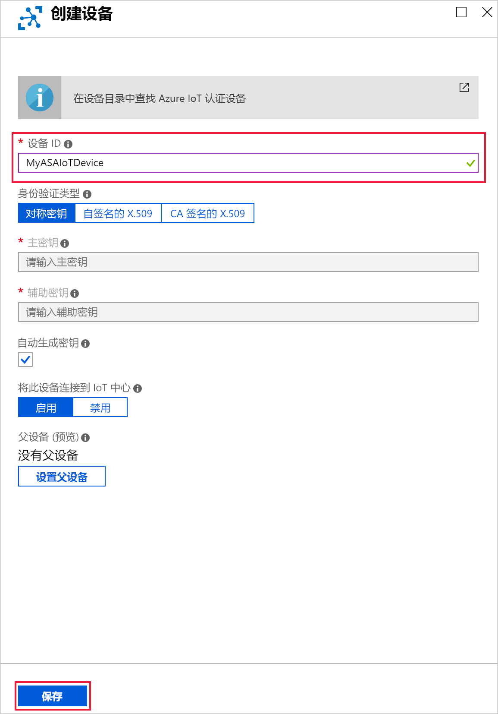

8. 创建设备后，请从“IoT 设备”列表打开设备  。 复制“连接字符串 -- 主密钥”并将其保存到记事本，供稍后使用  。

   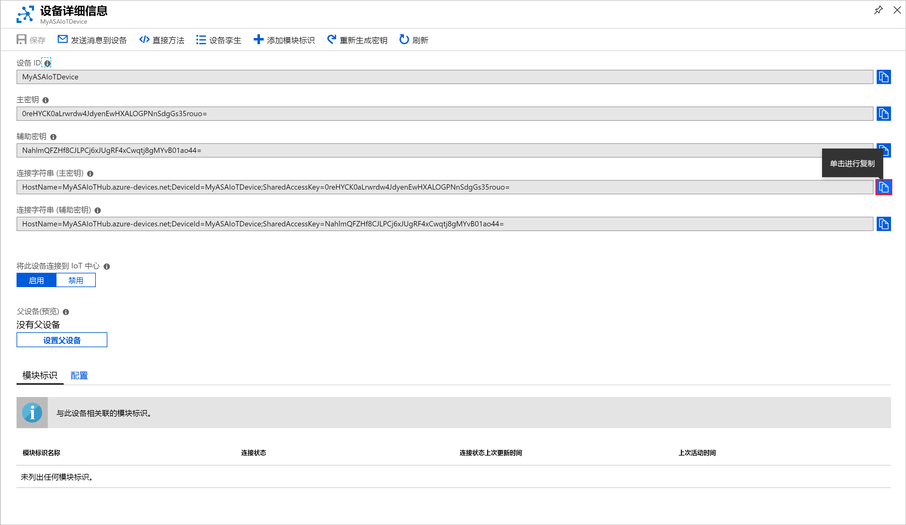

## <a name="create-blob-storage"></a>创建 Blob 存储

1. 从 Azure 门户的左上角选择“创建资源”   > “存储”   >   “存储帐户”。

2. 在“创建存储帐户”  窗格中，输入存储帐户名称、位置和资源组。 选择与创建的 IoT 中心相同的位置和资源组。 然后单击“查看 + 创建”，以便创建帐户  。

   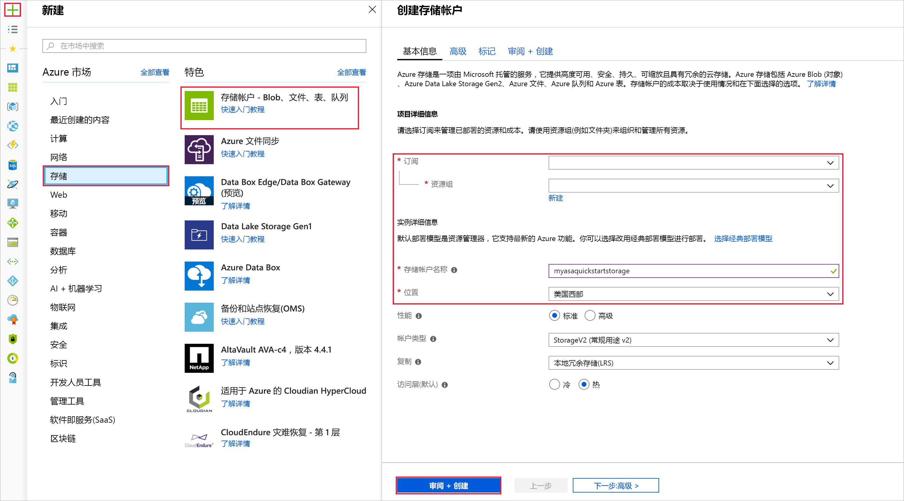

3. 创建存储帐户以后，请在“概览”窗格上选择“Blob”磁贴。  

   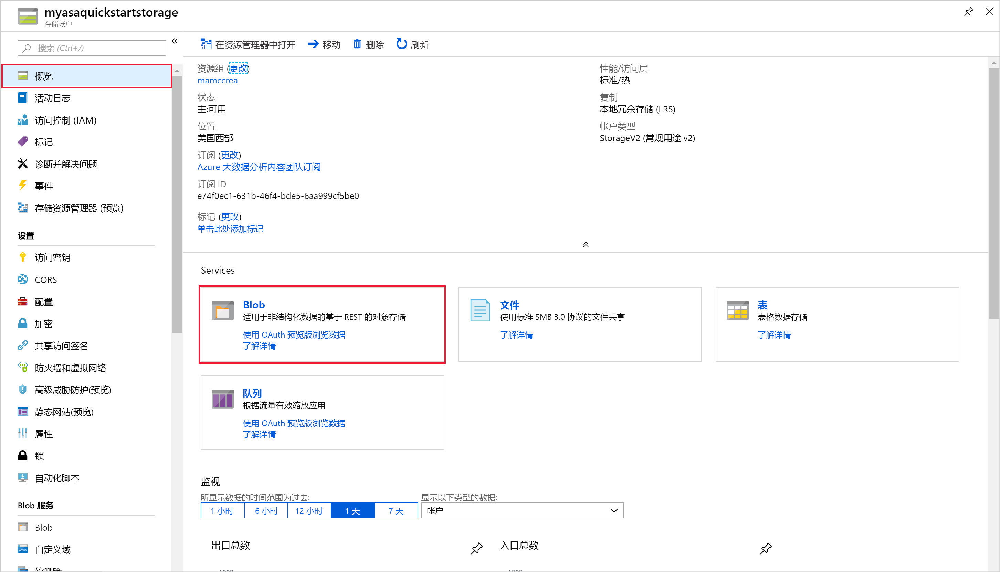

4. 从“Blob 服务”  页面中，选择“容器”  ，为你的容器提供一个名称，例如 *container1*。 将“公共访问级别”保留为“专用(非匿名访问)”，然后选择“确定”。   

   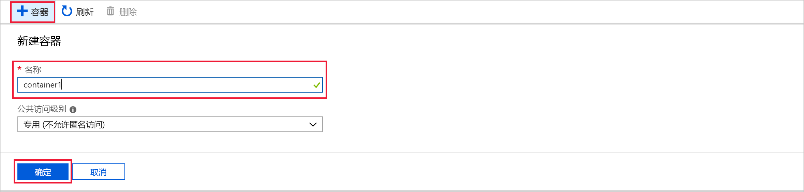

## <a name="create-a-stream-analytics-job"></a>创建流分析作业

1. 登录到 Azure 门户。

2. 在 Azure 门户的左上角选择“创建资源”。   

3. 从结果列表中选择“分析”   >   “流分析作业”。  

4. 使用以下信息填写“流分析作业”页：

   |**设置**  |**建议的值**  |**说明**  |
   |---------|---------|---------|
   |作业名称   |  MyASAJob   |   输入用于标识流分析作业的名称。 流分析作业名称只能包含字母数字字符、连字符和下划线，其长度必须介于 3 到 63 个字符之间。 |
   |订阅  | 用户的订阅\<\> |  选择要用于此作业的 Azure 订阅。 |
   |资源组   |   asaquickstart-resourcegroup  |   选择与 IoT 中心相同的资源组。 |
   |位置  |  \<选择离用户最近的区域\> | 选择可以在其中托管流分析作业的地理位置。 使用最靠近用户的位置，以便改进性能并减少数据传输成本。 |
   |流式处理单位  | 1  |   流单元表示执行作业所需的计算资源。 默认情况下，此值设置为 1。 若要了解如何缩放流单元，请参阅[了解和调整流单元](stream-analytics-streaming-unit-consumption.md)一文。   |
   |宿主环境  |  云  |   流分析作业可以部署到云或边缘设备。 可以通过云部署到 Azure 云，通过“Edge”部署到 IoT Edge 设备。 |

   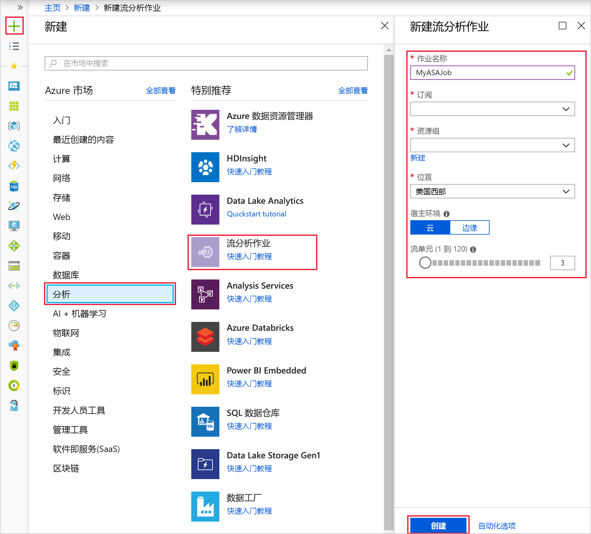

5. 选中用于将作业置于仪表板上的“固定到仪表板”复选框，然后选择“创建”   。  

6. 此时会在浏览器窗口右上角显示“正在部署...”通知。  

## <a name="configure-job-input"></a>配置作业输入

在此部分，需配置流分析作业的 IoT 中心设备输入。 使用在本快速入门的上一部分创建的 IoT 中心。

1. 导航到流分析作业。  

2. 选择“输入”   > “添加流输入”   >   “IoT 中心”。  

3. 使用以下值填写“IoT 中心”页  ：

   |**设置**  |**建议的值**  |**说明**  |
   |---------|---------|---------|
   |输入别名  |  IoTHubInput   |  输入一个名称，用于标识作业的输入。   |
   |订阅   |  用户的订阅\<\> |  选择包含已创建的存储帐户的 Azure 订阅。 存储帐户可以在同一订阅中，也可以在另一订阅中。 此示例假定已在同一订阅中创建存储帐户。 |
   |IoT 中心  |  MyASAIoTHub |  输入在上一部分创建的 IoT 中心的名称。 |

4. 让其他选项保留默认值，然后选择“保存”以保存设置。   

   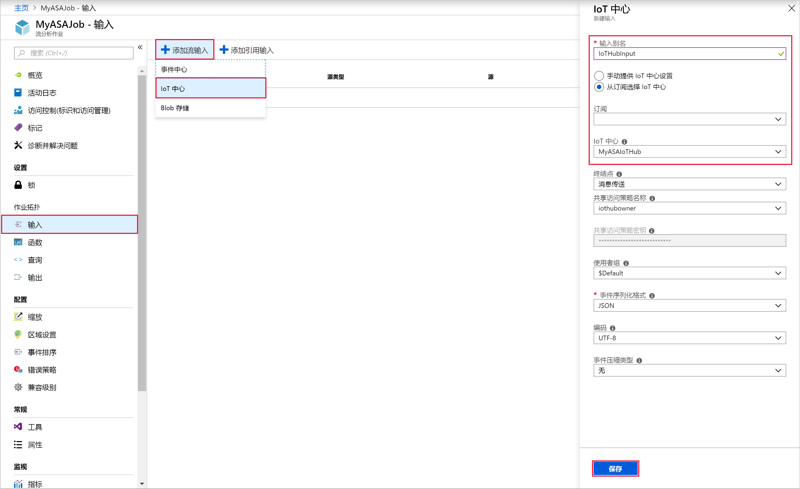
 
## <a name="configure-job-output"></a>配置作业输出

1. 导航到此前创建的的流分析作业。  

2. 选择“输出”   > “添加”   >   “Blob 存储”。  

3. 使用以下值填写“Blob 存储”页  ：

   |**设置**  |**建议的值**  |**说明**  |
   |---------|---------|---------|
   |输出别名 |   BlobOutput   |   输入一个名称，用于标识作业的输出。 |
   |订阅  |  用户的订阅\<\>  |  选择包含已创建的存储帐户的 Azure 订阅。 存储帐户可以在同一订阅中，也可以在另一订阅中。 此示例假定已在同一订阅中创建存储帐户。 |
   |存储帐户 |  asaquickstartstorage |   选择或输入存储帐户的名称。 如果在同一订阅中创建存储帐户名称，则会自动将其删除。       |
   |容器 |   container1  |  选择你在存储帐户中创建的现有容器。   |

4. 让其他选项保留默认值，然后选择“保存”以保存设置。   

   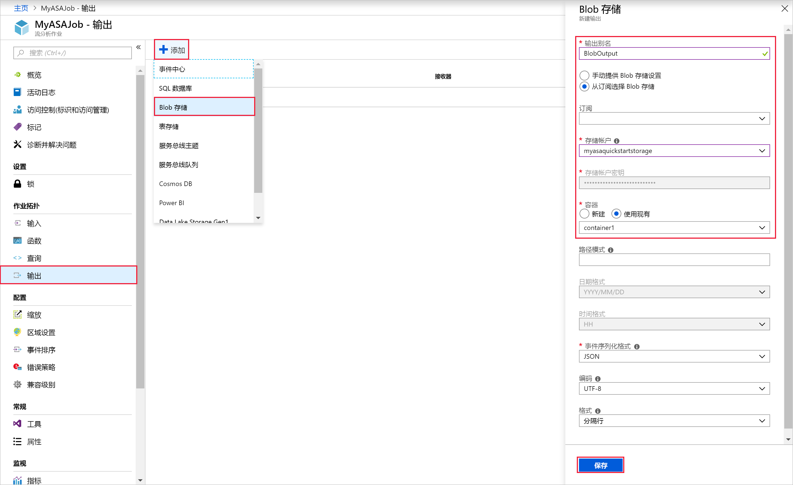
 
## <a name="define-the-transformation-query"></a>定义转换查询

1. 导航到此前创建的的流分析作业。  

2. 选择“查询”  ，然后更新查询，如下所示：  

   ```sql
   SELECT *
   INTO BlobOutput
   FROM IoTHubInput
   HAVING Temperature > 27
   ```

3. 在此示例中，查询从 IoT 中心读取数据，然后将其复制到 Blob 中的新文件。 选择“保存”。   

   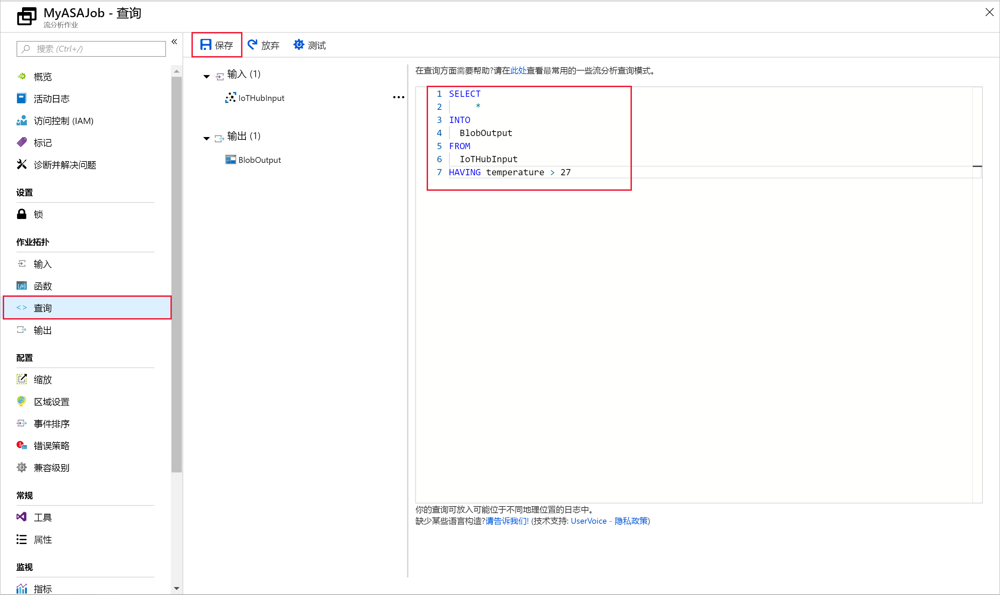

## <a name="run-the-iot-simulator"></a>运行 IoT 模拟器

1. 打开 [Raspberry Pi Azure IoT 联机模拟器](https://azure-samples.github.io/raspberry-pi-web-simulator/)。

2. 将第 15 行的占位符替换为在上一部分保存的 Azure IoT 中心设备连接字符串。

3. 单击 **“运行”** 。 输出会显示传感器数据和发送到 IoT 中心的消息。

   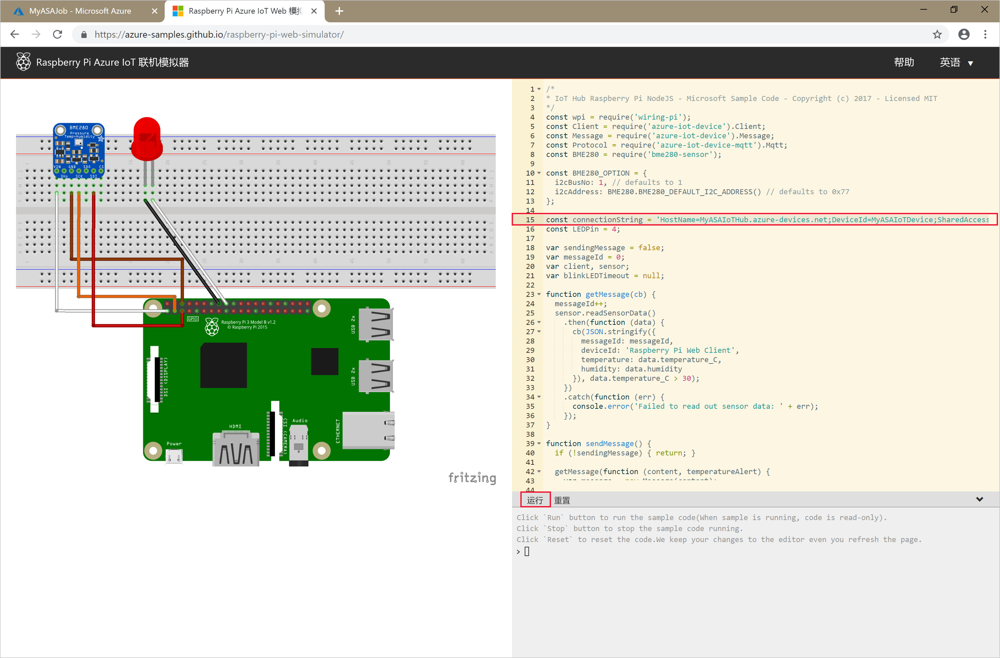

## <a name="start-the-stream-analytics-job-and-check-the-output"></a>启动流分析作业并检查输出

1. 返回到作业概览页，然后选择“启动”。 

2. 对于“作业输出启动时间”字段，请在“启动作业”  下选择“现在”  。  然后选择“启动”，以便启动作业  。

3. 数分钟后，在门户中找到存储帐户以及此前已配置为作业输出的容器。 现在可以在容器中看到输出文件。 此作业的首次启动需要数分钟的时间，但在启动后，只要有数据到达，它就会持续运行。  

   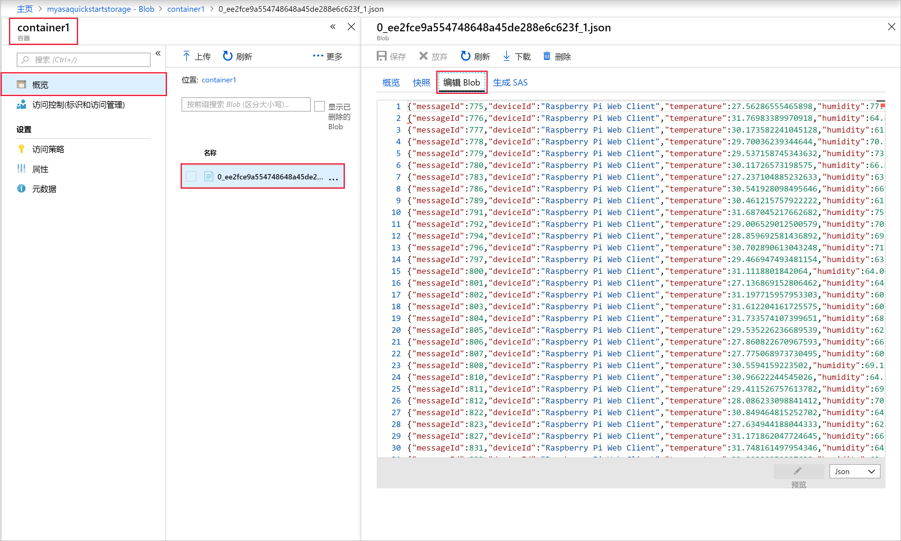

## <a name="clean-up-resources"></a>清理资源

若不再需要资源组、流分析作业以及所有相关资源，请将其删除。 删除作业可避免对作业使用的流单元进行计费。 如果计划在将来使用该作业，可以先停止它，等到以后需要时再重启它。 如果不打算继续使用该作业，请按照以下步骤删除本快速入门创建的所有资源：

1. 在 Azure 门户的左侧菜单中选择“资源组”  ，然后选择已创建资源的名称。  

2. 在资源组页上选择“删除”，在文本框中键入要删除的资源的名称，然后选择“删除”。  

## <a name="next-steps"></a>后续步骤

在本快速入门中，你使用 Azure 门户部署了一个简单的流分析作业。 也可通过 [PowerShell](stream-analytics-quick-create-powershell.md)、[Visual Studio](stream-analytics-quick-create-vs.md) 和 [Visual Studio Code](quick-create-vs-code.md) 部署流分析作业。

若要了解如何配置其他输入源并执行实时检测，请继续阅读以下文章：

> [!div class="nextstepaction"]
> [使用 Azure 流分析实时检测欺诈行为](stream-analytics-real-time-fraud-detection.md)
