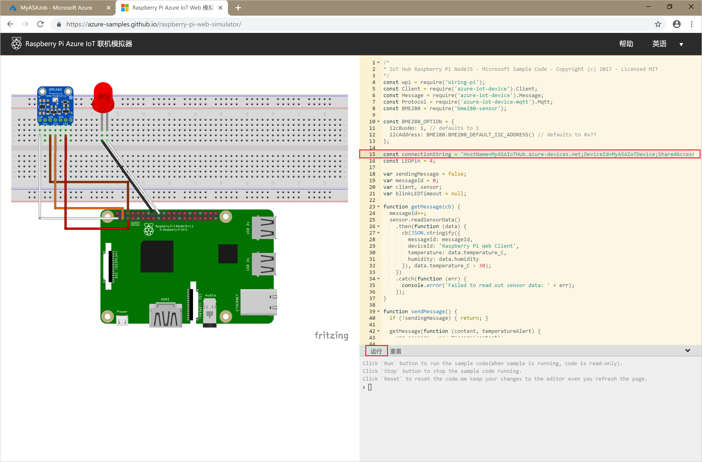

# <a name="quickstart-create-a-stream-analytics-job-using-azure-powershell"></a>快速入门：使用 Azure PowerShell 创建流分析作业

Azure PowerShell 模块用于通过 PowerShell cmdlet 或脚本创建和管理 Azure 资源。 本快速入门详细介绍了如何使用 Azure PowerShell 模块来部署并运行 Azure 流分析作业。

示例作业从 IoT 中心设备中读取流式处理数据。 输入数据由 Raspberry Pi 联机模拟器生成。 接下来，流分析作业使用流分析查询语言对数据进行转换，以便筛选所涉及的温度大于 27° 的消息。 最后，作业将生成的输出事件写入到 Blob 存储的一个文件中。

## <a name="before-you-begin"></a>开始之前

[!INCLUDE [updated-for-az](../../includes/updated-for-az.md)]

* 如果没有 Azure 订阅，请创建一个[免费帐户](https://azure.microsoft.com/free/)。

* 本快速入门需要 Azure PowerShell 模块。 运行 `Get-Module -ListAvailable Az` 即可找到在本地计算机上安装的版本。 如果需要进行安装或升级，请参阅[安装 Azure PowerShell 模块](https://docs.microsoft.com/powershell/azure/install-Az-ps)。

* 某些 IoT 中心操作不受 Azure PowerShell 支持，必须使用 Azure CLI 2.0.70 或更高版本以及 Azure CLI 的 IoT 扩展来完成。 [安装 Azure CLI](https://docs.microsoft.com/cli/azure/install-azure-cli?view=azure-cli-latest)，并使用 `az extension add --name azure-iot` 来安装 IoT 扩展。


## <a name="sign-in-to-azure"></a>登录 Azure

使用 `Connect-AzAccount` 命令登录到 Azure 订阅，然后在弹出的浏览器中输入 Azure 凭据：

```powershell
# Connect to your Azure account
Connect-AzAccount
```

如果有多个订阅，请运行以下 cmdlet，选择要用于本快速入门的订阅。 请确保将 `<your subscription name>` 替换为订阅的名称：

```powershell
# List all available subscriptions.
Get-AzSubscription

# Select the Azure subscription you want to use to create the resource group and resources.
Get-AzSubscription -SubscriptionName "<your subscription name>" | Select-AzSubscription
```

## <a name="create-a-resource-group"></a>创建资源组

使用 [New-AzResourceGroup](https://docs.microsoft.com/powershell/module/az.resources/new-azresourcegroup) 创建 Azure 资源组。 资源组是在其中部署和管理 Azure 资源的逻辑容器。

```powershell
$resourceGroup = "StreamAnalyticsRG"
$location = "WestUS2"
New-AzResourceGroup `
    -Name $resourceGroup `
    -Location $location
```

## <a name="prepare-the-input-data"></a>对输入数据进行准备

在定义流分析作业之前，请对已配置为作业输入的数据进行准备。

以下 Azure CLI 代码块通过多项命令来准备作业所需的输入数据。 查看介绍代码的部分。

1. 在 PowerShell 窗口中运行 [az login](https://docs.microsoft.com/cli/azure/authenticate-azure-cli?view=azure-cli-latest) 命令，以便登录到 Azure 帐户。

    当你成功登录后，Azure CLI 会返回订阅的列表。 复制用于本快速入门的订阅，然后运行 [az account set](https://docs.microsoft.com/cli/azure/manage-azure-subscriptions-azure-cli?view=azure-cli-latest#change-the-active-subscription) 命令以选择该订阅。 选择在上一部分使用 PowerShell 选择的订阅。 确保将 `<your subscription name>` 替换为订阅的名称。

    ```azurecli
    az login

    az account set --subscription "<your subscription>"
    ```

2. 使用 [az iot hub create](../iot-hub/iot-hub-create-using-cli.md#create-an-iot-hub) 命令创建 IoT 中心。 此示例创建名为 **MyASAIoTHub** 的 IoT 中心。 由于 IoT 中心名称是唯一的，因此需使用你自己的 IoT 中心名称。 将 SKU 设置为 F1 即可使用免费层，前提是它在订阅中可用。 否则，请选择下一个最低的层。

    ```azurecli
    az iot hub create --name "<your IoT Hub name>" --resource-group $resourceGroup --sku S1
    ```

    创建 IoT 中心以后，请使用 [az iot hub show-connection-string](https://docs.microsoft.com/cli/azure/iot/hub?view=azure-cli-latest) 命令获取 IoT 中心连接字符串。 复制整个连接字符串并将其保存。这样，在将 IoT 中心作为输入添加到流分析作业时，就可以使用该字符串。

    ```azurecli
    az iot hub show-connection-string --hub-name "MyASAIoTHub"
    ```

3. 使用 [az iothub device-identity create](../iot-hub/quickstart-send-telemetry-c.md#register-a-device) 命令将设备添加到 IoT 中心。 此示例创建名为 **MyASAIoTDevice** 的设备。

    ```azurecli
    az iot hub device-identity create --hub-name "MyASAIoTHub" --device-id "MyASAIoTDevice"
    ```

4. 使用 [az iot hub device-identity show-connection-string](/cli/azure/ext/azure-iot/iot/hub/device-identity#ext-azure-iot-az-iot-hub-device-identity-show-connection-string) 命令获取设备连接字符串。 复制整个连接字符串并将其保存。这样，在创建 Raspberry Pi 模拟器时，就可以使用该字符串。

    ```azurecli
    az iot hub device-identity show-connection-string --hub-name "MyASAIoTHub" --device-id "MyASAIoTDevice" --output table
    ```

    **输出示例：**

    ```output
    HostName=MyASAIoTHub.azure-devices.net;DeviceId=MyASAIoTDevice;SharedAccessKey=a2mnUsg52+NIgYudxYYUNXI67r0JmNubmfVafojG8=
    ```

## <a name="create-blob-storage"></a>创建 Blob 存储

以下 Azure PowerShell 代码块使用命令来创建用于作业输出的 Blob 存储。 查看介绍代码的部分。

1. 使用 [New-AzStorageAccount](https://docs.microsoft.com/powershell/module/az.storage/New-azStorageAccount) cmdlet 创建标准的常规用途存储帐户。  本示例创建一个名为 **myasaquickstartstorage** 的存储帐户，该帐户默认启用本地冗余存储 (LRS) 和 Blob 加密。

2. 检索存储帐户上下文 `$storageAccount.Context`，该上下文定义要使用的存储帐户。 使用存储帐户时，请引用上下文而不是重复提供凭据。

3. 使用 [New-AzStorageContainer](https://docs.microsoft.com/powershell/module/az.storage/new-azstoragecontainer) 创建存储容器。

4. 复制代码所输出的存储密钥，然后保存该密钥，以便稍后创建流式处理作业的输出。

    ```powershell
    $storageAccountName = "myasaquickstartstorage"
    $storageAccount = New-AzStorageAccount `
      -ResourceGroupName $resourceGroup `
      -Name $storageAccountName `
      -Location $location `
      -SkuName Standard_LRS `
      -Kind Storage

    $ctx = $storageAccount.Context
    $containerName = "container1"

    New-AzStorageContainer `
      -Name $containerName `
      -Context $ctx

    $storageAccountKey = (Get-AzStorageAccountKey `
      -ResourceGroupName $resourceGroup `
      -Name $storageAccountName).Value[0]

    Write-Host "The <storage account key> placeholder needs to be replaced in your output json files with this key value:"
    Write-Host $storageAccountKey -ForegroundColor Cyan
    ```

## <a name="create-a-stream-analytics-job"></a>创建流分析作业

请使用 [New-AzStreamAnalyticsJob](https://docs.microsoft.com/powershell/module/az.streamanalytics/new-azstreamanalyticsjob) cmdlet 创建流分析作业。 此 cmdlet 使用作业名称、资源组名称和作业定义作为参数。 作业名称可以是用于标识作业的任何友好名称， 但只能包含字母数字字符、连字符和下划线，且其长度必须介于 3 到 63 个字符之间。 作业定义是一个 JSON 文件，其中包含创建作业所需的属性。 在本地计算机上创建名为 `JobDefinition.json` 的文件，并向其添加以下 JSON 数据：

```json
{
  "location":"WestUS2",
  "properties":{
    "sku":{
      "name":"standard"
    },
    "eventsOutOfOrderPolicy":"adjust",
    "eventsOutOfOrderMaxDelayInSeconds":10,
    "compatibilityLevel": 1.1
  }
}
```

接下来运行 `New-AzStreamAnalyticsJob` cmdlet。 将 `jobDefinitionFile` 变量的值替换为在其中存储了作业定义 JSON 文件的路径。

```powershell
$jobName = "MyStreamingJob"
$jobDefinitionFile = "C:\JobDefinition.json"
New-AzStreamAnalyticsJob `
  -ResourceGroupName $resourceGroup `
  -File $jobDefinitionFile `
  -Name $jobName `
  -Force
```

## <a name="configure-input-to-the-job"></a>配置作业输入

使用 [New-AzStreamAnalyticsInput](https://docs.microsoft.com/powershell/module/az.streamanalytics/new-azstreamanalyticsinput) cmdlet 将输入添加到作业。 此 cmdlet 使用作业名称、作业输入名称、资源组名称和作业输入定义作为参数。 作业输入定义是一个 JSON 文件，其中包含配置作业的输入所需的属性。 在此示例中，需将 Blob 存储创建为输入。

在本地计算机上创建名为 `JobInputDefinition.json` 的文件，并向其添加以下 JSON 数据。 确保将 `accesspolicykey` 的值替换为在上一部分保存的 IoT 中心设备连接字符串的 `SharedAccessKey` 部分。

```json
{
    "properties": {
        "type": "Stream",
        "datasource": {
            "type": "Microsoft.Devices/IotHubs",
            "properties": {
                "iotHubNamespace": "MyASAIoTHub",
                "sharedAccessPolicyName": "iothubowner",
                "sharedAccessPolicyKey": "accesspolicykey",
                "endpoint": "messages/events",
                "consumerGroupName": "$Default"
                }
        },
        "compression": {
            "type": "None"
        },
        "serialization": {
            "type": "Json",
            "properties": {
                "encoding": "UTF8"
            }
        }
    },
    "name": "IoTHubInput",
    "type": "Microsoft.StreamAnalytics/streamingjobs/inputs"
}
```

接下来运行 `New-AzStreamAnalyticsInput` cmdlet，确保将 `jobDefinitionFile` 变量的值替换为在其中存储了作业输入定义 JSON 文件的路径。

```powershell
$jobInputName = "IoTHubInput"
$jobInputDefinitionFile = "C:\JobInputDefinition.json"
New-AzStreamAnalyticsInput `
  -ResourceGroupName $resourceGroup `
  -JobName $jobName `
  -File $jobInputDefinitionFile `
  -Name $jobInputName
```

## <a name="configure-output-to-the-job"></a>配置作业输出

使用 [New-AzStreamAnalyticsOutput](https://docs.microsoft.com/powershell/module/az.streamanalytics/new-azstreamanalyticsoutput) cmdlet 将输出添加到作业。 此 cmdlet 使用作业名称、作业输出名称、资源组名称和作业输出定义作为参数。 作业输出定义是一个 JSON 文件，其中包含配置作业的输出所需的属性。 此示例使用 Blob 存储作为输出。

在本地计算机上创建名为 `JobOutputDefinition.json` 的文件，并向其添加以下 JSON 数据。 确保将 `accountKey` 的值替换为存储帐户的访问密钥，该密钥是存储在 $storageAccountKey 值中的值。

```json
{
    "properties": {
        "datasource": {
            "type": "Microsoft.Storage/Blob",
            "properties": {
                "storageAccounts": [
                    {
                      "accountName": "asaquickstartstorage",
                      "accountKey": "<storage account key>"
                    }
                ],
                "container": "container1",
                "pathPattern": "output/",
                "dateFormat": "yyyy/MM/dd",
                "timeFormat": "HH"
            }
        },
        "serialization": {
            "type": "Json",
            "properties": {
                "encoding": "UTF8",
                "format": "LineSeparated"
            }
        }
    },
    "name": "BlobOutput",
    "type": "Microsoft.StreamAnalytics/streamingjobs/outputs"
}
```

接下来运行 `New-AzStreamAnalyticsOutput` cmdlet。 确保将 `jobOutputDefinitionFile` 变量的值替换为在其中存储了作业输出定义 JSON 文件的路径。

```powershell
$jobOutputName = "BlobOutput"
$jobOutputDefinitionFile = "C:\JobOutputDefinition.json"
New-AzStreamAnalyticsOutput `
  -ResourceGroupName $resourceGroup `
  -JobName $jobName `
  -File $jobOutputDefinitionFile `
  -Name $jobOutputName -Force
```

## <a name="define-the-transformation-query"></a>定义转换查询

使用 [New-AzStreamAnalyticsTransformation](https://docs.microsoft.com/powershell/module/az.streamanalytics/new-azstreamanalyticstransformation) cmdlet 将转换添加到作业。 此 cmdlet 使用作业名称、作业转换名称、资源组名称和作业转换定义作为参数。 在本地计算机上创建名为 `JobTransformationDefinition.json` 的文件，并向其添加以下 JSON 数据。 此 JSON 文件包含一个查询参数，用于定义转换查询：

```json
{
    "name":"MyTransformation",
    "type":"Microsoft.StreamAnalytics/streamingjobs/transformations",
    "properties":{
        "streamingUnits":1,
        "script":null,
        "query":" SELECT * INTO BlobOutput FROM IoTHubInput HAVING Temperature > 27"
    }
}
```

接下来运行 `New-AzStreamAnalyticsTransformation` cmdlet。 确保将 `jobTransformationDefinitionFile` 变量的值替换为在其中存储了作业转换定义 JSON 文件的路径。

```powershell
$jobTransformationName = "MyJobTransformation"
$jobTransformationDefinitionFile = "C:\JobTransformationDefinition.json"
New-AzStreamAnalyticsTransformation `
  -ResourceGroupName $resourceGroup `
  -JobName $jobName `
  -File $jobTransformationDefinitionFile `
  -Name $jobTransformationName -Force
```

## <a name="run-the-iot-simulator"></a>运行 IoT 模拟器

1. 打开 [Raspberry Pi Azure IoT 联机模拟器](https://azure-samples.github.io/raspberry-pi-web-simulator/)。

2. 将第 15 行的占位符替换为在上一部分保存的整个 Azure IoT 中心设备连接字符串。

3. 单击 **“运行”** 。 输出会显示传感器数据和发送到 IoT 中心的消息。

    

## <a name="start-the-stream-analytics-job-and-check-the-output"></a>启动流分析作业并检查输出

请使用 [Start-AzStreamAnalyticsJob](https://docs.microsoft.com/powershell/module/az.streamanalytics/start-azstreamanalyticsjob) cmdlet 启动作业。 此 cmdlet 使用作业名称、资源组名称、输出启动模式和启动时间作为参数。 `OutputStartMode` 接受的值为 `JobStartTime`、`CustomTime` 或 `LastOutputEventTime`。 若要详细了解每个值是指什么，请参阅 PowerShell 文档中的[参数](https://docs.microsoft.com/powershell/module/az.streamanalytics/start-azstreamanalyticsjob)部分。

以下 cmdlet 在运行以后会返回 `True` 作为输出（如果作业启动）。 在存储容器中，创建的输出文件夹包含已转换的数据。

```powershell
Start-AzStreamAnalyticsJob `
  -ResourceGroupName $resourceGroup `
  -Name $jobName `
  -OutputStartMode 'JobStartTime'
```

## <a name="clean-up-resources"></a>清理资源

若不再需要资源组、流式处理作业以及所有相关资源，请将其删除。 删除作业可避免对作业使用的流单元进行计费。 如果计划在将来使用该作业，可以跳过删除它的操作，暂时只需停止该作业。 如果不打算继续使用该作业，请运行以下 cmdlet，删除本快速入门创建的所有资源：

```powershell
Remove-AzResourceGroup `
  -Name $resourceGroup
```

## <a name="next-steps"></a>后续步骤

在本快速入门中，你使用 PowerShell 部署了一个简单的流分析作业。 也可通过 [Azure 门户](stream-analytics-quick-create-portal.md)和 [Visual Studio](stream-analytics-quick-create-vs.md) 部署流分析作业。

若要了解如何配置其他输入源并执行实时检测，请继续阅读以下文章：

> [!div class="nextstepaction"]
> [使用 Azure 流分析实时检测欺诈行为](stream-analytics-real-time-fraud-detection.md)
