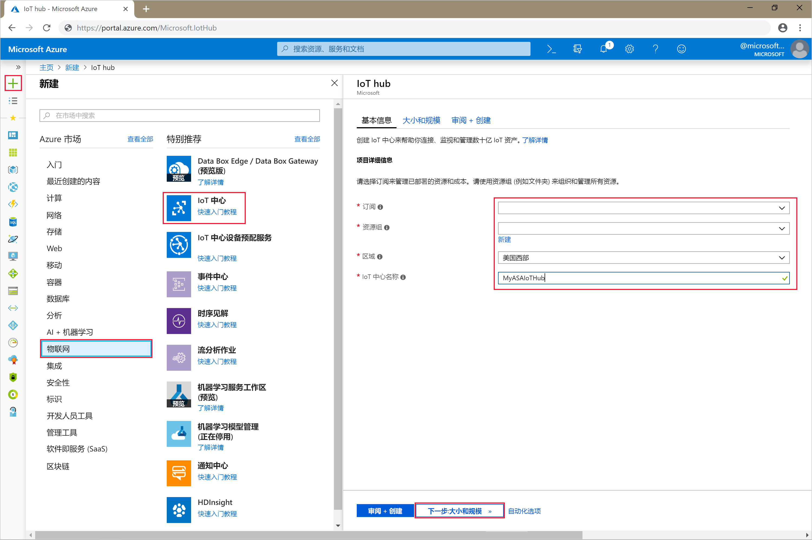
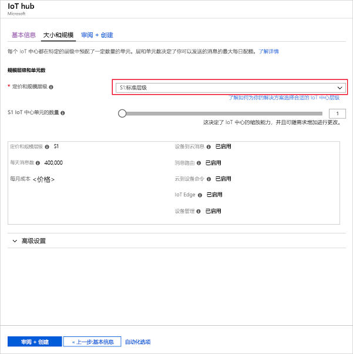
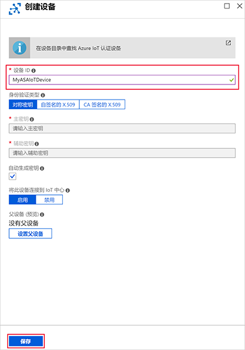
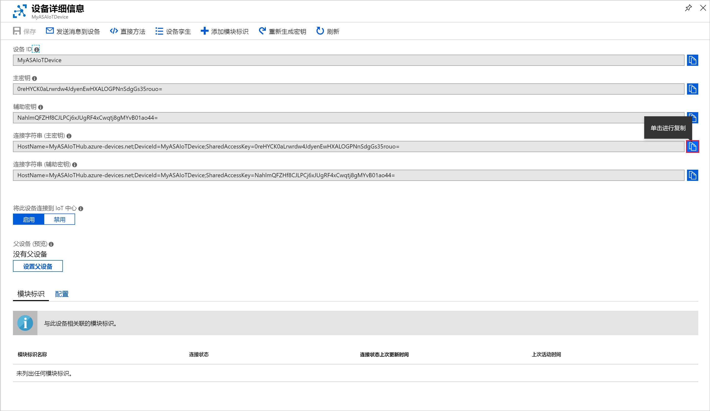

# <a name="quickstart-create-a-stream-analytics-job-by-using-the-azure-stream-analytics-tools-for-visual-studio"></a>快速入门：使用适用于 Visual Studio 的 Azure 流分析工具创建流分析作业

本快速入门展示了如何使用用于 Visual Studio 的 Azure 流分析工具创建和运行流分析作业。 示例作业从 IoT 中心设备中读取流式处理数据。 你将定义一个作业，用以计算超过 27° 时的平均温度并将生成的输出事件写入到 blob 存储中的一个新文件。

## <a name="before-you-begin"></a>开始之前

* 如果还没有 Azure 订阅，可以创建一个[免费帐户](https://azure.microsoft.com/free/)。

* 登录到 [Azure 门户](https://portal.azure.com/)。

* 安装 Visual Studio 2019、Visual Studio 2015 或 Visual Studio 2013 Update 4。 支持 Enterprise (Ultimate/Premium)、Professional、Community 版本。 不支持 Express 版本。

* 按照[安装说明](https://docs.microsoft.com/azure/stream-analytics/stream-analytics-tools-for-visual-studio-install)安装用于 Visual Studio 的流分析工具。

## <a name="prepare-the-input-data"></a>对输入数据进行准备

在定义流分析作业之前，应该对稍后会配置为作业输入的数据进行准备。 若要对作业所需的输入数据进行准备，请完成以下步骤：

1. 登录到 [Azure 门户](https://portal.azure.com/)。

2. 选择“创建资源” > “物联网” > “IoT 中心”    。

3. 在“IoT 中心”窗格中，输入以下信息： 
   
   |**设置**  |**建议的值**  |**说明**  |
   |---------|---------|---------|
   |订阅  | 用户的订阅\<\> |  选择要使用的 Azure 订阅。 |
   |资源组   |   asaquickstart-resourcegroup  |   选择“新建”  ，然后输入帐户的新资源组名称。 |
   |区域  |  \<选择离用户最近的区域\> | 选择可以在其中托管 IoT 中心的地理位置。 使用最靠近用户的位置。 |
   |IoT 中心名称  | MyASAIoTHub  |   选择 IoT 中心的名称。   |

   

4. 在完成时选择“下一步:  设置大小和规模”。

5. 选择“定价和缩放层”  。 就本快速入门来说，请选择“F1 - 免费”层（前提是此层在订阅上仍然可用）  。 如果免费层不可用，请选择可用的最低层。 有关详细信息，请参阅 [IoT 中心定价](https://azure.microsoft.com/pricing/details/iot-hub/)。

   

6. 选择“查看 + 创建”  。 查看 IoT 中心信息，然后单击“创建”  。 创建 IoT 中心可能需要数分钟的时间。 可在“通知”窗格中监视进度。 

7. 在 IoT 中心导航菜单的“IoT 设备”下单击“添加”   。 添加“设备 ID”，然后单击“保存”。  

   

8. 创建设备后，请从“IoT 设备”列表打开设备  。 复制“连接字符串 -- 主密钥”并将其保存到记事本，供稍后使用  。

   

## <a name="create-blob-storage"></a>创建 Blob 存储

1. 从 Azure 门户的左上角选择“创建资源”   > “存储”   >   “存储帐户”。

2. 在“创建存储帐户”  窗格中，输入存储帐户名称、位置和资源组。 选择与创建的 IoT 中心相同的位置和资源组。 然后单击“查看 + 创建”，以便创建帐户  。

   

3. 创建存储帐户以后，请在“概览”窗格上选择“Blob”磁贴。  

   

4. 从“Blob 服务”  页面中，选择“容器”  ，为你的容器提供一个名称，例如 *container1*。 将“公共访问级别”保留为“专用(非匿名访问)”，然后选择“确定”。   

   

## <a name="create-a-stream-analytics-project"></a>创建流分析项目

1. 启动 Visual Studio。

2. 选择“文件”>“新建项目”  。  

3. 在左侧的模板列表中，选择“流分析”，然后选择“Azure 流分析应用程序”   。  

4. 输入项目的**名称**、**位置**和**解决方案名称**，然后选择“确定”  。

   

注意 Azure 流分析项目中包括的元素。

   


## <a name="choose-the-required-subscription"></a>选择所需的订阅

1. 在 Visual Studio 中，在“视图”菜单中选择“服务器资源管理器”   。

2. 右键单击“Azure”并选择“连接到 Microsoft Azure 订阅”，然后使用你的 Azure 帐户进行登录。  

## <a name="define-input"></a>定义输入

1. 在“解决方案资源管理器”中，展开“输入”节点，然后双击“Input.json”    。

2. 使用以下值填写“流分析输入配置”  ：

   |**设置**  |**建议的值**  |**说明**   |
   |---------|---------|---------|
   |输入别名  |  输入   |  输入一个名称，用于标识作业的输入。   |
   |源类型   |  数据流 |  选择合适的输入源：数据流或参考数据。   |
   |源  |  IoT 中心 |  选择合适的输入源。   |
   |资源  | 选择当前帐户中的数据源 | 选择手动输入数据或选择现有帐户。   |
   |订阅  |  用户的订阅\<\>   | 选择包含创建的 IoT 中心的 Azure 订阅。   |
   |IoT 中心  |  MyASAIoTHub   |  选择或输入 IoT 中心的名称。 如果在同一订阅中创建 IoT 中心名称，则会自动将其删除。   |
   
3. 让其他选项保留默认值，然后选择“保存”以保存设置。   

   

## <a name="define-output"></a>定义输出

1. 在“解决方案资源管理器”中，展开“输出”节点，然后双击“Output.json”    。

2. 使用以下值填写“流分析输出配置”  ：

   |**设置**  |**建议的值**  |**说明**   |
   |---------|---------|---------|
   |输出别名  |  输出   |  输入一个名称，用于标识作业的输出。   |
   |接收器   |  Blob 存储 |  选择合适的接收器。    |
   |资源  |  手动提供数据源设置 |  选择手动输入数据或选择现有帐户。   |
   |订阅  |  用户的订阅\<\>   | 选择包含已创建的存储帐户的 Azure 订阅。 存储帐户可以在同一订阅中，也可以在另一订阅中。 此示例假定已在同一订阅中创建存储帐户。   |
   |存储帐户  |  asaquickstartstorage   |  选择或输入存储帐户的名称。 如果在同一订阅中创建存储帐户名称，则会自动将其删除。   |
   |容器  |  container1   |  选择你在存储帐户中创建的现有容器。   |
   |路径模式  |  output   |  输入要在容器内创建的文件路径的名称。   |
   
3. 让其他选项保留默认值，然后选择“保存”以保存设置。   

   

## <a name="define-the-transformation-query"></a>定义转换查询

1. 从 Visual Studio 中的“解决方案资源管理器”  打开 **Script.asaql**。

2. 添加以下查询：

   ```sql
   SELECT *
   INTO BlobOutput
   FROM IoTHubInput
   HAVING Temperature > 27
   ```

## <a name="submit-a-stream-analytics-query-to-azure"></a>将流分析查询提交到 Azure

1. 在“查询编辑器”中，选择脚本编辑器中的“提交到 Azure”   。

2. 选择“创建新的 Azure 流分析作业”  并输入**作业名称**。 选择你在本快速入门开头使用的**订阅**、**资源组**和**位置**。

   

## <a name="run-the-iot-simulator"></a>运行 IoT 模拟器

1. 在新的浏览器标签页或窗口中打开 [Raspberry Pi Azure IoT 联机模拟器](https://azure-samples.github.io/raspberry-pi-web-simulator/)。

2. 将第 15 行的占位符替换为在上一部分保存的 Azure IoT 中心设备连接字符串。

3. 单击“运行”  。 输出会显示传感器数据和发送到 IoT 中心的消息。

   

## <a name="start-the-stream-analytics-job-and-check-output"></a>启动流分析作业并检查输出

1. 在作业创建后，作业视图会自动打开。 选择绿色箭头按钮以启动作业。

   

2. 将“作业输出启动模式”  更改为“JobStartTime”  ，然后选择“启动”  。

   

3. 请注意，作业状态已更改为“正在运行”，并出现了输入/输出事件。  这可能需要几分钟的时间。

   

4. 若要查看结果，请在“视图”  菜单上选择“Cloud Explorer”  ，然后导航到你的资源组中的存储帐户。 在“Blob 容器”  下，双击 **container1**，然后双击**输出**文件路径。

   

## <a name="clean-up-resources"></a>清理资源

若不再需要资源组、流式处理作业以及所有相关资源，请将其删除。 删除作业可避免对作业使用的流单元进行计费。 如果计划在将来使用该作业，可以先停止它，等到以后需要时再重启它。 如果不打算继续使用该作业，请按照以下步骤删除本快速入门创建的所有资源：

1. 在 Azure 门户的左侧菜单中选择“资源组”  ，然后选择已创建资源的名称。  

2. 在资源组页上选择“删除”，在文本框中键入要删除的资源的名称，然后选择“删除”。  

## <a name="next-steps"></a>后续步骤

在本快速入门中，你使用 Visual Studio 部署了一个简单的流分析作业。 也可通过 [Azure 门户](stream-analytics-quick-create-portal.md)和 [PowerShell](stream-analytics-quick-create-powershell.md) 部署流分析作业。 

若要了解适用于 Visual Studio 的 Azure 流分析工具，请继续阅读以下文章：

> [!div class="nextstepaction"]
> [使用 Visual Studio 查看 Azure 流分析作业](stream-analytics-vs-tools.md)
