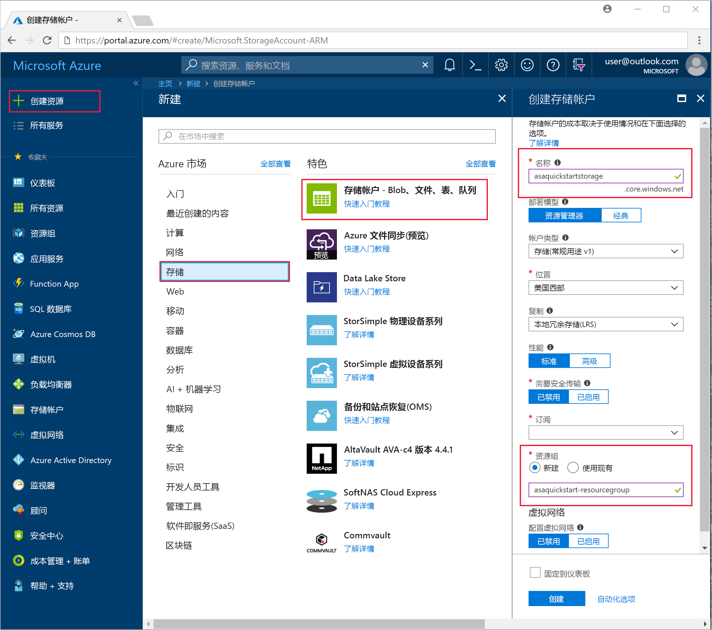
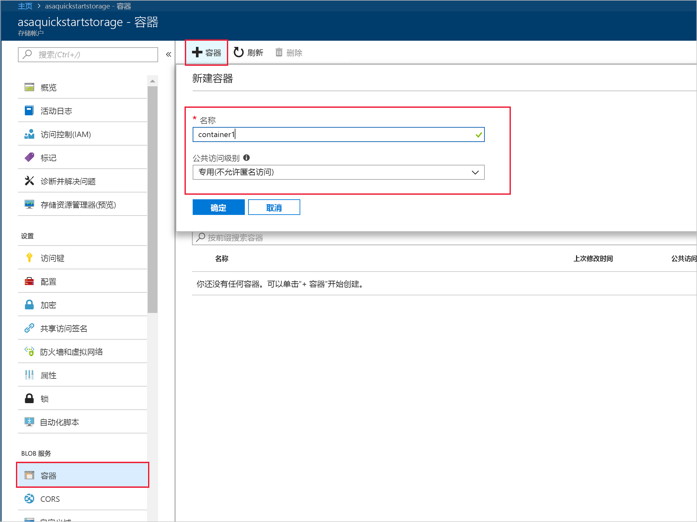
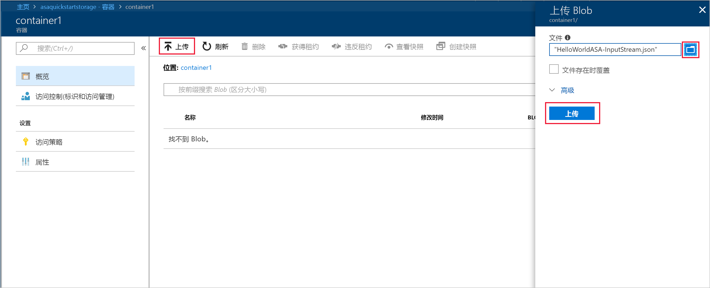
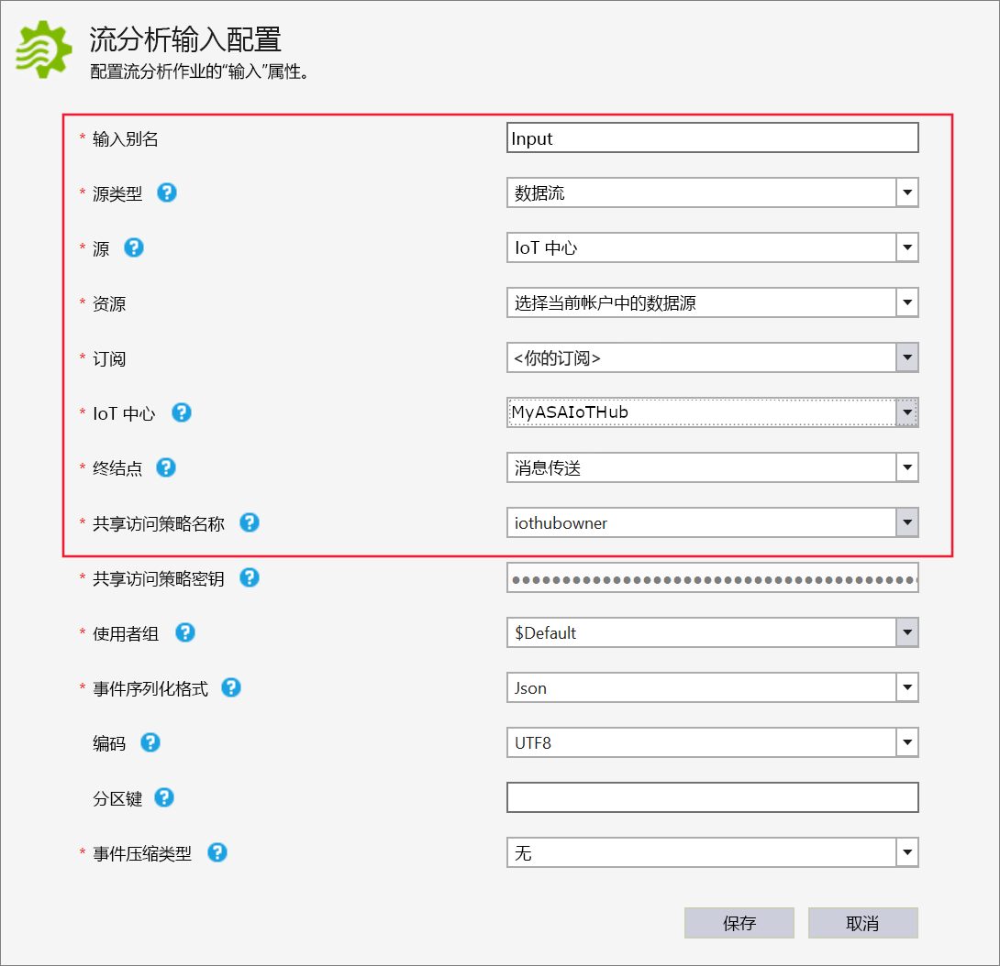
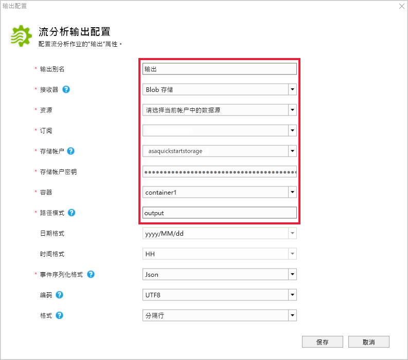
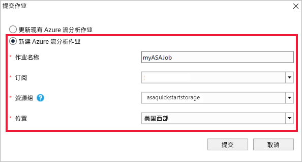
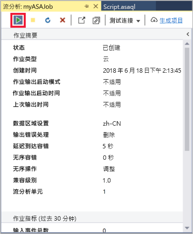
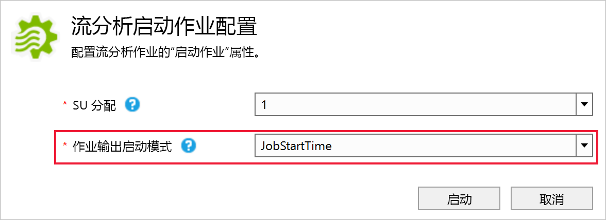
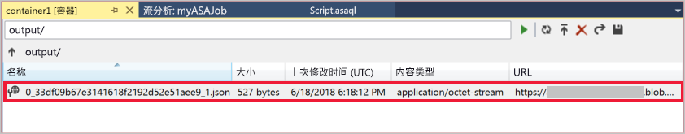

# <a name="quickstart-create-a-stream-analytics-job-by-using-the-azure-stream-analytics-tools-for-visual-studio"></a>快速入门：使用用于 Visual Studio 的 Azure 流分析工具创建流分析作业

本快速入门展示了如何使用用于 Visual Studio 的 Azure 流分析工具创建和运行流分析作业。 示例作业从 Azure Blob 存储中读取流式处理数据。 在本快速入门中使用的输入数据文件包含的静态数据仅供说明之用。 在实际方案中，请将流式处理输入数据用于流分析作业。 在本快速入门中，你将定义一个作业，用以计算超过 100° 时的平均温度并将生成的输出事件写入到一个新文件中。

## <a name="before-you-begin"></a>开始之前

* 如果还没有 Azure 订阅，可以创建一个[免费帐户](https://azure.microsoft.com/free/)。

* 登录到 [Azure 门户](https://portal.azure.com/)。

* 安装 Visual Studio 2017、Visual Studio 2015 或 Visual Studio 2013 Update 4。 支持 Enterprise (Ultimate/Premium)、Professional、Community 版本。 不支持 Express 版本。

* 按照[安装说明](https://docs.microsoft.com/azure/stream-analytics/stream-analytics-tools-for-visual-studio-install)安装用于 Visual Studio 的流分析工具。

## <a name="prepare-the-input-data"></a>对输入数据进行准备

在定义流分析作业之前，应该对已配置为作业输入的数据进行准备。 若要对作业所需的输入数据进行准备，请运行以下步骤：

1. 从 GitHub 下载[示例传感器数据](https://raw.githubusercontent.com/Azure/azure-stream-analytics/master/Samples/GettingStarted/HelloWorldASA-InputStream.json)。 示例数据包含下述 JSON 格式的传感器信息：  

   ```json
   {
     "time": "2018-01-26T21:18:52.0000000",
     "dspl": "sensorC",
     "temp": 87,
     "hmdt": 44
   }
   ```
2. 登录到 [Azure 门户](https://portal.azure.com/)。

3. 从 Azure 门户的左上角选择“创建资源” > “存储” > “存储帐户”。 填充“存储帐户作业”页，将“名称”设置为“asaquickstartstorage”，将“位置”设置为“美国西部”，将“资源组”设置为“asaquickstart-resourcegroup”（请将存储帐户托管在流式处理作业所在的资源组中，以便提高性能）。 余下设置可以保留默认值。  

   

4. 在“所有资源”页中找到上一步创建的存储帐户。 打开“概览”页，然后打开“Blob”磁贴。  

5. 从“Blob 服务”页面中，选择“容器”，为你的容器提供一个**名称**，例如 *container1*，然后选择“确定”。  

   

6. 转到上一步创建的容器。 选择“上传”，然后上传从第一步获取的传感器数据。  

   

## <a name="create-a-stream-analytics-project"></a>创建流分析项目

1. 启动 Visual Studio。

2. 选择“文件”>“新建项目”。  

3. 在左侧的模板列表中，选择“流分析”，然后选择“Azure 流分析应用程序”。  

4. 输入项目的**名称**、**位置**和**解决方案名称**，然后选择“确定”。

   

注意 Azure 流分析项目中包括的元素。

   


## <a name="choose-the-required-subscription"></a>选择所需的订阅

1. 在 Visual Studio 中，在“视图”菜单中选择“服务器资源管理器”。

2. 右键单击“Azure”并选择“连接到 Microsoft Azure 订阅”，然后使用你的 Azure 帐户进行登录。

## <a name="define-input"></a>定义输入

1. 在“解决方案资源管理器”中，展开“输入”节点，然后双击“Input.json”。

2. 使用以下值填写“流分析输入配置”：

   |**设置**  |建议的值  |**说明**   |
   |---------|---------|---------|
   |输入别名  |  输入   |  输入一个名称，用于标识作业的输入。   |
   |源类型   |  数据流 |  选择合适的输入源：数据流或引用数据。   |
   |Source  |  Blob 存储 |  选择合适的输入源。   |
   |资源  | 选择当前帐户中的数据源 | 选择手动输入数据或选择现有帐户。   |
   |订阅  |  用户的订阅\<\>   | 选择包含已创建的存储帐户的 Azure 订阅。 存储帐户可以在同一订阅中，也可以在另一订阅中。 此示例假定已在同一订阅中创建存储帐户。   |
   |存储帐户  |  asaquickstartstorage   |  选择或输入存储帐户的名称。 如果在同一订阅中创建存储帐户名称，则会自动将其删除。   |
   |容器  |  container1   |  选择你在存储帐户中创建的现有容器。   |
   
3. 让其他选项保留默认值，然后选择“保存”以保存设置。  

   

## <a name="define-output"></a>定义输出

1. 在“解决方案资源管理器”中，展开“输出”节点，然后双击“Output.json”。

2. 使用以下值填写“流分析输出配置”：

   |**设置**  |建议的值  |**说明**   |
   |---------|---------|---------|
   |输出别名  |  输出   |  输入一个名称，用于标识作业的输出。   |
   |接收器   |  Blob 存储 |  选择合适的接收器。    |
   |资源  |  手动提供数据源设置 |  选择手动输入数据或选择现有帐户。   |
   |订阅  |  用户的订阅\<\>   | 选择包含已创建的存储帐户的 Azure 订阅。 存储帐户可以在同一订阅中，也可以在另一订阅中。 此示例假定已在同一订阅中创建存储帐户。   |
   |存储帐户  |  asaquickstartstorage   |  选择或输入存储帐户的名称。 如果在同一订阅中创建存储帐户名称，则会自动将其删除。   |
   |容器  |  container1   |  选择你在存储帐户中创建的现有容器。   |
   |路径模式  |  output   |  输入要在容器内创建的文件路径的名称。   |
   
3. 让其他选项保留默认值，然后选择“保存”以保存设置。  

   

## <a name="define-the-transformation-query"></a>定义转换查询

1. 从 Visual Studio 中的“解决方案资源管理器”打开 **Script.asaql**。

2. 添加以下查询：

   ```sql
   SELECT 
   System.Timestamp AS OutputTime,
   dspl AS SensorName,
   Avg(temp) AS AvgTemperature
   INTO
     Output
   FROM
     Input TIMESTAMP BY time
   GROUP BY TumblingWindow(second,30),dspl
   HAVING Avg(temp)>100
   ```

## <a name="submit-a-stream-analytics-query-to-azure"></a>将流分析查询提交到 Azure

1. 在“查询编辑器”中，选择脚本编辑器中的“提交到 Azure”。

2. 选择“创建新的 Azure 流分析作业”并输入**作业名称**。 选择你在本快速入门开头使用的**订阅**、**资源组**和**位置**。

   

## <a name="start-the-stream-analytics-job-and-check-output"></a>启动流分析作业并检查输出

1. 在作业创建后，作业视图会自动打开。 选择绿色箭头按钮以启动作业。

   

2. 将日期“自定义时间”更改为 `2018-01-01` 并选择“启动”。

   

3. 请注意，作业状态已更改为“正在运行”，并出现了输入/输出事件。 这可能需要几分钟的时间。

   

4. 若要查看结果，请在“视图”菜单上选择“Cloud Explorer”，然后导航到你的资源组中的存储帐户。 在“Blob 容器”下，双击 **container1**，然后双击**输出**文件路径。

   

## <a name="clean-up-resources"></a>清理资源

若不再需要资源组、流式处理作业以及所有相关资源，请将其删除。 删除作业可避免对作业使用的流单元进行计费。 如果计划在将来使用该作业，可以先停止它，等到以后需要时再重启它。 如果不打算继续使用该作业，请按照以下步骤删除本快速入门创建的所有资源：

1. 在 Azure 门户的左侧菜单中选择“资源组”，然后选择已创建资源的名称。  

2. 在资源组页上选择“删除”，在文本框中键入要删除的资源的名称，然后选择“删除”。

## <a name="next-steps"></a>后续步骤

在本快速入门中，你部署了一个简单的流分析作业。 若要了解如何配置其他输入源并执行实时检测，请继续阅读以下文章：

> [!div class="nextstepaction"]
> [使用 Azure 流分析实时检测欺诈行为](stream-analytics-real-time-fraud-detection.md)
