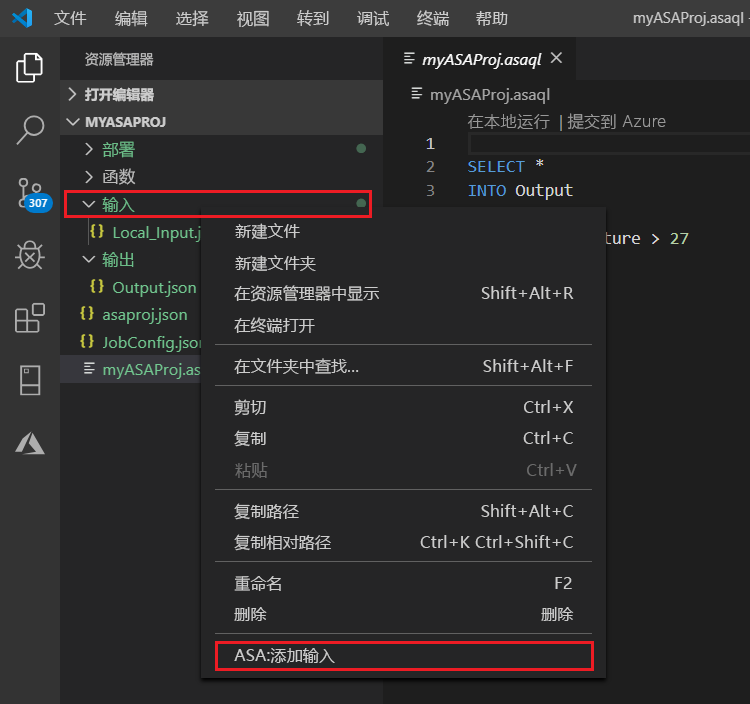
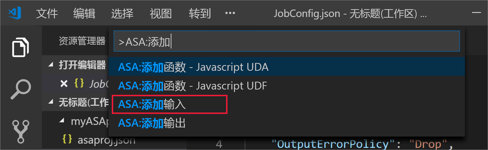
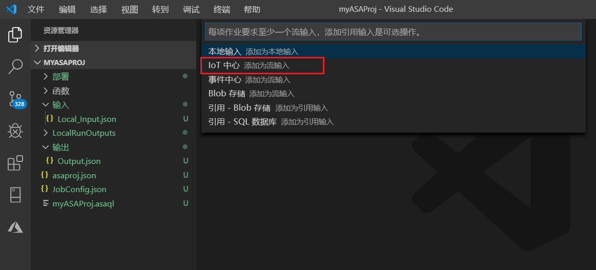
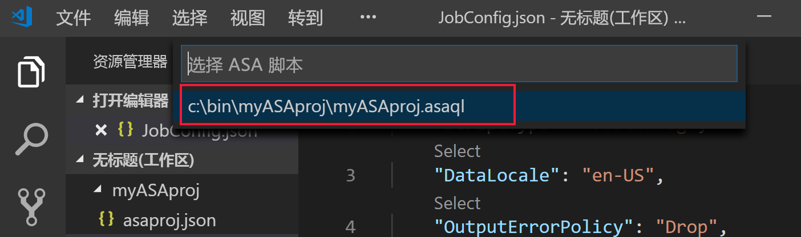
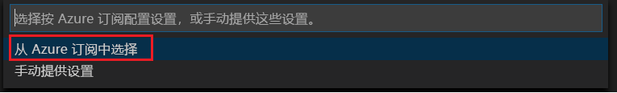
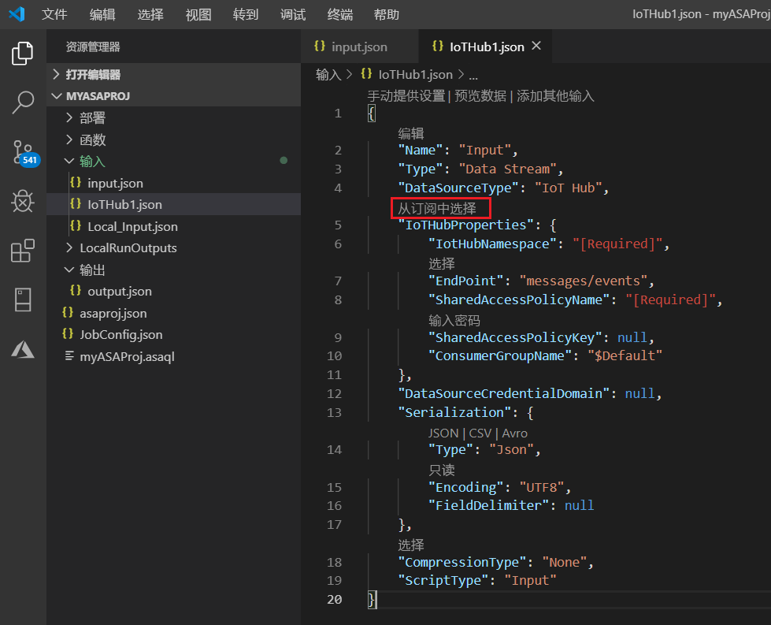
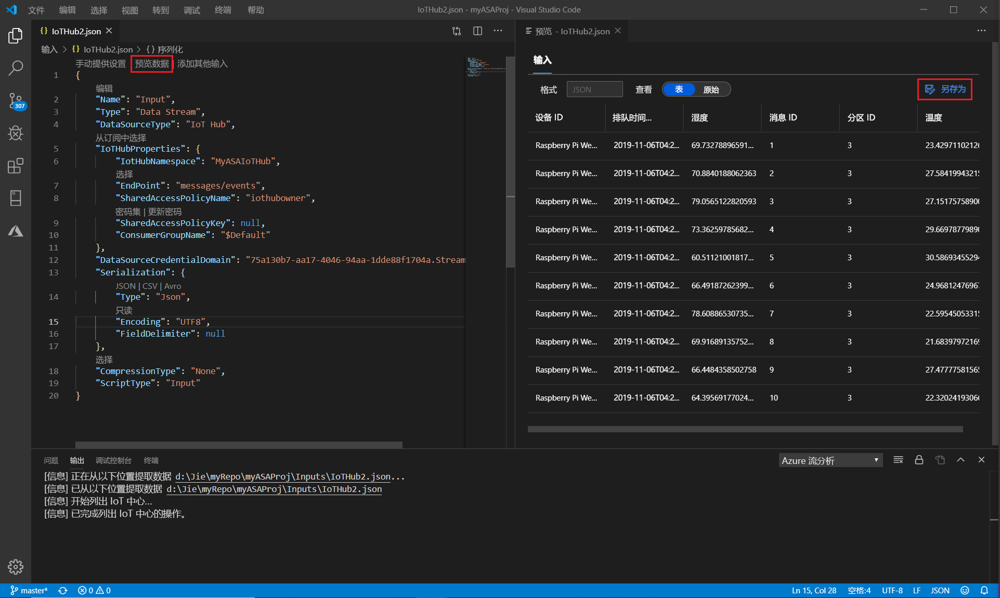

# 使用 Visual Studio Code 对实时流输入进行本地测试流分析查询

可以使用 Azure 流分析工具 Visual Studio Code 来针对实时流输入在本地测试流分析作业。 输入可以来自 Azure 事件中心或 Azure IoT 中心等源。 输出结果以 JSON 文件的形式发送到项目中名为**LocalRunOutputs**的文件夹。

## 必备组件

* 安装[.NET Core SDK](https://dotnet.microsoft.com/download)并重启 Visual Studio Code。

* 使用[本快速入门](quick-create-vs-code.md)教程了解如何使用 Visual Studio Code 创建流分析作业。

## 定义实时流输入

1. 右键单击流分析项目中的 "**输入**" 文件夹。 然后从上下文菜单中选择 " **ASA：添加输入**"。

   

   还可以按**Ctrl + Shift + P**打开命令面板，并输入**ASA： Add Input**。

   

2. 从下拉列表中选择输入源类型。

   

3. 如果从命令面板添加了输入，请选择将使用该输入的流分析查询脚本。 它应自动填充为**myASAproj. script.asaql**的文件路径。

   

4. 从下拉菜单中选择 "**从 Azure 订阅中选择**"。

    

5. 配置新生成的 JSON 文件。 您可以使用 CodeLens 功能来帮助您输入字符串、从下拉列表中选择或直接在文件中更改文本。 以下屏幕截图显示了**从订阅中选择**的示例。

   

## 预览输入

若要确保输入数据即将到来，请从顶部行中选择 "预览实时输入配置文件中的**数据**"。 某些输入数据来自 IoT 中心，并显示在预览窗口中。 预览可能需要几秒钟才能显示。

 

## 在本地运行查询

返回到查询编辑器，选择 "**本地运行**"。 然后从下拉列表中选择 "**使用实时输入**"。

结果将显示在右侧窗口中，并每隔3秒刷新一次。 您可以选择 "**运行**" 以再次测试。 还可以选择 "**在文件夹中打开**"，以便在文件资源管理器中查看结果文件，并使用 Visual Studio Code 或类似于 Excel 的工具打开它们。 请注意，结果文件仅以 JSON 格式提供。

默认情况下，作业开始创建输出的默认时间设置为 "**现在**"。 您可以通过选择 "结果" 窗口中的 "**输出开始时间**" 按钮来自定义时间。

## 后续步骤

* [浏览 Visual Studio Code 的 Azure 流分析作业（预览）](visual-studio-code-explore-jobs.md)

* [使用 npm 包设置 CI/CD 管道](setup-cicd-vs-code.md)
