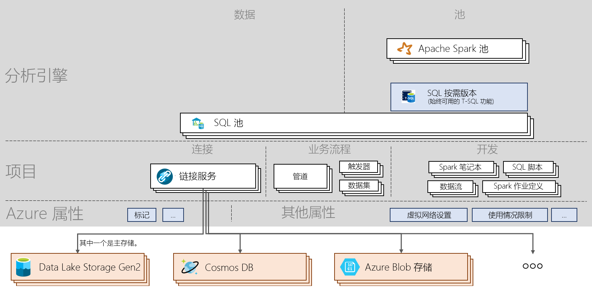

# Azure Synapse Analytics 速查表

[!INCLUDE [preview](includes/note-preview.md)]

Azure Synapse Analytics 速查表引导你了解该服务的基本概念和重要命令。 对于初学者以及想要重点了解最基本 Azure Synapse 主题的用户而言，本文都能提供帮助。

## 体系结构

> [!div class="mx-imgBorder"]
>

## 术语
| 术语                         | 定义      |
|:---                                 |:---                 |
| **Synapse 工作区** | 用于在 Azure 中执行基于云的企业分析的安全协作边界。 工作区部署在特定的区域中，并有关联的 ADLS Gen2 帐户和文件系统（用于存储临时数据）。 工作区位于资源组下。 |
| Synapse SQL   | 使用池或按需版本功能运行分析。  |
| SQL 池   | 具有相应数据库的 0:N SQL 预配资源可以部署在工作区中。 每个 SQL 池具有一个关联的数据库。 可以手动或自动缩放、暂停和恢复 SQL 池。 SQL 池可以从 100 DWU 纵向扩展到 30000 DWU。       |
| **SQL 按需版本**   | 为大规模数据构建的分布式数据处理系统，可用于对 Data Lake 中的数据运行 T-SQL 查询。 它是一个无服务器服务，因此你无需管理基础结构。       |
|Apache Spark for Synapse | Spark 池中使用的 Spark 运行时。 当前支持的版本为使用 Python 3.6.1 的 Spark 2.4、Scala 2.11.12、支持 .NET 的 Apache Spark 0.5，以及 Delta Lake 0.3。  | 
| **Apache Spark 池**  | 具有相应数据库的 0:N Spark 预配资源可以部署在工作区中。 可以自动暂停、恢复和缩放 Spark 池。  |
| Spark 应用程序  |   由驱动程序进程和一组执行程序进程构成。 Spark 应用程序在 Spark 池中运行。            |
| Spark 会话  |   Spark 应用程序的统一入口点。 它提供与 Spark 的各项功能进行交互的方式，使用的构造更少。 若要运行笔记本，需要创建会话。 可将会话配置为在特定大小的、特定数目的执行程序中运行。 笔记本会话的默认配置是在 2 个中等大小的执行程序中运行。 |
| SQL 请求  |   操作，例如通过 SQL 池或 SQL 按需版本运行的查询。 |
|数据集成| 提供在各种源之间引入数据的功能，并协调在工作区内部或外部运行的活动。| 
|项目| 该概念涵盖了用户在管理数据源以及进行开发、协调和可视化时所需的所有对象。|
|笔记本| 支持 Scala、PySpark、C# 和 SparkSQL 的交互式和反应式数据科学与工程接口。 |
|Spark 作业定义|用于通过包含代码及其依赖项的程序集 jar 提交 Spark 作业的接口。|
|数据流|  提供完全可视的体验，无需编写代码即可执行大数据转换。 所有优化和执行操作都采用无服务器方式。 |
|SQL 脚本| 文件中保存的 SQL 命令集。 一个 SQL 脚本可以包含一个或多个 SQL 语句。 使用 SQL 脚本可以通过 SQL 池或 SQL 按需版本运行 SQL 请求。|
|管道| 共同执行某个任务的活动的逻辑分组。|
|活动| 定义要对数据执行的操作，例如复制数据、运行 Notebook 或 SQL 脚本。|
|触发器| 执行管道。 可以手动或自动（计划、翻转窗口或基于事件）运行触发器。|
|链接服务| 连接字符串，定义工作区在连接到外部资源时所需的连接信息。|
|数据集|  数据的命名视图，它只指向或引用要在活动中作为输入和输出使用的数据。 它属于链接服务。|

## 后续步骤

- [创建工作区](quickstart-create-workspace.md)
- [使用 Synapse Studio](quickstart-synapse-studio.md)
- [创建 SQL 池](quickstart-create-sql-pool-portal.md)
- [创建 Apache Spark 池](quickstart-create-apache-spark-pool-portal.md)
- [使用 SQL 按需版本](quickstart-sql-on-demand.md)

