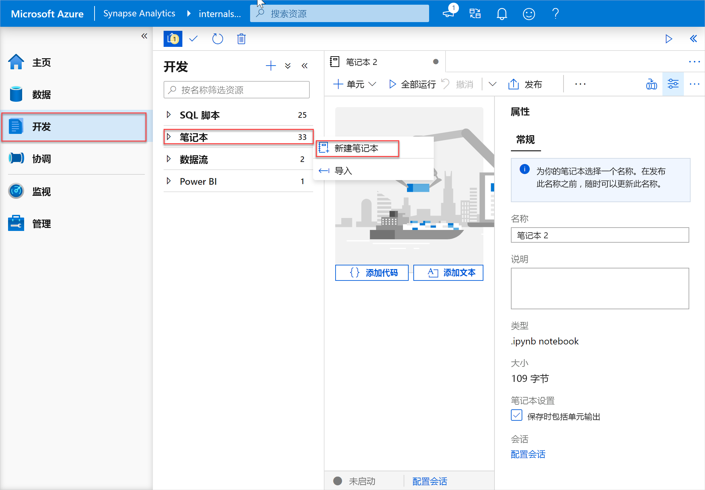
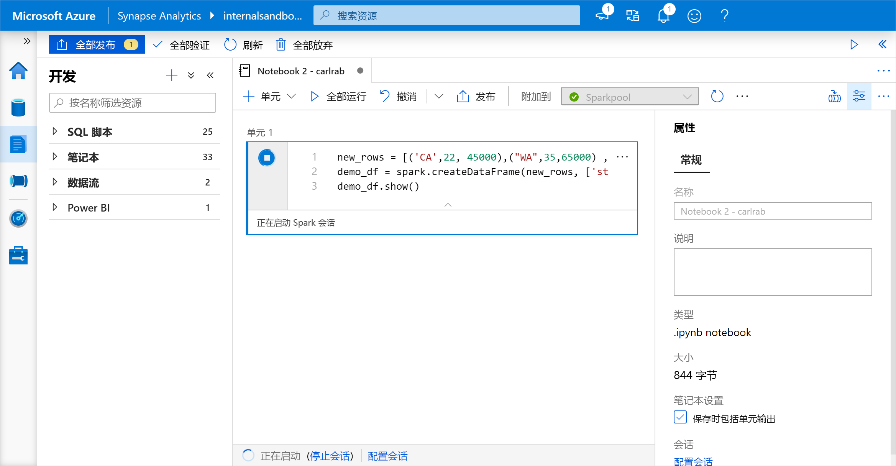
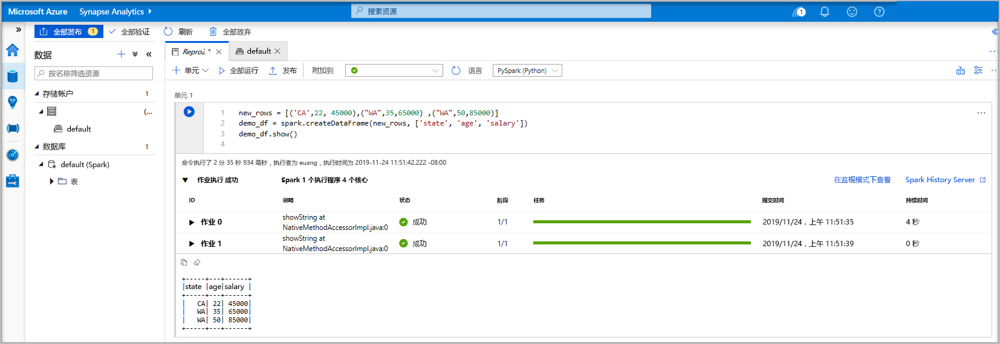
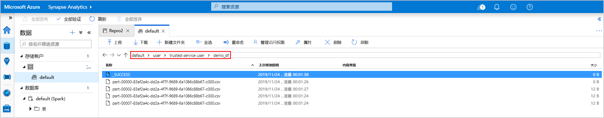
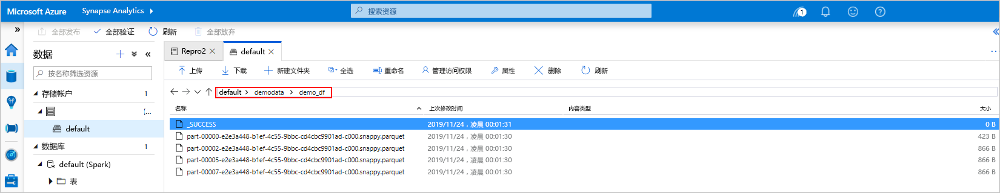
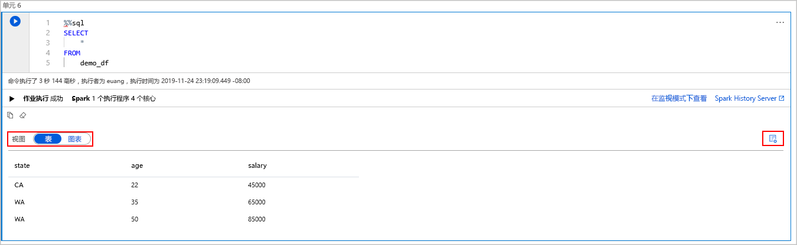
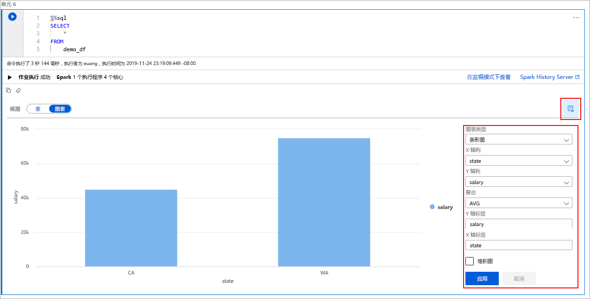

# <a name="quickstart-create-an-apache-spark-pool-preview-in-azure-synapse-analytics-using-web-tools"></a>快速入门：使用 Web 工具在 Azure Synapse Analytics 中创建 Apache Spark 池（预览版）

本快速入门介绍如何使用 Web 工具在 Azure Synapse 中创建 Apache Spark 池（预览版）。 然后，介绍如何连接到 Apache Spark 池并针对文件和表运行 Spark SQL 查询。 通过 Apache Spark 可以使用内存处理进行快速数据分析和群集计算。 有关 Azure Synapse 中 Spark 的信息，请参阅[概述：Azure Synapse 上的 Apache Spark](./spark/apache-spark-overview.md)。

> [!IMPORTANT]
> 不管是否正在使用 Spark 实例，它们都会按分钟按比例计费。 请务必在用完 Spark 实例后将其关闭，或设置较短的超时。 有关详细信息，请参阅本文的**清理资源**部分。

如果没有 Azure 订阅，请[在开始之前创建一个免费帐户](https://azure.microsoft.com/free/)。

## <a name="prerequisites"></a>先决条件

- Azure 订阅 - [创建免费帐户](https://azure.microsoft.com/free/)
- [Synapse Analytics 工作区](quickstart-create-workspace.md)
- [Apache Spark 池](quickstart-create-apache-spark-pool-studio.md)

## <a name="sign-in-to-the-azure-portal"></a>登录到 Azure 门户

登录 [Azure 门户](https://portal.azure.com/)。

如果还没有 Azure 订阅，可以在开始前[创建一个免费帐户](https://azure.microsoft.com/free/)。

## <a name="create-a-notebook"></a>创建笔记本

笔记本是支持各种编程语言的交互式环境。 使用笔记本可与数据交互，将代码和 Markdown、文本相结合，以及执行简单的可视化操作。

1. 在要使用的 Azure Synapse 工作区的 Azure 门户视图中，选择“启动 Synapse Studio”。
2. 启动 Synapse Studio 后，选择“开发”。 然后，将鼠标悬停在“笔记本”项上。 选择省略号图标 (...)。
3. 然后选择“新建笔记本”。 随即会创建并打开一个具有自动生成的名称的新笔记本。
  

4. 在“属性”窗口中提供笔记本的名称。
5. 在工具栏上单击“发布”。
6. 如果工作区中只有一个 Apache Spark 池，则默认选择该池。 如果未选择任何池，请使用下拉箭头选择合适的 Apache Spark 池。
7. 单击“添加代码”。 默认语言为 `Pyspark`。 你将混合使用 Pyspark 和 Spark SQL，因此默认选择是适当的。
8. 接下来，创建一个用于操作的简单 Spark 数据帧对象。 在本例中，你将在代码中创建该对象。 有三行和三列：

   ```python
   new_rows = [('CA',22, 45000),("WA",35,65000) ,("WA",50,85000)]
   demo_df = spark.createDataFrame(new_rows, ['state', 'age', 'salary'])
   demo_df.show()
   ```

9. 现在，使用以下方法之一运行代码单元：

   - 按 **Shift + Enter**。
   - 选择单元左侧的蓝色播放图标。
   - 选择工具栏上的“全部运行”按钮。

   

10. 如果 Apache Spark 池实例尚未运行，它会自动启动。 在运行的单元下面，以及在笔记本底部的状态面板上，都可以看到 Apache Spark 池实例的状态。 启动池需要 2-5 分钟时间，具体取决于池的大小。 代码运行完成后，单元下面会显示有关运行该代码花费了多长时间及其执行情况的信息。 在输出单元中可以看到输出。

    

11. 现在，数据会存在于一个数据帧中，从该数据帧中可以通过多种不同的方式使用这些数据。 在本快速入门的余下部分，需要以不同的格式使用这些数据。
12. 在另一个单元中输入并运行以下代码，以创建一个 Spark 表、一个 CSV 文件和一个 Parquet 文件，它们都包含数据的副本：

    ```python
     demo_df.createOrReplaceTempView('demo_df')
     demo_df.write.csv('demo_df', mode='overwrite')
     demo_df.write.parquet('abfss://<<TheNameOfAStorageAccountFileSystem>>@<<TheNameOfAStorageAccount>>.dfs.core.windows.net/demodata/demo_df', mode='overwrite')
    ```

    如果使用存储资源管理器，可以查看上述两种不同的文件编写方式的影响。 如果未指定文件系统，则会使用默认文件系统，在本例中为 `default>user>trusted-service-user>demo_df`。 数据将保存到指定的文件系统的位置。

    请注意，在使用“csv”和“parquet”格式的情况下，写入操作创建了一个包含许多已分区文件的目录。

    

    

## <a name="run-spark-sql-statements"></a>运行 Spark SQL 语句

结构化查询语言 (SQL) 是用于查询和定义数据的最常见且最广泛使用的语言。 Spark SQL 作为 Apache Spark 的扩展使用，可使用熟悉的 SQL 语法处理结构化数据。

1. 将以下代码粘贴到空单元中，然后运行代码。 该命令将列出池中的表。

   ```sql
   %%sql
   SHOW TABLES
   ```

   将 Notebook 与 Azure Synapse Apache Spark 池配合使用时，将获得预设 `sqlContext`，可以使用该预设通过 Spark SQL 运行查询。 `%%sql` 告知笔记本要使用预设 `sqlContext` 来运行查询。 默认情况下，该查询检索所有 Azure Synapse Apache Spark 池包含的系统表中的前 10 行。

2. 运行另一个查询，请查看 `demo_df` 中的数据。

    ```sql
    %%sql
    SELECT * FROM demo_df
    ```

    该代码生成两个输出单元，其中一个包含数据结果，另一个显示作业视图。

    默认情况下，结果视图会显示一个网格。 但是，网格下面会提供一个视图切换器，用于在网格视图与图形视图之间进行切换。

    

3. 在“视图”切换器中，选择“图表”。 
4. 选择最右侧的“视图选项”图标。
5. 在“图表类型”字段中选择“条形图”。
6. 在“X 轴列”字段中选择“省/市/自治区”。
7. 在“Y 轴列”字段中选择“工资”。
8. 在“聚合”字段中，选择“平均”。
9. 选择“应用”。

   

10. 运行 SQL 时可以获得相同的体验，但不需要切换语言。 为此，可将上面的 SQL 单元替换为以下 PySpark 单元，其输出体验是相同的，因为使用了 display 命令：

    ```python
    display(spark.sql('SELECT * FROM demo_df'))
    ```

11. 对于前面执行的每个单元，可以选择转到“History Server”和“监视”。  单击相应的链接会转到用户体验的不同组成部分。

## <a name="clean-up-resources"></a>清理资源

Azure Synapse 在 Azure Data Lake Storage 中保存数据。 可以安全关闭未在使用的 Spark 实例。 只要 Azure Synapse Apache Spark 池正在运行，即使不使用它，它也会产生费用。 

由于池的费用是存储费用的许多倍，关闭未在使用的 Spark 实例可以节省费用。

为了确保关闭 Spark 实例，请结束任何已连接的会话（笔记本）。 达到 Apache Spark 池中指定的空闲时间时，池将会关闭。 也可以在笔记本底部的状态栏中选择“结束会话”。

## <a name="next-steps"></a>后续步骤

在本快速入门中，你已了解了如何创建 Azure Synapse Apache Spark 池和运行基本的 Spark SQL 查询。

- [Azure Synapse Analytics](overview-what-is.md)
- [.NET for Apache Spark 文档](/dotnet/spark?toc=/azure/synapse-analytics/toc.json&bc=/azure/synapse-analytics/breadcrumb/toc.json)
- [Apache Spark 官方文档](https://spark.apache.org/docs/latest/)

>[!NOTE]
> 某些 Apache Spark 官方文档依赖于使用 Spark 控制台，但该控制台在 Azure Synapse Spark 中不可用。 请改用[笔记本](quickstart-apache-spark-notebook.md)或 [IntelliJ](./spark/intellij-tool-synapse.md) 体验。
