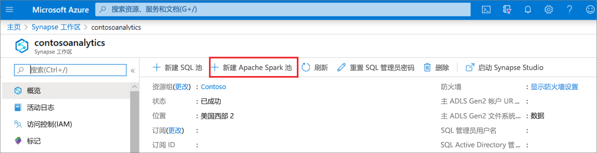
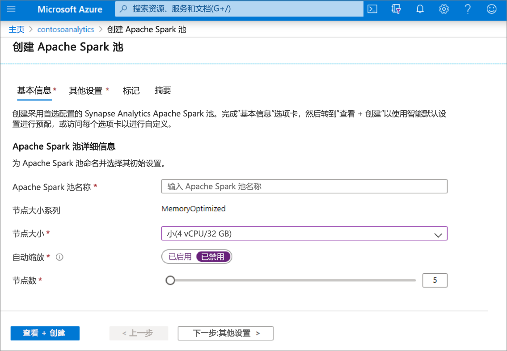
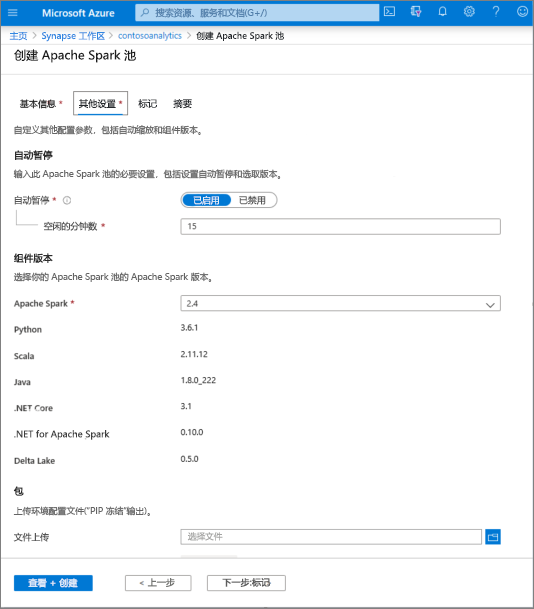
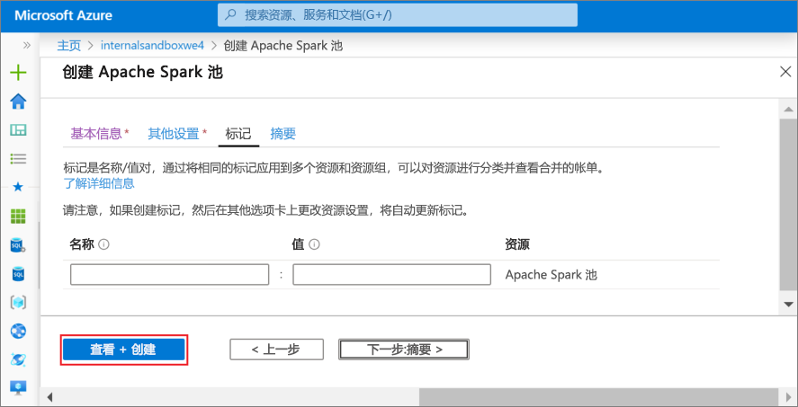
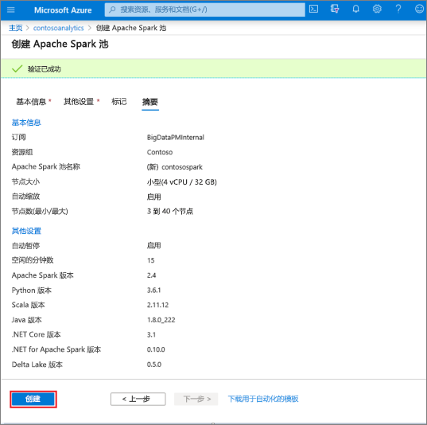
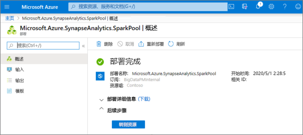
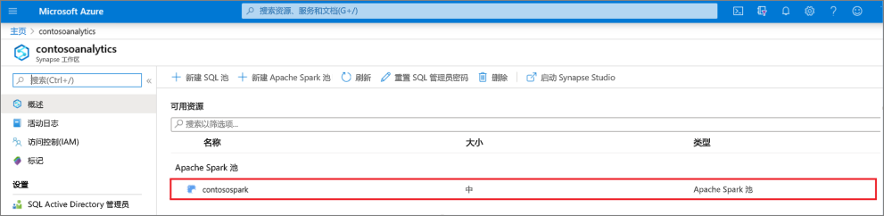
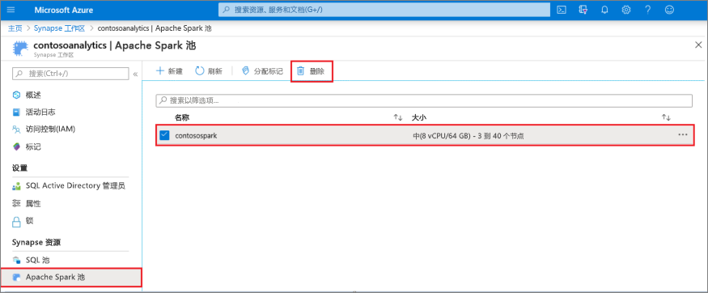
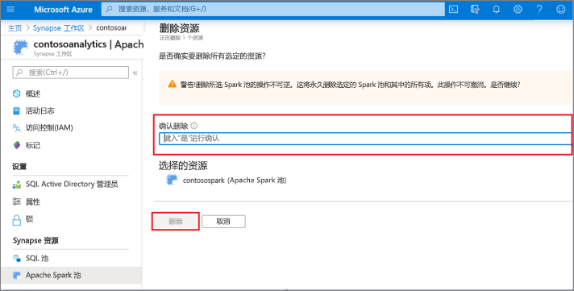

# 快速入门：使用 Azure 门户新建 Apache Spark 池（预览版）

Azure Synapse Analytics 提供了各种分析引擎，可帮助你引入、转换、分析和分布数据，以及对数据建模。 Apache Spark 池提供开源大数据计算功能。 在 Synapse 工作区中创建 Apache Spark 池后，可以加载、处理和分布数据以及为数据建模，更快地获取分析见解。

本快速入门介绍如何使用 Azure 门户在 Synapse 工作区中创建 Apache Spark 池。

> [!IMPORTANT]
> 不管是否正在使用 Spark 实例，它们都会按分钟按比例计费。 请务必在用完 Spark 实例后将其关闭，或设置较短的超时。 有关详细信息，请参阅本文的**清理资源**部分。

如果没有 Azure 订阅，请[在开始之前创建一个免费帐户](https://azure.microsoft.com/free/)。

## 先决条件

- Azure 订阅 - [创建免费帐户](https://azure.microsoft.com/free/)
- [Synapse Analytics 工作区](quickstart-create-workspace.md)

## 登录到 Azure 门户

登录到 [Azure 门户](https://portal.azure.com/)

## 导航到 Synapse 工作区 
1. 导航到要在其中创建 Apache Spark 池的 Synapse 工作区，方法是在搜索栏中键入服务名称（或直接键入资源名称）。

1. 从工作区列表中，键入要打开的工作区的名称（或名称的一部分）。 在此示例中，我们将使用名为 contosoanalytics 的工作区。

## 创建新的 Apache Spark 池

1. 在要在其中创建 Apache Spark 池的 Synapse 工作区中，选择“新建 Apache Spark 池”。
    
2. 在“基本信息”选项卡中输入以下详细信息：

    |设置 | 建议的值 | 说明 |
    | :------ | :-------------- | :---------- |
    | **Apache Spark 池名称** | 有效的池名称 | 这是 Apache Spark 池要使用的名称。 |
    | **节点大小** | 小 (4 vCPU / 32 GB) | 请将此项设置为最小大小，以降低本快速入门的成本 |
    | **自动缩放** | 已禁用 | 此快速入门不需要自动缩放 |
    | **节点数** | 5 | 在此快速入门中使用小尺寸来限制成本 |

    
    > [!IMPORTANT]
    > 请注意，Apache Spark 池可以使用的名称有特定的限制。 名称只能包含字母或数字，必须为 15 个或更少的字符，必须以字母开头，不能包含保留字，并且在工作区中必须是独一无二的。

3. 选择“下一步: 其他设置”并查看默认设置。 请不要修改任何默认设置。
    

4. 选择“下一步: 标记”。 请不要添加任何标记。
    

5. 选择“查看 + 创建”。

6. 根据前面输入的内容，确保详细信息正确，然后选择“创建”。
    

7. 此时会启动资源预配流，指示其完成时间。
    

8. 预配完成后，导航回到工作区会显示新建的 Apache Spark 池对应的新条目。
    

9. 此时没有任何资源在运行，因此 Spark 不会产生费用，但你已创建有关所要创建的 Spark 实例的元数据。

## 清理资源

执行以下步骤，从工作区中删除 Apache Spark 池。
> [!WARNING]
> 删除 Apache Spark 池会从工作区中删除分析引擎。 将不再可以连接到该池，并且使用此 Apache Spark 池的所有查询、管道和笔记本都不再可以正常运行。

若要删除 Apache Spark 池，请执行以下操作：

1. 导航到工作区中的“Apache Spark 池”边栏选项卡。
2. 选择要删除的 Apache Spark 池（在本例中为 contosospark）。
3. 按“删除”。
 
4. 确认删除，然后按“删除”按钮。
 
5. 成功完成该过程后，工作区资源中将不再列出该 Apache Spark 池。

## 后续步骤

- 请参阅[快速入门：创建 Apache Spark 笔记本](quickstart-apache-spark-notebook.md)。
- 请参阅[快速入门：使用 Azure 门户创建 Synapse SQL 池](quickstart-create-sql-pool-portal.md)。
