# 快速入门：使用 Synapse Studio 创建 Apache Spark 池（预览版）

Azure Synapse Analytics 提供了各种分析引擎，可帮助你引入、转换、分析和提供数据，以及对数据建模。 Apache Spark 池提供开源大数据计算功能。 在 Synapse 工作区中创建 Apache Spark 池后，可以加载、处理和提供数据以及为数据建模，以获取见解。  

本快速入门介绍了使用 Synapse Studio 在 Synapse 工作区中创建 Apache Spark 池的步骤。

> [!IMPORTANT]
> 不管是否正在使用 Spark 实例，它们都会按分钟按比例计费。 请务必在用完 Spark 实例后将其关闭，或设置较短的超时。 有关详细信息，请参阅本文的**清理资源**部分。

如果没有 Azure 订阅，请[在开始之前创建一个免费帐户](https://azure.microsoft.com/free/)。

## 先决条件

- Azure 订阅 - [创建免费帐户](https://azure.microsoft.com/free/)
- [Synapse 工作区](./quickstart-create-workspace.md)

## 登录到 Azure 门户

登录到 [Azure 门户](https://portal.azure.com/)

## 导航到 Synapse 工作区

1. 导航到要在其中创建 Apache Spark 池的 Synapse 工作区，方法是在搜索栏中键入服务名称（或直接键入资源名称）。

1. 从工作区列表中，键入要打开的工作区的名称（或名称的一部分）。 在此示例中，我们将使用名为 contosoanalytics 的工作区。

## 启动 Synapse Studio 

1. 从工作区概述中，选择“启动 Synapse Studio”以打开将在其中创建 Apache Spark 池的位置。 直接在搜索栏中键入服务名称或资源名称。
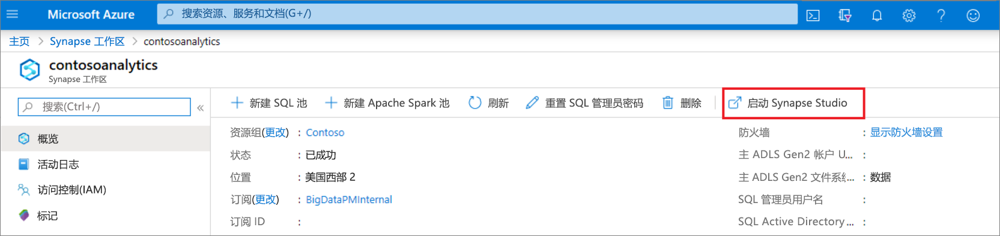

## 在 Synapse Studio 中创建 Apache Spark 池

1. 在 Synapse Studio 主页上，选择“管理”图标以导航到左侧导航栏中的“管理中心” 。
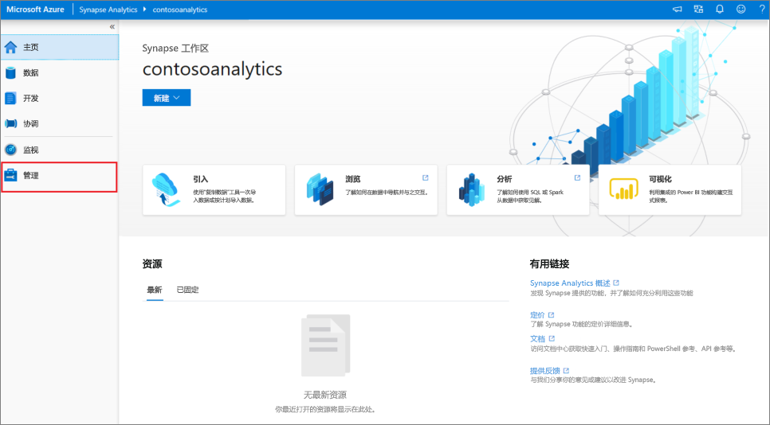

1. 进入管理中心后，导航到“Apache Spark 池”部分，查看工作区中可用的 Apache Spark 池的当前列表。
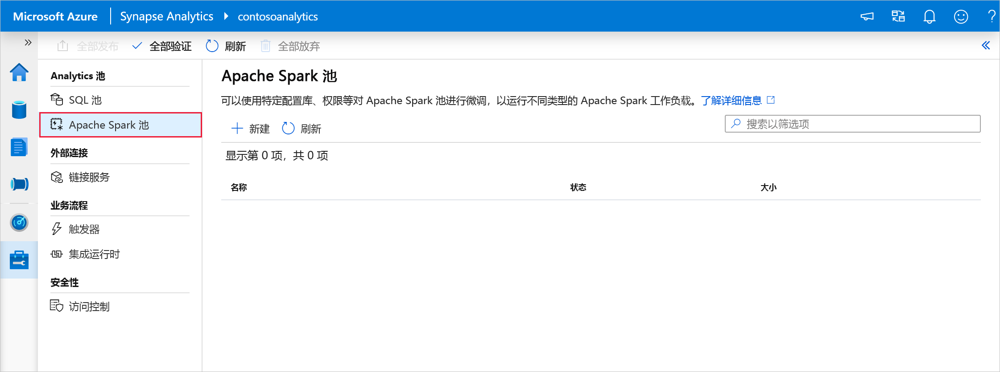

1. 选择“+ 新建”，随即会显示新 Apache Spark 池创建向导。 
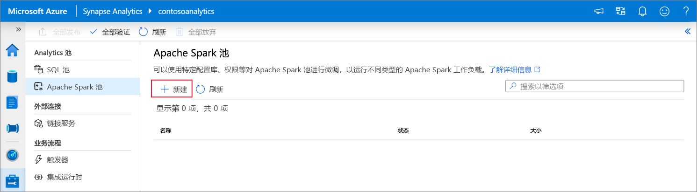

1. 在“基本信息”选项卡中输入以下详细信息：

    | 设置 | 建议的值 | 说明 |
    | :------ | :-------------- | :---------- |
    | **Apache Spark 池名称** | contosospark | 这是 Apache Spark 池要使用的名称。 |
    | **节点大小** | 小 (4 vCPU / 32 GB) | 请将此项设置为最小大小，以降低本快速入门的成本 |
    | **自动缩放** | 已禁用 | 使用此快速入门时无需进行自动缩放 |
    | **节点数** | 8 | 在此快速入门中使用小尺寸来限制成本|
    
    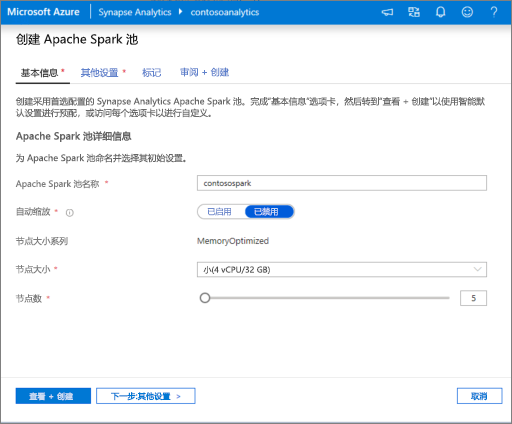
    > [!IMPORTANT]
    > 请注意，Apache Spark 池可以使用的名称有特定的限制。 名称只能包含字母或数字，必须为 15 个或更少的字符，必须以字母开头，不能包含保留字，并且在工作区中必须是独一无二的。

1. 在下一个选项卡（其他设置）中，保留所有默认值，并按“查看 + 创建”（我们不会添加任何标记）。
 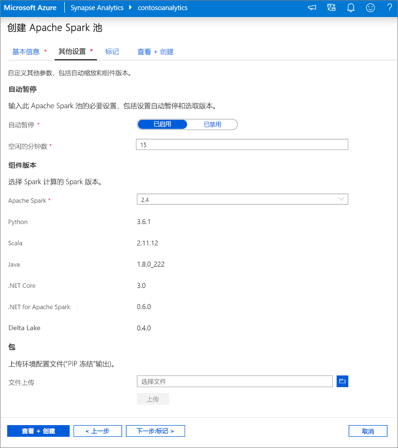

1. 目前不会添加任何标记，因此请选择“查看 + 创建”。

1. 在“查看 + 创建”选项卡中，根据前面输入的内容，确保详细信息正确，然后按“创建” 。 
 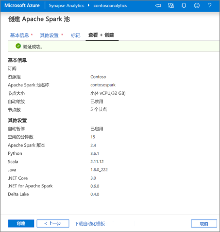

1. Apache Spark 池将开始预配过程。
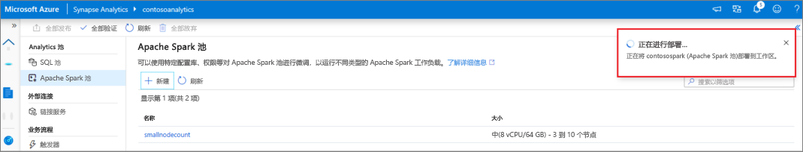

1. 预配完成后，新的 Apache Spark 池将显示在列表中。
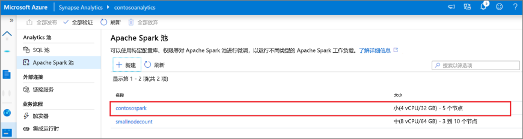

## 使用 Synapse Studio 清理 Apache Spark 池资源

执行以下步骤，使用 Synapse Studio 从工作区中删除 Apache Spark 池。
> [!WARNING]
> 删除 Spark 池会从工作区中删除分析引擎。 将不再可以连接到该池，并且使用此 Spark 池的所有查询、管道和笔记本都不再可以正常运行。

若要删除 Apache Spark 池，请执行以下操作：

1. 在 Synapse Studio 的管理中心导航到 Apache Spark 池。
1. 选择要删除的 Apache 池旁边的省略号（在本例中为 contosospark）以显示 Apache Spark 池的命令。
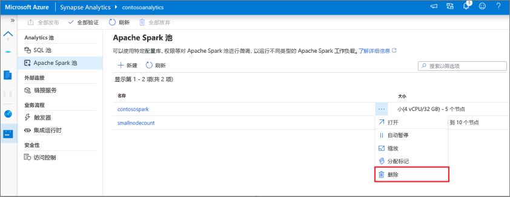
1. 按“删除”。
1. 确认删除，然后按“删除”按钮。
 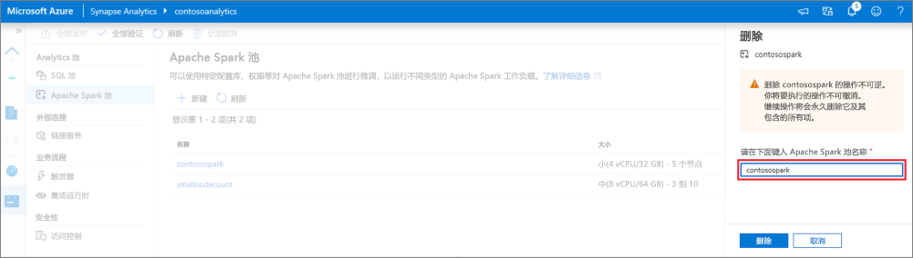
1. 成功完成该过程后，工作区资源中将不再列出该 Apache Spark 池。 

## 后续步骤

- 请参阅[快速入门：使用 Web 工具在 Synapse Studio 中创建 Apache Spark 池](quickstart-apache-spark-notebook.md)。
- 请参阅[快速入门：使用 Azure 门户创建 Apache Spark 池](quickstart-create-apache-spark-pool-portal.md)。
