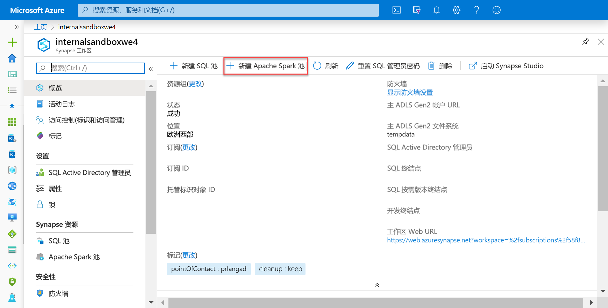
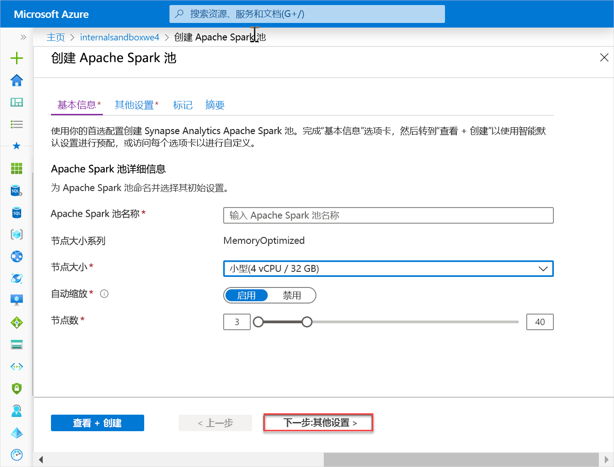
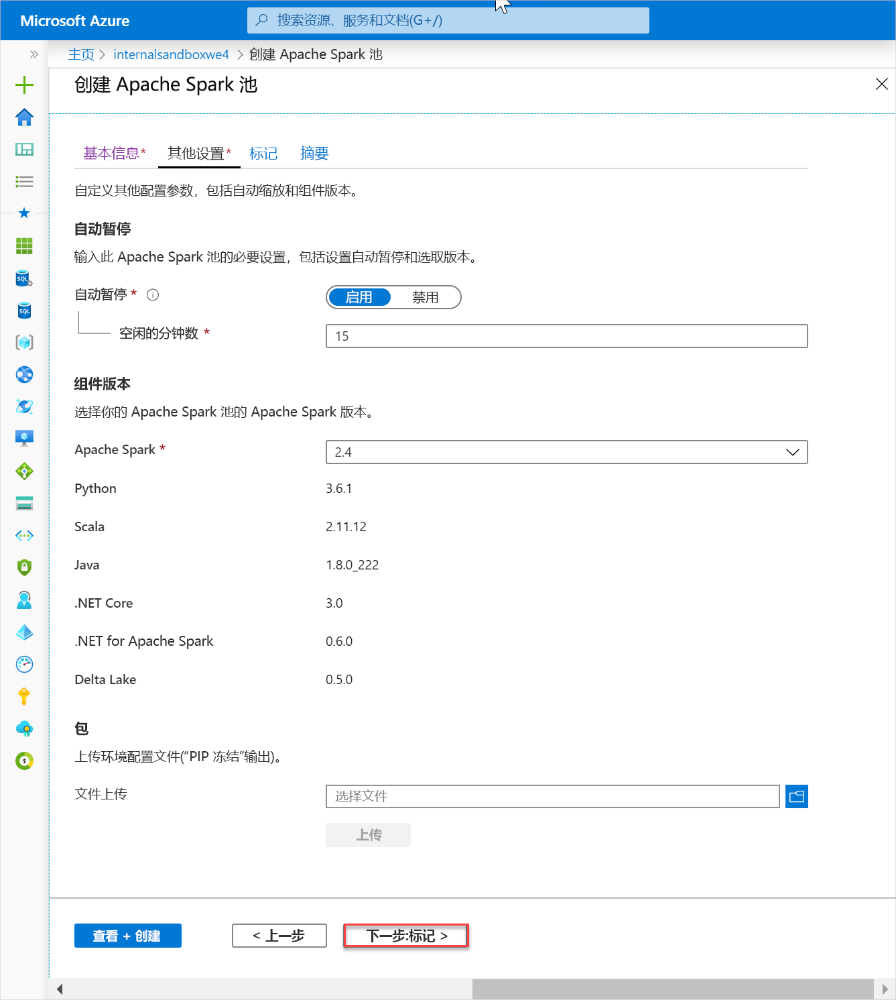
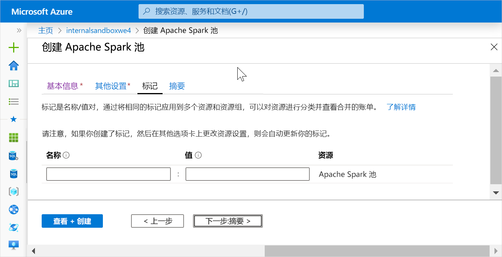
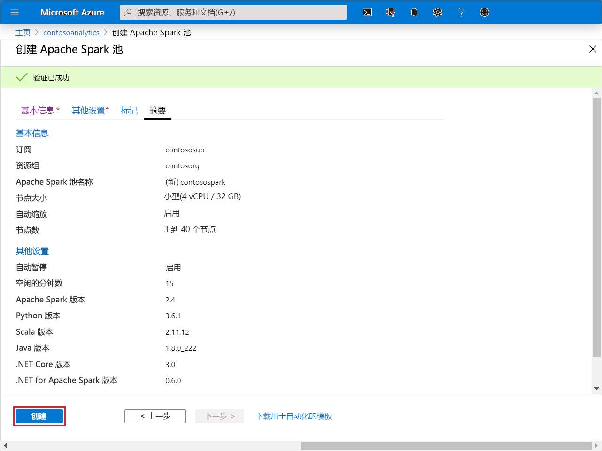
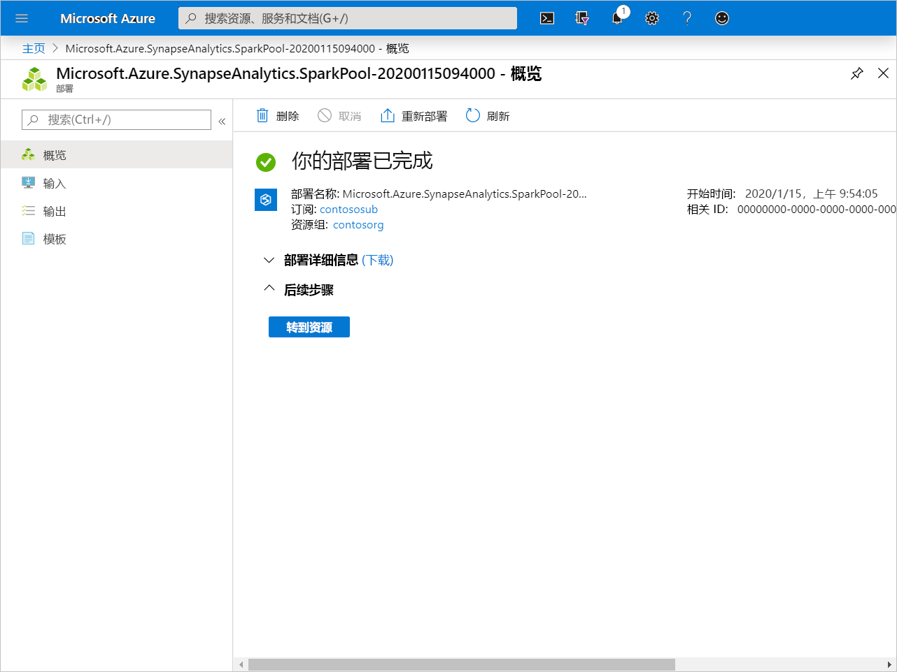
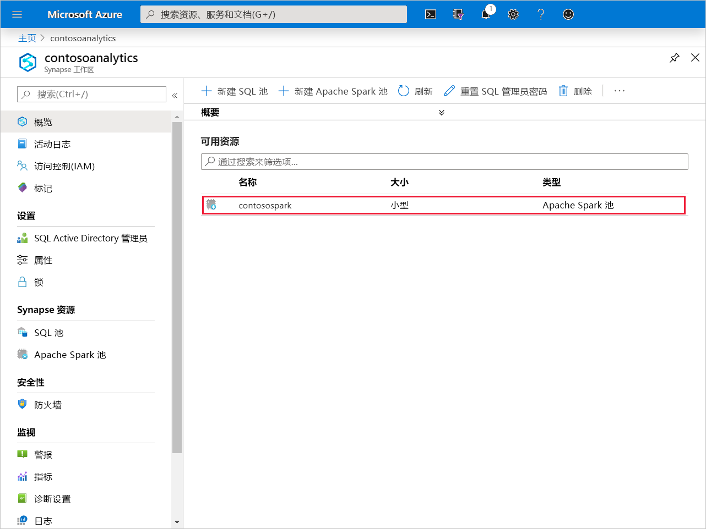
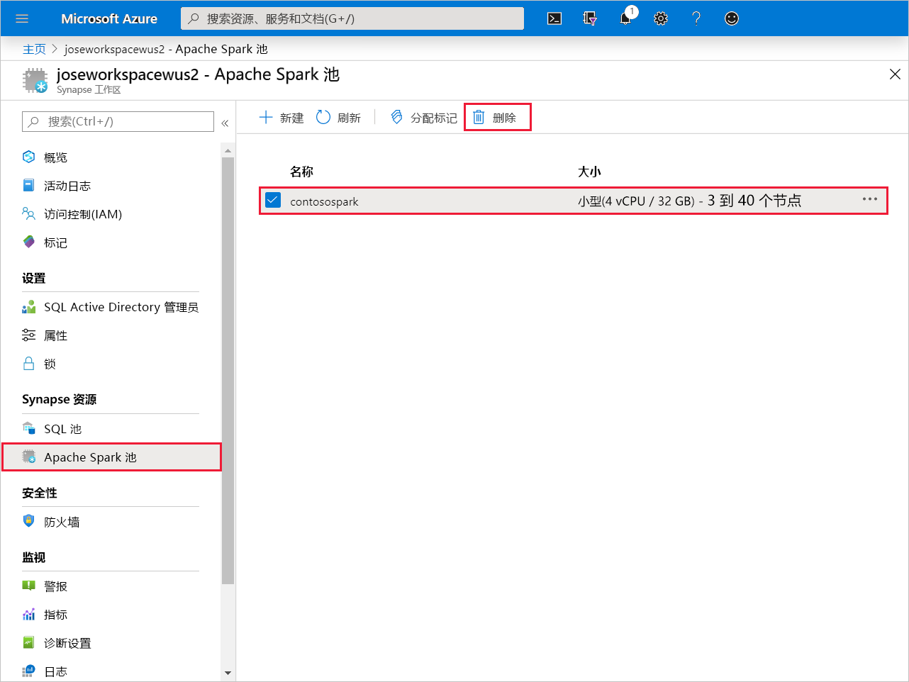
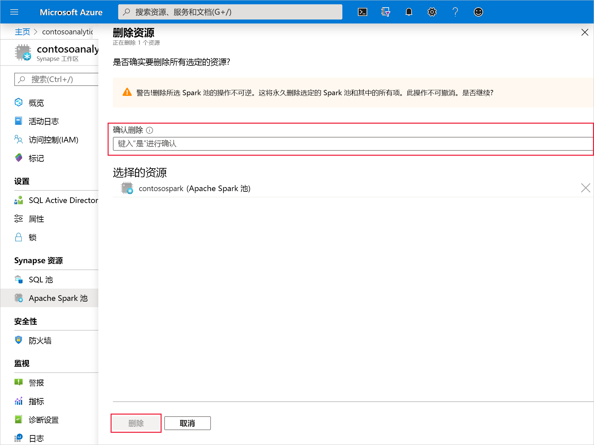

# 快速入门：创建新的 Apache Spark 池（预览版）

Synapse Analytics 提供各种分析引擎来帮助你引入、转换、分析和提供数据以及为数据建模。 Apache Spark 池提供开源大数据计算功能。 在 Synapse 工作区中创建 Apache Spark 池后，可以加载、处理和提供数据以及为数据建模，以获取见解。

本快速入门介绍如何使用 Azure 门户在 Synapse 工作区中创建 Apache Spark 池。

> [!IMPORTANT]
> 不管是否正在使用 Spark 实例，它们都会按分钟按比例计费。 请务必在用完 Spark 实例后将其关闭，或设置较短的超时。 有关详细信息，请参阅本文的**清理资源**部分。

如果没有 Azure 订阅，请[在开始之前创建一个免费帐户](https:/azure.microsoft.com/free/)。

## 先决条件

- Azure 订阅 - [创建免费帐户](https:/azure.microsoft.com/free/)
- [Synapse Analytics 工作区](quickstart-create-workspace.md)

## 登录到 Azure 门户

登录到 [Azure 门户](https:/portal.azure.com/)

## 创建新的 Apache Spark 池

1. 在要在其中创建 Apache Spark 池的 Synapse 工作区中，单击“新建 Apache Spark 池”。 

2. 在“基本信息”选项卡中输入以下详细信息： 

    |设置 | 建议的值 | 说明 |
    | :------ | :-------------- | :---------- |
    | **Apache Spark 池名称** | 有效的池名称 | 这是 Apache Spark 池要使用的名称。 |
    | **节点大小** | 小 (4 vCPU / 32 GB) | 请将此项设置为最小大小，以降低本快速入门的成本 |
    | **自动缩放** | 已启用 | 请保留此项默认设置 |
    | **节点数** | 3 - 40 | 请保留此项默认设置 |
    ||||

    
    > [!IMPORTANT]
    > 请注意，Apache Spark 池可以使用的名称有特定的限制。 名称只能包含字母或数字，必须为 15 个或更少的字符，必须以字母开头，不能包含保留字，并且在工作区中必须是独一无二的。

3. 单击“下一步: 其他设置”并查看默认设置。  请不要修改任何默认设置。

4. 单击“下一步: 标记”。  请不要添加任何标记。

5. 单击“查看 + 创建”  。

6. 根据前面输入的内容，确保详细信息正确，然后单击“创建”。 

7. 此时，资源预配流将会启动，并在完成后提供相应的指示 

8. 预配完成后，导航回到工作区会显示新建的 Apache Spark 池对应的新条目。
 

9. 此时没有任何资源在运行，因此 Spark 不会产生费用，但你已创建有关所要创建的 Spark 实例的元数据。

## 清理资源

执行以下步骤，从工作区中删除 Apache Spark 池。
> [!WARNING]
> 删除 Apache Spark 池会从工作区中删除分析引擎。 将不再可以连接到该池，并且使用此 Apache Spark 池的所有查询、管道和笔记本都不再可以正常运行。

若要删除 Apache Spark 池，请执行以下操作：

1. 导航到工作区中的“Apache Spark 池”边栏选项卡。
2. 选择要删除的 Apache 池（在本例中为 contosospark） 
3. 按“删除”。 
 
4. 确认删除，然后按“删除”按钮。 
 
5. 成功完成该过程后，工作区资源中将不再列出该 Apache Spark 池。

创建 SQL 池后，它将出现在工作区中，用于加载数据、处理流、从 Lake 中读取数据，等等。

## 后续步骤

- 请参阅[快速入门：使用 Web 工具在 Synapse Studio 中创建 Apache Spark 池](spark/apache-spark-notebook-create-spark-use-sql.md)。
- 请参阅[快速入门：使用 Azure 门户创建 Synapse SQL 池](quickstart-create-sql-pool.md)。
