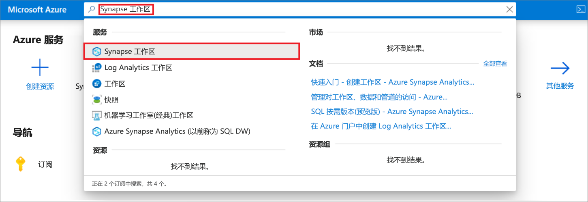
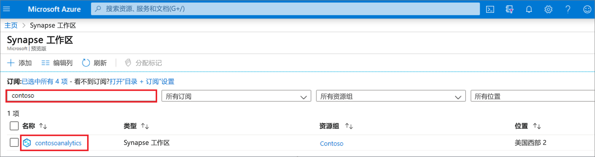
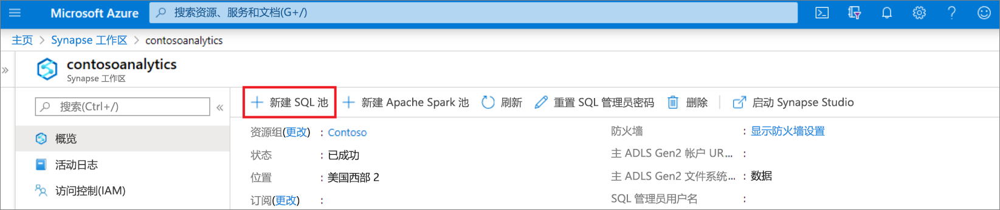
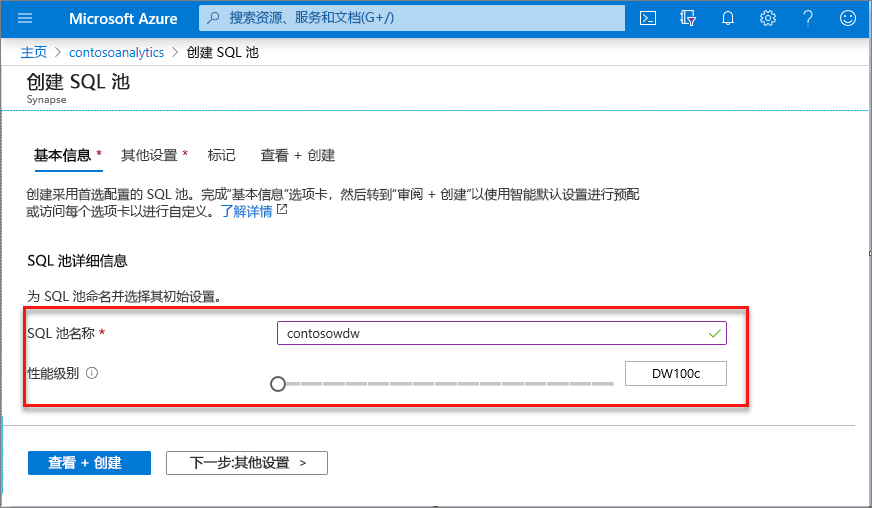
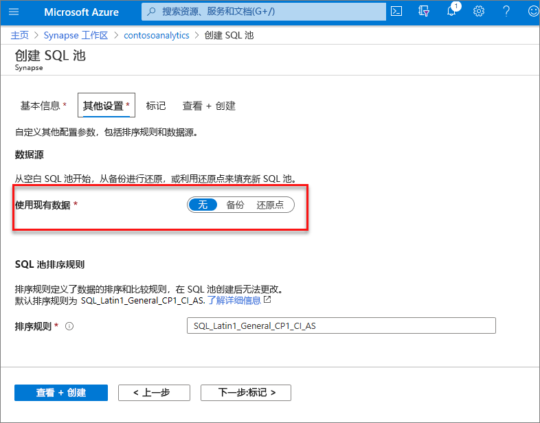
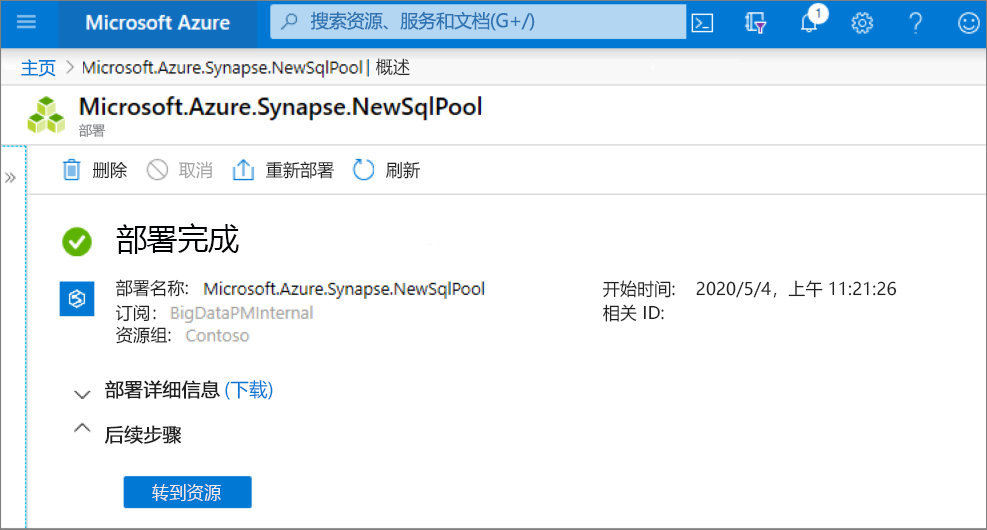
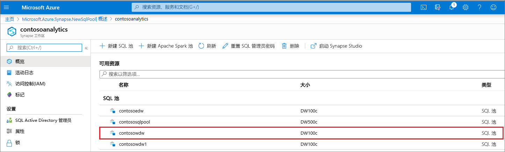
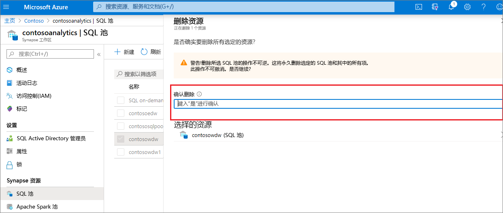

# 快速入门：使用 Azure 门户创建 Synapse SQL 池（预览版）

Azure Synapse Analytics 提供了各种分析引擎，可帮助你引入、转换和分析数据，以及对数据建模。 SQL 池提供基于 T-SQL 的计算和存储功能。 在 Synapse 工作区中创建 SQL 池后，可以加载、处理和提供数据以及为数据建模，更快地获取分析见解。

本快速入门介绍如何使用 Azure 门户在 Synapse 工作区中创建 SQL 池。

如果没有 Azure 订阅，请[在开始之前创建一个免费帐户](https://azure.microsoft.com/free/)。

## 先决条件

- Azure 订阅 - [创建免费帐户](https://azure.microsoft.com/free/)
- [Synapse 工作区](./quickstart-create-workspace.md)

## 登录到 Azure 门户

登录到 [Azure 门户](https://portal.azure.com/)

## 导航到 Synapse 工作区

1. 导航到要在其中创建 SQL 池的 Synapse 工作区，方法是在搜索栏中键入服务名称（或直接键入资源名称）。
 
1. 从工作区列表中，键入要打开的工作区的名称（或名称的一部分）。 在此示例中，我们将使用名为 contosoanalytics 的工作区。

## 新建 SQL 池

1. 在要在其中创建 SQL 池的 Synapse 工作区中，选择顶栏中的“新建 SQL 池”命令。

2. 在“基本信息”选项卡中输入以下详细信息：

    | 设置 | 建议的值 | 说明 |
    | :------ | :-------------- | :---------- |
    | **SQL 池名称** | 任何有效的名称 | SQL 池的名称。 |
    | **性能级别** | DW100c | 设置为最小大小可降低此快速入门的成本 |

  
    
    > [!IMPORTANT]
    > 请注意，SQL 池可以使用的名称有特定的限制。 名称不能包含特殊字符，不能多于 15 个字符，不能包含保留字，并且在工作区中必须是独一无二的。

3. 在完成时选择“下一步:其他设置”。
4. 选择“无”以在无数据的情况下预配 SQL 池。 让默认排序规则保持选中状态。

5. 选择“查看 + 创建”。
6. 根据前面输入的内容，确保详细信息正确。 选择“创建”。

7. 此时会启动资源预配流。
 

8. 预配完成后，导航回到工作区会显示新建的 SQL 池对应的新条目。
 

创建 SQL 池后，它将出现在工作区中，用于加载数据、处理流、从 Lake 中读取数据，等等。

## 清理资源

执行以下步骤，从工作区中删除 SQL 池。
> [!WARNING]
> 删除 SQL 池将从工作区中删除分析引擎以及所删除 SQL 池的数据库中存储的数据。 将无法再连接到该 SQL 池，并且从该 SQL 池读取数据或向其中写入数据的所有查询、管道和笔记本都将不再可以正常运行。

如果要删除 SQL 池，请完成以下步骤：

1. 导航到工作区边栏选项卡中的“SQL 池”边栏选项卡
1. 选择要删除的 SQL 池（在本例中为 contosowdw）
1. 选择后，按“删除”。
1. 确认删除操作，并按“删除”按钮 。
1. 成功完成此过程后，工作区资源中将不再列出该 SQL 池。

## 后续步骤

- 请参阅[快速入门：使用 Web 工具在 Synapse Studio 中创建 Apache Spark 池](quickstart-apache-spark-notebook.md)。
- 请参阅[快速入门：使用 Azure 门户创建 Apache Spark 池](quickstart-create-apache-spark-pool-portal.md)。
