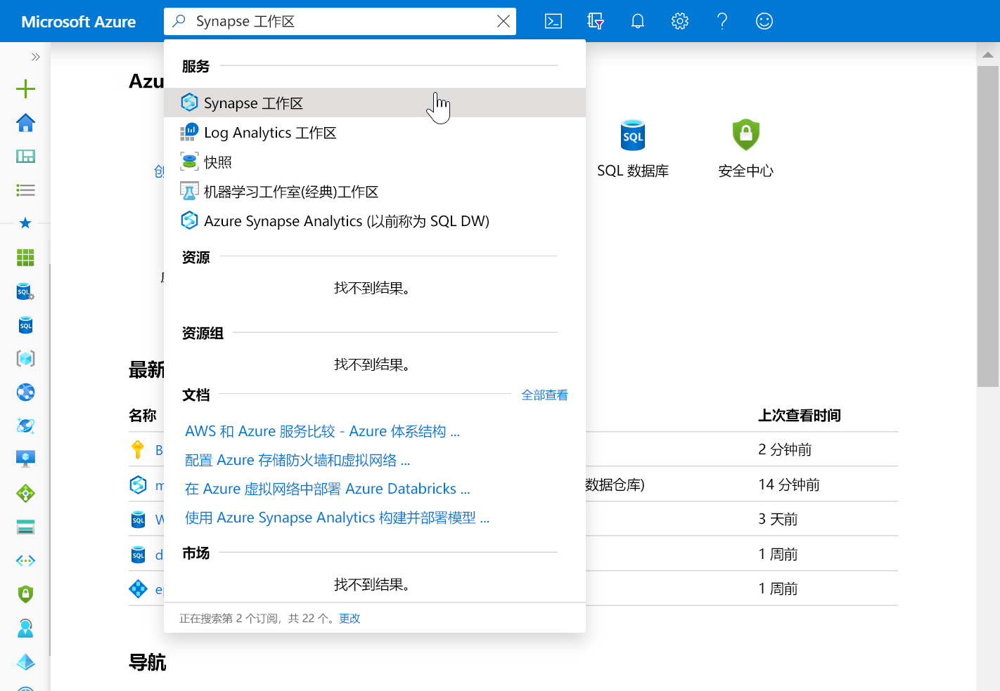
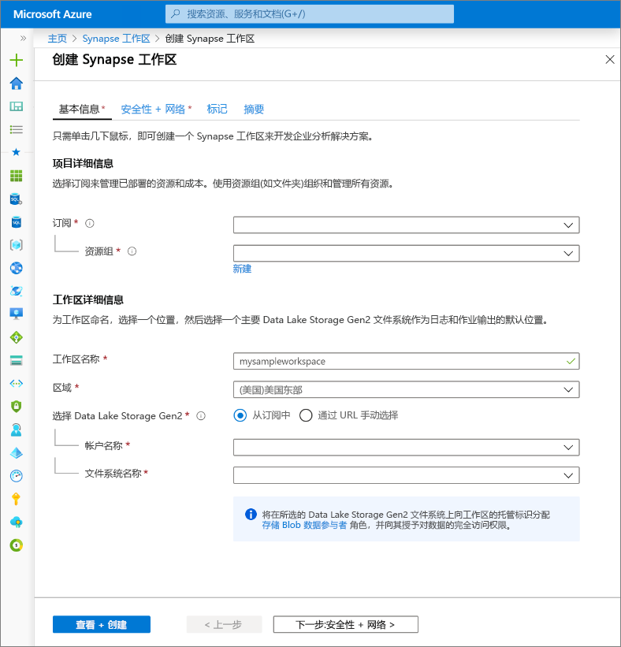
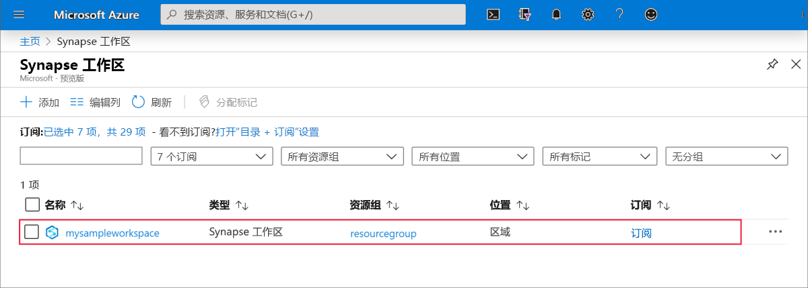
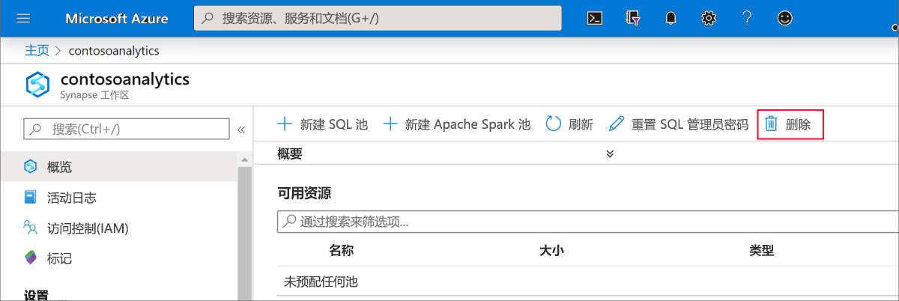
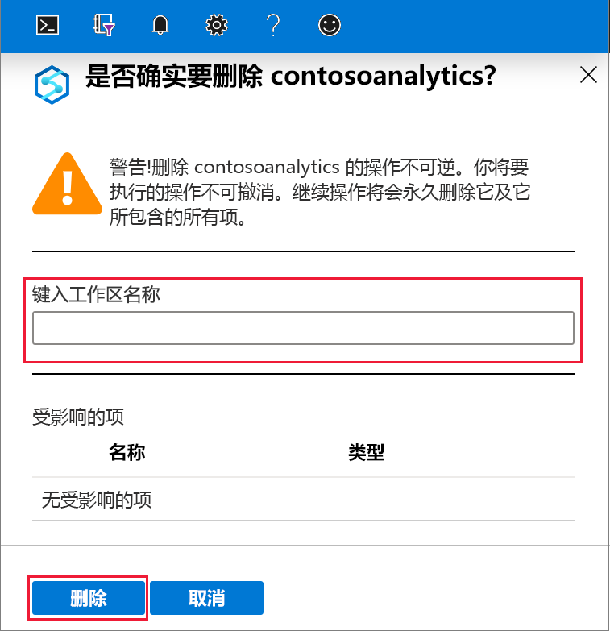

# 快速入门：创建 Synapse 工作区

本快速入门介绍了使用 Azure 门户创建 Azure Synapse 工作区的步骤。

如果没有 Azure 订阅，请[在开始之前创建一个免费帐户](https://azure.microsoft.com/free/)。

## 先决条件

- [Azure Data Lake Storage Gen2 存储帐户](../storage/common/storage-account-create.md?toc=/azure/synapse-analytics/toc.json&bc=/azure/synapse-analytics/breadcrumb/toc.json)

## 登录到 Azure 门户

登录到 [Azure 门户](https://portal.azure.com/)

## 使用 Azure 门户创建 Azure Synapse 工作区

1. 在 Microsoft Azure 搜索窗格中，输入“Synapse 工作区”，然后选择此服务。

2. 在“Synapse 工作区”页上，单击“+ 添加”。

3. 使用以下信息填写“Azure Synapse 工作区”窗体：

    | 设置 | 建议的值 | 说明 |
    | :------ | :-------------- | :---------- |
    | **订阅** | 用户的订阅 | 有关订阅的详细信息，请参阅[订阅](https://account.windowsazure.com/Subscriptions)。 |
    | **资源组** | 任何资源组 | 如需有效的资源组名称，请参阅 [Naming rules and restrictions](/azure/architecture/best-practices/resource-naming?toc=/azure/synapse-analytics/toc.json&bc=/azure/synapse-analytics/breadcrumb/toc.json&view=azure-sqldw-latest)（命名规则和限制）。 |
    | **工作区名称** | mysampleworkspace | 指定工作区的名称，该名称还将用于连接终结点。|
    | **区域** | 美国东部 2 | 指定工作区的位置。|
    | **Data Lake Storage Gen2** | 帐户：`storage account name`   文件系统：`root file system to use` | 指定要用作主存储的 ADLS Gen2 存储帐户名称，以及要使用的文件系统。|
    ||||

    

    可以通过以下方式选择存储帐户：
    - 你的订阅中可用的 ADLS Gen2 帐户的列表
    - 使用帐户名称手动输入

    > [!IMPORTANT]
    > Azure Synapse 工作区需要能够读取所选 ADLS Gen2 帐户以及向其写入内容。 此外，对于作为主存储帐户链接的任何存储帐户，在创建存储帐户时必须已启用“分层命名空间”。
    >
    > 在 ADLS Gen2 选择字段下有一条说明，指出将在所选的 Data Lake Storage Gen2 文件系统上向工作区的托管标识分配**存储 Blob 数据参与者**角色，并向其授予完全访问权限。

4. （可选）修改任何“安全性 + 网络默认值”选项卡：
5. （可选）在**标记**选项卡中添加任何标记。
6. **摘要**选项卡将运行必要的验证，以确保可以成功创建工作区。 验证成功后，按“创建”。
7. 在资源预配过程成功完成后，你会在 Synapse 工作区列表中看到所创建的工作区对应的条目。 

## 清理资源

执行以下步骤，删除 Azure Synapse 工作区。
> [!WARNING]
> 删除 Azure Synapse 工作区将删除分析引擎、存储在包含的 SQL 池所在数据库中的数据，以及工作区元数据。 将无法再连接到 SQL 终结点、Apache Spark 终结点。 将删除所有代码项目（查询、笔记本、作业定义和管道）。
>
> 删除工作区不会影响链接到工作区的 Data Lake Store Gen2 中的数据。

如果要删除 Azure Synapse 工作区，请完成以下步骤：

1. 导航到要删除的 Azure Synapse 工作区。
1. 在命令栏中按“删除”。
 
1. 确认删除，并按“删除”按钮。
 
1. 该过程成功完成后，工作区列表中将不再列出该 Azure Synapse 工作区。

## 后续步骤

接下来，可以[创建 SQL 池](quickstart-create-sql-pool-studio.md)或[创建 Apache Spark 池](quickstart-create-apache-spark-pool-studio.md)，开始分析和探究你的数据。
