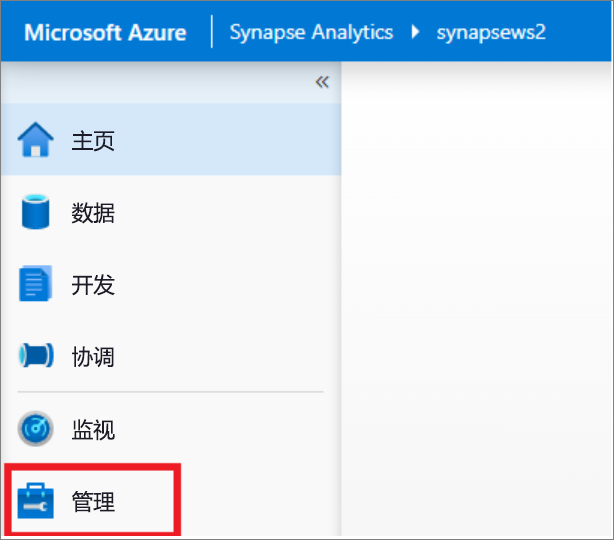
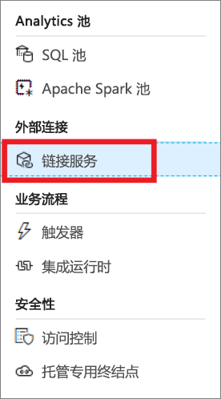
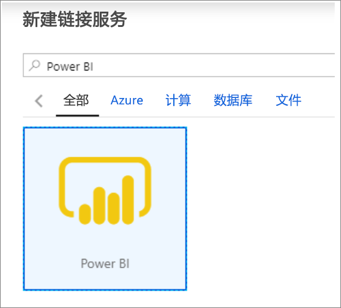
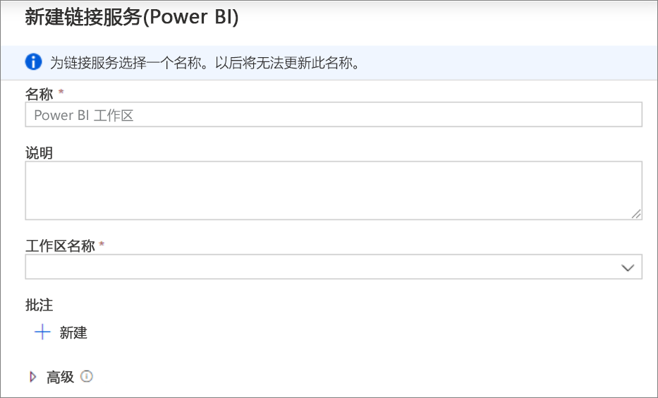
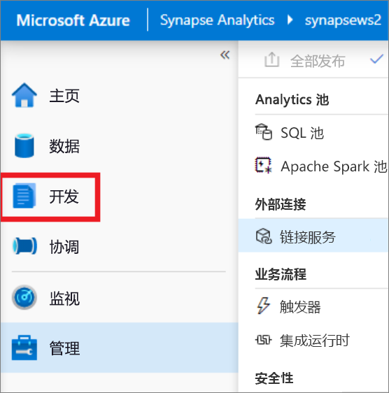
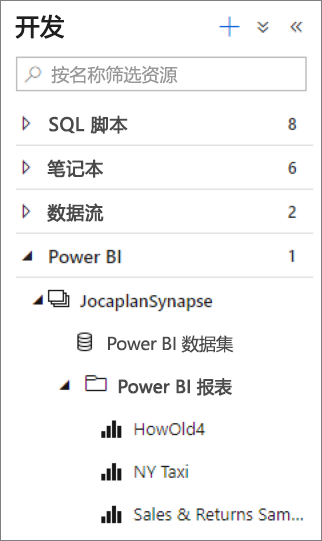
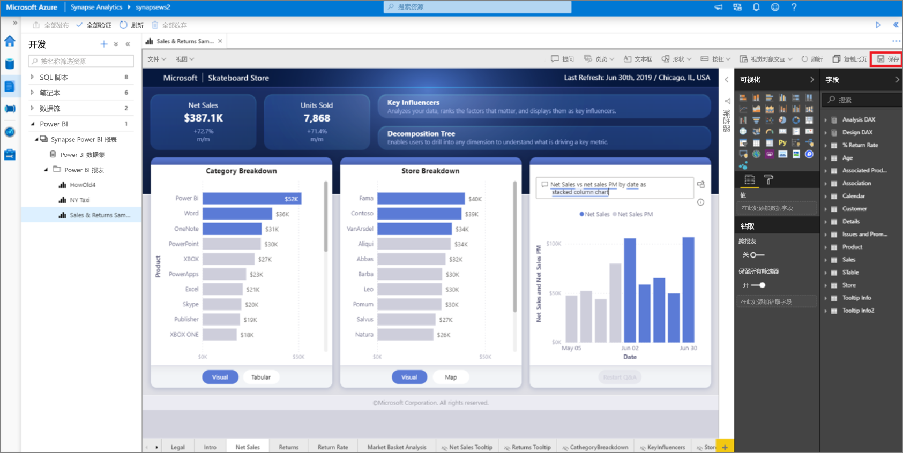

# 快速入门：将 Power BI 工作区链接到 Synapse 工作区

本快速入门介绍如何将 Power BI 工作区连接到 Synapse Analytics 工作区，以便从 Synapse Studio（预览版）创建新的 Power BI 报表和数据集。

如果没有 Azure 订阅，请[在开始之前创建一个免费帐户](https://azure.microsoft.com/free/)。

## 先决条件

- [创建 Azure Synapse 工作区和关联的存储帐户](quickstart-create-workspace.md)。
- [Power BI Professional 或 Premium 工作区](https://docs.microsoft.com/power-bi/service-create-the-new-workspaces)

## 将 Power BI 工作区链接到 Synapse 工作区

1. 在 Synapse Studio 中，单击“管理”。

    

2. 在“外部连接”下，单击“链接服务”。

    

3. 单击“+ 新建”。

    

4. 单击“Power BI”，然后单击“继续” 。

    

5. 输入链接服务的名称，并从下拉列表中选择一个工作区。

    

6. 单击“创建”。

## 在 Synapse Studio 中查看 Power BI 工作区

链接工作区后，可以在 Synapse Studio 中浏览 Power BI 数据集、修改/创建新 Power BI 报表。

1. 单击“开发”。

    

2. 展开 Power BI 和要使用的工作区。

    

可以在“开发”选项卡的顶部单击 + 创建新报表 。可以通过单击报表名称修改现有报表。 所有保存的更改都将写回到 Power BI 工作区。

## 后续步骤

详细了解如何[创建有关 Azure 存储中存储的文件的 Power BI 报表](sql/tutorial-connect-power-bi-desktop.md)。
