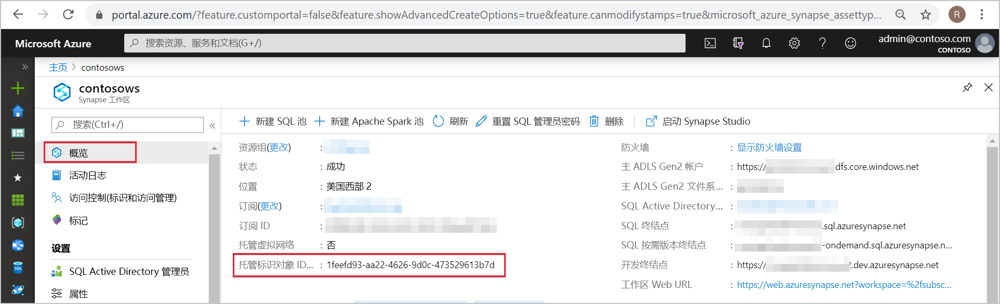
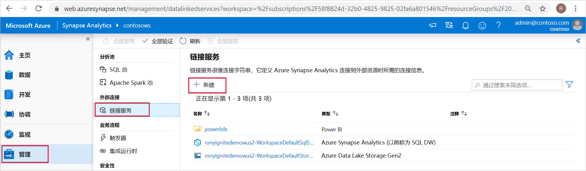
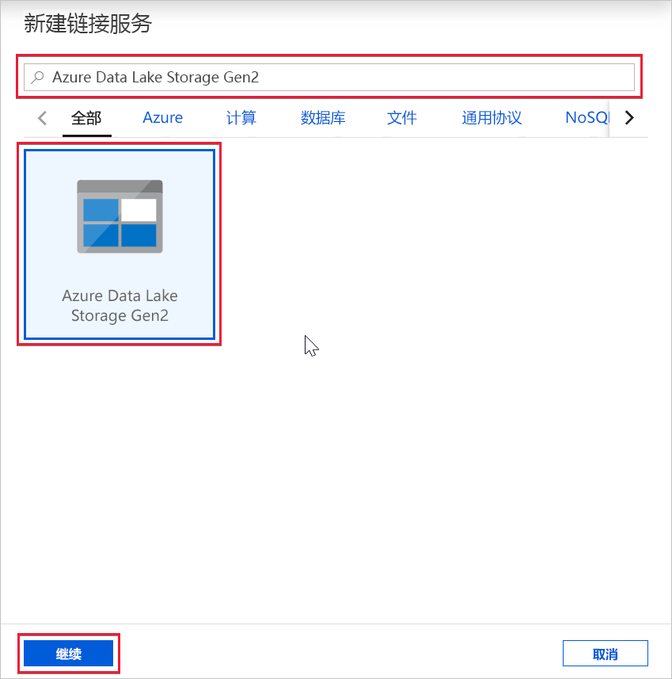
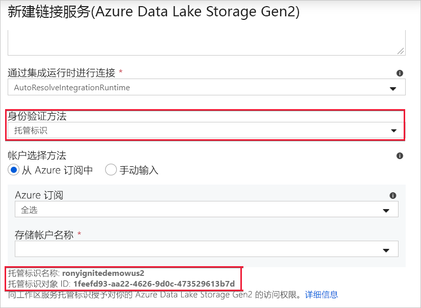

# Azure Synapse 工作区托管标识（预览版）

本文介绍 Azure Synapse 工作区中的托管标识。

## 托管标识

Azure 资源的托管标识是 Azure Active Directory 的一项功能。 此功能为 Azure 服务提供了 Azure AD 中的自动托管标识。 可以使用托管标识功能向支持 Azure AD 身份验证的任何服务进行身份验证。

Azure 资源托管标识是以前称为托管服务标识 (MSI) 的服务的新名称。 请参阅[托管标识](../../active-directory/managed-identities-azure-resources/overview.md?toc=/azure/synapse-analytics/toc.json&bc=/azure/synapse-analytics/breadcrumb/toc.json)来了解详细信息。

## Azure Synapse 工作区托管标识

创建工作区时，会为你的 Azure Synapse 工作区创建一个系统分配的托管标识。

>[!NOTE]
>在此文档的剩余部分中，我们将此工作区托管标识称为托管标识。

Azure Synapse 使用托管标识来协调管道。 托管标识生命周期直接绑定到 Azure Synapse 工作区。 如果删除 Azure Synapse 工作区，则还会清除托管标识。

工作区托管标识需要在管道中执行操作的权限。 授予权限时，可以使用对象 ID 或 Azure Synapse 工作区名称来查找托管标识。

## 在 Azure 门户中检索托管标识

可以在 Azure 门户中检索托管标识。 在 Azure 门户中打开 Azure Synapse 工作区，从左侧导航栏中选择“概览”  。 托管标识的对象 ID 会显示在主屏幕中。

从 Azure Synapse Studio 中创建支持托管标识身份验证的链接服务时，托管标识信息也会显示。

启动“Azure Synapse Studio”  ，从左侧导航栏中选择“管理”选项卡。 然后选择“链接服务”  并选择“+ 新建”  选项来创建新的链接服务。

在“新建链接服务”  窗口中，键入“Azure Data Lake Storage Gen2”  。 从下面的列表中选择“Azure Data Lake Storage Gen2”  资源类型，然后选择“继续”。

在下一个窗口中，选择“托管标识”作为“身份验证方法”   。 你将看到托管标识的“名称”  和“对象 ID”  。

## 后续步骤

[向 Azure Synapse 工作区托管标识授予权限](./how-to-grant-workspace-managed-identity-permissions.md)
