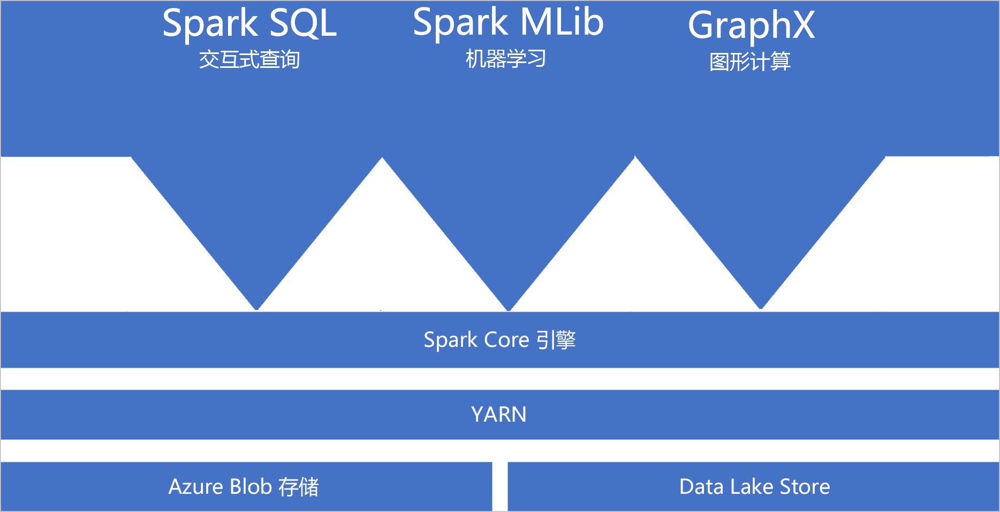
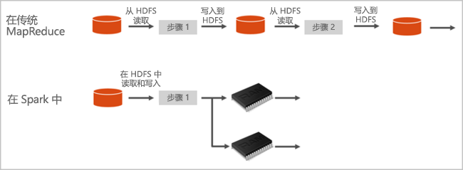

# Azure Synapse Analytics 中的 Apache Spark 是什么

Apache Spark 是并行处理框架，支持使用内存中处理来提升大数据分析应用程序的性能。 Azure Synapse Analytics 中的 Apache Spark 是 Apache Spark 在云中的一种 Microsoft 实现。 使用 Azure Synapse 可以在 Azure 中轻松创建和配置 Spark 池（预览版）。 Azure Synapse 中的 Spark 池与 Azure 存储和 Azure Data Lake Generation 2 存储兼容。 因此，可以使用 Azure Spark 池来处理 Azure 中存储的数据。

[!INCLUDE [preview](../includes/note-preview.md)]

## 什么是 Apache Spark

Apache Spark 提供用于内存中群集计算的基元。 Spark 作业可以将数据加载和缓存到内存中并重复地对其进行查询。 内存中计算的速度要比基于磁盘的应用程序快得多。 Spark 还与多种编程语言相集成，使你可以像处理本地集合一样处理分布式数据集。 无需将所有内容构造为映射和化简操作。

Azure Synapse 中的 Spark 池提供完全托管的 Spark 服务。 下面列出了在 Synapse Analytics 中创建 Spark 池的优势。

| Feature | 说明 |
| --- | --- |
| 速度和效率 |当节点数少于 60 个时，Spark 实例的启动时间大约为 2 分钟；当节点数超过 60 个时，启动时间大约为 5 分钟。 默认情况下，将在执行最后一个作业后的 5 分钟后关闭实例，除非笔记本连接使该实例保持活动状态。 |
| 容易创建 |可以使用 Azure 门户、Azure PowerShell 或 Synapse Analytics .NET SDK，在 Azure Synapse 中快速创建新的 Spark 池。 请参阅 [Synapse Analytics 中的 Spark 池入门](../quickstart-create-apache-spark-pool-studio.md)。 |
| 易于使用 |Synapse Analytics 包含派生自 [Nteract](https://nteract.io/) 的自定义笔记本。 可以使用这些笔记本执行交互式数据处理和可视化。|
| REST API |Synapse Analytics 中的 Spark 包含 [Apache Livy](https://github.com/cloudera/hue/tree/master/apps/spark/java#welcome-to-livy-the-rest-spark-server)（基于 REST-API 的 Spark 作业服务器，用于远程提交和监视作业）。 |
| 支持 Azure Data Lake Storage Generation 2| Azure Synapse 中的 Spark 池可以使用 Azure Data Lake Storage Generation 2 和 BLOB 存储。 有关 Data Lake Storage 的详细信息，请参阅 [Azure Data Lake Storage 概述](../../data-lake-store/data-lake-store-overview.md)。 |
| 与第三方 IDE 集成 | Azure Synapse 为 [Jetbrains 的 IntelliJ IDEA](https://www.jetbrains.com/idea/) 提供一个 IDE 插件，该插件可用于创建应用程序并将其提交到 Spark 池。 |
| 预先加载的 Anaconda 库 |Azure Synapse 中的 Spark 池预装了 Anaconda 库。 [Anaconda](https://docs.continuum.io/anaconda/) 提供将近 200 个用于机器学习、数据分析、可视化等的库。 |
| 可伸缩性 | 可为 Azure Synapse 中的 Apache Spark 池启用自动缩放，以根据需要纵向扩展和缩减池。 此外，由于所有数据都存储在 Azure 存储或 Data Lake Storage 中，因此可以关闭 Spark 池而不丢失任何数据。 |

Azure Synapse 中的 Spark 池默认包含可在这些池中使用的以下组件。

- [Spark Core](https://spark.apache.org/docs/latest/)。 包括 Spark Core、Spark SQL、GraphX 和 MLlib。
- [Anaconda](https://docs.continuum.io/anaconda/)
- [Apache Livy](https://github.com/cloudera/hue/tree/master/apps/spark/java#welcome-to-livy-the-rest-spark-server)
- [Nteract 笔记本](https://nteract.io/)

## Spark 池体系结构

了解 Spark 在 Synapse Analytics 上的运行方式后，即可轻松了解 Spark 的组件。

Spark 应用程序在池中作为一组独立的进程运行，由主程序（称为驱动程序）中的 SparkContext 对象进行协调。

SparkContext 能够连接到可在不同应用程序之间分配资源的群集管理器。 该群集管理器为 [Apache Hadoop YARN](https://hadoop.apache.org/docs/current/hadoop-yarn/hadoop-yarn-site/YARN.html)。 连接后，Spark 将获取池中节点上的执行程序，这些执行程序是为应用程序运行计算和存储数据的进程。 然后，它将应用程序代码（由传递给 SparkContext 的 JAR 或 Python 文件指定）发送到执行程序。 最后，SparkContext 将任务发送给执行程序来运行。

SparkContext 在节点上运行用户的主函数，并执行各种并行操作。 然后，SparkContext 收集操作的结果。 节点从/向文件系统读取和写入数据。 节点还将已转换的数据作为弹性分布式数据集 (RDD) 缓存在内存中。

SparkContext 连接到 Spark 池，并负责将应用程序转换为有向图 (DAG)。 该图由在节点上的执行程序进程内执行的各个任务构成。 每个应用程序获取自己的执行程序进程，这些进程在整个应用程序持续时间内保留，并以多个线程运行任务。

## Synapse Analytics 中的 Apache Spark 用例

Synapse Analytics 中的 Spark 池可实现以下重要方案：

### 数据工程/数据准备

Apache Spark 包含许多语言功能，用于支持准备和处理大量数据的工作，使这些数据能够创造更大的价值并可由 Synapse Analytics 中的其他服务使用。 这是通过多种语言（C#、Scala、PySpark、Spark SQL）以及为处理和连接而提供的库实现的。

### 机器学习

Apache Spark 随附 [MLlib](https://spark.apache.org/mllib/) - 构建在 Spark 基础之上的、可从 Synapse Analytics 中的 Spark 池使用的机器学习库。 Synapse Analytics 中的 Spark 池还包含 Anaconda - 一种 Python 分发版，带有用于数据科学（包括机器学习）的各种包。 当这些与内置的笔记本支持相结合时，你将获得一个用于创建机器学习应用程序的环境。

## 从哪里开始

请通过以下文章来详细了解 Synapse Analytics 中的 Apache Spark：

- [快速入门：在 Azure Synapse 中创建 Spark 池](../quickstart-create-apache-spark-pool-portal.md)
- [快速入门：创建 Apache Spark 笔记本](../quickstart-apache-spark-notebook.md)
- [教程：使用 Apache Spark 进行机器学习](./apache-spark-machine-learning-mllib-notebook.md)
- [Apache Spark 官方文档](https://spark.apache.org/docs/latest/)

> [!NOTE]
> 某些 Apache Spark 官方文档依赖于使用 Spark 控制台，但该控制台在 Azure Synapse Spark 中不可用，请改用笔记本或 IntelliJ 体验

## 后续步骤

在本概述文章中，你已大致了解了 Azure Synapse Analytics 中的 Apache Spark。 请继续阅读下一篇文章，了解如何在 Azure Synapse Analytics 中创建 Spark 池：

- [在 Azure Synapse 中创建 Spark 池](../quickstart-create-apache-spark-pool-portal.md)
