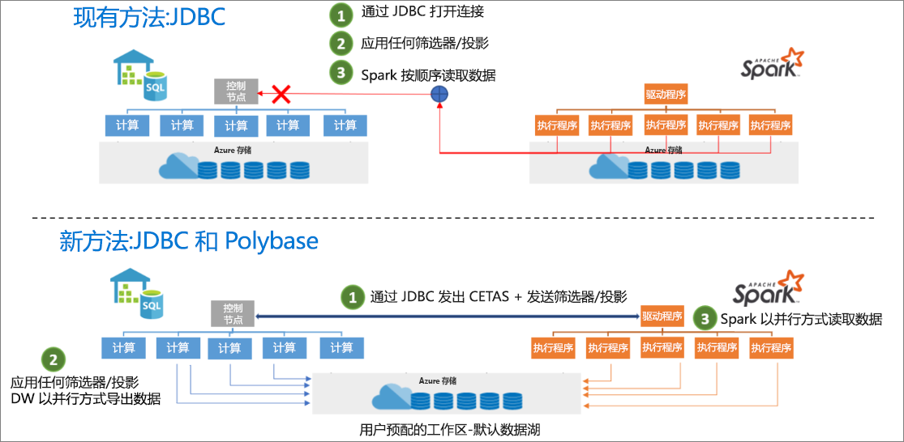

# <a name="introduction"></a>简介

Azure Synapse Apache Spark 到 Synapse SQL 的连接器设计用来高效地在 Azure Synapse 中的 Spark 池（预览版）与 SQL 池之间传输数据。 Azure Synapse Apache Spark 到 Synapse SQL 的连接器仅适用于 SQL 池，不适用于 SQL 按需版本。

## <a name="design"></a>设计

可以使用 JDBC 来执行 Spark 池与 SQL 池之间的数据传输。 但是，假设有两个分布式系统（例如 Spark 池和 SQL 池），则 JDBC 往往会成为串行数据传输的瓶颈。

Azure Synapse Apache Spark 池到 Synapse SQL 的连接器是适用于 Apache Spark 的一个数据源实现。 它使用 Azure Data Lake Storage Gen2 以及 SQL 池中的 Polybase 高效地在 Spark 群集与 Synapse SQL 实例之间传输数据。



## <a name="authentication-in-azure-synapse-analytics"></a>Azure Synapse Analytics 中的身份验证

系统之间的身份验证在 Azure Synapse Analytics 中无缝进行。 有一个令牌服务，它与 Azure Active Directory 进行连接来获取在访问存储帐户或数据仓库服务器时使用的安全令牌。

因此，只要在存储帐户和数据仓库服务器上配置了 AAD 身份验证，就不需要创建凭据或在连接器 API 中指定凭据。 如果没有，则可以指定 SQL 身份验证。 可在[用法](#usage)部分中找到更多详细信息。

## <a name="constraints"></a>约束

- 此连接器仅适用于 Scala。

## <a name="prerequisites"></a>先决条件

- 必须为需要向其/从其传输数据的数据库/SQL 池中的 db_exporter 角色的成员。
- 必须为默认存储帐户上“存储 Blob 数据参与者”角色的成员。

若要创建用户，请连接到 SQL 池数据库，然后按照以下示例操作：

```sql
--SQL User
CREATE USER Mary FROM LOGIN Mary;

--Azure Active Directory User
CREATE USER [mike@contoso.com] FROM EXTERNAL PROVIDER;
```

若要分配角色，请使用以下命令：

```sql
--SQL User
EXEC sp_addrolemember 'db_exporter', 'Mary';

--Azure Active Directory User
EXEC sp_addrolemember 'db_exporter',[mike@contoso.com]
```

## <a name="usage"></a>使用情况

不需要 import 语句，对于笔记本体验，它们是预先导入的。

### <a name="transfer-data-to-or-from-a-sql-pool-attached-with-the-workspace"></a>将数据传输到与工作区相连的 SQL 池，或者从该池向外传输数据

> [!NOTE]
> **在笔记本体验中，import 不是必需的**

```scala
 import com.microsoft.spark.sqlanalytics.utils.Constants
 import org.apache.spark.sql.SqlAnalyticsConnector._
```

#### <a name="read-api"></a>读取 API

```scala
val df = spark.read.sqlanalytics("<DBName>.<Schema>.<TableName>")
```

上述 API 适用于 SQL 池中的内部（托管）表以及外部表。

#### <a name="write-api"></a>写入 API

```scala
df.write.sqlanalytics("<DBName>.<Schema>.<TableName>", <TableType>)
```

写入 API 会在 SQL 池中创建表，然后调用 Polybase 来加载数据。  表不得存在于 SQL 池中，否则将返回指出“已存在名为…的对象”的错误

TableType 值

- Constants.INTERNAL - SQL 池中的托管表
- Constants.EXTERNAL - SQL 池中的外部表

SQL 池托管表

```scala
df.write.sqlanalytics("<DBName>.<Schema>.<TableName>", Constants.INTERNAL)
```

SQL 池外部表

若要写入 SQL 池外部表，SQL 池上必须存在 EXTERNAL DATA SOURCE 和 EXTERNAL FILE FORMAT。  有关详细信息，请参阅在 SQL 池中创建[外部数据源](/sql/t-sql/statements/create-external-data-source-transact-sql?toc=/azure/synapse-analytics/sql-data-warehouse/toc.json&bc=/azure/synapse-analytics/sql-data-warehouse/breadcrumb/toc.json&view=azure-sqldw-latest)和[外部文件格式](/sql/t-sql/statements/create-external-file-format-transact-sql?toc=/azure/synapse-analytics/sql-data-warehouse/toc.json&bc=/azure/synapse-analytics/sql-data-warehouse/breadcrumb/toc.json&view=azure-sqldw-latest)。  以下是在 SQL 池中创建外部数据源和外部文件格式的示例。

```sql
--For an external table, you need to pre-create the data source and file format in SQL pool using SQL queries:
CREATE EXTERNAL DATA SOURCE <DataSourceName>
WITH
  ( LOCATION = 'abfss://...' ,
    TYPE = HADOOP
  ) ;

CREATE EXTERNAL FILE FORMAT <FileFormatName>
WITH (  
    FORMAT_TYPE = PARQUET,  
    DATA_COMPRESSION = 'org.apache.hadoop.io.compress.SnappyCodec'  
);
```

使用 Azure Active Directory 向存储帐户传递身份验证时，不需要使用 EXTERNAL CREDENTIAL 对象。  请确保你是存储帐户上“存储 Blob 数据参与者”角色的成员。

```scala

df.write.
    option(Constants.DATA_SOURCE, <DataSourceName>).
    option(Constants.FILE_FORMAT, <FileFormatName>).
    sqlanalytics("<DBName>.<Schema>.<TableName>", Constants.EXTERNAL)

```

### <a name="if-you-transfer-data-to-or-from-a-sql-pool-or-database-outside-the-workspace"></a>如果将数据传输到工作区外部的 SQL 池或数据库，或者从该池或数据库向外传输数据

> [!NOTE]
> 在笔记本体验中，import 不是必需的

```scala
 import com.microsoft.spark.sqlanalytics.utils.Constants
 import org.apache.spark.sql.SqlAnalyticsConnector._
```

#### <a name="read-api"></a>读取 API

```scala
val df = spark.read.
option(Constants.SERVER, "samplews.database.windows.net").
sqlanalytics("<DBName>.<Schema>.<TableName>")
```

#### <a name="write-api"></a>写入 API

```scala
df.write.
option(Constants.SERVER, "samplews.database.windows.net").
sqlanalytics("<DBName>.<Schema>.<TableName>", <TableType>)
```

### <a name="use-sql-auth-instead-of-aad"></a>使用 SQL 身份验证而非 AAD

#### <a name="read-api"></a>读取 API

目前，该连接器不支持对工作区外部的 SQL 池使用基于令牌的身份验证。 需要使用 SQL 身份验证。

```scala
val df = spark.read.
option(Constants.SERVER, "samplews.database.windows.net").
option(Constants.USER, <SQLServer Login UserName>).
option(Constants.PASSWORD, <SQLServer Login Password>).
sqlanalytics("<DBName>.<Schema>.<TableName>")
```

#### <a name="write-api"></a>写入 API

```scala
df.write.
option(Constants.SERVER, "samplews.database.windows.net").
option(Constants.USER, <SQLServer Login UserName>).
option(Constants.PASSWORD, <SQLServer Login Password>).
sqlanalytics("<DBName>.<Schema>.<TableName>", <TableType>)
```

### <a name="use-the-pyspark-connector"></a>使用 PySpark 连接器

> [!NOTE]
> 在给出此示例时，只考虑了笔记本体验。

假设你有一个要写入到数据仓库的数据帧“pyspark_df”。

在 PySpark 中使用此数据帧创建一个临时表：

```py
pyspark_df.createOrReplaceTempView("pysparkdftemptable")
```

使用 magic 在 PySpark 笔记本中运行 Scala 单元格：

```scala
%%spark
val scala_df = spark.sqlContext.sql ("select * from pysparkdftemptable")

scala_df.write.sqlanalytics("sqlpool.dbo.PySparkTable", Constants.INTERNAL)
```

同样，在读取方案中，使用 Scala 读取数据并将其写入到一个临时表中，在 PySpark 中使用 Spark SQL 查询该临时表并将结果写入一个数据帧。

## <a name="allow-other-users-to-use-the-azure-synapse-apache-spark-to-synapse-sql-connector-in-your-workspace"></a>允许其他用户在工作区中使用 Synapse SQL 的 Azure Synapse Apache Spark 连接器

你需要成为连接到工作区的 ADLS Gen2 存储帐户上的存储 Blob 数据所有者，才能改变其他用户缺少的权限。 确保用户有权访问工作区并具有运行笔记本的权限。

### <a name="option-1"></a>选项 1

- 使用户成为存储 Blob 数据参与者/所有者

### <a name="option-2"></a>方法 2

- 在文件夹结构上指定以下 ACL：

| Folder | / | synapse | workspaces  | \<workspacename> | sparkpools | \<sparkpoolname>  | sparkpoolinstances  |
|--|--|--|--|--|--|--|--|
| 访问权限 | --X | --X | --X | --X | --X | --X | -WX |
| 默认权限 | ---| ---| ---| ---| ---| ---| ---|

- 应能够从“synapse”并从 Azure 门户向下对所有文件夹进行 ACL。 若要对根“/”文件夹进行 ACL，请按照下面的说明进行操作。

- 使用 AAD 从存储资源管理器连接到与工作区连接的存储帐户
- 选择帐户，并为工作区提供 ADLS Gen2 URL 和默认文件系统
- 看到列出的存储帐户后，右键单击列出的工作区，然后选择“管理访问权限”
- 将用户添加到具有“执行”访问权限的 / 文件夹中。 选择“确定”

> [!IMPORTANT]
> 如果不打算这样做，请勿选择“默认”。

## <a name="next-steps"></a>后续步骤

- [使用 Azure 门户创建 SQL 池](../../synapse-analytics/quickstart-create-apache-spark-pool-portal.md)
- [使用 Azure 门户新建 Apache Spark 池](../../synapse-analytics/quickstart-create-apache-spark-pool-portal.md) 
