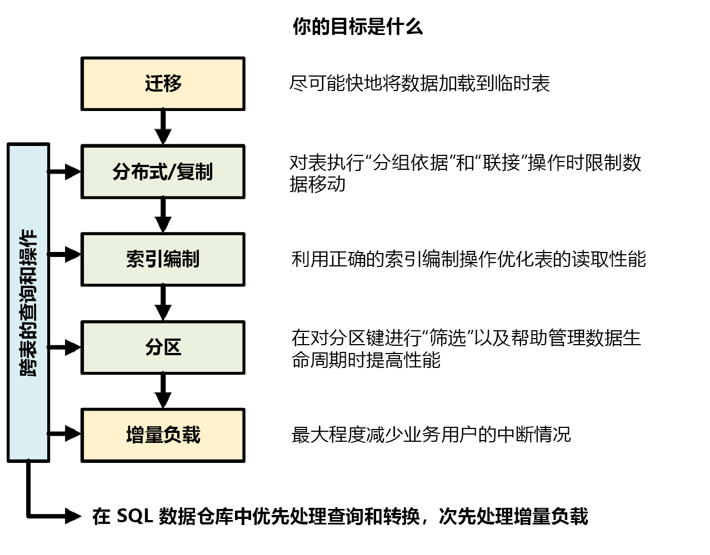

# Azure Synapse Analytics（以前称为 SQL DW）的速查表

此速查表提供有关生成 Azure Synapse 解决方案的有用提示和最佳做法。

下图显示了设计数据仓库的过程：

## 跨表的查询和操作

如果事先已知道要在数据仓库中运行的主要操作和查询，则可以针对这些操作指定数据仓库体系结构的优先级。 这些查询和操作可能包括：

* 将一个或两个事实数据表与维度表相联接，筛选合并的表，然后将结果追加到数据市场。
* 对事实销售进行较大或较小的更新。
* 仅将数据追加到表。

提前知道操作类型有助于优化表设计。

## 数据迁移

首先，请将数据载入 [Azure Data Lake Storage](../../data-factory/connector-azure-data-lake-store.md?toc=/azure/synapse-analytics/sql-data-warehouse/toc.json&bc=/azure/synapse-analytics/sql-data-warehouse/breadcrumb/toc.json) 或 Azure Blob 存储。 接下来，使用 PolyBase 将数据载入临时表中。 使用以下配置：

| 设计 | 建议 |
|:--- |:--- |
| 分发 | 循环 |
| 索引 | 堆 |
| 分区 | 无 |
| 资源类 | largerc 或 xlargerc |

详细了解[数据迁移](https://blogs.msdn.microsoft.com/sqlcat/20../../migrating-data-to-azure-sql-data-warehouse-in-practice/)、[数据加载](design-elt-data-loading.md)以及[提取、加载和转换 (ELT) 过程](design-elt-data-loading.md)。

## 分布式表或复制表

根据表属性使用以下策略：

| 类型 | 非常适合...| 谨慎使用|
|:--- |:--- |:--- |
| 复制 | * 星型架构中压缩后（约 5 倍压缩率）存储小于 2 GB 的小型维度表 |*    表上有大量写入事务（例如：插入、更新插入、删除、更新）  *    经常更改数据仓库单位 (DWU) 预配  *    仅使用 2-3 列，而表有许多列  *    对复制表编制索引 |
| 轮循机制（默认） | *    临时表   * 没有明显的联接键或合适的候选列 |*    因数据移动而性能下降 |
| 哈希 | * 事实数据表  *    大型维度表 |* 不能更新分布键 |

**提示：**

* 先使用轮循机制，但以哈希分布策略为最终目标，以便充分利用大规模并行体系结构。
* 确保常见的哈希键具有相同的数据格式。
* 请勿以 varchar 格式进行分发。
* 可以将具有常见哈希键的维度表哈希分布到具有频繁联接操作的事实数据表。
* 使用 *[sys.dm_pdw_nodes_db_partition_stats](/sql/relational-databases/system-dynamic-management-views/sys-dm-db-partition-stats-transact-sql?toc=/azure/synapse-analytics/sql-data-warehouse/toc.json&bc=/azure/synapse-analytics/sql-data-warehouse/breadcrumb/toc.json&view=azure-sqldw-latest)* 分析数据中的任何偏斜。
* 使用 *[sys.dm_pdw_request_steps](/sql/relational-databases/system-dynamic-management-views/sys-dm-pdw-request-steps-transact-sql?toc=/azure/synapse-analytics/sql-data-warehouse/toc.json&bc=/azure/synapse-analytics/sql-data-warehouse/breadcrumb/toc.json&view=azure-sqldw-latest)* 分析查询背后的数据移动、监视时间广播以及随机选择操作需要。 这有助于查看分布策略。

详细了解[复制表](design-guidance-for-replicated-tables.md)和[分布式表](sql-data-warehouse-tables-distribute.md)。

## 为表编制索引

索引有助于加速读取表。 下面列出了一组独有的技术，可根据需要使用：

| 类型 | 非常适合... | 谨慎使用|
|:--- |:--- |:--- |
| 堆 | * 临时表  * 包含小规模查找的小型表 |* 任何查找扫描全表 |
| 聚集索引 | * 最多包含 1 亿行的表  * 仅 1-2 列被频繁使用的大型表（超过 1 亿行） |*    用于复制表  *    涉及多个联接和 Group By 操作的复杂查询  *    对索引列进行更新：它会占用内存 |
| 聚集列存储索引 (CCI)（默认） | *    大型表（超过 1 亿行） | *    用于复制表  *    对表进行大规模更新操作  *    对表过度分区：行组未横跨不同的分布节点和分区 |

**提示：**

* 除了聚集索引，可能还需要向经常用于筛选的列添加非聚集索引。
* 注意如何使用 CCI 管理表上的内存。 加载数据时，你希望用户（或查询）受益于大型资源类。 确保避免剪裁和创建许多经过压缩的小型行组。
* 在第 2 代上，CCI 表在计算节点上本地缓存，以最大限度地提高性能。
* 对于 CCI，可能因行组压缩不当而出现性能下降的情况。 如果发生此情况，请重新生成或重新整理 CCI。 你希望每个压缩后的行组包含至少 10 万行。 理想状态为一个行组 100 万行。
* 基于增量加载频率和大小，你想自动执行索引的重新整理或重新生成操作。 彻底清理操作始终有用。
* 想要剪裁行组时应更具战略性。 打开的行组有多大？ 未来几天希望加载多少数据？

详细了解[索引](sql-data-warehouse-tables-index.md)。

## 分区

如果拥有一个大型事实数据表（超过 10 亿行的表），可能需要对表分区。 在 99% 的情况下，分区键应基于日期。 注意不要过度分区，尤其是在具有聚集列存储索引时。

对于需要 ELT 的临时表，可从分区中受益。 它使数据生命周期管理更便捷。
注意不要对数据过度分区，尤其是对聚集列存储索引。

详细了解[分区](sql-data-warehouse-tables-partition.md)。

## 增量加载

若要增量加载数据，请先确保分配更大的资源类来加载数据。  当加载到具有聚集列存储索引的表中时，这一点尤其重要。  有关更多详细信息，请参阅[资源类](resource-classes-for-workload-management.md)。  

建议使用 PolyBase 和 ADF V2 在数据仓库中自动执行 ELT 管道。

对于历史数据中的大量更新，请考虑使用 [CTAS](sql-data-warehouse-develop-ctas.md) 将要保留的数据写入表中，而不是使用 INSERT、UPDATE 和 DELETE。

## 维护统计信息

 在自动统计信息功能推出正式版之前，要求手动维护统计信息。 对数据做*重大*更改时务必更新统计信息。 这有助于优化查询计划。 如果发现维护所有统计信息所需时间太长，请更谨慎地选择包含统计信息的列。

还可以定义更新频率。 例如，可能想要更新每天都要添加新值的日期列。 对涉及联接的列、WHERE 子句中使用的列、在 GROUP BY 中找到的列进行信息统计，可以获得最大效益。

详细了解[统计信息](sql-data-warehouse-tables-statistics.md)。

## 资源类

资源组用作将内存分配给查询的一种方式。 如果需要更多内存来提高查询或加载速度，应分配更大的资源类。 但另一方面，使用更大的资源类会影响并发。 在将所有用户移动到大型资源类之前，你希望把这点纳入考虑范围。

如果发现查询所需时间过长，请确保用户未在大型资源类中运行。 大型资源类会占用许多并发槽。 它们可能导致其他查询排队等待。

最后，通过使用第 2 代的 [SQL 池](sql-data-warehouse-overview-what-is.md#synapse-sql-pool-in-azure-synapse)，每个资源类可比第 1 代获得多 2.5 倍的内存。

详细了解如何使用[资源类和并发](resource-classes-for-workload-management.md)。

## 降低成本

Azure Synapse 的一个重要功能是可以[管理计算资源](sql-data-warehouse-manage-compute-overview.md)。 你可在不使用 SQL 池时进行暂停，这会停止计算资源的计费。 可以缩放资源以满足性能需求。 若要暂停，请使用 [Azure 门户](pause-and-resume-compute-portal.md)或 [PowerShell](pause-and-resume-compute-powershell.md)。 若要缩放，请使用 [Azure 门户](quickstart-scale-compute-portal.md)、[Powershell](quickstart-scale-compute-powershell.md)、[T-SQL](quickstart-scale-compute-tsql.md) 或 [REST API](sql-data-warehouse-manage-compute-rest-api.md#scale-compute)。

立即使用 Azure Functions 根据需要进行自动缩放：

## 优化体系结构以提高性能

建议考虑在中心辐射型体系结构中使用 SQL 数据库和 Azure Analysis Services。 该解决方案可以在不同的用户组之间提供工作负荷隔离，同时还能使用 SQL 数据库和 Azure Analysis Services 的高级安全功能。 这也是一种向用户提供无限并发的方式。

详细了解[利用 Azure Synapse 的典型体系结构](https://blogs.msdn.microsoft.com/sqlcat/20../../common-isv-application-patterns-using-azure-sql-data-warehouse/)。

单击一下即可在 SQL 池的 SQL 数据库中部署辐射型体系结构：

