# <a name="quickstart-create-and-query-a-synapse-sql-pool-using-the-azure-portal"></a>快速入门：使用 Azure 门户创建并查询 Synapse SQL 池

使用 Azure 门户在 Azure Synapse Analytics（以前称为 SQL DW）中快速创建和查询 Synapse SQL 池（数据仓库）。

## <a name="prerequisites"></a>先决条件

1. 如果没有 Azure 订阅，请在开始之前创建一个[免费](https://azure.microsoft.com/free/)帐户。

   > [!NOTE]
   > 在 Azure Synapse 中创建 SQL 池可能会产生新的可计费服务。 有关详细信息，请参阅 [Azure Synapse Analytics 定价](https://azure.microsoft.com/pricing/details/synapse-analytics/)。

2. 下载并安装最新版本的 [SQL Server Management Studio](/sql/ssms/download-sql-server-management-studio-ssms?toc=/azure/synapse-analytics/sql-data-warehouse/toc.json&bc=/azure/synapse-analytics/sql-data-warehouse/breadcrumb/toc.json&view=azure-sqldw-latest) (SSMS)。

## <a name="sign-in-to-the-azure-portal"></a>登录到 Azure 门户

登录 [Azure 门户](https://portal.azure.com/)。

## <a name="create-a-sql-pool"></a>创建 SQL 池

数据仓库是使用 Azure Synapse Analytics 中的 SQL 池创建的。 SQL 池是使用定义的一组[计算资源](memory-concurrency-limits.md)创建的。 数据库在 [Azure 资源组](../../azure-resource-manager/management/overview.md?toc=/azure/synapse-analytics/sql-data-warehouse/toc.json&bc=/azure/synapse-analytics/sql-data-warehouse/breadcrumb/toc.json)和[逻辑 SQL 服务器](../../azure-sql/database/logical-servers.md?toc=/azure/synapse-analytics/sql-data-warehouse/toc.json&bc=/azure/synapse-analytics/sql-data-warehouse/breadcrumb/toc.json)中创建。

按照这些步骤创建包含 **AdventureWorksDW** 示例数据的 SQL 池。

1. 在 Azure 门户的左上角选择“创建资源”。

   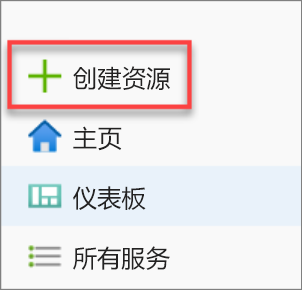

2. 在“新建”页上选择“数据库”，然后在“特色”列表中选择“Azure Synapse Analytics (前称为 SQL 数据仓库)”。   

   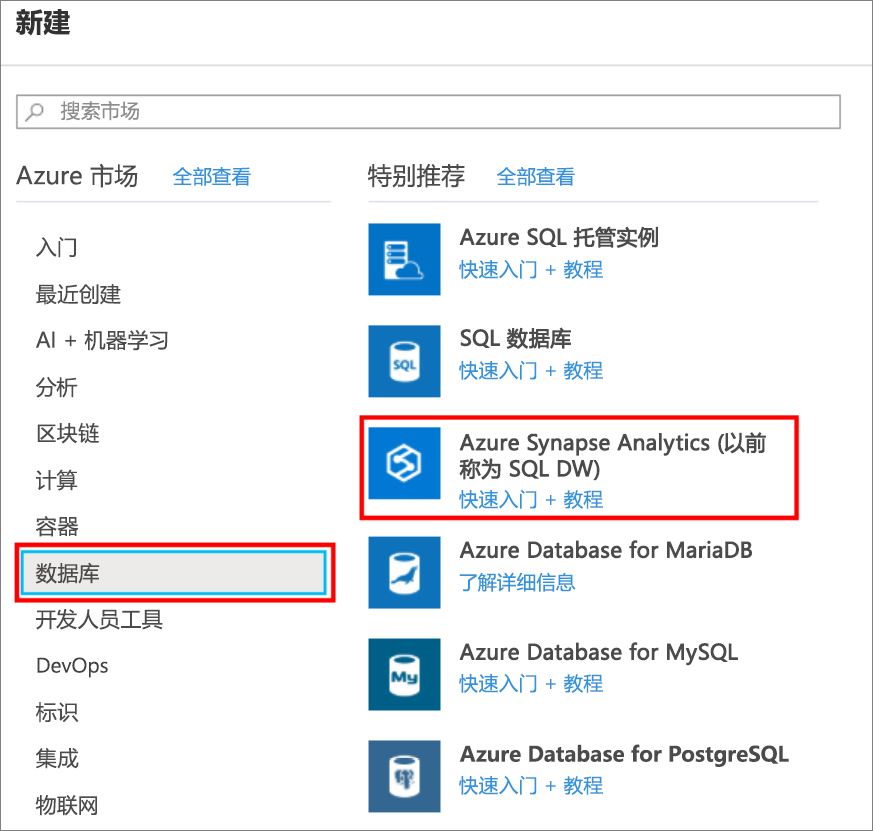

3. 在“基本信息”中，提供订阅、资源组、SQL 池名称和服务器名称：

   | 设置 | 建议的值 | 说明 |
   | :------ | :-------------- | :---------- |
   | **订阅** | 订阅 | 有关订阅的详细信息，请参阅[订阅](https://account.windowsazure.com/Subscriptions)。 |
   | **资源组** | myResourceGroup | 如需有效的资源组名称，请参阅 [Naming rules and restrictions](/azure/architecture/best-practices/resource-naming?toc=/azure/synapse-analytics/sql-data-warehouse/toc.json&bc=/azure/synapse-analytics/sql-data-warehouse/breadcrumb/toc.json)（命名规则和限制）。 |
   | **SQL 池名称** | 任何全局唯一的名称（例如 *mySampleDataWarehouse*） | 如需有效的数据库名称，请参阅 [Database Identifiers](/sql/relational-databases/databases/database-identifiers?toc=/azure/synapse-analytics/sql-data-warehouse/toc.json&bc=/azure/synapse-analytics/sql-data-warehouse/breadcrumb/toc.json&view=azure-sqldw-latest)（数据库标识符）。 请注意，SQL 池是一种数据库。 |
   | **Server** | 任何全局唯一名称 | 选择现有的服务器，或者选择“新建”创建新的服务器名称。 如需有效的服务器名称，请参阅 [Naming rules and restrictions](/azure/architecture/best-practices/resource-naming?toc=/azure/synapse-analytics/sql-data-warehouse/toc.json&bc=/azure/synapse-analytics/sql-data-warehouse/breadcrumb/toc.json)（命名规则和限制）。 |

   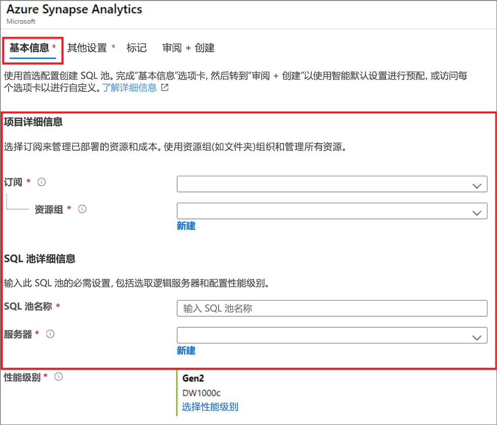

4. 在“性能级别”下，选择“选择性能级别”以根据需要使用滑块更改配置。 

   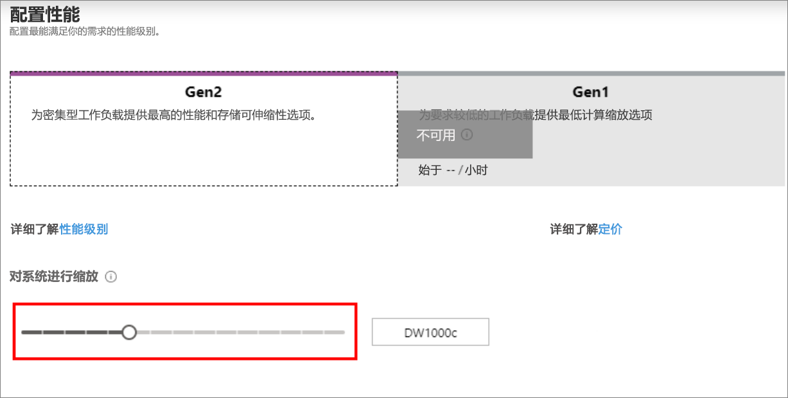  

   有关性能级别的详细信息，请参阅[管理 Azure Synapse Analytics 中的计算资源](sql-data-warehouse-manage-compute-overview.md)。

5. 选择“其他设置”，在“使用现有数据”下，选择“示例”，以便将 AdventureWorksDW 创建为示例数据库  。

    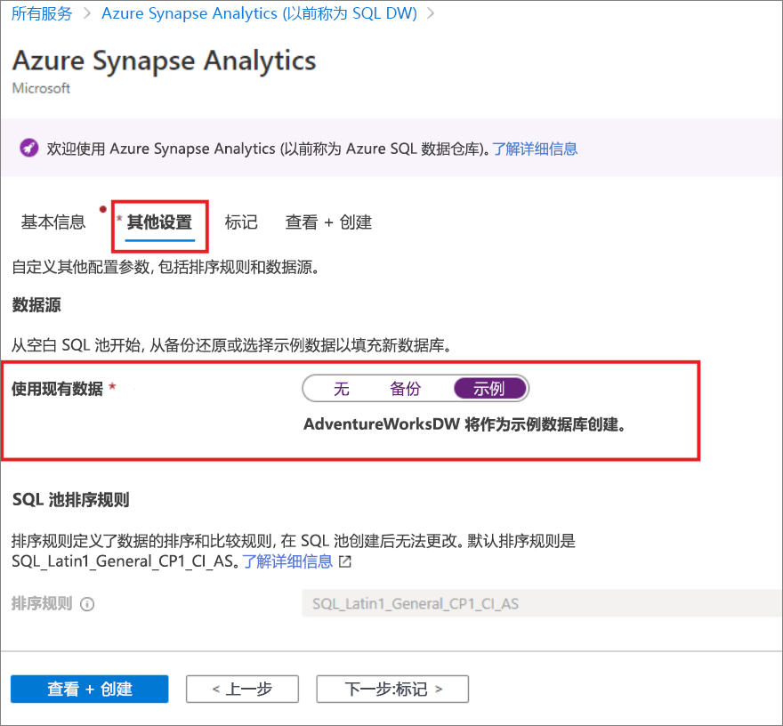 

6. 填写 Azure Synapse Analytics 窗体的“基本信息”选项卡后，请依次选择“查看 + 创建”、“创建”以创建 SQL 池。  预配需要数分钟。

   

   

7. 在工具栏上，选择“通知”监视部署过程。

   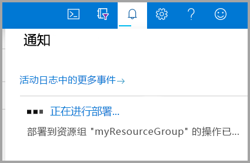

## <a name="create-a-server-level-firewall-rule"></a>创建服务器级防火墙规则

Azure Synapse 服务将在服务器级别创建防火墙。 此防火墙会阻止外部应用程序和工具连接到服务器或服务器上的任何数据库。 要启用连接，可以添加防火墙规则，为特定 IP 地址启用连接。 按照以下步骤为客户端的 IP 地址创建[服务器级防火墙规则](../../azure-sql/database/firewall-configure.md?toc=/azure/synapse-analytics/sql-data-warehouse/toc.json&bc=/azure/synapse-analytics/sql-data-warehouse/breadcrumb/toc.json)。

> [!NOTE]
> Azure Synapse 通过端口 1433 进行通信。 如果尝试从企业网络内部进行连接，则该网络的防火墙可能不允许经端口 1433 的出站流量。 如果是这样，则无法连接到服务器，除非 IT 部门打开了端口 1433。

1. 部署完成后，从左侧菜单中选择“所有服务”。 选择“数据库”，然后选择“Azure Synapse Analytics”旁边的星形图标将 Azure Synapse Analytics 添加到收藏夹。 

2. 在左侧菜单中选择“Azure Synapse Analytics”，然后在“Azure Synapse Analytics”页上选择“mySampleDataWarehouse”。    此时会打开数据库的概述页，其中显示了完全限定的服务器名称（例如 **sqlpoolservername.database.windows.net**），并提供了其他配置的选项。

3. 复制此完全限定的服务器名称，以便在此快速入门和其他快速入门中使用它连接到服务器及其数据库。 若要打开服务器设置，请选择服务器名称。

   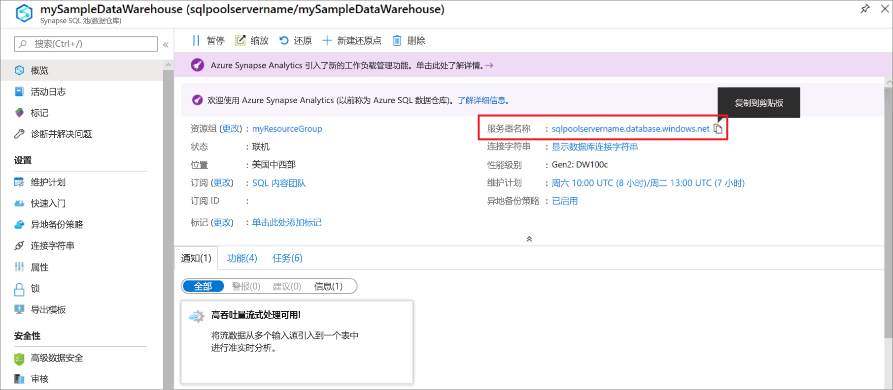

4. 选择“显示防火墙设置”。

   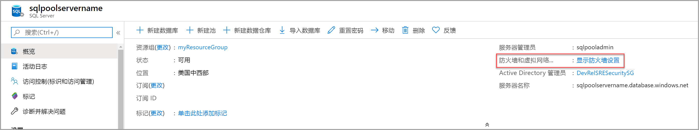

5. 此时会打开服务器的“防火墙设置”页面。

   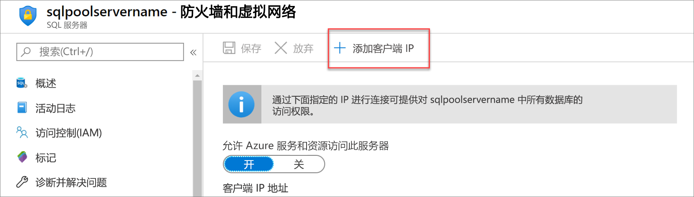

6. 若要将当前的 IP 地址添加到新的防火墙规则，请在工具栏上选择“添加客户端 IP”。 防火墙规则可以针对单个 IP 地址或一系列 IP 地址打开端口 1433。

7. 选择“保存”。 此时会针对当前的 IP 地址创建服务器级防火墙规则，在服务器上打开端口 1433。

8. 选择“确定”，然后关闭“防火墙设置”页。 

现在，可使用此 IP 地址连接到服务器及其 SQL 池。 可从 SQL Server Management Studio 或另一种所选工具进行连接。 连接时，请使用之前创建的 ServerAdmin 帐户。

> [!IMPORTANT]
> 默认情况下，所有 Azure 服务都允许通过 SQL 数据库防火墙进行访问。 在此页上选择“关闭”，然后选择“保存”，对所有 Azure 服务禁用防火墙。 

## <a name="get-the-fully-qualified-server-name"></a>获取完全限定的服务器名称

请在 Azure 门户中获取服务器的完全限定的服务器名称。 稍后，在连接到服务器时，将使用该完全限定的名称。

1. 登录 [Azure 门户](https://portal.azure.com/)。

2. 在左侧菜单中选择“Azure Synapse Analytics”，然后在“Azure Synapse Analytics”页上选择你的 SQL 池。 

3. 在数据库的“Azure 门户”页的“概要”窗格中，找到并复制“服务器名称”。   在此示例中，完全限定的名称为 sqlpoolservername.database.windows.net。

    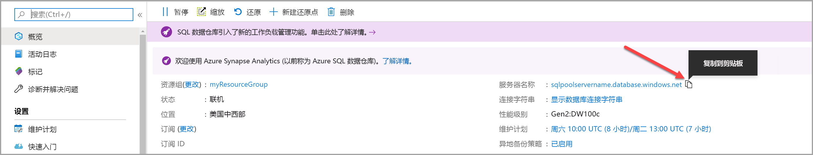

## <a name="connect-to-the-server-as-server-admin"></a>以服务器管理员的身份连接到服务器

本部分使用 [SQL Server Management Studio](/sql/ssms/download-sql-server-management-studio-ssms?toc=/azure/synapse-analytics/sql-data-warehouse/toc.json&bc=/azure/synapse-analytics/sql-data-warehouse/breadcrumb/toc.json&view=azure-sqldw-latest) (SSMS) 来建立与服务器的连接。

1. 打开 SQL Server Management Studio。

2. 在“连接到服务器”对话框中，输入以下信息：

   | 设置 | 建议的值 | 说明 |
   | :------ | :-------------- | :---------- |
   | 服务器类型 | 数据库引擎 | 此值是必需的 |
   | 服务器名称 | 完全限定的服务器名称 | 例如：**sqlpoolservername.database.windows.net**。 |
   | 身份验证 | SQL Server 身份验证 | SQL 身份验证是本教程中配置的唯一身份验证类型。 |
   | 登录 | 服务器管理员帐户 | 创建服务器时指定的帐户。 |
   | 密码 | 服务器管理员帐户的密码 | 创建服务器时指定的密码。 |
   ||||

   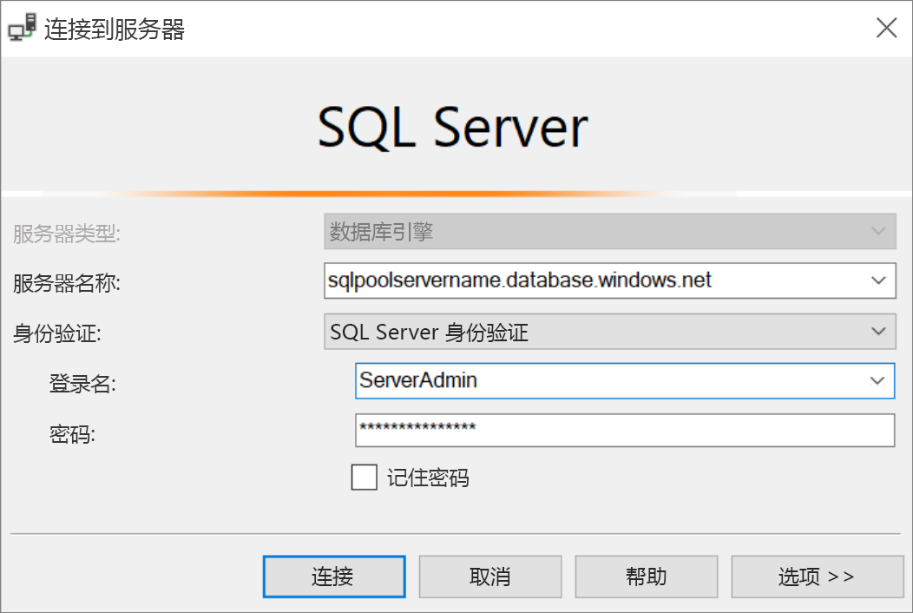

3. 选择“连接”。 对象资源管理器窗口在 SSMS 中打开。

4. 在“对象资源管理器”中，展开“数据库”。 然后展开“mySampleDatabase”，查看新数据库中的对象。

   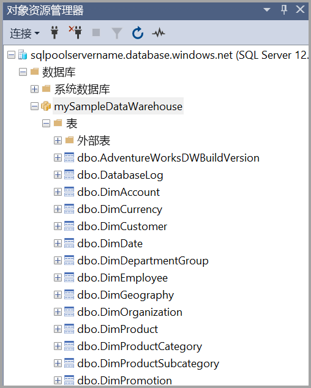

## <a name="run-some-queries"></a>运行一些查询

不建议在以服务器管理员身份登录时运行大型查询，因为它使用[有限的资源类](resource-classes-for-workload-management.md)。 改为按[教程中所示](https://docs.microsoft.com/azure/synapse-analytics/sql-data-warehouse/load-data-wideworldimportersdw#create-a-user-for-loading-data)配置[工作负荷隔离](https://docs.microsoft.com/azure/synapse-analytics/sql-data-warehouse/quickstart-configure-workload-isolation-tsql)。

Azure Synapse Analytics 使用 T-SQL 作为查询语言。 打开一个查询窗口并运行一些 T-SQL 查询，请使用以下步骤：

1. 右键单击“mySampleDataWarehouse”并选择“新建查询”。  “新建查询”窗口随即打开。

2. 在查询窗口中，输入以下命令以查看数据库列表。

    ```sql
    SELECT * FROM sys.databases
    ```

3. 选择“执行”。 查询结果显示两个数据库：master 和 mySampleDataWarehouse。

   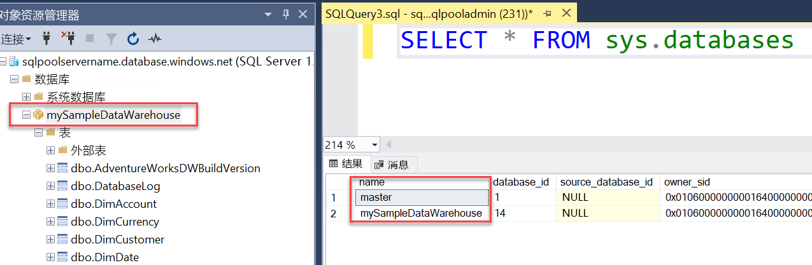

4. 若要查看某些数据，请使用以下命令查看姓氏为 Adams 家中有三个孩子的客户数。 结果列出六个客户。

    ```sql
    SELECT LastName, FirstName FROM dbo.dimCustomer
    WHERE LastName = 'Adams' AND NumberChildrenAtHome = 3;
    ```

   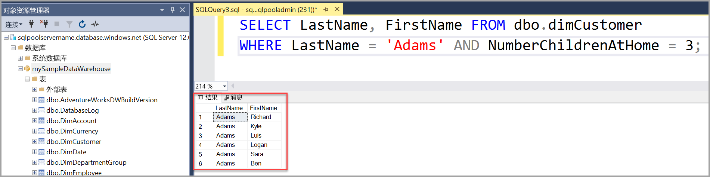

## <a name="clean-up-resources"></a>清理资源

针对 SQL 池的数据仓库单元数和存储的数据收费。 这些计算和存储资源是分开计费的。

- 如果想要将数据保留在存储中，可以在不使用 SQL 池时暂停计算。 如果暂停计算资源，则你只需支付数据存储费用。 只要准备好处理数据，便可以恢复计算。

- 若要避免将来产生费用，可以删除该 SQL 池。

按照以下步骤清理不再需要的资源。

1. 登录到 [Azure 门户](https://portal.azure.com)，选择你的 SQL 池。

   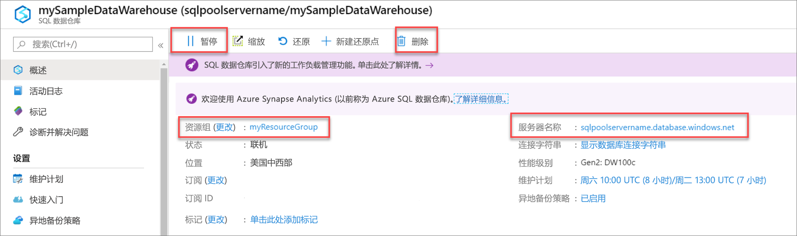

2. 若要暂停计算，请选择“暂停”按钮。 暂停 SQL 池后，会看到“恢复”按钮。 若要恢复计算，请选择“恢复”。

3. 若要删除 SQL 池以免产生计算或存储费用，请选择“删除”。

4. 若要删除创建的服务器，请选择上图所示的“sqlpoolservername.database.windows.net”，然后选择“删除” 。 请谨慎执行此删除操作，因为删除服务器的同时也会删除分配给该服务器的所有数据库。

5. 若要删除资源组，请选择“myResourceGroup”，然后选择“删除资源组”。

希望优化并节省云支出？

[!INCLUDE [cost-management-horizontal](../../../includes/cost-management-horizontal.md)]

## <a name="next-steps"></a>后续步骤

若要详细了解如何将数据加载到 SQL 池中，请阅读[将数据加载到 SQL 池](load-data-from-azure-blob-storage-using-polybase.md)一文。
