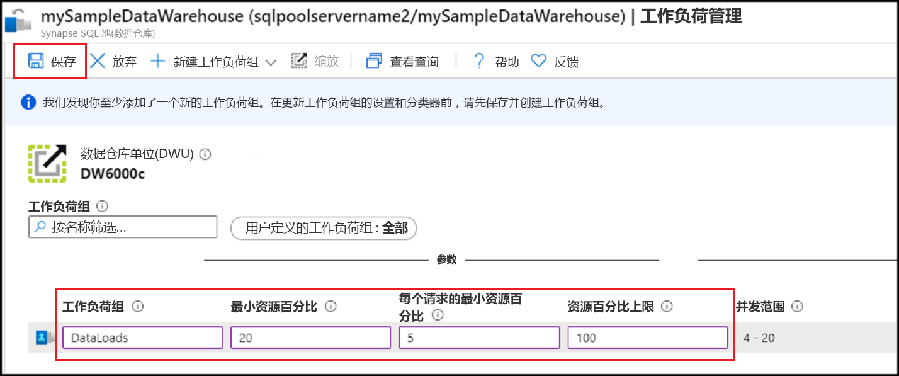
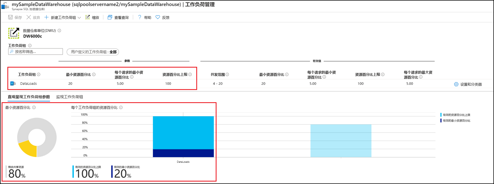
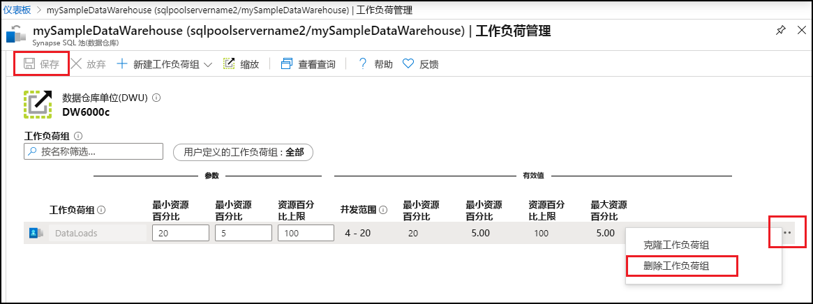

# 快速入门：在 Azure 门户中使用工作负荷组配置 Synapse SQL 池工作负荷隔离

在本快速入门中，你将通过创建用来预留资源的工作负荷组来配置[工作负荷隔离](sql-data-warehouse-workload-isolation.md)。  为实现本教程的目的，我们将创建用于加载数据的名为 `DataLoads` 的工作负荷组。 此工作负荷组将预留 20% 的系统资源。  如果与数据加载对应的隔离度为 20%，则可保证这些数据加载获得的资源能够满足 SLA 要求。  创建工作负荷组后，可[创建工作负荷分类器](quickstart-create-a-workload-classifier-portal.md)，将查询分配到此工作负荷组。

如果没有 Azure 订阅，请在开始之前创建一个[免费](https://azure.microsoft.com/free/)帐户。

## 登录到 Azure 门户

登录 [Azure 门户](https://portal.azure.com/)。

> [!NOTE]
> 在 Azure Synapse Analytics 中创建 SQL 池实例可能会产生一个新的可计费服务。  有关详细信息，请参阅 [Azure Synapse Analytics 定价](https://azure.microsoft.com/pricing/details/sql-data-warehouse/)。

## 先决条件

本快速入门假定你在 Synapse SQL 中已有一个 SQL 池实例，并且你具有 CONTROL DATABASE 权限。 如果需要创建一个 SQL 数据仓库，可使用[创建并连接 - 门户](create-data-warehouse-portal.md)创建名为“mySampleDataWarehouse”的数据仓库  。

>[!IMPORTANT] 
>SQL 池必须联机才能配置工作负荷管理。 

## 配置工作负荷隔离
可以通过创建工作负荷组，为特定工作负荷隔离和保留 SQL 池资源。  请参阅[工作负荷隔离](sql-data-warehouse-workload-isolation.md)概念文档，详细了解工作负荷组如何帮助你实现工作负荷管理。  [创建并连接 - 门户](create-data-warehouse-portal.md)快速入门创建了 mySampleDataWarehouse  并使用 400 DWU 对其进行了初始化。 以下步骤在 mySampleDataWarehouse  中创建一个工作负荷组。

若要创建隔离度为 20% 的工作负荷组，请执行以下操作：
1.  在 Azure 门户的左侧页中单击“Azure Synapse Analytics (前称为 SQL 数据仓库)”。 
2.  从“Azure Synapse Analytics (以前称为 SQL DW)”  页中选择 **mySampleDataWarehouse**。 此时将打开 SQL 池。
3.  单击“工作负荷管理”  。
4.  单击“新建工作负荷组”  。
5.  单击“自定义”  。

    

6.  对于“工作负荷组”，输入 `DataLoads`。 
7.  对于“最小资源百分比”，输入 `20`。 
8.  对于“每个请求的最小资源百分比”，输入 `5`。 
9.  对于“资源百分比上限”，输入 `100`。 
10.   单击“ **保存**”。

   

创建工作负荷组后会出现门户通知。  工作负荷组资源显示在已配置值下方的图表中。

   

## 清理资源

若要删除在本教程中创建的 `DataLoads` 工作负荷组，请执行以下步骤：
1. 单击 `DataLoads` 工作负荷组右侧的 **`...`** 。
2. 单击“删除工作负荷组”  。
3. 在系统提示你确认删除工作负荷组时，单击“是”  。
4. 单击“保存”  。

   

我们会针对数据仓库中存储的数据，按数据仓库单位收费。 这些计算和存储资源是分开计费的。

- 如果想要将数据保留在存储中，可以在不使用数据仓库时暂停计算。 如果暂停计算资源，则你只需支付数据存储费用。 准备好处理数据时，可以恢复计算。
- 如果不想支付将来的费用，则可以删除数据仓库。

遵循以下步骤清理资源。

1. 登录到 [Azure 门户](https://portal.azure.com)，选择你的数据仓库。

    

2. 若要暂停计算，请选择“暂停”  按钮。 暂停数据仓库后，可看到“启动”  按钮。  若要恢复计算，请选择“启动”  。

3. 若要删除数据仓库以免产生计算或存储费用，请选择“删除”  。

4. 若要删除创建的 SQL 服务器，请选择上图所示的“sqlpoolservername.database.windows.net”，然后选择“删除”。    请谨慎执行此删除操作，因为删除服务器的同时也会删除分配给该服务器的所有数据库。

5. 若要删除资源组，请选择“myResourceGroup”  ，然后选择“删除资源组”  。

## 后续步骤

若要使用 `DataLoads` 工作负荷组，需要创建一个[工作负荷分类器](/sql/t-sql/statements/create-workload-classifier-transact-sql?toc=/azure/synapse-analytics/sql-data-warehouse/toc.json&bc=/azure/synapse-analytics/sql-data-warehouse/breadcrumb/toc.json&view=azure-sqldw-latest)，以将请求路由到工作负荷组。  继续学习[创建工作负荷分类器](quickstart-create-a-workload-classifier-portal.md)教程，为 `DataLoads` 创建工作负荷分类器。

## 另请参阅
有关如何监视工作负荷以进行工作负荷管理的详细信息，请参阅操作方法文章：[管理和监视工作负荷管理](sql-data-warehouse-how-to-manage-and-monitor-workload-importance.md)。
