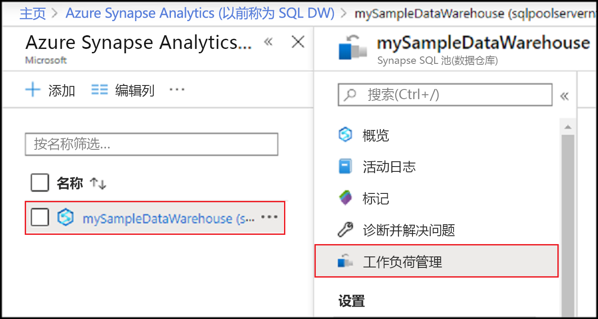
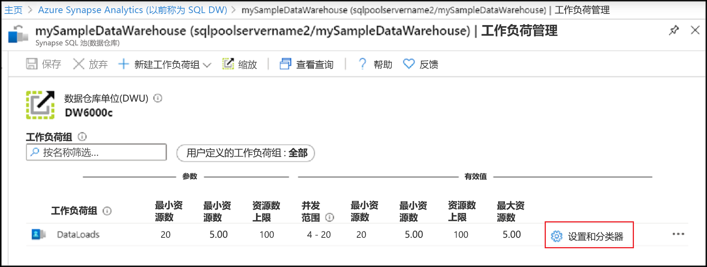
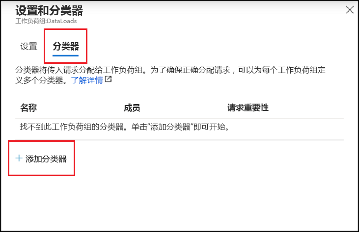
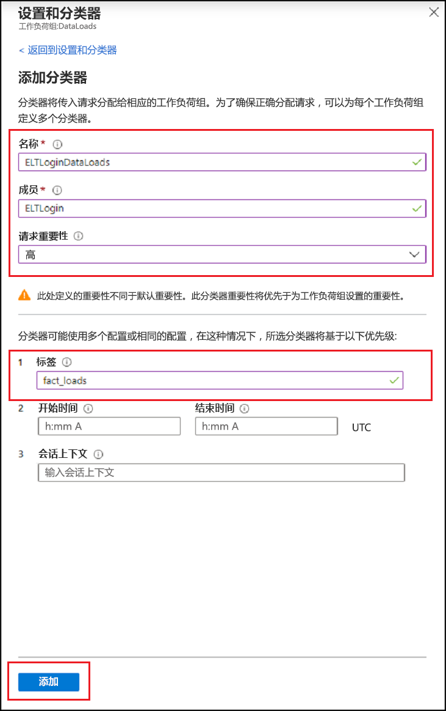
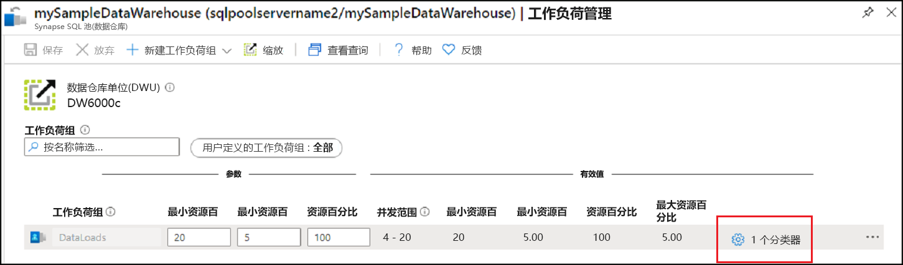
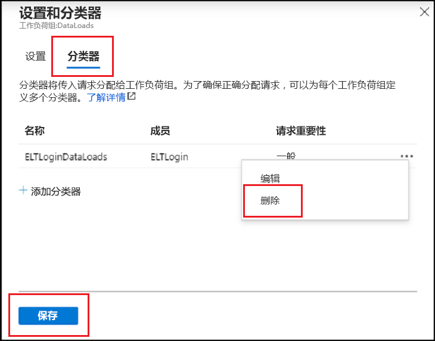
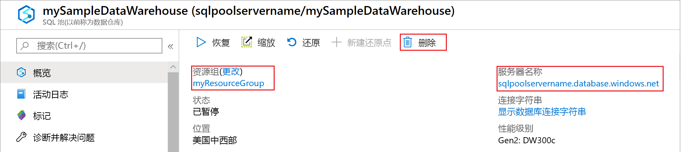

# <a name="quickstart-create-a-synapse-sql-pool-workload-classifier-using-the-azure-portal"></a>快速入门：使用 Azure 门户创建 Synapse SQL 池工作负载分类器

在本快速入门中，你将创建一个[工作负载分类器](sql-data-warehouse-workload-classification.md)，用于将查询分配到工作负载组。  该分类器将 `ELTLogin` SQL 用户的请求分配到 `DataLoads` 工作负载组。   按照[快速入门：配置工作负载隔离](quickstart-configure-workload-isolation-portal.md)教程创建 `DataLoads` 工作负载组。  本教程将使用 WLM_LABEL 选项创建工作负载分类器，这样有助于对请求进一步进行正确的分类。  该分类器还会将 `HIGH` [工作负载重要性](sql-data-warehouse-workload-importance.md)分配到这些请求。


如果没有 Azure 订阅，请在开始之前创建一个[免费](https://azure.microsoft.com/free/)帐户。


## <a name="sign-in-to-the-azure-portal"></a>登录到 Azure 门户

登录 [Azure 门户](https://portal.azure.com/)。

> [!NOTE]
> 在 Azure Synapse Analytics 中创建 SQL 池实例可能会产生一个新的可计费服务。  有关详细信息，请参阅 [Azure Synapse Analytics 定价](https://azure.microsoft.com/pricing/details/sql-data-warehouse/)。

## <a name="prerequisites"></a>先决条件

本快速入门假定你已在 Synapse SQL 中有 SQL 池实例，并且具有 CONTROL DATABASE 权限。 如果需要创建一个 SQL 数据仓库，可使用[创建并连接 - 门户](create-data-warehouse-portal.md)创建名为“mySampleDataWarehouse”的数据仓库  。
<br><br>
存在工作负载组 `DataLoads`。  请参阅[快速入门：配置工作负载隔离](quickstart-configure-workload-isolation-portal.md)教程以创建工作负载组。
<br><br>
>[!IMPORTANT] 
>SQL 池必须联机才能配置工作负载管理。 


## <a name="create-a-login-for-eltlogin"></a>创建 ELTLogin 的登录名

使用 [CREATE LOGIN](/sql/t-sql/statements/create-login-transact-sql?toc=/azure/synapse-analytics/sql-data-warehouse/toc.json&bc=/azure/synapse-analytics/sql-data-warehouse/breadcrumb/toc.json&view=azure-sqldw-latest) 在 `master` 数据库中为 `ELTLogin` 创建 SQL Server 身份验证登录名。

```sql
IF NOT EXISTS (SELECT * FROM sys.sql_logins WHERE name = 'ELTLogin')
BEGIN
CREATE LOGIN [ELTLogin] WITH PASSWORD='<strongpassword>'
END
;
```

## <a name="create-user-and-grant-permissions"></a>创建用户并授予权限

创建登录名后，需要在数据库中创建一个用户。  使用 [CREATE USER](/sql/t-sql/statements/create-user-transact-sql?toc=/azure/synapse-analytics/sql-data-warehouse/toc.json&bc=/azure/synapse-analytics/sql-data-warehouse/breadcrumb/toc.json&view=azure-sqldw-latest) 在 mySampleDataWarehouse 中创建 SQL 用户 `ELTRole` 。  由于我们将在本教程中测试分类，因此请授予对 mySampleDataWarehouse 的 `ELTLogin` 权限  。 

```sql
IF NOT EXISTS (SELECT * FROM sys.database_principals WHERE name = 'ELTLogin')
BEGIN
CREATE USER [ELTLogin] FOR LOGIN [ELTLogin]
GRANT CONTROL ON DATABASE::mySampleDataWarehouse TO ELTLogin 
END
;
```

## <a name="configure-workload-classification"></a>配置工作负载分类
分类允许你基于一组规则将请求路由到工作负载组。  在[快速入门：配置工作负载隔离](quickstart-configure-workload-isolation-portal.md)教程中，我们已创建 `DataLoads` 工作负载组。  现在，你将创建一个工作负载分类器，用于将查询路由到 `DataLoads` 工作负载组。


1.  在 Azure 门户的左侧页中单击“Azure Synapse Analytics (前称为 SQL 数据仓库)”。 
2.  从“Azure Synapse Analytics (以前称为 SQL DW)”  页中选择 **mySampleDataWarehouse**。 此时将打开 SQL 池。
3.  单击“工作负载管理”  。

    

4.  单击 `DataLoads` 工作负载组右侧的“设置和分类器”  。

    

5. 单击“分类器”  。
6. 单击“添加分类器”  。

    

7.  在“名称”中输入 `ELTLoginDataLoads` 。
8.  在“成员”中输入 `ELTLogin` 。
9.  为“请求重要性”选择 `High` 。  这是可选字段，默认设置为一般重要性  。
10. 在“标签”中输入 `fact_loads` 。
11. 单击“添加”  。
12. 单击“ **保存**”。

    

## <a name="verify-and-test-classification"></a>验证并测试分类
检查 [sys.workload_management_workload_classifiers](/sql/relational-databases/system-catalog-views/sys-workload-management-workload-classifiers-transact-sql?view=azure-sqldw-latest) 目录视图，验证是否存在 `ELTLoginDataLoads` 分类器。

```sql
SELECT * FROM sys.workload_management_workload_classifiers WHERE name = 'ELTLoginDataLoads'
```

检查 [sys.workload_management_workload_classifier_details](/sql/relational-databases/system-catalog-views/sys-workload-management-workload-classifier-details-transact-sql?view=azure-sqldw-latest) 目录视图，验证分类器详细信息。

```sql
SELECT c.[name], c.group_name, c.importance, cd.classifier_type, cd.classifier_value
  FROM sys.workload_management_workload_classifiers c
  JOIN sys.workload_management_workload_classifier_details cd
    ON cd.classifier_id = c.classifier_id
  WHERE c.name = 'ELTLoginDataLoads'
```

运行以下语句以测试分类。  确保以 ``ELTLogin`` 身份连接并在查询中使用 ``Label``。
```sql
CREATE TABLE factstaging (ColA int)
INSERT INTO factstaging VALUES(0)
INSERT INTO factstaging VALUES(1)
INSERT INTO factstaging VALUES(2)
GO

CREATE TABLE testclassifierfact WITH (DISTRIBUTION = ROUND_ROBIN)
AS
SELECT * FROM factstaging
OPTION (LABEL='fact_loads')
```

使用 `ELTLoginDataLoads` 工作负载分类器验证已分类到 `DataLoads` 工作负载组的 `CREATE TABLE` 语句。
```sql 
SELECT TOP 1 request_id, classifier_name, group_name, resource_allocation_percentage, submit_time, [status], [label], command 
FROM sys.dm_pdw_exec_requests 
WHERE [label] = 'fact_loads'
ORDER BY submit_time DESC
```


## <a name="clean-up-resources"></a>清理资源

若要删除在本教程中创建的 `ELTLoginDataLoads` 工作负载分类器，请执行以下步骤：

1. 单击 `DataLoads` 工作负载组右侧的“1 分类器”  。

    

2. 单击“分类器”  。
3. 单击 `ELTLoginDataLoads` 工作负载分类器右侧的“`...`”  。
4. 单击“删除”  。
5. 单击“保存”  。

    

我们会针对数据仓库中存储的数据，按数据仓库单位收费。 这些计算和存储资源是分开计费的。

- 如果想要将数据保留在存储中，可以在不使用数据仓库时暂停计算。 如果暂停计算资源，则你只需支付数据存储费用。 准备好处理数据时，可以恢复计算。
- 如果不想支付将来的费用，则可以删除数据仓库。

遵循以下步骤清理资源。

1. 登录到 [Azure 门户](https://portal.azure.com)，选择你的数据仓库。

    

2. 若要暂停计算，请选择“暂停”  按钮。 暂停数据仓库后，可看到“启动”  按钮。  若要恢复计算，请选择“启动”  。

3. 若要删除数据仓库以免产生计算或存储费用，请选择“删除”  。

4. 若要删除创建的 SQL 服务器，请选择上图所示的“sqlpoolservername.database.windows.net”，然后选择“删除”。    请谨慎执行此删除操作，因为删除服务器的同时也会删除分配给该服务器的所有数据库。

5. 若要删除资源组，请选择“myResourceGroup”  ，然后选择“删除资源组”  。

## <a name="next-steps"></a>后续步骤

使用 Azure 门户监视指标监视工作负载。  有关详细信息，请参阅[管理和监视工作负载管理](sql-data-warehouse-how-to-manage-and-monitor-workload-importance.md)。
